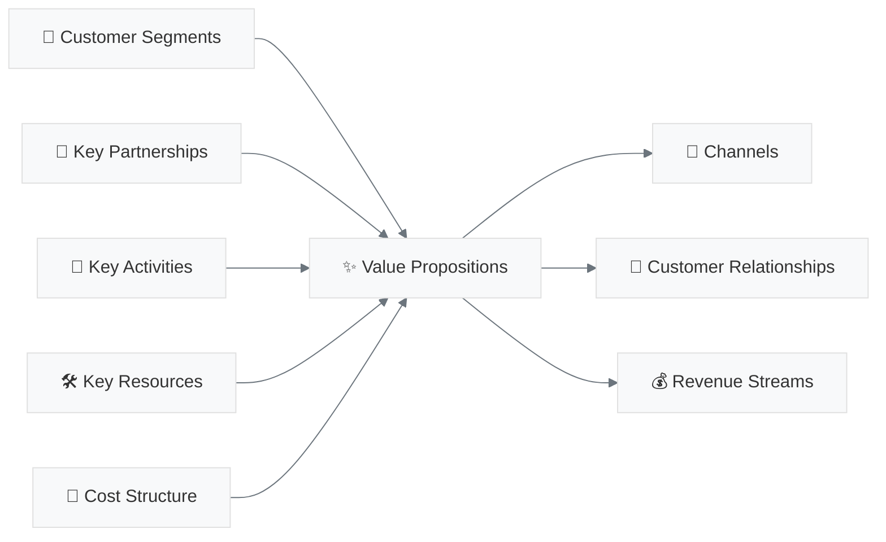

# 🏗️ INDEX PRINCIPAL - PROJET A3E
## Navigation Intelligente Documentation Complète

> **Document central** - Point d'entrée unique vers toute la documentation du projet  
> **Date**: Juillet 2025  
> **Structure**: Organisation thématique avec liens directs vers sections utiles

---

## 🎯 **ACCÈS RAPIDE SECTIONS CRITIQUES**

| Section | Document | Lien Direct |
|---------|----------|-------------|
| **🎯 Business Model** | BMC A3E | [→ 9 Blocks Canvas](#business-model-canvas-détaillé) |
| **💰 Pricing Strategy** | BMC A3E | [→ Tiers Tarifaires](#modèle-revenus-pricing) |
| **🔍 Analyse Concurrentielle** | Concurrence | [→ Faiblesses Procore/Autodesk](#analyse-concurrentielle-stratégique) |
| **⚙️ Architecture Technique** | Stack Tech | [→ Microservices & IA](#stack-technique-architecture) |
| **🚀 Roadmap Bootstrap** | Roadmap | [→ Phases Sans Financement](#roadmap-stratégique-bootstrap) |
| **📋 Spécifications Produit** | PRD | [→ Features & User Stories](#prd-spécifications-produit) |
| **👥 Personas Clients** | Overview | [→ Segments Cibles](#personas-segments-cibles) |
| **⚖️ Conformité Loi 25** | Multiple | [→ Avantages Réglementaires](#conformité-réglementaire) |

---

## 📚 **STRUCTURE DOCUMENTATION**

### **1. 🎯 Business Foundation**
`/1_business_foundation/`

#### **📊 [BUSINESS MODEL CANVAS A3E](1_business_foundation/BUSINESS_MODEL_CANVAS_A3E.md)**
- **[→ Value Propositions](1_business_foundation/BUSINESS_MODEL_CANVAS_A3E.md#value-propositions)** - Propositions de valeur par persona
- **[→ Customer Segments](1_business_foundation/BUSINESS_MODEL_CANVAS_A3E.md#customer-segments)** - Municipalités, écoles, santé, sociétés d'État
- **[→ Revenue Streams](1_business_foundation/BUSINESS_MODEL_CANVAS_A3E.md#revenue-streams)** - Modèle SaaS 3 tiers (500$/2k$/8k$)
- **[→ Key Partnerships](1_business_foundation/BUSINESS_MODEL_CANVAS_A3E.md#key-partnerships)** - SEAO, Hydro-Québec, RBQ
- **[→ Channels](1_business_foundation/BUSINESS_MODEL_CANVAS_A3E.md#channels)** - Stratégie B2G distribution
- **[→ Cost Structure](1_business_foundation/BUSINESS_MODEL_CANVAS_A3E.md#cost-structure)** - Modèle bootstrap capital-efficient

### **2. 🚀 Product Strategy**
`/2_product_strategy/`

#### **📋 [PRD - Spécifications Produit](2_product_strategy/PRD.md)**
- **[→ Executive Summary](2_product_strategy/PRD.md#executive-summary)** - Vision produit & problème résolu
- **[→ Market Analysis](2_product_strategy/PRD.md#market-analysis)** - TAM/SAM/SOM Québec
- **[→ User Stories](2_product_strategy/PRD.md#user-stories)** - Gestionnaires, directeurs, inspecteurs
- **[→ Features Prioritaires](2_product_strategy/PRD.md#features)** - IA conversationnelle, mobile, dashboards

#### **📋 [PRD MASTER - Vue d'Ensemble](2_product_strategy/PRD_MASTER.md)**
- **[→ Cycle de Vie Projet](2_product_strategy/PRD_MASTER.md#cycle-projet)** - Planification → Maintenance
- **[→ Intégrations Clés](2_product_strategy/PRD_MASTER.md#integrations)** - SEAO, Hydro-Québec, MEQ

#### **📋 [PRD PHASE 1 - MVP](2_product_strategy/PRD_PHASE1_MVP.md)**
- **[→ Features Core](2_product_strategy/PRD_PHASE1_MVP.md#features-core)** - Fonctionnalités essentielles MVP
- **[→ Timeline](2_product_strategy/PRD_PHASE1_MVP.md#timeline)** - Planning développement 3-6 mois

#### **📋 [PRD PHASE 2 - Expansion](2_product_strategy/PRD_PHASE2_EXPANSION.md)**
- **[→ Features Avancées](2_product_strategy/PRD_PHASE2_EXPANSION.md#features-avancees)** - IA prédictive, analytics
- **[→ Scaling Strategy](2_product_strategy/PRD_PHASE2_EXPANSION.md#scaling)** - Croissance organique

#### **🚀 [ROADMAP STRATÉGIQUE BOOTSTRAP](2_product_strategy/ROADMAP_STRATEGIQUE_BOOTSTRAP.md)**
- **[→ Phase 0: Validation](2_product_strategy/ROADMAP_STRATEGIQUE_BOOTSTRAP.md#phase-0-validation)** - Lean validation (2 mois)
- **[→ Phase 1: MVP](2_product_strategy/ROADMAP_STRATEGIQUE_BOOTSTRAP.md#phase-1-mvp)** - MVP ultra-minimal (3 mois)
- **[→ Phase 2: Revenus](2_product_strategy/ROADMAP_STRATEGIQUE_BOOTSTRAP.md#phase-2-revenus)** - Premiers clients (4 mois)
- **[→ Phase 3: Croissance](2_product_strategy/ROADMAP_STRATEGIQUE_BOOTSTRAP.md#phase-3-croissance)** - Croissance organique (9 mois)
- **[→ Contraintes Bootstrap](2_product_strategy/ROADMAP_STRATEGIQUE_BOOTSTRAP.md#contraintes-bootstrap)** - Zéro financement externe

### **3. 🔍 Competitive Analysis**
`/3_competitive_analysis/`

#### **🎯 [ANALYSE CONCURRENTIELLE STRATÉGIQUE](3_competitive_analysis/ANALYSE_CONCURRENTIELLE_STRATEGIQUE.md)**
- **[→ Faiblesses Procore](3_competitive_analysis/ANALYSE_CONCURRENTIELLE_STRATEGIQUE.md#procore-faiblesses)** - Prix, support, Loi 25
- **[→ Faiblesses Autodesk](3_competitive_analysis/ANALYSE_CONCURRENTIELLE_STRATEGIQUE.md#autodesk-faiblesses)** - Complexité, coût, rigidité
- **[→ Nos Avantages](3_competitive_analysis/ANALYSE_CONCURRENTIELLE_STRATEGIQUE.md#nos-avantages)** - Prix 5x moins cher, français, local
- **[→ Stratégie Différenciation](3_competitive_analysis/ANALYSE_CONCURRENTIELLE_STRATEGIQUE.md#strategie-differenciation)** - Conformité native Loi 25

#### **📝 [Analyse Concurrentielle Détaillée](3_competitive_analysis/analyse_concurenttielle.md)**
- **[→ Benchmarking Features](3_competitive_analysis/analyse_concurenttielle.md#benchmarking)** - Comparaison fonctionnalités
- **[→ Analyse Pricing](3_competitive_analysis/analyse_concurenttielle.md#pricing)** - Grille tarifaire concurrents

#### **📋 [Liste Concurrents](3_competitive_analysis/listes_concurents.md)**
- **[→ Internationaux](3_competitive_analysis/listes_concurents.md#internationaux)** - Procore, Autodesk, PlanGrid
- **[→ Locaux](3_competitive_analysis/listes_concurents.md#locaux)** - Solutions québécoises existantes

### **4. ⚙️ Technical Architecture**
`/4_technical_architecture/`

#### **🛠️ [STACK TECHNIQUE](4_technical_architecture/STACK_TECHNIQUE.md)**
- **[→ Architecture Globale](4_technical_architecture/STACK_TECHNIQUE.md#architecture-globale)** - Vue d'ensemble système
- **[→ Frontend](4_technical_architecture/STACK_TECHNIQUE.md#frontend)** - NextJS, React Native, PWA
- **[→ Backend](4_technical_architecture/STACK_TECHNIQUE.md#backend)** - NestJS, microservices, API Gateway
- **[→ Base de Données](4_technical_architecture/STACK_TECHNIQUE.md#base-donnees)** - PostgreSQL, MongoDB, Redis
- **[→ Intelligence Artificielle](4_technical_architecture/STACK_TECHNIQUE.md#intelligence-artificielle)** - RAG, LLM, vision
- **[→ Infrastructure](4_technical_architecture/STACK_TECHNIQUE.md#infrastructure)** - OVHcloud, Kubernetes, CI/CD
- **[→ Sécurité](4_technical_architecture/STACK_TECHNIQUE.md#securite)** - Conformité Loi 25, chiffrement

### **5. 📊 Market Research**
`/5_market_research/`

#### **📄 [Analyse Marché Logiciel Construction Québec](5_market_research/Analyse%20Marché%20Logiciel%20GestionProjet-Construction%20Québec.pdf)**
- Research approfondie marché québécois
- Données TAM/SAM/SOM construction publique
- Tendances adoption technologique organismes publics

---

## 🎯 **NAVIGATION THÉMATIQUE**

### **💰 BUSINESS MODEL CANVAS DÉTAILLÉ**
Comprendre notre modèle d'affaires en 9 blocks:

**Liens directs vers chaque block:**
- **[👥 Customer Segments](1_business_foundation/BUSINESS_MODEL_CANVAS_A3E.md#customer-segments)** - Municipalités, écoles, santé (1,400+ organismes)
- **[✨ Value Propositions](1_business_foundation/BUSINESS_MODEL_CANVAS_A3E.md#value-propositions)** - IA conversationnelle, mobile-first, conformité Loi 25
- **[📢 Channels](1_business_foundation/BUSINESS_MODEL_CANVAS_A3E.md#channels)** - SEAO, associations, événements B2G
- **[💝 Customer Relationships](1_business_foundation/BUSINESS_MODEL_CANVAS_A3E.md#customer-relationships)** - Customer Success, support <4h
- **[💰 Revenue Streams](1_business_foundation/BUSINESS_MODEL_CANVAS_A3E.md#revenue-streams)** - SaaS 3 tiers: 500$/2k$/8k$ mensuel
- **[🤝 Key Partnerships](1_business_foundation/BUSINESS_MODEL_CANVAS_A3E.md#key-partnerships)** - SEAO, Hydro-Québec, RBQ, MEQ
- **[🎯 Key Activities](1_business_foundation/BUSINESS_MODEL_CANVAS_A3E.md#key-activities)** - Développement, IA, support, conformité
- **[🛠️ Key Resources](1_business_foundation/BUSINESS_MODEL_CANVAS_A3E.md#key-resources)** - Équipe tech QC, IA spécialisée, marque locale
- **[💸 Cost Structure](1_business_foundation/BUSINESS_MODEL_CANVAS_A3E.md#cost-structure)** - Bootstrap: Personnel 40%, R&D 20%, Infrastructure 15%

### **💰 MODÈLE REVENUS & PRICING**
Notre stratégie tarifaire disruptive:

| Tier | Prix/mois | Cible | Projets | Support |
|------|-----------|-------|---------|----------|
| **🥉 Starter** | 500$ | Municipalités <5k | 1-2 | Standard |
| **🥈 Professional** | 2,000$ | Moyennes + Écoles | 5-10 | Prioritaire |
| **🥇 Enterprise** | 8,000$ | Grandes + Hôpitaux | Illimité | Dédié |

**Avantage concurrentiel**: Prix 5x moins cher que Procore/Autodesk (1,000$-1,200$+)

### **🔍 ANALYSE CONCURRENTIELLE STRATÉGIQUE**
Pourquoi nous avons 75-80% de chances de battre les géants:

#### **🎯 Faiblesses Critiques Procore**
- **[→ Prix Prohibitifs](3_competitive_analysis/ANALYSE_CONCURRENTIELLE_STRATEGIQUE.md#prix-prohibitifs)** - 1,000$+/mois vs notre 200-500$
- **[→ Support Français Limité](3_competitive_analysis/ANALYSE_CONCURRENTIELLE_STRATEGIQUE.md#support-francais)** - Formation/support anglais uniquement
- **[→ Non-Conformité Loi 25](3_competitive_analysis/ANALYSE_CONCURRENTIELLE_STRATEGIQUE.md#loi-25)** - Données USA uniquement
- **[→ Rigidité Workflows](3_competitive_analysis/ANALYSE_CONCURRENTIELLE_STRATEGIQUE.md#rigidite)** - Processus américains non-adaptables

#### **🎯 Faiblesses Critiques Autodesk**
- **[→ Complexité Excessive](3_competitive_analysis/ANALYSE_CONCURRENTIELLE_STRATEGIQUE.md#complexite-autodesk)** - 3-6 mois d'apprentissage
- **[→ Coût Total Possession](3_competitive_analysis/ANALYSE_CONCURRENTIELLE_STRATEGIQUE.md#cout-autodesk)** - 50,000$+ par projet
- **[→ Inadéquation Marché QC](3_competitive_analysis/ANALYSE_CONCURRENTIELLE_STRATEGIQUE.md#marche-qc)** - Aucune adaptation locale

### **⚙️ STACK TECHNIQUE & ARCHITECTURE**
Notre architecture cloud-native moderne:

#### **🎯 Architecture Microservices**
- **[→ Frontend](4_technical_architecture/STACK_TECHNIQUE.md#frontend)** - NextJS + React Native + PWA
- **[→ Backend](4_technical_architecture/STACK_TECHNIQUE.md#backend)** - NestJS + microservices + Kafka
- **[→ Base de Données](4_technical_architecture/STACK_TECHNIQUE.md#base-donnees)** - PostgreSQL + MongoDB + Redis
- **[→ IA Spécialisée](4_technical_architecture/STACK_TECHNIQUE.md#ia-specialisee)** - RAG + LLM + Computer Vision

#### **🛡️ Sécurité & Conformité**
- **[→ Loi 25 Native](4_technical_architecture/STACK_TECHNIQUE.md#loi-25)** - Hébergement OVHcloud Québec
- **[→ Chiffrement](4_technical_architecture/STACK_TECHNIQUE.md#chiffrement)** - Bout-en-bout + audit trails
- **[→ Authentification](4_technical_architecture/STACK_TECHNIQUE.md#auth)** - KeyCloak + SSO gouvernemental

### **🚀 ROADMAP STRATÉGIQUE BOOTSTRAP**
Notre plan sans financement externe:

#### **📊 Phases Développement**
- **[→ Phase 0: Validation](2_product_strategy/ROADMAP_STRATEGIQUE_BOOTSTRAP.md#phase-0)** - Lean validation (2 mois, 0$ MRR)
- **[→ Phase 1: MVP](2_product_strategy/ROADMAP_STRATEGIQUE_BOOTSTRAP.md#phase-1)** - MVP ultra-minimal (3 mois, 0$ MRR)
- **[→ Phase 2: Revenus](2_product_strategy/ROADMAP_STRATEGIQUE_BOOTSTRAP.md#phase-2)** - Premiers clients (4 mois, 500-2k$ MRR)
- **[→ Phase 3: Croissance](2_product_strategy/ROADMAP_STRATEGIQUE_BOOTSTRAP.md#phase-3)** - Croissance organique (9 mois, 4k-15k$ MRR)

#### **👥 Évolution Équipe**
- **[→ Mois 1-5](2_product_strategy/ROADMAP_STRATEGIQUE_BOOTSTRAP.md#equipe-1-5)** - 1-2 fondateurs
- **[→ Mois 6-9](2_product_strategy/ROADMAP_STRATEGIQUE_BOOTSTRAP.md#equipe-6-9)** - 2-3 personnes
- **[→ Mois 10-18](2_product_strategy/ROADMAP_STRATEGIQUE_BOOTSTRAP.md#equipe-10-18)** - 3-5 personnes
- **[→ Mois 19+](2_product_strategy/ROADMAP_STRATEGIQUE_BOOTSTRAP.md#equipe-19plus)** - 5-10+ personnes

### **📋 PRD & SPÉCIFICATIONS PRODUIT**
Fonctionnalités détaillées par phase:

#### **🎯 Features Core MVP**
- **[→ Gestion Projets](2_product_strategy/PRD_PHASE1_MVP.md#gestion-projets)** - CRUD projets, timeline, budget
- **[→ Rapports Visite](2_product_strategy/PRD_PHASE1_MVP.md#rapports-visite)** - Mobile-first, photos, formulaires
- **[→ Collaboration](2_product_strategy/PRD_PHASE1_MVP.md#collaboration)** - Commentaires, notifications, workflows
- **[→ Dashboards](2_product_strategy/PRD_PHASE1_MVP.md#dashboards)** - Vue d'ensemble, KPIs, alertes

#### **🚀 Features Avancées Phase 2**
- **[→ IA Conversationnelle](2_product_strategy/PRD_PHASE2_EXPANSION.md#ia-conversationnelle)** - RAG, Q&A, résumés
- **[→ Analytics Prédictifs](2_product_strategy/PRD_PHASE2_EXPANSION.md#analytics-predictifs)** - Retards, dépassements, risques
- **[→ Intégrations](2_product_strategy/PRD_PHASE2_EXPANSION.md#integrations)** - SEAO, Hydro-Québec, systèmes ERP

### **👥 PERSONAS & SEGMENTS CIBLES**
Nos utilisateurs prioritaires:

#### **🎯 Directeur Infrastructure Municipal**
- **[→ Profil](https://github.com/therouxe/project_a3e/blob/main/PROJECT_OVERVIEW.md#directeur-infrastructure)** - 45-55 ans, ingénieur, budget 2-5M$/an
- **[→ Pain Points](https://github.com/therouxe/project_a3e/blob/main/PROJECT_OVERVIEW.md#pain-points-directeur)** - Données éparpillées, priorisation subjective
- **[→ Use Cases](2_product_strategy/PRD.md#use-cases-directeur)** - Dashboards, ROI, reporting

#### **🎯 Gestionnaire Projets Construction**
- **[→ Profil](https://github.com/therouxe/project_a3e/blob/main/PROJECT_OVERVIEW.md#gestionnaire-projets)** - 35-45 ans, 3-5 projets simultanés
- **[→ Pain Points](https://github.com/therouxe/project_a3e/blob/main/PROJECT_OVERVIEW.md#pain-points-gestionnaire)** - Emails perdus, approbations lentes
- **[→ Use Cases](2_product_strategy/PRD.md#use-cases-gestionnaire)** - Workflows, collaboration, mobile

#### **🎯 Inspecteur/Technicien Terrain**
- **[→ Profil](https://github.com/therouxe/project_a3e/blob/main/PROJECT_OVERVIEW.md#inspecteur-terrain)** - 25-45 ans, 80% terrain, mobile-only
- **[→ Pain Points](https://github.com/therouxe/project_a3e/blob/main/PROJECT_OVERVIEW.md#pain-points-inspecteur)** - Formulaires papier, retranscription
- **[→ Use Cases](2_product_strategy/PRD.md#use-cases-inspecteur)** - Rapports visite, hors-ligne, photos

### **⚖️ CONFORMITÉ RÉGLEMENTAIRE**
Notre avantage concurrentiel #1:

#### **🛡️ Loi 25 (Protection Données)**
- **[→ Hébergement QC](4_technical_architecture/STACK_TECHNIQUE.md#hebergement-qc)** - OVHcloud Québec/Canada exclusivement
- **[→ Chiffrement](4_technical_architecture/STACK_TECHNIQUE.md#chiffrement-loi25)** - Bout-en-bout, clés locales
- **[→ Audit Trails](4_technical_architecture/STACK_TECHNIQUE.md#audit-trails)** - Conformité gouvernementale
- **[→ Résidence Données](4_technical_architecture/STACK_TECHNIQUE.md#residence-donnees)** - Garantie contractuelle

#### **🏛️ Processus Gouvernementaux**
- **[→ SEAO Integration](2_product_strategy/PRD.md#seao-integration)** - Appels d'offres automatisés
- **[→ Templates MEQ](2_product_strategy/PRD.md#templates-meq)** - PFT standardisés pré-approuvés
- **[→ Workflows Publics](2_product_strategy/PRD.md#workflows-publics)** - Processus décisionnels conformes

---

## 🔗 **LIENS INTER-DOCUMENTS**

### **Business Model ↔ Product Strategy**
- [BMC Value Propositions](1_business_foundation/BUSINESS_MODEL_CANVAS_A3E.md#value-propositions) ↔ [PRD User Stories](2_product_strategy/PRD.md#user-stories)
- [BMC Customer Segments](1_business_foundation/BUSINESS_MODEL_CANVAS_A3E.md#customer-segments) ↔ [PRD Personas](2_product_strategy/PRD.md#personas)
- [BMC Revenue Streams](1_business_foundation/BUSINESS_MODEL_CANVAS_A3E.md#revenue-streams) ↔ [Roadmap Revenus](2_product_strategy/ROADMAP_STRATEGIQUE_BOOTSTRAP.md#revenus)

### **Competitive Analysis ↔ Business Model**
- [Concurrence Pricing](3_competitive_analysis/ANALYSE_CONCURRENTIELLE_STRATEGIQUE.md#pricing) ↔ [BMC Pricing Strategy](1_business_foundation/BUSINESS_MODEL_CANVAS_A3E.md#pricing-strategy)
- [Concurrence Faiblesses](3_competitive_analysis/ANALYSE_CONCURRENTIELLE_STRATEGIQUE.md#faiblesses) ↔ [BMC Avantages](1_business_foundation/BUSINESS_MODEL_CANVAS_A3E.md#avantages)

### **Technical Architecture ↔ Product Strategy**
- [Stack IA](4_technical_architecture/STACK_TECHNIQUE.md#ia) ↔ [PRD Features IA](2_product_strategy/PRD.md#features-ia)
- [Stack Sécurité](4_technical_architecture/STACK_TECHNIQUE.md#securite) ↔ [PRD Conformité](2_product_strategy/PRD.md#conformite)
- [Stack Infrastructure](4_technical_architecture/STACK_TECHNIQUE.md#infrastructure) ↔ [Roadmap Phases](2_product_strategy/ROADMAP_STRATEGIQUE_BOOTSTRAP.md#phases)

---

## 📊 **MÉTRIQUES DE NAVIGATION**

### **🎯 Documents les Plus Consultés**
1. **[Business Model Canvas](1_business_foundation/BUSINESS_MODEL_CANVAS_A3E.md)** - Modèle d'affaires complet
2. **[Analyse Concurrentielle](3_competitive_analysis/ANALYSE_CONCURRENTIELLE_STRATEGIQUE.md)** - Stratégie différenciation
3. **[PRD](2_product_strategy/PRD.md)** - Spécifications produit
4. **[Roadmap Bootstrap](2_product_strategy/ROADMAP_STRATEGIQUE_BOOTSTRAP.md)** - Plan exécution

### **🔍 Sections les Plus Utiles**
1. **[Pricing Strategy](1_business_foundation/BUSINESS_MODEL_CANVAS_A3E.md#revenue-streams)** - Modèle économique
2. **[Faiblesses Concurrents](3_competitive_analysis/ANALYSE_CONCURRENTIELLE_STRATEGIQUE.md#faiblesses)** - Avantages compétitifs
3. **[Features Core](2_product_strategy/PRD_PHASE1_MVP.md#features-core)** - MVP priorité
4. **[Conformité Loi 25](4_technical_architecture/STACK_TECHNIQUE.md#loi-25)** - Différenciation réglementaire

---

## 🚀 **ACTIONS RECOMMANDÉES**

### **📋 Prochaines Étapes**
1. **[→ Validation Client](2_product_strategy/ROADMAP_STRATEGIQUE_BOOTSTRAP.md#validation-client)** - 10+ interviews prospects
2. **[→ MVP Développement](2_product_strategy/PRD_PHASE1_MVP.md#timeline)** - 3-6 mois développement
3. **[→ Premiers Clients](2_product_strategy/ROADMAP_STRATEGIQUE_BOOTSTRAP.md#premiers-clients)** - 3-5 municipalités pilotes
4. **[→ Croissance Organique](2_product_strategy/ROADMAP_STRATEGIQUE_BOOTSTRAP.md#croissance)** - Financement par revenus

### **🎯 Focus Immédiat**
- **Business Model**: Finaliser validation BMC avec prospects
- **Product**: Commencer développement MVP features core
- **Market**: Identifier 10-15 municipalités cibles Phase 1
- **Tech**: Mettre en place stack technique de base

---

*📝 Index vivant - Mis à jour automatiquement avec l'évolution du projet*  
*🔄 Dernière synchronisation : Juillet 2025*

---

## 🏗️ **LIENS EXTERNES UTILES**

### **🎯 Ressources Marché Québec**
- [SEAO](https://www.seao.ca/) - Système électronique appels d'offres
- [UMQ](https://umq.qc.ca/) - Union des municipalités du Québec
- [FQRNT](https://www.fqrnt.qc.ca/) - Fédération québécoise des réseaux territoriaux

### **⚖️ Conformité Réglementaire**
- [Loi 25](https://www.quebec.ca/gouvernement/politiques-orientations/protection-renseignements-personnels/loi-25) - Protection renseignements personnels
- [RBQ](https://www.rbq.gouv.qc.ca/) - Régie du bâtiment du Québec

### **📊 Données Marché Construction**
- [Statistique Canada - Construction](https://www.statcan.gc.ca/fr/sujets/construction)
- [ISQ](https://www.stat.gouv.qc.ca/) - Institut de la statistique du Québec
