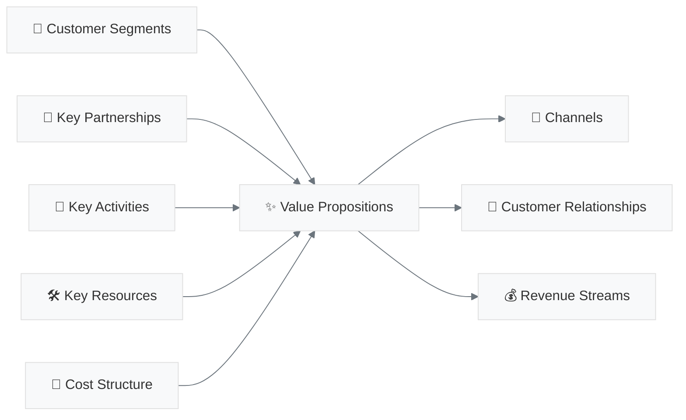

# 🚀 Projet A3E -  Beta

[](https://github.com/MacroMan5/project_a3e_beta)
[]()
[]()

## 📋 Description

**InfraQC** est une plateforme SaaS de gestion de construction spécialement conçue pour le secteur public québécois. Cette solution vise à remplacer les outils Excel et les processus manuels par une plateforme moderne, conforme à la Loi 25 et adaptée aux besoins spécifiques du marché québécois.

## 🎯 Vision

Devenir la référence en gestion de projets de construction pour les organismes publics québécois, en offrant une solution locale, abordable et parfaitement adaptée aux réglementations et workflows québécois.

## 📊 Stratégie

- **Approche Bootstrap** : Développement sans financement externe initial
- **Marché cible** : Municipalités <50k habitants, centres de services scolaires
- **Avantage concurrentiel** : Conformité Loi 25, interface française, prix accessible
- **Modèle** : SaaS B2G avec pricing adapté au secteur public

## 🗂️ Structure du Projet

```
project/
├── 1_business_foundation/     # Fondations business et canvas
├── 2_product_strategy/        # Stratégie produit et roadmap
├── 3_competitive_analysis/    # Analyse concurrentielle
├── 4_technical_architecture/  # Architecture technique
└── 5_market_research/        # Recherche de marché
```

## 🎯 **ACCÈS RAPIDE SECTIONS CRITIQUES**

| Section | Document | Lien Direct |
|---------|----------|-------------|
| **🎯 Business Model** | BMC A3E | [→ 9 Blocks Canvas](#business-model-canvas-détaillé) |
| **💰 Pricing Strategy** | BMC A3E | [→ Tiers Tarifaires](#modèle-revenus-pricing) |
| **🔍 Analyse Concurrentielle** | Concurrence | [→ Faiblesses Procore/Autodesk](#analyse-concurrentielle-stratégique) |
| **⚙️ Architecture Technique** | Stack Tech | [→ Microservices & IA](#stack-technique-architecture) |
| **🚀 Roadmap Bootstrap** | Roadmap | [→ Phases Sans Financement](#roadmap-stratégique-bootstrap) |
| **📋 Spécifications Produit** | PRD | [→ Features & User Stories](#prd-spécifications-produit) |
| **👥 Personas Clients** | Overview | [→ Segments Cibles](#personas-segments-cibles) |
| **⚖️ Conformité Loi 25** | Multiple | [→ Avantages Réglementaires](#conformité-réglementaire) |

## 📚 **STRUCTURE DOCUMENTATION**

### **1. 🎯 Business Foundation**
`/project/1_business_foundation/`

#### **📊 [BUSINESS MODEL CANVAS A3E](project/1_business_foundation/BUSINESS_MODEL_CANVAS_A3E.md)**
- **[→ Value Propositions](project/1_business_foundation/BUSINESS_MODEL_CANVAS_A3E.md#value-propositions)** - Propositions de valeur par persona
- **[→ Customer Segments](project/1_business_foundation/BUSINESS_MODEL_CANVAS_A3E.md#customer-segments)** - Municipalités, écoles, santé, sociétés d'État
- **[→ Revenue Streams](project/1_business_foundation/BUSINESS_MODEL_CANVAS_A3E.md#revenue-streams)** - Modèle SaaS 3 tiers (500$/2k$/8k$)
- **[→ Key Partnerships](project/1_business_foundation/BUSINESS_MODEL_CANVAS_A3E.md#key-partnerships)** - SEAO, Hydro-Québec, RBQ

#### **📋 [PROJECT OVERVIEW](project/1_business_foundation/PROJECT_OVERVIEW.md)**
- **[→ Vue d'ensemble](project/1_business_foundation/PROJECT_OVERVIEW.md#vue-densemble)** - Résumé exécutif du projet
- **[→ Market Analysis](project/1_business_foundation/PROJECT_OVERVIEW.md#market-analysis)** - Analyse du marché québécois

### **2. 🚀 Product Strategy**
`/project/2_product_strategy/`

#### **📋 [PRD MASTER - Vue d'Ensemble](project/2_product_strategy/PRD_MASTER.md)**
- **[→ Cycle de Vie Projet](project/2_product_strategy/PRD_MASTER.md#cycle-projet)** - Planification → Maintenance
- **[→ Intégrations Clés](project/2_product_strategy/PRD_MASTER.md#integrations)** - SEAO, Hydro-Québec, MEQ

#### **📋 [PRD PHASE 1 - MVP](project/2_product_strategy/PRD_PHASE1_MVP.md)**
- **[→ Features Core](project/2_product_strategy/PRD_PHASE1_MVP.md#features-core)** - Fonctionnalités essentielles MVP
- **[→ Timeline](project/2_product_strategy/PRD_PHASE1_MVP.md#timeline)** - Planning développement 3-6 mois

#### **📋 [PRD PHASE 2 - Expansion](project/2_product_strategy/PRD_PHASE2_EXPANSION.md)**
- **[→ Features Avancées](project/2_product_strategy/PRD_PHASE2_EXPANSION.md#features-avancees)** - IA prédictive, analytics
- **[→ Scaling Strategy](project/2_product_strategy/PRD_PHASE2_EXPANSION.md#scaling)** - Croissance organique

#### **🚀 [ROADMAP STRATÉGIQUE BOOTSTRAP](project/2_product_strategy/ROADMAP_STRATEGIQUE_BOOTSTRAP.md)**
- **[→ Phase 0: Validation](project/2_product_strategy/ROADMAP_STRATEGIQUE_BOOTSTRAP.md#phase-0-validation)** - Lean validation (2 mois)
- **[→ Phase 1: MVP](project/2_product_strategy/ROADMAP_STRATEGIQUE_BOOTSTRAP.md#phase-1-mvp)** - MVP ultra-minimal (3 mois)
- **[→ Phase 2: Revenus](project/2_product_strategy/ROADMAP_STRATEGIQUE_BOOTSTRAP.md#phase-2-revenus)** - Premiers clients (4 mois)
- **[→ Phase 3: Croissance](project/2_product_strategy/ROADMAP_STRATEGIQUE_BOOTSTRAP.md#phase-3-croissance)** - Croissance organique (9 mois)

### **3. 🔍 Competitive Analysis**
`/project/3_competitive_analysis/`

#### **🎯 [ANALYSE CONCURRENTIELLE STRATÉGIQUE](project/3_competitive_analysis/ANALYSE_CONCURRENTIELLE_STRATEGIQUE.md)**
- **[→ Faiblesses Procore](project/3_competitive_analysis/ANALYSE_CONCURRENTIELLE_STRATEGIQUE.md#procore-faiblesses)** - Prix, support, Loi 25
- **[→ Faiblesses Autodesk](project/3_competitive_analysis/ANALYSE_CONCURRENTIELLE_STRATEGIQUE.md#autodesk-faiblesses)** - Complexité, coût, rigidité
- **[→ Nos Avantages](project/3_competitive_analysis/ANALYSE_CONCURRENTIELLE_STRATEGIQUE.md#nos-avantages)** - Prix 5x moins cher, français, local
- **[→ Stratégie Différenciation](project/3_competitive_analysis/ANALYSE_CONCURRENTIELLE_STRATEGIQUE.md#strategie-differenciation)** - Conformité native Loi 25

### **4. ⚙️ Technical Architecture**
`/project/4_technical_architecture/`

#### **🛠️ [STACK TECHNIQUE](project/4_technical_architecture/STACK_TECHNIQUE.md)**
- **[→ Architecture Globale](project/4_technical_architecture/STACK_TECHNIQUE.md#architecture-globale)** - Vue d'ensemble système
- **[→ Frontend](project/4_technical_architecture/STACK_TECHNIQUE.md#frontend)** - NextJS, React Native, PWA
- **[→ Backend](project/4_technical_architecture/STACK_TECHNIQUE.md#backend)** - NestJS, microservices, API Gateway
- **[→ Base de Données](project/4_technical_architecture/STACK_TECHNIQUE.md#base-donnees)** - PostgreSQL, MongoDB, Redis
- **[→ Intelligence Artificielle](project/4_technical_architecture/STACK_TECHNIQUE.md#intelligence-artificielle)** - RAG, LLM, vision
- **[→ Infrastructure](project/4_technical_architecture/STACK_TECHNIQUE.md#infrastructure)** - OVHcloud, Kubernetes, CI/CD
- **[→ Sécurité](project/4_technical_architecture/STACK_TECHNIQUE.md#securite)** - Conformité Loi 25, chiffrement

### **5. 📊 Market Research**
`/project/5_market_research/`

#### **📄 Analyse Marché Construction Québec**
- Research approfondie marché québécois
- Données TAM/SAM/SOM construction publique
- Tendances adoption technologique organismes publics
- Tendances adoption technologique organismes publics

---

## 🎯 **NAVIGATION THÉMATIQUE**

### **💰 BUSINESS MODEL CANVAS DÉTAILLÉ**
Comprendre notre modèle d'affaires en 9 blocks:



## 📈 Phases de Développement

1. **Phase 0** (Mois 1-2) : Validation Lean - Customer Discovery
2. **Phase 1** (Mois 3-5) : MVP Ultra-Minimal - Premier produit payant
3. **Phase 2** (Mois 6-9) : Premiers Revenus - 500$ → 2000$ MRR
4. **Phase 3** (Mois 10-18) : Croissance Organique - 4k$ → 15k$ MRR
5. **Phase 4** (Mois 19-30) : Financement Stratégique - Expansion Canada

## 🔧 Stack Technique Planifié

- **Frontend** : Next.js 14, React 18, TypeScript, Tailwind CSS
- **Backend** : Supabase (PostgreSQL, Auth, Storage)
- **Hosting** : Vercel (frontend), Supabase (backend)
- **Mobile** : PWA → React Native
- **AI/ML** : Azure OpenAI, LangChain (phases avancées)

## � Modèle Économique

- **Tier 1** : 200$/utilisateur/mois (Municipalités)
- **Tier 2** : 400$/utilisateur/mois (Pro)
- **Tier 3** : Custom (Enterprise)

## 🎯 Métriques Clés

- **Phase 1** : 10 clients payants, 1000$ MRR
- **Phase 2** : 20 clients, 4000$ MRR
- **Phase 3** : 100 clients, 20000$ MRR
- **Phase 4** : 500 clients, expansion Canada

## 📝 Documentation

- [Business Model Canvas](project/1_business_foundation/BUSINESS_MODEL_CANVAS_A3E.md)
- [Project Overview](project/1_business_foundation/PROJECT_OVERVIEW.md)
- [Roadmap Stratégique](project/2_product_strategy/ROADMAP_STRATEGIQUE_BOOTSTRAP.md)
- [PRD Master](project/2_product_strategy/PRD_MASTER.md)
- [PRD MVP](project/2_product_strategy/PRD_PHASE1_MVP.md)
- [PRD Phase 2](project/2_product_strategy/PRD_PHASE2_EXPANSION.md)
- [Analyse Concurrentielle](project/3_competitive_analysis/ANALYSE_CONCURRENTIELLE_STRATEGIQUE.md)
- [Stack Technique](project/4_technical_architecture/STACK_TECHNIQUE.md)

## � Statut Actuel

**Phase 0 - Validation Lean** 🎯
- [ ] 20 customer interviews
- [ ] Validation problème/solution
- [ ] 5 design partners confirmés
- [ ] MVP défini et spécifié

## 🔒 Confidentialité

Ce projet est **strictement confidentiel**. Toute la documentation contient des informations stratégiques propriétaires.

---

*Dernière mise à jour : Juillet 2025*  
*Créé avec ❤️ pour révolutionner la gestion de construction au Québec*
