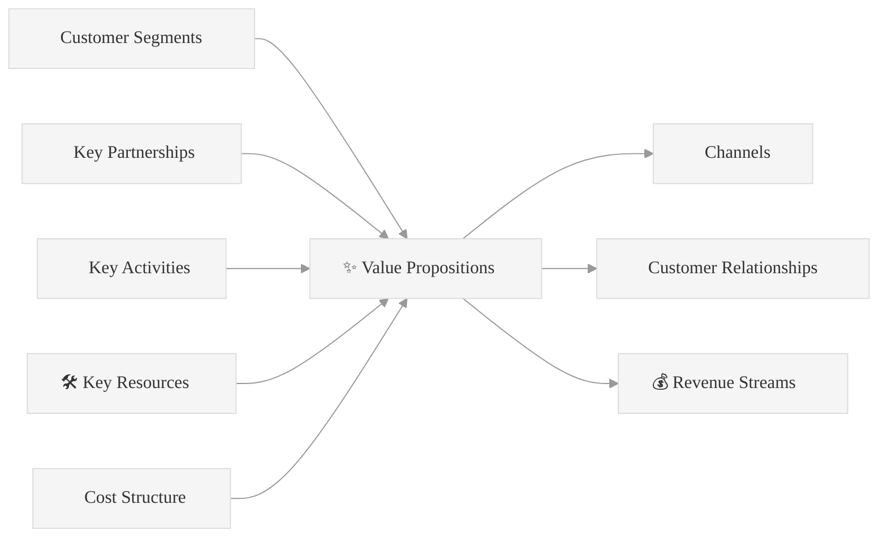

# 🚀 Projet A3E -  Beta

[](https://github.com/MacroMan5/project_a3e_beta)
[]()
[]()

## 📋 Description

**Beta** est une plateforme SaaS de gestion de construction spécialement conçue pour le secteur public québécois. Cette solution vise à remplacer les outils Excel et les processus manuels par une plateforme moderne, conforme à la Loi 25 et adaptée aux besoins spécifiques du marché québécois.

## 🎯 Vision

Devenir la référence en gestion de projets de construction pour les organismes publics québécois, en offrant une solution locale, abordable et parfaitement adaptée aux réglementations et workflows québécois.

## 📊 Stratégie

- **Approche Bootstrap** : Développement sans financement externe initial
- **Marché cible** : Municipalités <50k habitants, centres de services scolaires
- **Avantage concurrentiel** : Conformité Loi 25, interface française, prix accessible
- **Modèle** : SaaS B2G avec pricing adapté au secteur public

## 🗂️ Structure du Projet

```
project/
├── 1_business_foundation/     # Fondations business et validation
├── 2_competitive_analysis/    # Analyse concurrentielle stratégique
├── 3_product_strategy/        # Stratégie produit et go-to-market
├── 4_technical_architecture/  # Architecture technique et stack
├── 5_market_research/         # Recherche de marché et données
├── 6_product_specifications/  # Spécifications produit (PRD)
├── 7_financement/            # Documentation financement
└── 8_implementation_roadmap/ # Roadmap d'implémentation
```

## 🎯 **ACCÈS RAPIDE SECTIONS CRITIQUES**

| Section | Document | Lien Direct |
|---------|----------|-------------|
| **🔬 Plan Validation** | Validation Plan | [→ 6 Hypothèses + 60 Jours](project/1_business_foundation/VALIDATION_PLAN.md) **NOUVEAU** |
| **🎯 Action Immédiate** | Next Steps | [→ Checklist 7 Jours + GO/NO-GO](project/1_business_foundation/NEXT_STEPS_IMMEDIATE.md) **URGENT** |
| **🚀 Plan MVP** | MVP Execution | [→ 16 Semaines + 50k$](project/6_product_specifications/MVP_EXECUTION_PLAN.md) **NOUVEAU** |
| **🎯 Business Model** | BMC A3E | [→ 9 Blocks Canvas](project/3_product_strategy/BUSINESS_MODEL_CANVAS_A3E.md#business-model-canvas-visuel) |
| **💰 Pricing Strategy** | BMC A3E | [→ Tiers Tarifaires](project/3_product_strategy/BUSINESS_MODEL_CANVAS_A3E.md#revenue-streams) |
| **🔍 Analyse Concurrentielle** | Concurrence | [→ Faiblesses Procore/Autodesk](project/2_competitive_analysis/ANALYSE_CONCURRENTIELLE_STRATEGIQUE.md#faiblesses-critiques) |
| **⚙️ Architecture Technique** | Stack Tech | [→ Microservices & IA](project/4_technical_architecture/STACK_TECHNIQUE.md#architecture-globale) |
| **� Guide Mermaid** | Diagrammes | [→ Standards Visuels](project/4_technical_architecture/GUIDE_MERMAID.md) **NOUVEAU** |
| **📋 Spécifications Produit** | PRD Master | [→ Features & User Stories](project/6_product_specifications/PRD_MASTER.md#modules-features-overview) |
| **👥 Personas Clients** | PRD Master | [→ Segments Cibles](project/6_product_specifications/PRD_MASTER.md#user-personas) |
| **⚖️ Conformité Loi 25** | Stack Technique | [→ Avantages Réglementaires](project/4_technical_architecture/STACK_TECHNIQUE.md#securite) |

## 📚 **STRUCTURE DOCUMENTATION**

### **1. 🎯 Business Foundation**
`/project/1_business_foundation/`

#### **📊 [BUSINESS MODEL CANVAS A3E](project/3_product_strategy/BUSINESS_MODEL_CANVAS_A3E.md)**
- **[→ Value Propositions](project/3_product_strategy/BUSINESS_MODEL_CANVAS_A3E.md#value-propositions-spécifiques)** - Propositions de valeur par persona
- **[→ Customer Segments](project/3_product_strategy/BUSINESS_MODEL_CANVAS_A3E.md#customer-segments)** - Municipalités, écoles, santé, sociétés d'État
- **[→ Revenue Streams](project/3_product_strategy/BUSINESS_MODEL_CANVAS_A3E.md#revenue-streams)** - Modèle SaaS 3 tiers (500$/2k$/8k$)
- **[→ Key Partnerships](project/3_product_strategy/BUSINESS_MODEL_CANVAS_A3E.md#key-partnerships-stratégiques)** - SEAO, Hydro-Québec, RBQ

#### **📋 [PROJECT OVERVIEW](project/1_business_foundation/PROJECT_OVERVIEW.md)**
- **[→ Vue d'ensemble](project/1_business_foundation/PROJECT_OVERVIEW.md#vue-densemble)** - Résumé exécutif du projet
- **[→ Market Analysis](project/1_business_foundation/PROJECT_OVERVIEW.md#market-analysis)** - Analyse du marché québécois

#### **🔬 [VALIDATION PLAN](project/1_business_foundation/VALIDATION_PLAN.md)** - **NOUVEAU**
- **[→ 6 Hypothèses Critiques](project/1_business_foundation/VALIDATION_PLAN.md#6-hypotheses-critiques)** - Plan méthodologique Build-Measure-Learn
- **[→ Timeline 60 Jours](project/1_business_foundation/VALIDATION_PLAN.md#timeline-60-jours)** - 4 sprints de validation
- **[→ Critères Go/No-Go](project/1_business_foundation/VALIDATION_PLAN.md#criteres-go-no-go)** - Décision MVP basée sur données

#### **🎯 [NEXT STEPS IMMEDIATE](project/1_business_foundation/NEXT_STEPS_IMMEDIATE.md)** - **URGENT**
- **[→ Actions Critiques 7 Jours](project/1_business_foundation/NEXT_STEPS_IMMEDIATE.md#actions-critiques-semaine-1)** - Checklist immédiate
- **[→ Budget & Go/No-Go](project/1_business_foundation/NEXT_STEPS_IMMEDIATE.md#criteres-decision-immediate)** - Décision aujourd'hui
- **[→ Quick Start Validation](project/1_business_foundation/NEXT_STEPS_IMMEDIATE.md#actions-concretes-aujourdhui)** - Commencer maintenant

### **2. 🔍 Competitive Analysis**
`/project/2_competitive_analysis/`

#### **🎯 [ANALYSE CONCURRENTIELLE STRATÉGIQUE](project/2_competitive_analysis/ANALYSE_CONCURRENTIELLE_STRATEGIQUE.md)**
- **[→ Faiblesses Procore](project/2_competitive_analysis/ANALYSE_CONCURRENTIELLE_STRATEGIQUE.md#procore-faiblesses)** - Prix, support, Loi 25
- **[→ Faiblesses Autodesk](project/2_competitive_analysis/ANALYSE_CONCURRENTIELLE_STRATEGIQUE.md#autodesk-faiblesses)** - Complexité, coût, rigidité
- **[→ Nos Avantages](project/2_competitive_analysis/ANALYSE_CONCURRENTIELLE_STRATEGIQUE.md#nos-avantages)** - Prix 5x moins cher, français, local
- **[→ Stratégie Différenciation](project/2_competitive_analysis/ANALYSE_CONCURRENTIELLE_STRATEGIQUE.md#strategie-differenciation)** - Conformité native Loi 25

### **3. 🚀 Product Strategy**
`/project/3_product_strategy/`

#### **📊 [BUSINESS MODEL CANVAS A3E](project/3_product_strategy/BUSINESS_MODEL_CANVAS_A3E.md)**
- **[→ 9 Blocks Canvas](project/3_product_strategy/BUSINESS_MODEL_CANVAS_A3E.md#business-model-canvas-visuel)** - Modèle d'affaires complet
- **[→ Segments Clients](project/3_product_strategy/BUSINESS_MODEL_CANVAS_A3E.md#customer-segments)** - Municipalités, CSS, CIUSSS
- **[→ Proposition Valeur](project/3_product_strategy/BUSINESS_MODEL_CANVAS_A3E.md#value-propositions-spécifiques)** - 5x moins cher + Loi 25

#### **📋 [PRODUCT STRATEGY](project/3_product_strategy/PRODUCT_STRATEGY.md)**
- **[→ Vision Produit](project/3_product_strategy/PRODUCT_STRATEGY.md#vision-produit)** - Stratégie globale A3E Beta
- **[→ Positionnement](project/3_product_strategy/PRODUCT_STRATEGY.md#positionnement)** - "Shopify de la construction québécoise"

### **4. ⚙️ Technical Architecture**
`/project/4_technical_architecture/`

#### **🛠️ [STACK TECHNIQUE](project/4_technical_architecture/STACK_TECHNIQUE.md)**
- **[→ Architecture Globale](project/4_technical_architecture/STACK_TECHNIQUE.md#architecture-globale)** - Vue d'ensemble système
- **[→ Frontend](project/4_technical_architecture/STACK_TECHNIQUE.md#frontend)** - NextJS, React Native, PWA
- **[→ Backend](project/4_technical_architecture/STACK_TECHNIQUE.md#backend)** - NestJS, microservices, API Gateway
- **[→ Base de Données](project/4_technical_architecture/STACK_TECHNIQUE.md#base-donnees)** - PostgreSQL, MongoDB, Redis
- **[→ Intelligence Artificielle](project/4_technical_architecture/STACK_TECHNIQUE.md#intelligence-artificielle)** - RAG, LLM, vision
- **[→ Infrastructure](project/4_technical_architecture/STACK_TECHNIQUE.md#infrastructure)** - OVHcloud, Kubernetes, CI/CD
- **[→ Sécurité](project/4_technical_architecture/STACK_TECHNIQUE.md#securite)** - Conformité Loi 25, chiffrement

### **5. 🔍 Market Research**
`/project/5_market_research/`

#### **📊 [Analyse Marché Plateforme QC](project/5_market_research/Analyse_Marche_PlateForme_QC.pdf)**
- Analyse détaillée du marché québécois de la construction publique
- Données TAM/SAM spécifiques au Québec
- Opportunités sectorielles par segment

### **6. 📋 Product Specifications**
`/project/6_product_specifications/`

#### **📋 [PRD MASTER - Vue d'Ensemble](project/6_product_specifications/PRD_MASTER.md)**
- **[→ Executive Summary](project/6_product_specifications/PRD_MASTER.md#executive-summary)** - Vision produit globale
- **[→ Market Analysis](project/6_product_specifications/PRD_MASTER.md#market-analysis)** - TAM/SAM québécois
- **[→ User Personas](project/6_product_specifications/PRD_MASTER.md#user-personas)** - 3 profils cibles détaillés

#### **🚀 [MVP EXECUTION PLAN](project/6_product_specifications/MVP_EXECUTION_PLAN.md)** - **NOUVEAU**
- **[→ Features MVP MoSCoW](project/6_product_specifications/MVP_EXECUTION_PLAN.md#features-mvp-priorisation-moscow)** - Priorisation claire features
- **[→ Timeline 16 Semaines](project/6_product_specifications/MVP_EXECUTION_PLAN.md#timeline-16-semaines)** - Plan d'exécution technique détaillé
- **[→ Budget & Équipe](project/6_product_specifications/MVP_EXECUTION_PLAN.md#equipe-ressources)** - 50k$ budget, équipe 3-4 personnes

#### **📋 [PRD PHASE 1 - MVP](project/6_product_specifications/PRD_PHASE1_MVP.md)**
- **[→ Features Core](project/6_product_specifications/PRD_PHASE1_MVP.md#features-requirements-moscow-prioritization)** - Fonctionnalités essentielles MVP
- **[→ Timeline](project/6_product_specifications/PRD_PHASE1_MVP.md#planning-detaille)** - Planning développement 3-6 mois

#### **📋 [PRD PHASE 2 - Expansion](project/6_product_specifications/PRD_PHASE2_EXPANSION.md)**
- **[→ Features Avancées](project/6_product_specifications/PRD_PHASE2_EXPANSION.md#features-avancees)** - IA prédictive, analytics
- **[→ Scaling Strategy](project/6_product_specifications/PRD_PHASE2_EXPANSION.md#scaling)** - Croissance organique

#### **📋 [PRD PHASE 3 - Platform](project/6_product_specifications/PRD_PHASE3_PLATFORM.md)**
- **[→ Features Plateforme](project/6_product_specifications/PRD_PHASE3_PLATFORM.md#features-plateforme)** - Évolution vers plateforme complète
- **[→ Ecosystem Strategy](project/6_product_specifications/PRD_PHASE3_PLATFORM.md#ecosystem)** - Stratégie écosystème

### **7. 💰 Financement**
`/project/7_financement/`

#### **📊 [Rapport Financement Startup QC](project/7_financement/Rapport_Financement_Startup_QC.pdf)**
- Stratégies de financement pour startups québécoises
- Options gouvernementales et privées
- Calendrier de financement par phases

---

## 🎯 **NAVIGATION THÉMATIQUE**

### **💰 BUSINESS MODEL CANVAS DÉTAILLÉ**
Comprendre notre modèle d'affaires en 9 blocks:



## 👥 Équipe Fondatrice

**Équipe de 3 fondateurs complémentaires** pour un lancement bootstrap optimal :

- **🎯 Gestionnaire** : Stratégie business, développement client, customer success
- **🏗️ Architecte** : Design produit, UX/UI, recherche utilisateur, validation marché
- **💻 Développeur Full-Stack** : Implémentation technique, DevOps, architecture système

## 📈 Phases de Développement

1. **Phase 0** (Mois 1-2) : Validation Lean - Customer Discovery
2. **Phase 1** (Mois 3-9) : MVP Complet - Développement et premiers clients
3. **Phase 2** (Mois 10-18) : Expansion - Croissance 10→50 clients (1k→9k MRR)
4. **Phase 3** (Mois 19-30) : Platform - Scaling 50→200 clients (9k→40k MRR)
5. **Phase 4** (Mois 31+) : Financement Stratégique - Expansion Canada

## 🔧 Stack Technique Planifié

- **Frontend** : Next.js 14, React 18, TypeScript, Tailwind CSS
- **Backend** : NestJS, microservices, PostgreSQL
- **Hosting** : OVHcloud (conformité Loi 25)
- **Mobile** : PWA → React Native
- **AI/ML** : Azure OpenAI, LangChain, RAG

## 💰 Modèle Économique SaaS B2G

**Phase 1 (MVP)** : Pricing d'acquisition
- **🎯 Design Partners** : 100$/org/mois + 50$/utilisateur additionnel (50% rabais à vie)
- **🚀 Early Adopters** : 150$/org/mois + 60$/utilisateur additionnel

**Phase 2+ (Scaling)** : Pricing mature
- **🥉 STANDARD** : 200$/org/mois + 75$/utilisateur additionnel (Petites municipalités)
- **🥈 PROFESSIONAL** : 500$/org/mois + 100$/utilisateur additionnel (Municipalités moyennes, CSS)
- **🥇 ENTERPRISE** : Custom pricing + volume discounts (Grandes villes, CIUSSS)

## 🎯 Métriques Clés Bootstrap

- **Phase 1 (Mois 9)** : 10 clients, 2,000$ MRR (24K$ ARR)
- **Phase 2 (Mois 18)** : 50 clients, 17,500$ MRR (210K$ ARR)
- **Phase 3 (Mois 30)** : 200 clients, 70,000$ MRR (840K$ ARR)
- **Série A** : 2-5M$ pour expansion canadienne

---

## 📖 **GLOSSAIRE DES TERMES CLÉS**

| **Terme** | **Définition** | **Usage dans le Projet** |
|-----------|----------------|---------------------------|
| **Design Partners** | 5-10 premiers clients payants avec rabais 50% à vie | Phase 1 MVP : 100$/org + 50$/user, accès direct fondateurs |
| **Early Adopters** | 10-20 clients suivants avec pricing privilégié | Phase 1 MVP : 150$/org + 60$/user, onboarding inclus |
| **Customer Discovery** | Processus validation hypothèses via interviews clients | Phase 0 : 20+ interviews pour valider problem-solution fit |
| **Loi 25** | Loi québécoise protection renseignements personnels | Avantage concurrentiel : données hébergées Canada obligatoire |
| **MRR** | Monthly Recurring Revenue (revenus récurrents mensuels) | Métrique principale : 2K$ → 17.5K$ → 70K$ par phase |
| **MVP** | Minimum Viable Product (produit viable minimum) | Phase 1 : 4 modules core, 10 clients, 3-9 mois |
| **NPS** | Net Promoter Score (score satisfaction client) | Cible évolutive : 40 → 60 → 80 selon phase |
| **PLN/CON/CONS/MAINT** | Codes modules : Planification/Conception/Construction/Maintenance | Référence features : PLN-001, CON-002, etc. |
| **RBAC** | Role-Based Access Control (contrôle accès par rôles) | Sécurité : admin, gestionnaire, inspecteur, lecteur |
| **RAG** | Retrieval-Augmented Generation (IA avec base connaissance) | Phase 2+ : Assistant IA spécialisé construction QC |
| **SaaS B2G** | Software as a Service Business-to-Government | Modèle : abonnement mensuel organismes publics |
| **TAM/SAM** | Total/Serviceable Addressable Market | TAM : 50M$/an, SAM : 15M$/an (marché québécois) |

## 📝 **NAVIGATION RAPIDE - DOCUMENTS ESSENTIELS**

### **🔥 Documents Critiques (À Lire en Premier)**
1. **[🎯 NEXT STEPS IMMEDIATE](project/1_business_foundation/NEXT_STEPS_IMMEDIATE.md)** - Actions urgentes 7 jours (**URGENT**)
2. **[🔬 VALIDATION PLAN](project/1_business_foundation/VALIDATION_PLAN.md)** - Plan validation 60 jours (**NOUVEAU**)
3. **[🚀 MVP EXECUTION PLAN](project/6_product_specifications/MVP_EXECUTION_PLAN.md)** - Plan d'exécution 16 semaines (**NOUVEAU**)
4. **[📋 PROJECT OVERVIEW](project/1_business_foundation/PROJECT_OVERVIEW.md)** - Vue d'ensemble du projet
5. **[📊 BUSINESS MODEL CANVAS](project/3_product_strategy/BUSINESS_MODEL_CANVAS_A3E.md)** - Modèle d'affaires complet

### **📚 Documentation Complète**
- [🏗️ Stack Technique](project/4_technical_architecture/STACK_TECHNIQUE.md)
- [🎯 Analyse Concurrentielle](project/2_competitive_analysis/ANALYSE_CONCURRENTIELLE_STRATEGIQUE.md)
- [📋 PRD Master](project/6_product_specifications/PRD_MASTER.md)
- [📋 PRD MVP](project/6_product_specifications/PRD_PHASE1_MVP.md)

## � Statut Actuel

**Phase 0 - Validation Lean** 🎯
- [ ] 20 customer interviews
- [ ] Validation problème/solution
- [ ] 5 design partners confirmés
- [ ] MVP défini et spécifié

## 🔒 Confidentialité

Ce projet est **strictement confidentiel**. Toute la documentation contient des informations stratégiques propriétaires.

---

*Dernière mise à jour : Juillet 2024*  
*Créé avec ❤️ pour révolutionner la gestion de construction au Québec*
