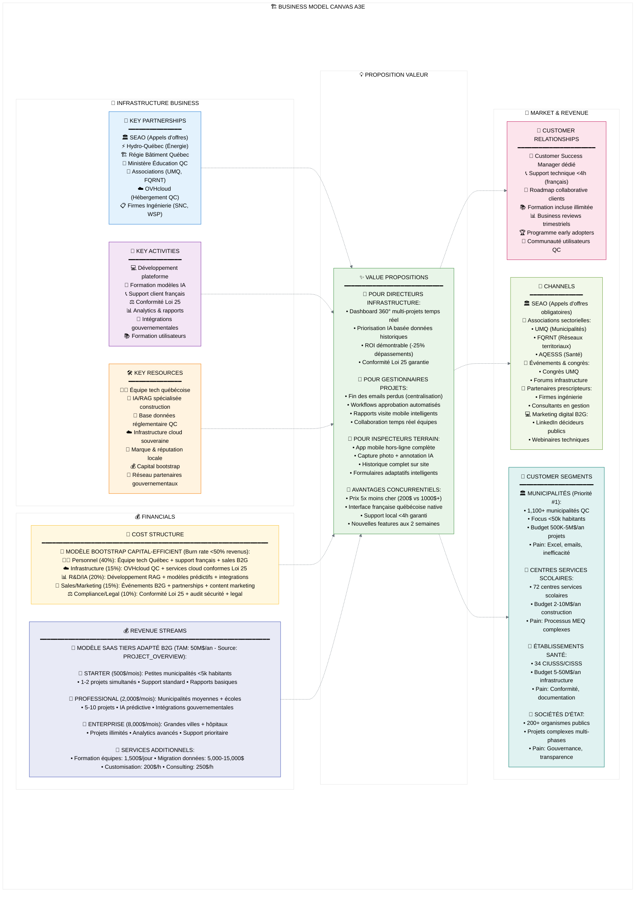
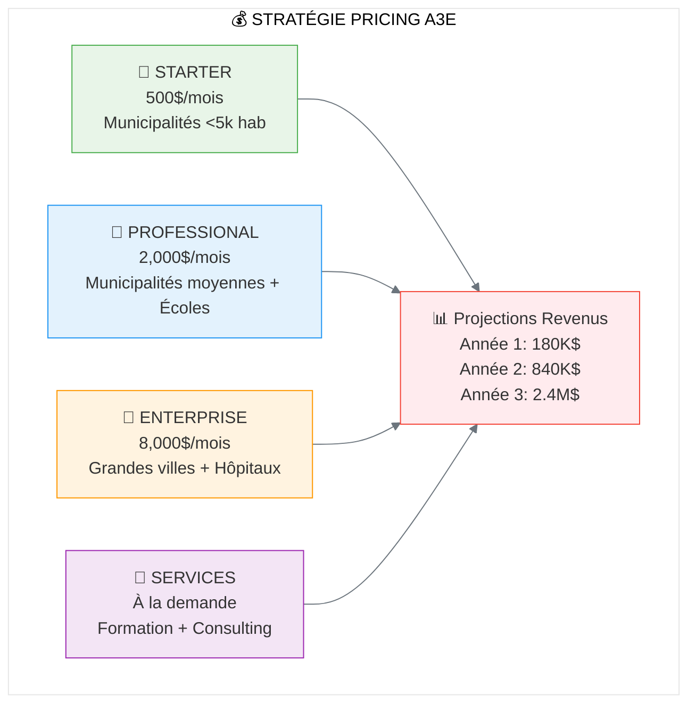
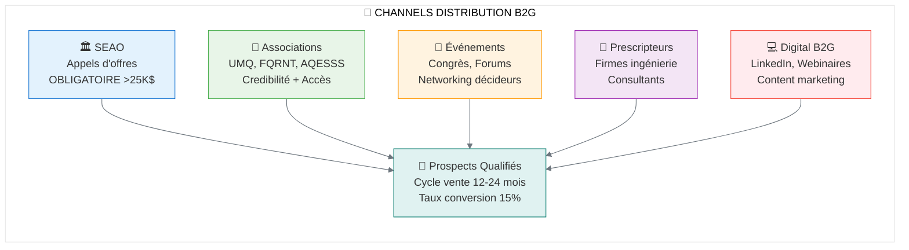

# 🏗️ BUSINESS MODEL CANVAS A3E
## Plateforme Construction Publique Québec

> **Document stratégique** - Modèle d'affaires et proposition de valeur  
> **Date**: Juillet 2025  
> **Aligné avec**: [PROJECT_OVERVIEW.md](../../PROJECT_OVERVIEW.md)  
> **Status**: Version 1.0

📚 **[← Retour INDEX](../INDEX.md)** | **[→ Analyse Concurrentielle](../3_competitive_analysis/ANALYSE_CONCURRENTIELLE_STRATEGIQUE.md)** | **[→ PRD Produit](../2_product_strategy/PRD.md)**

---

## 📊 **BUSINESS MODEL CANVAS VISUEL**



---

## 🎯 **CUSTOMER SEGMENTS DÉTAILLÉS** {#customer-segments}

📋 **Liens connexes**: [→ Personas PROJECT_OVERVIEW](../../PROJECT_OVERVIEW.md#personas-cibles) | [→ PRD Market Analysis](../2_product_strategy/PRD.md#market-analysis)

### **Segment Primaire: Municipalités Québécoises**
- **Taille marché**: 1,100+ municipalités (priorité <50k habitants)
- **Budget IT annuel**: 50K-200K$ (5-10% pour nouveaux outils)
- **Budget projets**: 500K-5M$/an infrastructure
- **Décideurs**: Directeur général, Directeur travaux publics, Maire
- **Pain points critiques**:
  - 95% utilisent encore Excel/email
  - Manque visibilité sur portfolio projets
  - Difficile justification dépenses aux citoyens
  - Non-conformité Loi 25 solutions actuelles

### **Segment Secondaire: Centres Services Scolaires**
- **Taille marché**: 72 centres services scolaires QC
- **Budget projets**: 2-10M$/an construction/rénovation
- **Décideurs**: Directeur général, Directeur services techniques
- **Spécificités**:
  - Processus MEQ standardisés (PFT obligatoires)
  - Complexité approbations multi-niveaux
  - Besoin transparence communautés

### **Segment Tertiaire: Établissements Santé**
- **Taille marché**: 34 CIUSSS/CISSS
- **Budget projets**: 5-50M$/an infrastructure
- **Contraintes spéciales**: Conformité santé, accessibilité
- **Opportunité**: Projets complexes, valeur élevée

---

## 💡 **VALUE PROPOSITIONS SPÉCIFIQUES**

### **🎯 Pour Directeurs Infrastructure Municipaux**
**Job-to-be-Done**: *"Gérer efficacement portfolio projets infrastructure avec transparence citoyenne et conformité réglementaire"*

**Gains créés**:
- **ROI mesurable**: Réduction 25% dépassements budgétaires
- **Transparence citoyenne**: Portail public temps réel
- **Conformité garantie**: Loi 25 + audit trails complets
- **Décisions éclairées**: Analytics prédictifs + benchmarking

**Pain relievers**:
- Fin fragmentation données (Excel → Plateforme unifiée)
- Priorisation objective (IA vs subjectivité)
- Reporting automatisé (vs 10-15h/semaine manuelles)

### **🎯 Pour Gestionnaires Projets Construction**
**Job-to-be-Done**: *"Livrer projets dans délais/budgets avec coordination efficace équipes"*

**Gains créés**:
- **Productivité**: Réduction 50% temps administratif
- **Collaboration**: Workflows automatisés vs emails
- **Mobilité**: Accès temps réel terrain/bureau
- **Qualité**: Templates PFT + processus standardisés

**Pain relievers**:
- Fin emails perdus (centralisation communications)
- Versions uniques documents (vs multiples versions)
- Approbations rapides (workflows vs circuits manuels)

### **🎯 Pour Inspecteurs/Techniciens Terrain**
**Job-to-be-Done**: *"Documenter efficacement état projets avec outils adaptés terrain"*

**Gains créés**:
- **Efficacité terrain**: Mode hors-ligne complet
- **Qualité rapports**: IA détection défauts photos
- **Simplicité**: Formulaires adaptatifs intelligents
- **Historique**: Accès complet données site

**Pain relievers**:
- Fin formulaires papier (mobile-first)
- Fin retranscription (capture directe)
- Contexte disponible (historique vs mémoire)

---

## 💰 **REVENUE STREAMS DÉTAILLÉS** {#revenue-streams}

📊 **Liens connexes**: [→ Roadmap Revenus](../2_product_strategy/ROADMAP_STRATEGIQUE_BOOTSTRAP.md#revenus) | [→ Pricing Concurrentiel](../3_competitive_analysis/ANALYSE_CONCURRENTIELLE_STRATEGIQUE.md#pricing)

### **Modèle SaaS Tiers - Adapté B2G**



### **Pricing vs Concurrents**
| Métrique | A3E | Procore | Autodesk |
|----------|-----|---------|----------|
| **Prix entry-level** | 500$/mois | 1,000$/mois | 1,200$/mois |
| **Formation** | Incluse | 5,000$ | 8,000$ |
| **Support** | Français <4h | Anglais 48h | Anglais 72h |
| **ROI typique** | 6 mois | 2-3 ans | 3+ ans |
| **Conformité Loi 25** | ✅ Native | ❌ Impossible | ❌ Impossible |

### **Services Additionnels**
- **Formation équipes**: 1,500$/jour (vs 5,000$ concurrents)
- **Migration données**: 5,000-15,000$ selon complexité
- **Customisation**: 200$/h développement
- **Consulting gestion projets**: 250$/h
- **Audit conformité**: 5,000$ one-time

---

## 🤝 **KEY PARTNERSHIPS STRATÉGIQUES**

### **Partenaires Gouvernementaux**
- **SEAO**: Intégration native appels d'offres
- **Régie Bâtiment Québec**: Conformité codes construction
- **Ministère Éducation**: Templates PFT standardisés
- **Hydro-Québec**: Données énergétiques temps réel

### **Partenaires Technologiques**
- **OVHcloud Canada**: Hébergement souverain Loi 25
- **Microsoft Azure Canada**: Infrastructure cloud backup
- **Firm.ai**: Modules IA spécialisés construction

### **Partenaires Écosystème**
- **Firmes ingénierie**: SNC-Lavalin, WSP, CIMA+ (prescripteurs)
- **Associations**: UMQ, FQRNT, AQESSS (credibilité + accès)
- **Fournisseurs construction**: Régie Bâtiment (conformité)

---

## 📢 **CHANNELS & GO-TO-MARKET**

### **Channel Strategy B2G Québec**



### **Customer Acquisition Strategy**
1. **Phase Bootstrap (0-12 mois)**: 2-3 municipalités pilotes via réseau
2. **Phase Traction (12-24 mois)**: 10-15 clients via SEAO + associations
3. **Phase Scale (24+ mois)**: Expansion organique + partenaires

---

## 🛠️ **KEY ACTIVITIES & RESOURCES**

### **Core Activities (Aligned with Capital Efficiency)**
- **Développement produit** (40% effort): Features MVP + IA spécialisée
- **Customer Success** (25% effort): Support français + formation
- **Sales B2G** (20% effort): Processus longs, multi-stakeholders
- **Compliance** (15% effort): Loi 25 + sécurité + audit

### **Critical Resources**
- **Équipe tech québécoise**: Développeurs full-stack + data scientists
- **Base connaissances**: Réglementations QC + terminologie construction
- **Infrastructure souveraine**: Cloud québécois/canadien Loi 25
- **Capital bootstrap**: 18-24 mois runway sans financement externe

---

## 📊 **VALIDATION & MÉTRIQUES CLÉS**

### **Product-Market Fit Metrics**
- **Retention Rate**: >80% après 12 mois (vs 60% industrie)
- **NPS Score**: >60 (obsession customer satisfaction)
- **Time-to-Value**: <30 jours (vs 6+ mois concurrents)
- **Usage Weekly**: >3 sessions/semaine utilisateurs clés

### **Business Metrics**
- **CAC (Customer Acquisition Cost)**: <8,000$ (vs 25,000$+ B2B traditionnel)
- **LTV/CAC Ratio**: >5:1 (sustainable growth)
- **Churn Rate**: <5% annuel (secteur public stable)
- **Expansion Revenue**: 120%+ (upsell modules)

### **Unit Economics Cibles**
```
- ARPU Starter: 6,000$/an
- ARPU Professional: 24,000$/an  
- ARPU Enterprise: 96,000$/an
- Gross Margin: >85% (SaaS typical)
- Payback Period: <12 mois
```

---

## 🚀 **COMPÉTITIVE ADVANTAGES**

### **1. Barrière Réglementaire (Loi 25)**
- **Impossible pour Procore/Autodesk**: Hébergement hors-Canada interdit
- **Fenêtre opportunité**: 18-24 mois avant solutions conformes
- **First-mover advantage**: Établir standard marché

### **2. Expertise Locale Profonde**
- **Interface française native**: Pas traduction Google
- **Processus gouvernementaux**: SEAO, MEQ, RBQ intégrés
- **Support local**: Équipe qui comprend contexte québécois

### **3. Pricing Disruptif**
- **5x moins cher**: 200$/mois vs 1,000$+ concurrents
- **Formation incluse**: vs 5,000-8,000$ supplémentaires
- **ROI rapide**: 6 mois vs 2-3 ans

### **4. Agilité Bootstrap**
- **Ship fast**: Features aux 2 semaines vs 18+ mois
- **Customer-centric**: Roadmap collaborative clients
- **Réactivité**: Support <4h vs 48-72h

---

## 📈 **PROJECTIONS FINANCIÈRES**

### **Runway Bootstrap 18-24 mois**
```
Année 1: 
- Clients: 3 municipalités pilotes
- Revenus: 180K$
- Coûts: 400K$ (équipe 4 personnes)
- Burn: -220K$

Année 2:
- Clients: 15 organismes publics  
- Revenus: 840K$
- Coûts: 650K$ (équipe 7 personnes)
- Profit: +190K$ (break-even atteint)

Année 3:
- Clients: 40+ organismes
- Revenus: 2.4M$
- Profit: 1.2M$ (50% margin)
- Série A: 2-5M$ pour expansion
```

---

## 🎯 **NEXT STEPS ACTIVATION**

### **Phase Immédiate (30 jours)**
1. **Validation BMC**: 10 interviews prospects cibles
2. **MVP Spec**: Features critiques Phase 1
3. **Legal Setup**: Structure + IP + conformité base
4. **Early Partnerships**: Discussions SEAO + OVHcloud

### **Phase Lancement (90 jours)**
1. **Alpha MVP**: 2 municipalités pilotes
2. **Conformité Loi 25**: Audit + certification
3. **Team Building**: CTO + Sales B2G
4. **First Revenue**: Contrat pilot payant

---

*Ce Business Model Canvas constitue la fondation stratégique d'A3E, parfaitement aligné avec la vision PROJECT_OVERVIEW.md et optimisé pour le contexte unique du marché québécois B2G.*

**Prochaine étape recommandée**: Customer Discovery avec 10+ prospects pour valider hypothèses clés du BMC.

---

*Document vivant - À réviser après chaque cycle de validation*  
*Dernière mise à jour : Juillet 2025*