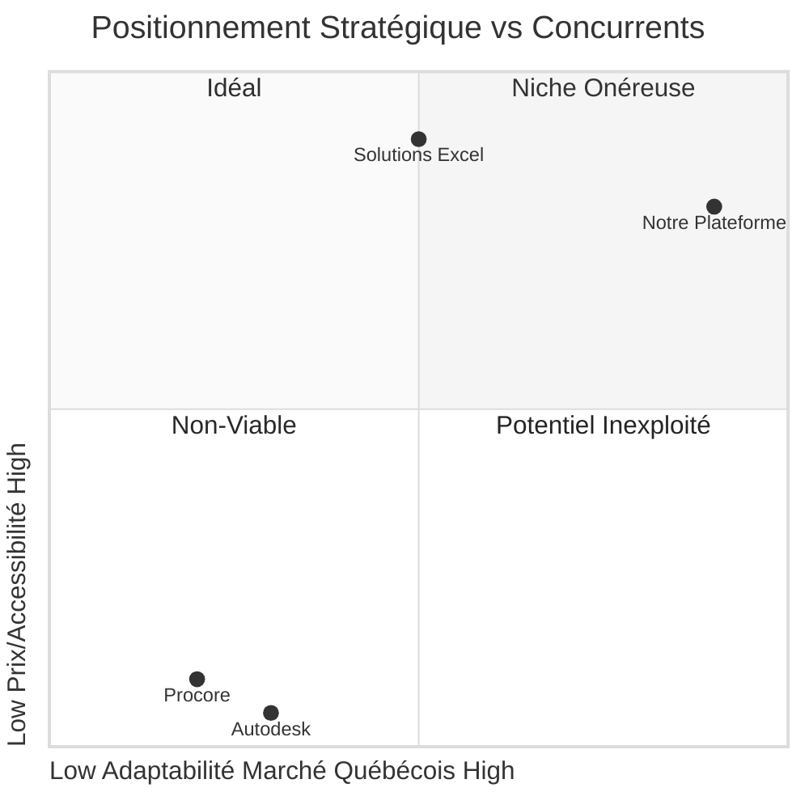

# 🏗️ PROJET A3E - VUE D'ENSEMBLE
## Plateforme de Gestion de Construction Québec

> **Document de synthèse** - Vision globale et objectifs stratégiques  
> **Date**: Juillet 2025  
> **Status**: Version 1.0

---

## 🎯 **VISION & MISSION**

### **Vision**
Révolutionner la gestion de l'infrastructure publique au Québec en créant une plateforme unifiée et intelligente qui connecte toutes les phases du cycle de vie des projets de construction, de la planification à la maintenance.

### **Mission**
Développer une solution SaaS 100% québécoise qui transforme chaque gestionnaire de projet en super-gestionnaire grâce à l'automatisation intelligente, tout en garantissant une conformité totale à la Loi 25 et aux processus gouvernementaux locaux.

---

## 📊 **OPPORTUNITÉ DE MARCHÉ**

### **Problématique Actuelle**
- **95% des organismes publics** utilisent encore Excel et email pour gérer leurs projets d'infrastructure
- **Fragmentation totale** des données entre les quatre phases du cycle de vie
- **Perte massive de temps** : 10-15h/semaine en communications non-productives par gestionnaire
- **Non-conformité** avec la Loi 25 des solutions américaines existantes (Procore, Autodesk)

### **Marché Cible**
- **1,100+ municipalités** québécoises (priorité <50k habitants)
- **72 centres de services scolaires**
- **34 CIUSSS/CISSS**
- **200+ sociétés d'État**
- **Budget total TAM** : 50M$/an en logiciels de construction/maintenance

### **Fenêtre d'Opportunité**
La conformité à la Loi 25 (hébergement des données au Québec) crée une barrière d'entrée naturelle contre les géants américains, offrant une fenêtre stratégique de 18-24 mois pour s'établir comme standard du marché.

---

## 🔄 **CYCLE DE VIE D'UN PROJET DE CONSTRUCTION**

Notre plateforme couvre les quatre phases critiques du cycle de vie d'un projet de construction, offrant une solution end-to-end là où les concurrents ne couvrent souvent que 1-2 phases.

### **1. Planification**
- **Acteurs**: Organismes publics, directeurs d'infrastructure
- **Activités**: Analyse de parc immobilier, priorisation des projets, planification budgétaire
- **Problèmes actuels**: Données dispersées, priorisation subjective, manque de visibilité
- **Notre solution**: Dashboards analytiques, outils de priorisation IA, simulation budgétaire

### **2. Conception**
- **Acteurs**: Architectes, ingénieurs, gestionnaires de projet
- **Activités**: Création PFT, fiches locaux, plans, devis, approbations
- **Problèmes actuels**: Échanges par email, versions multiples, approbations lentes
- **Notre solution**: Gestion documentaire collaborative, workflows d'approbation, PFT automatisés

### **3. Construction**
- **Acteurs**: Entrepreneurs, sous-traitants, inspecteurs
- **Activités**: Exécution des travaux, rapports de visite, demandes de changement
- **Problèmes actuels**: Communication fragmentée, retards d'approbation, documentation manuelle
- **Notre solution**: Rapports de visite mobiles, communication centralisée, signatures électroniques

### **4. Maintenance**
- **Acteurs**: Opérations, techniciens, inspecteurs
- **Activités**: Entretien préventif, inspections, gestion des actifs
- **Problèmes actuels**: Déconnexion phase construction, données d'actifs dispersées
- **Notre solution**: Maintenance prédictive IA, historique complet des actifs, intégrations IoT

---

## ✨ **FONCTIONNALITÉS CLÉS INNOVANTES**

### **1. 🧠 IA Conversationnelle Spécialisée**
- **RAG sur documents** : Extraire intelligence des plans, devis, contrats, PFT
- **Q&A français québécois** : Terminologie construction locale et réglementations QC
- **Résumés automatiques** : Synthèse intelligente des documents, réunions, décisions
- **Prédictions basées sur données historiques** : Retards, dépassements, risques

### **2. 📱 Rapports de Visite Révolutionnaires**
- **Mobile-first** : Application PWA/native optimisée pour le terrain
- **Capture photo intelligente** : Annotations, détection automatique défauts
- **Formulaires dynamiques adaptatifs** : Contextualisation selon réponses
- **Mode hors-ligne avancé** : Fonctionnalité complète sans connectivité

### **3. 📊 Dashboards Analytiques Prédictifs**
- **Vue unifiée multi-projets** : Statuts, budgets, risques, ressources
- **Prédiction maintenance** : Anticiper besoins d'intervention
- **Optimisation énergétique** : Monitoring consommation temps réel (Hydro-Québec)
- **Benchmarking projets similaires** : Comparaisons avec organismes similaires

### **4. 🔄 Intégrations Gouvernementales Exclusives**
- **SEAO** : Soumissions automatisées, suivi appels d'offres
- **Hydro-Québec** : Données énergétiques temps réel
- **Systèmes financiers gouvernementaux** : Synchronisation budgétaire
- **Templates MEQ** : PFT standardisés et pré-approuvés

---

## 💪 **AVANTAGES CONCURRENTIELS**

### **1. Conformité Loi 25 Native**
- **Hébergement 100% québécois/canadien** (impossible pour Procore/Autodesk)
- **Chiffrement bout-en-bout** des données sensibles
- **Audit trails complets** pour conformité réglementaire
- **Résidence des données garantie** au Québec

### **2. Expertise Locale Insurpassable**
- **Interface 100% française québécoise** (pas une traduction)
- **Processus alignés** avec méthodes gouvernementales québécoises
- **Support technique local** par experts qui comprennent le contexte
- **Adaptation aux codes et normes** spécifiques au Québec

### **3. Prix Disruptif vs Concurrents**
| Solution | Prix mensuel | Formation | Support | ROI typique |
|----------|--------------|-----------|---------|-------------|
| **Notre Plateforme** | 200$ | Incluse | Français 2h | 6 mois |
| **Procore** | 1,000$+ | 5,000$ | Anglais 48h | 2-3 ans |
| **Autodesk** | 1,200$+ | 8,000$ | Anglais 72h | 3+ ans |

### **4. Agilité et Innovation Supérieures**
- **Nouvelles fonctionnalités** en 2-4 semaines (vs 18+ mois concurrents)
- **Support direct** avec réponse garantie <4h
- **Personnalisations** selon besoins spécifiques organismes
- **Roadmap collaborative** avec clients prioritaires

---

## 🛠️ **ARCHITECTURE TECHNIQUE**

STACK_TECHNIQUE.md 

## 🚀 **STRATÉGIE DE DÉPLOIEMENT**

ROADMAP_STRATEGIQUE_BOOTSTRAP.md

## 👥 **PERSONNAS CIBLES**

### **Directeur Infrastructure Municipal**
- 45-55 ans, formation ingénieur/administrateur
- Gère budget 2-5M$/an projets infrastructure
- Frustrés par données éparpillées (Excel, emails)
- Besoin priorisation objective projets et reporting efficace
- Utilise principalement desktop, mais besoin accès mobile terrain

### **Gestionnaire Projets Construction**
- 35-45 ans, expérience 10+ ans gestion projets
- Gère 3-5 projets simultanés (500K$-5M$)
- Points douloureux: emails perdus, versions multiples, approbations lentes
- Utilise mobile 60%, desktop 40%
- Besoin notifications temps réel et accès hors bureau

### **Inspecteur/Technicien Terrain**
- 25-45 ans, formation technique bâtiment
- 80% temps sur terrain, utilise smartphone/tablette
- Frustré par formulaires papier, retranscription, manque historique sur site
- Utilise exclusivement mobile, sessions courtes (15-30min)
- Besoin mode hors-ligne et capture photo/annotation efficace

---

## 📈 **FACTEURS CRITIQUES DE SUCCÈS**

### **1. Execution Speed**
- Ship features toutes les 2 semaines maximum
- Résolution bugs <24h garantie
- Feedback → Action <72h

### **2. Customer Obsession**
- NPS >60 comme obsession
- Fondateurs parlent à 5+ clients par semaine
- Chaque employé fait du support client

### **3. Focus Produit Extrême**
- Une feature à la fois, parfaitement exécutée
- Dire non à 90% des opportunités
- Concentration sur un segment client spécifique initial

### **4. Capital Efficiency**
- Rentabilité avant chaque embauche
- Burn rate <50% revenus
- ROI prouvé pour chaque dépense

---

## 🚨 **RISQUES ET MITIGATION**

| Risque | Impact | Probabilité | Stratégie Mitigation |
|--------|--------|-------------|----------------------|
| Cycles vente B2G longs | Critique | Élevée | Focus petites municipalités + prix bas |
| Concurrent local financé | Majeur | Moyenne | Vitesse exécution + lock-in contracts |
| Problème recrutement tech | Majeur | Élevée | Remote work + stages universitaires |
| Changement Loi 25 | Critique | Faible | Diversification features value-add |
| Burnout fondateurs | Critique | Moyenne | Work-life discipline + advisors |

---

## 🔗 **DOCUMENTATION COMPLÉMENTAIRE**

Pour plus de détails sur des aspects spécifiques du projet, consultez:

- [**Roadmap Stratégique Bootstrap**](/home/therouxe/project_a3e/project/project_management/ROADMAP_STRATEGIQUE_BOOTSTRAP.md) - Plan détaillé phases développement sans financement externe
- [**Stack Technique**](/home/therouxe/project_a3e/project/stack/STACK_TECHNIQUE.md) - Architecture technique complète et évolution
- [**Analyse Concurrentielle**](/home/therouxe/project_a3e/concurence/ANALYSE_CONCURRENTIELLE_STRATEGIQUE.md) - Analyse détaillée concurrents et avantages
- [**PRD**](/home/therouxe/project_a3e/project/project_management/prd/PRD.md) - Spécifications fonctionnelles complètes

---

## 💎 **CONCLUSION**

Le moment est idéal pour révolutionner la gestion de construction publique au Québec avec une solution locale, conforme et innovante. Notre approche bootstrap nous permet de rester agiles et centrés sur les besoins réels des clients tout en construisant une barrière défensive contre les géants américains.

En combinant expertise locale, conformité réglementaire et innovation technologique, nous avons tous les éléments pour devenir le "Shopify de la construction québécoise" - une success story locale avec potentiel global.

Le marché est mûr, la technologie est prête, et **la fenêtre d'opportunité est MAINTENANT**.

---

*Document vivant - À réviser trimestriellement*  
*Dernière mise à jour : Juillet 2025*

