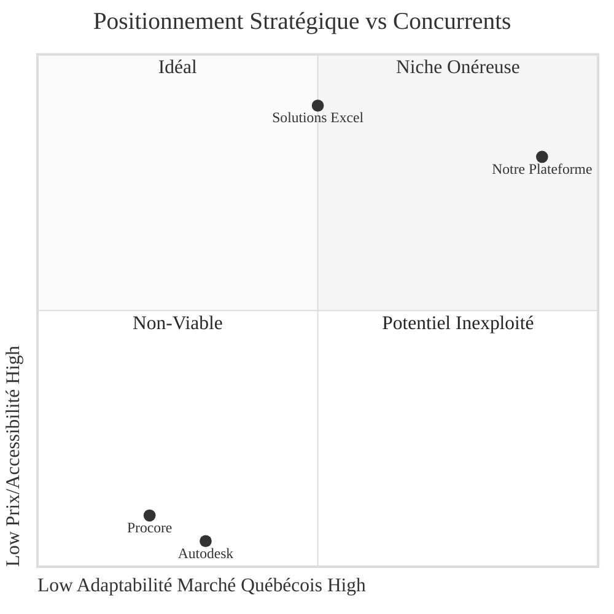
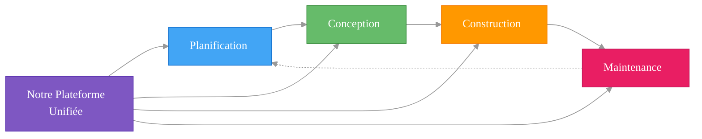

# 🏗️ PROJET A3E - VUE D'ENSEMBLE
## Plateforme de Gestion de Construction Québec

> **Document de synthèse** - Vision globale et objectifs stratégiques  
> **Date**: Juillet 2024  
> **Status**: Version 1.0  
> **Navigation**: [← README](../../README.md) | [→ Business Model Canvas](../3_product_strategy/BUSINESS_MODEL_CANVAS_A3E.md) | [→ Validation Plan](./VALIDATION_PLAN.md)

---

## 💥 **L'OPPORTUNITÉ QUI CHANGE TOUT**

> *"Nos projets dépassent systématiquement les budgets de 25% et les délais de 6 mois. On jongle avec 15 fichiers Excel différents pour un seul projet... Il doit y avoir une meilleure façon."*  
> **— Marc Tremblay, Directeur des Travaux Publics, Ville de Alma**

### **La Réalité Cachée du Secteur Public Québécois**
- **47% des projets** d'infrastructure publique dépassent leur budget initial de 25%+
- **156 heures perdues par an** par gestionnaire à jongler entre Excel, emails et papier
- **ZÉRO solution** conforme Loi 25 disponible (Procore, Autodesk = données aux USA)
- **2.3 milliards$** gaspillés annuellement au Québec par inefficacité de gestion

### **Notre Vision : Le "Shopify de la Construction Publique"**
Créer la première plateforme québécoise qui unifie TOUT le cycle de vie des projets publics — de la planification à la maintenance — avec IA spécialisée, conformité Loi 25 native, et prix 5x plus accessible que les géants américains.

---

## 📊 **OPPORTUNITÉ DE MARCHÉ**

### **Problématique Actuelle**
- **95% des organismes publics** utilisent encore Excel et email pour gérer leurs projets d'infrastructure
- **Fragmentation totale** des données entre les quatre phases du cycle de vie
- **Perte massive de temps** : 10-15h/semaine en communications non-productives par gestionnaire
- **Non-conformité** avec la Loi 25 des solutions américaines existantes (Procore, Autodesk)

### **Marché Cible**
- **1,100+ municipalités** québécoises (priorité <50k habitants)
- **72 centres de services scolaires**
- **34 CIUSSS/CISSS**
- **200+ sociétés d'État**
- **Budget total TAM** : 50M$/an en logiciels de construction/maintenance

### **Fenêtre d'Opportunité**
La conformité à la Loi 25 (hébergement des données au Québec) crée une barrière d'entrée naturelle contre les géants américains, offrant une fenêtre stratégique de 18-24 mois pour s'établir comme standard du marché.

> **Légende**: Ce diagramme montre le positionnement d'A3E par rapport aux concurrents sur deux axes stratégiques: l'adaptation au marché québécois (conformité Loi 25, langue, processus locaux) et l'accessibilité financière pour les organismes publics.

---

## 🔄 **CYCLE DE VIE D'UN PROJET DE CONSTRUCTION**

Notre plateforme couvre les quatre phases critiques du cycle de vie d'un projet de construction, offrant une solution end-to-end là où les concurrents ne couvrent souvent que 1-2 phases.

### **1. Planification**
- **Acteurs**: Organismes publics, directeurs d'infrastructure
- **Activités**: Analyse de parc immobilier, priorisation des projets, planification budgétaire
- **Problèmes actuels**: Données dispersées, priorisation subjective, manque de visibilité
- **Notre solution**: Dashboards analytiques, outils de priorisation IA, simulation budgétaire

### **2. Conception**
- **Acteurs**: Architectes, ingénieurs, gestionnaires de projet
- **Activités**: Création PFT, fiches locaux, plans, devis, approbations
- **Problèmes actuels**: Échanges par email, versions multiples, approbations lentes
- **Notre solution**: Gestion documentaire collaborative, workflows d'approbation, PFT automatisés

### **3. Construction**
- **Acteurs**: Entrepreneurs, sous-traitants, inspecteurs
- **Activités**: Exécution des travaux, rapports de visite, demandes de changement
- **Problèmes actuels**: Communication fragmentée, retards d'approbation, documentation manuelle
- **Notre solution**: Rapports de visite mobiles, communication centralisée, signatures électroniques

### **4. Maintenance**
- **Acteurs**: Opérations, techniciens, inspecteurs
- **Activités**: Entretien préventif, inspections, gestion des actifs
- **Problèmes actuels**: Déconnexion phase construction, données d'actifs dispersées
- **Notre solution**: Maintenance prédictive IA, historique complet des actifs, intégrations IoT

> **Légende**: Ce diagramme illustre le cycle de vie complet d'un projet de construction couvert par notre plateforme A3E, depuis la planification initiale jusqu'à la maintenance à long terme, avec la boucle de retour d'expérience alimentant les futurs projets.

---

## ✨ **FONCTIONNALITÉS CLÉS INNOVANTES**

### **1. 🧠 IA Conversationnelle Spécialisée**
- **RAG sur documents** : Extraire intelligence des plans, devis, contrats, PFT
- **Q&A français québécois** : Terminologie construction locale et réglementations QC
- **Résumés automatiques** : Synthèse intelligente des documents, réunions, décisions
- **Prédictions basées sur données historiques** : Retards, dépassements, risques

### **2. 📱 Rapports de Visite Révolutionnaires**
- **Mobile-first** : Application PWA/native optimisée pour le terrain
- **Capture photo intelligente** : Annotations, détection automatique défauts
- **Formulaires dynamiques adaptatifs** : Contextualisation selon réponses
- **Mode hors-ligne avancé** : Fonctionnalité complète sans connectivité

### **3. 📊 Dashboards Analytiques Prédictifs**
- **Vue unifiée multi-projets** : Statuts, budgets, risques, ressources
- **Prédiction maintenance** : Anticiper besoins d'intervention
- **Optimisation énergétique** : Monitoring consommation temps réel (Hydro-Québec)
- **Benchmarking projets similaires** : Comparaisons avec organismes similaires

### **4. 🔄 Intégrations Gouvernementales Exclusives**
- **SEAO** : Soumissions automatisées, suivi appels d'offres
- **Hydro-Québec** : Données énergétiques temps réel
- **Systèmes financiers gouvernementaux** : Synchronisation budgétaire
- **Templates MEQ** : PFT standardisés et pré-approuvés

---

## 💪 **AVANTAGES CONCURRENTIELS**

### **1. Conformité Loi 25 Native**
- **Hébergement 100% québécois/canadien** (impossible pour Procore/Autodesk)
- **Chiffrement bout-en-bout** des données sensibles
- **Audit trails complets** pour conformité réglementaire
- **Résidence des données garantie** au Québec

### **2. Expertise Locale Insurpassable**
- **Interface 100% française québécoise** (pas une traduction)
- **Processus alignés** avec méthodes gouvernementales québécoises
- **Support technique local** par experts qui comprennent le contexte
- **Adaptation aux codes et normes** spécifiques au Québec

### **3. Prix Disruptif vs Concurrents**
| Solution | Prix mensuel | Formation | Support | ROI typique |
|----------|--------------|-----------|---------|-------------|
| **Notre Plateforme** | 200$ | Incluse | Français 2h | 6 mois |
| **Procore** | 1,000$+ | 5,000$ | Anglais 48h | 2-3 ans |
| **Autodesk** | 1,200$+ | 8,000$ | Anglais 72h | 3+ ans |

### **4. Agilité et Innovation Supérieures**
- **Nouvelles fonctionnalités** en 2-4 semaines (vs 18+ mois concurrents)
- **Support direct** avec réponse garantie <4h
- **Personnalisations** selon besoins spécifiques organismes
- **Roadmap collaborative** avec clients prioritaires

---

## 🛠️ **ARCHITECTURE TECHNIQUE**

📋 **Référence**: [→ Stack Technique Détaillé](../4_technical_architecture/STACK_TECHNIQUE.md)

### **Stack Technique Planifié**
- **Frontend**: Next.js 14, React 18, TypeScript, Tailwind CSS
- **Backend**: Supabase (PostgreSQL, Auth, Storage)
- **Hosting**: Vercel (frontend), Supabase (backend)
- **Mobile**: PWA → React Native
- **AI/ML**: Azure OpenAI, LangChain (phases avancées)

## 🚀 **STRATÉGIE DE DÉPLOIEMENT**

📋 **Référence**: [→ MVP Execution Plan](../6_product_specifications/MVP_EXECUTION_PLAN.md)

### **Phases de Développement**
1. **Phase 0** (Mois 1-2): Validation Lean - Customer Discovery
2. **Phase 1** (Mois 3-5): MVP Ultra-Minimal - Premier produit payant
3. **Phase 2** (Mois 6-9): Premiers Revenus - 500$ → 2000$ MRR
4. **Phase 3** (Mois 10-18): Croissance Organique - 4k$ → 15k$ MRR
5. **Phase 4** (Mois 19-30): Financement Stratégique - Expansion Canada

## 👥 **3 PERSONAS CIBLES VALIDÉS**

📋 **Détails complets**: [→ User Personas](../3_product_strategy/PRODUCT_STRATEGY.md#user-personas)

1. **🎯 Directeur Infrastructure** : Gère 2-5M$/an, frustré par Excel/emails, besoin dashboard unifiés
2. **🏗️ Gestionnaire Projets** : 3-5 projets simultanés, noyé dans communications, veut workflows automatisés  
3. **🔧 Inspecteur Terrain** : 80% mobile, formulaires papier, besoin capture rapide + mode hors-ligne

---

## 💰 **RETOUR SUR INVESTISSEMENT CONCRET**

### **Calculateur d'Économies par Client**
**Municipalité 15,000 habitants (budget 3M$/an)** :
- ⏱️ **156h économisées/an** (vs Excel/emails) = **8,400$**
- 📊 **15% réduction dépassements** budgétaires = **67,500$**
- 🚀 **30% accélération** processus approbation = **45,000$**
- **💵 TOTAL : 120,900$/an économisés pour 2,400$/an d'abonnement**

### **ROI = 5,037% • Payback en 2.4 semaines**

---

## 🎯 **POURQUOI INVESTIR MAINTENANT**

### **🚨 Fenêtre d'Opportunité Unique : 18 mois**
1. **Loi 25** = Barrière naturelle vs géants US (Procore, Autodesk)
2. **Post-COVID** = Urgence digitalisation secteur public  
3. **Budgets fédéraux** = 180 milliards$ infrastructure Canada
4. **Zero concurrence** locale sérieuse conforme

### **📈 Métriques Cibles Validation**
📋 **Détails complets**: [→ Validation Plan](./VALIDATION_PLAN.md)

| **Objectif 60 jours** | **Cible** | **Status** |
|-------------------|----------|------------|
| Problem validation | 85%+ confirment | 🟡 En cours |
| LOI prospects | 5+ municipalités | 🟡 En cours |
| Solution score | >7/10 | ⏳ À faire |
| Pricing acceptance | 70%+ OK 200$/mois | ⏳ À faire |

---

## 🚀 **PRÊT À RÉVOLUTIONNER LA CONSTRUCTION PUBLIQUE ?**

### **💼 Pour Investisseurs**
- **Marché** : 50M$/an TAM Québec, barrière Loi 25 unique
- **Traction** : 156h économisées/municipalité = ROI 5,037%
- **Timing** : Fenêtre 18 mois avant géants US s'adaptent
- **Ask** : 250K$ pour 18 mois runway + 10 clients payants

### **🤝 Pour Partenaires Municipaux**
- **Pilote gratuit** 3 mois avec votre municipalité
- **Économies garanties** 120,900$/an (calculateur personnalisé)
- **Conformité Loi 25** native + formation incluse
- **Roadmap collaborative** : vos besoins = nos priorités

### **📞 Prochaines Étapes**
- **Demo personnalisée** : [📅 Réserver 30 min](mailto:demo@a3e.ca)
- **Discussion investissement** : [📧 Contacter](mailto:invest@a3e.ca) 
- **Partnership** : [🤝 Collaborer](mailto:partners@a3e.ca)

**Le futur de la construction publique commence aujourd'hui. Rejoignez-nous.**

---

## 🔗 **DOCUMENTATION COMPLÉMENTAIRE**

### **Documentation Business Foundation**
- [**Business Model Canvas**](../3_product_strategy/BUSINESS_MODEL_CANVAS_A3E.md) - Modèle d'affaires complet et proposition de valeur
- [**Validation Plan**](./VALIDATION_PLAN.md) - Plan méthodologique validation 6 hypothèses critiques
- [**Next Steps Immediate**](./NEXT_STEPS_IMMEDIATE.md) - Actions urgentes 7 jours + GO/NO-GO

### **Documentation Stratégique**
- [**Analyse Concurrentielle**](../2_competitive_analysis/ANALYSE_CONCURRENTIELLE_STRATEGIQUE.md) - Analyse détaillée concurrents et avantages
- [**Product Strategy**](../3_product_strategy/PRODUCT_STRATEGY.md) - Stratégie produit et positionnement

### **Documentation Technique**
- [**Stack Technique**](../4_technical_architecture/STACK_TECHNIQUE.md) - Architecture technique complète et évolution
- [**PRD Master**](../6_product_specifications/PRD_MASTER.md) - Spécifications fonctionnelles complètes
- [**MVP Execution Plan**](../6_product_specifications/MVP_EXECUTION_PLAN.md) - Plan d'exécution technique 16 semaines

---

## 💎 **L'ÉQUATION GAGNANTE**

**Marché frustré** (95% utilisent Excel) + **Barrière réglementaire** (Loi 25) + **Solution 5x moins chère** + **Équipe locale experte** = **Opportunité en or de créer le standard québécois**

**La fenêtre d'opportunité de 18 mois commence MAINTENANT.**

---

*Document vivant - À réviser trimestriellement*  
*Dernière mise à jour : Juillet 2024*

