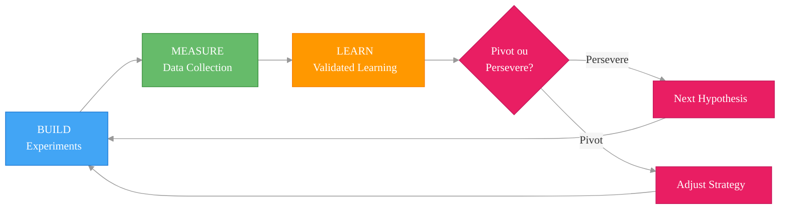
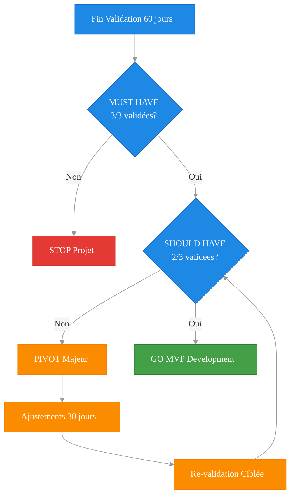

# 🔬 PLAN DE VALIDATION - A3E Beta
## Méthodologie Lean Startup pour Validation Hypothèses Critiques

> **Document de validation** - Plan méthodologique Build-Measure-Learn  
> **Date**: Juillet 2025  
> **Durée**: 60 jours  
> **Budget estimé**: 3,000-5,000$  
> **Status**: Prêt à exécution

📚 **[← Retour README](../../README.md)** | **[→ BMC](./BUSINESS_MODEL_CANVAS_A3E.md)** | **[→ MVP Plan](../5_product_specifications/MVP_EXECUTION_PLAN.md)** | **[→ Project Overview](./PROJECT_OVERVIEW.md)**

---

## 🎯 **OBJECTIF & METHODOLOGIE**

### **Objectif Principal**
Valider les 6 hypothèses critiques identifiées dans notre Business Model Canvas et analyse concurrentielle pour minimiser les risques avant le développement MVP.

### **Méthodologie Build-Measure-Learn 2025**


> **Légende**: Ce diagramme illustre notre méthodologie de validation itérative Build-Measure-Learn, inspirée du Lean Startup, pour valider chaque hypothèse critique, apprendre rapidement, et pivoter si nécessaire avant d'investir dans le développement complet.
```

---

## 📋 **6 HYPOTHÈSES CRITIQUES À VALIDER**

### **H1: PROBLÈME - Pain Point Excel/Email** {#h1-probleme}
**Hypothèse**: 90%+ des gestionnaires publics québécois perdent 10-15h/semaine à cause de l'inefficacité Excel/Email

**Source**: [BMC Customer Segments](./BUSINESS_MODEL_CANVAS_A3E.md#customer-segments) + [Analyse Concurrentielle](../2_competitive_analysis/ANALYSE_CONCURRENTIELLE_STRATEGIQUE.md#faiblesses-critiques)

**Validation**:
- **Build**: Script interview + questionnaire 20 questions
- **Measure**: 
  - 20 interviews gestionnaires (municipalités <50k habitants)
  - 10 interviews CSS (centres services scolaires)
  - Analyse temps perdu quantifié/semaine
- **Critère succès**: 85%+ confirment problème critique, 10h+/semaine perdu

### **H2: SOLUTION - Value Proposition Uniqueness** {#h2-solution}
**Hypothèse**: Notre solution (prix 5x moins cher + conformité Loi 25) crée une valeur perçue supérieure aux alternatives

**Source**: [BMC Value Propositions](./BUSINESS_MODEL_CANVAS_A3E.md#value-propositions)

**Validation**:
- **Build**: Prototype Figma interactif + pricing comparison
- **Measure**: 
  - Tests A/B sur 15 prospects (A3E vs Procore vs Excel)
  - Score value proposition (1-10)
  - Willingness to pay (prix acceptable)
- **Critère succès**: Score >7/10, prix validé 200-300$/mois

### **H3: MARCHÉ - Taille & Accessibilité** {#h3-marche}
**Hypothèse**: 500+ organismes publics québécois sont accessibles et prêts à adopter une nouvelle solution

**Source**: [PROJECT_OVERVIEW Market Analysis](./PROJECT_OVERVIEW.md#market-analysis)

**Validation**:
- **Build**: Base de données prospects + outreach LinkedIn
- **Measure**: 
  - Taux réponse outreach (>15%)
  - Nombre RFP correspondants SEAO/trimestre
  - Budget IT disponible/organisation
- **Critère succès**: 100+ prospects qualifiés identifiés, 50+ accessibles

### **H4: PRICING - Willingness to Pay** {#h4-pricing}
**Hypothèse**: Organismes publics accepteront payer 200$/utilisateur/mois pour notre solution complète

**Source**: [BMC Revenue Streams](./BUSINESS_MODEL_CANVAS_A3E.md#revenue-streams)

**Validation**:
- **Build**: Simulation pricing + ROI calculator
- **Measure**: 
  - 15 exercices pricing avec prospects
  - Budget max acceptable vs features offertes
  - Comparaison coût actuel vs ROI estimé
- **Critère succès**: 70%+ acceptent 200$/mois, ROI positif <12 mois

### **H5: ACQUISITION - Channel Effectiveness** {#h5-acquisition}
**Hypothèse**: Canaux B2G (SEAO, associations, LinkedIn) génèrent suffisamment de leads qualifiés

**Source**: [BMC Channels](./BUSINESS_MODEL_CANVAS_A3E.md#channels)

**Validation**:
- **Build**: Campagne test sur 3 canaux principaux
- **Measure**: 
  - Coût acquisition par canal (CAC)
  - Taux conversion lead → meeting
  - Qualité leads (budget + autorité + timing)
- **Critère succès**: CAC <500$, taux conversion >10%, 20+ leads qualifiés/mois

### **H6: CONFORMITÉ - Loi 25 Avantage Concurrentiel** {#h6-conformite}
**Hypothèse**: Conformité Loi 25 est un facteur décisionnel critique éliminant automatiquement Procore/Autodesk

**Source**: [Analyse Concurrentielle Barrière Réglementaire](../2_competitive_analysis/ANALYSE_CONCURRENTIELLE_STRATEGIQUE.md#avantages-concurrentiels)

**Validation**:
- **Build**: Questionnaire conformité + audit besoins légaux
- **Measure**: 
  - % prospects pour qui Loi 25 = critère éliminatoire
  - Niveau de connaissance réglementation
  - Délai conformité requis organisations
- **Critère succès**: 80%+ considèrent critique, 90%+ éliminent solutions US

---

## 📅 **TIMELINE 60 JOURS - 4 SPRINTS DE VALIDATION**

### **Sprint 1: Problem Validation (Semaine 1-2)** {#sprint-1}
**Focus**: H1 (Problème) + H3 (Marché)

#### **Semaine 1: Infrastructure + Outreach**
**Lundi-Mardi: Setup Validation**
- ✅ **CRM Setup**: Notion workspace avec templates interviews
- ✅ **Scripts préparés**: [Voir templates dans NEXT_STEPS_IMMEDIATE](./NEXT_STEPS_IMMEDIATE.md#templates-de-contact)
- ✅ **Liste prospects**: 50+ organismes cibles identifiés
- ✅ **Questionnaire structuré**: 15 questions validation H1 + H3

**Mercredi-Vendredi: Outreach Intensif**
- 📊 **Objectif**: 50 contacts total, 15% taux réponse
- 🎯 **Répartition**:
  - 30 messages LinkedIn gestionnaires municipaux
  - 15 emails directs DG municipalités <10k habitants
  - 5 appels centres services scolaires
- 📈 **Métriques tracking**: Taux ouverture, réponse, booking

#### **Semaine 2: Discovery + Analysis**
**Lundi-Mercredi: Interviews Customer Discovery**
- 🎯 **Target**: 15 interviews 30 minutes (5/jour)
- 📝 **Structure interview**:
  - Pain points actuels Excel/Email (10 min)
  - Temps perdu quantifié/semaine (5 min)
  - Solutions tentées + échecs (10 min)
  - Priorités budgétaires (5 min)
- 🎥 **Process**: Enregistrement + transcription immédiate

**Jeudi-Vendredi: Synthesis + Decision**
- 📊 **Data analysis**: Compilation réponses + patterns
- 📋 **Rapport validation**: H1 + H3 validated/failed
- 🚦 **Go/No-Go decision**: Critères seuils atteints?

**Livrables**:
- 15 interviews complétées + synthèse
- Base prospects 100+ contacts qualifiés
- Décision Go/No-Go hypothèses H1-H3

### **Sprint 2: Solution Validation (Semaine 3-4)** {#sprint-2}
**Focus**: H2 (Solution) + H6 (Conformité)

```yaml
Semaine 3:
  Lundi-Mardi: Création prototype
    - Figma prototype 5 écrans clés
    - Comparison sheet vs Procore
    - Simulation conformité Loi 25
  
  Mercredi-Vendredi: Tests solution
    - 10 démos prototype prospects
    - Feedback UX + value proposition
    - Questions conformité réglementaire

Semaine 4:
  Lundi-Mercredi: Validation conformité
    - 10 entrevues sur enjeux Loi 25
    - Analyse critères éliminatoires
    - Impact sur décision achat
  
  Jeudi-Vendredi: Itération solution
    - Ajustements prototype v2
    - Rapport solution validation
    - Go/No-Go H2 et H6
```

**Livrables**:
- Prototype Figma validé
- Rapport conformité Loi 25
- Décision Go/No-Go hypothèses H2-H6

### **Sprint 3: Business Model Validation (Semaine 5-6)** {#sprint-3}
**Focus**: H4 (Pricing) + H5 (Acquisition)

```yaml
Semaine 5:
  Lundi-Mardi: Setup pricing experiments
    - 3 niveaux pricing (150$/200$/300$)
    - ROI calculator personnalisé
    - Simulations budget organismes
  
  Mercredi-Vendredi: Tests pricing
    - 15 exercices pricing prospects
    - Van Westendorp price sensitivity
    - Willingness to pay validation

Semaine 6:
  Lundi-Mercredi: Tests channels acquisition
    - Campagne LinkedIn Ads (1,000$)
    - Email outreach SEAO contacts
    - Participation événement COMAQ/UMQ
  
  Jeudi-Vendredi: Analyse acquisition
    - CAC par canal calculé
    - Lead qualification metrics
    - Go/No-Go H4 et H5
```

**Livrables**:
- Pricing model validé + ROI calculator
- Stratégie acquisition optimisée
- Décision Go/No-Go hypothèses H4-H5

### **Sprint 4: Pre-MVP Planning (Semaine 7-8)** {#sprint-4}
**Focus**: Synthèse + MVP Planning

```yaml
Semaine 7:
  Lundi-Mercredi: Synthèse globale
    - Rapport validation 6 hypothèses
    - Business model ajusté
    - Stratégie pivots si nécessaire
  
  Jeudi-Vendredi: MVP planning
    - Features prioritaires validées
    - Timeline développement
    - Budget & équipe requise

Semaine 8:
  Lundi-Mercredi: Design partners
    - 5 prospects confirmés pilotes
    - Conditions programme early adopters
    - Contrats prêts signature
  
  Jeudi-Vendredi: Go-to-Market
    - Stratégie lancement MVP
    - Métriques success post-validation
    - Décision finale Go/No-Go MVP
```

**Livrables**:
- Rapport validation complet
- 5 design partners confirmés
- MVP Execution Plan finalisé

---

## 📊 **CRITÈRES GO/NO-GO GLOBAUX**

### **Critères MUST HAVE (Éliminatoires)**
| Hypothèse | Seuil Minimum | Mesure Précise | Action si Échec |
|-----------|---------------|----------------|-----------------|
| **H1: Problème** | 85% confirment problème critique | 13/15 interviews + temps perdu >8h/semaine | **STOP** - Problème non-critique |
| **H3: Marché** | 100+ prospects accessibles | Liste qualifiée + budget confirmé | **STOP** - Marché inaccessible |
| **H6: Conformité** | 80% considèrent Loi 25 critique | 12/15 éliminent solutions US | **STOP** - Pas d'avantage réglementaire |

### **Critères SHOULD HAVE (Ajustables)**
| Hypothèse | Seuil Optimal | Mesure Précise | Action si Échec |
|-----------|---------------|----------------|-----------------|
| **H2: Solution** | Score >7/10 value proposition | Moyenne 7+ sur prototype tests | **PIVOT** - Redesign solution |
| **H4: Pricing** | 70% acceptent 200$/mois | 11/15 trouvent prix acceptable | **PIVOT** - Ajuster pricing |
| **H5: Acquisition** | CAC <500$, conversion >10% | Coût réel + taux mesuré | **PIVOT** - Nouveaux canaux |

### **Métriques de Qualité Validation**
| Critère | Standard | Mesure |
|---------|----------|--------|
| **Interviews qualité** | Durée >25 min | Questions complètes répondues |
| **Decision makers** | 80% authority | Peuvent confirmer budget/timeline |
| **Représentativité** | 3 segments couverts | Municipalités, CSS, santé |

### **Décision Globale**


> **Légende**: Ce diagramme présente l'arbre de décision pour déterminer si nous devons poursuivre le développement du MVP, pivoter notre stratégie, ou arrêter le projet en fonction de la validation de nos hypothèses critiques "Must Have" et "Should Have".
```

---

## 💰 **BUDGET & RESSOURCES**

### **Budget Estimé 60 Jours**
```yaml
Personnel (50%): 2,500$
  - Interviews + outreach: 80h × 25$/h = 2,000$
  - Design prototype: 20h × 25$/h = 500$

Outils & Software (20%): 1,000$
  - LinkedIn Sales Navigator: 80$/mois × 2 = 160$
  - Figma Pro: 15$/mois × 2 = 30$
  - Survey tools (Typeform): 35$/mois × 2 = 70$
  - CRM (Notion Pro): 10$/mois × 2 = 20$
  - Événements/networking: 500$
  - Téléphone/transport: 200$

Marketing Tests (30%): 1,500$
  - LinkedIn Ads: 1,000$
  - Prototypage/mockups: 300$
  - Matériel présentation: 200$

TOTAL: 5,000$ (Budget maximum)
```

### **Équipe Required**
- **Lead Validation** (1 personne): Fondateur/CEO - interviews, analyse
- **Design/UX** (0.5 personne): Prototype Figma, présentation
- **Support Analysis** (0.25 personne): Recherche, transcription, données

---

## 🎯 **MÉTRIQUES DE SUCCÈS POST-VALIDATION**

### **Si GO pour MVP**
- **Design Partners**: 5 organismes confirmés
- **Pricing Validated**: 200$/mois acceptable
- **Timeline Confident**: 3-6 mois développement MVP
- **Market Size**: 100+ prospects pipeline qualifié
- **Competitive Moat**: Avantage Loi 25 confirmé

### **Next Steps Immédiats**
1. **Signature design partners** (Semaine 9)
2. **Financement seed/bootstrap** (Semaine 10-11)
3. **Équipe technique setup** (Semaine 12)
4. **Development Sprint 0** (Semaine 13)

---

## 🔄 **PROCESS D'APPRENTISSAGE CONTINU**

### **Weekly Reviews**
- **Lundi**: Planning semaine + objectifs validation
- **Mercredi**: Mid-week checkpoint + ajustements
- **Vendredi**: Synthèse apprentissages + next steps

### **Learning Documentation**
- **Notion Database**: Centralisation toutes interviews
- **Weekly Reports**: Progrès vs hypothèses + insights
- **Pivot Log**: Décisions + rationale si changements

### **Stakeholder Communication**
- **Rapport hebdomadaire**: Progrès + apprentissages clés
- **Dashboard métriques**: Temps réel state validation
- **Final Presentation**: Go/No-Go avec recommandations

---

**Ce plan de validation nous permettra de prendre une décision éclairée sur le développement MVP avec un risque minimisé et une connaissance approfondie de notre marché cible.**

**Prochaine étape**: Exécution Sprint 1 - Problem Validation dès validation de ce plan.

---

*Document évolutif - Ajustements selon apprentissages*  
*Dernière mise à jour : Juillet 2025*  
*Prochaine révision : Après Sprint 1 validation*