# 🏗️ BUSINESS MODEL CANVAS A3E
## Plateforme Construction Publique Québec

> **Document stratégique** - Modèle d'affaires et proposition de valeur  
> **Date**: Juillet 2025  
> **Aligné avec**: [PROJECT_OVERVIEW.md](../1_business_foundation/PROJECT_OVERVIEW.md)  
> **Status**: Version 1.0

📚 **[→ Analyse Concurrentielle](../2_competitive_analysis/ANALYSE_CONCURRENTIELLE_STRATEGIQUE.md)** | **[→ PRD Produit](../6_product_specifications/PRD_MASTER.md)**

---

## 📊 **BUSINESS MODEL CANVAS VISUEL**

```mermaid
%%{init: {'theme': 'base', 'themeVariables': { 'primaryColor': '#f5f5f5', 'lineColor': '#999', 'fontFamily': 'Roboto, sans-serif'}}}%%
graph TD
    subgraph BMC ["🏗️ BUSINESS MODEL CANVAS A3E"]
        VP["💎 PROPOSITION DE VALEUR<br/>• Dashboard 360° multi-projets<br/>• IA spécialisée construction<br/>• Mobile-first & hors-ligne<br/>• Conformité Loi 25 native<br/>• Prix 5x moins cher<br/>• Support français <4h"]
        
        CS["👥 SEGMENTS CLIENTS<br/>• Municipalités (1,100+)<br/>• Centres services scolaires (72)<br/>• Établissements santé (34)<br/>• Sociétés d'État (200+)"]
        
        CH["📱 CANAUX<br/>• SEAO<br/>• Associations sectorielles<br/>• Événements B2G<br/>• Partenaires prescripteurs<br/>• Marketing digital ciblé"]
        
        CR["💝 RELATIONS CLIENTS<br/>• CSM dédié<br/>• Support français<br/>• Formation incluse<br/>• Communauté utilisateurs"]
        
        KP["🤝 PARTENAIRES CLÉS<br/>• SEAO & Gouvernement<br/>• Régie Bâtiment Québec<br/>• OVHcloud (Loi 25)<br/>• Associations sectorielles"]
        
        KA["🎯 ACTIVITÉS CLÉS<br/>• Développement plateforme<br/>• IA spécialisée<br/>• Support client<br/>• Conformité Loi 25"]
        
        KR["🏢 RESSOURCES CLÉS<br/>• Équipe tech québécoise<br/>• IA/RAG construction<br/>• Cloud souverain<br/>• Capital bootstrap"]
        
        RS["💰 REVENUS<br/>• SaaS évolutif : 100$→500$/mois<br/>• Design Partners : 100$/mois<br/>• Standard/Pro : 200-500$/mois<br/>• Services additionnels<br/>• TAM: 50M$/an"]
        
        CS2["💸 COÛTS<br/>• Personnel (40%)<br/>• Infrastructure (15%)<br/>• R&D/IA (20%)<br/>• Marketing (15%)<br/>• Compliance (10%)"]
    end
    
    VP --- CS
    VP --- CH
    VP --- CR
    KP --- VP
    KA --- VP
    KR --- VP
    CS2 --- VP
    RS --- VP
    
    %% Définition des classes
    classDef value fill:#e8f5e8,stroke:#388e3c,color:#000,font-size:14px
    classDef clients fill:#e0f2f1,stroke:#00796b,color:#000,font-size:14px
    classDef channels fill:#f1f8e9,stroke:#689f38,color:#000,font-size:14px
    classDef relations fill:#fce4ec,stroke:#c2185b,color:#000,font-size:14px
    classDef partners fill:#e3f2fd,stroke:#1976d2,color:#000,font-size:14px
    classDef activities fill:#f3e5f5,stroke:#7b1fa2,color:#000,font-size:14px
    classDef resources fill:#fff3e0,stroke:#f57c00,color:#000,font-size:14px
    classDef revenue fill:#e8eaf6,stroke:#3f51b5,color:#000,font-size:14px
    classDef costs fill:#fff8e1,stroke:#fbc02d,color:#000,font-size:14px
    
    %% Application des classes
    class VP value
    class CS clients
    class CH channels
    class CR relations
    class KP partners
    class KA activities
    class KR resources
    class RS revenue
    class CS2 costs
```



> **Légende**: Ce Business Model Canvas présente les 9 composantes clés du modèle d'affaires d'A3E, centré sur une proposition de valeur adaptée au marché québécois et un modèle de revenus SaaS par abonnement mensuel à trois niveaux.
```

---

## 🎯 **CUSTOMER SEGMENTS DÉTAILLÉS** {#customer-segments}

📋 **Liens connexes**: [→ Personas PROJECT_OVERVIEW](PROJECT_OVERVIEW.md#personas-cibles) | [→ PRD Market Analysis](../2_product_strategy/PRD_MASTER.md#market-analysis)

### **Segment Primaire: Municipalités Québécoises**
- **Taille marché**: 1,100+ municipalités (priorité <50k habitants)
- **Budget IT annuel**: 50K-200K$ (5-10% pour nouveaux outils)
- **Budget projets**: 500K-5M$/an infrastructure
- **Décideurs**: Directeur général, Directeur travaux publics, Maire
- **Pain points critiques**:
  - 95% utilisent encore Excel/email
  - Manque visibilité sur portfolio projets
  - Difficile justification dépenses aux citoyens
  - Non-conformité Loi 25 solutions actuelles

### **Segment Secondaire: Centres Services Scolaires**
- **Taille marché**: 72 centres services scolaires QC
- **Budget projets**: 2-10M$/an construction/rénovation
- **Décideurs**: Directeur général, Directeur services techniques
- **Spécificités**:
  - Processus MEQ standardisés (PFT obligatoires)
  - Complexité approbations multi-niveaux
  - Besoin transparence communautés

### **Segment Tertiaire: Établissements Santé**
- **Taille marché**: 34 CIUSSS/CISSS
- **Budget projets**: 5-50M$/an infrastructure
- **Contraintes spéciales**: Conformité santé, accessibilité
- **Opportunité**: Projets complexes, valeur élevée

---

## 💡 **VALUE PROPOSITIONS SPÉCIFIQUES**

### **🎯 Pour Directeurs Infrastructure Municipaux**
**Job-to-be-Done**: *"Gérer efficacement portfolio projets infrastructure avec transparence citoyenne et conformité réglementaire"*

**Gains créés**:
- **ROI mesurable**: Réduction 25% dépassements budgétaires
- **Transparence citoyenne**: Portail public temps réel
- **Conformité garantie**: Loi 25 + audit trails complets
- **Décisions éclairées**: Analytics prédictifs + benchmarking

**Pain relievers**:
- Fin fragmentation données (Excel → Plateforme unifiée)
- Priorisation objective (IA vs subjectivité)
- Reporting automatisé (vs 10-15h/semaine manuelles)

### **🎯 Pour Gestionnaires Projets Construction**
**Job-to-be-Done**: *"Livrer projets dans délais/budgets avec coordination efficace équipes"*

**Gains créés**:
- **Productivité**: Réduction 50% temps administratif
- **Collaboration**: Workflows automatisés vs emails
- **Mobilité**: Accès temps réel terrain/bureau
- **Qualité**: Templates PFT + processus standardisés

**Pain relievers**:
- Fin emails perdus (centralisation communications)
- Versions uniques documents (vs multiples versions)
- Approbations rapides (workflows vs circuits manuels)

### **🎯 Pour Inspecteurs/Techniciens Terrain**
**Job-to-be-Done**: *"Documenter efficacement état projets avec outils adaptés terrain"*

**Gains créés**:
- **Efficacité terrain**: Mode hors-ligne complet
- **Qualité rapports**: IA détection défauts photos
- **Simplicité**: Formulaires adaptatifs intelligents
- **Historique**: Accès complet données site

**Pain relievers**:
- Fin formulaires papier (mobile-first)
- Fin retranscription (capture directe)
- Contexte disponible (historique vs mémoire)

---

## 💰 **REVENUE STREAMS DÉTAILLÉS** {#revenue-streams}

📊 **Liens connexes**: [→ Roadmap Revenus](../2_product_strategy/ROADMAP_STRATEGIQUE_BOOTSTRAP.md#revenus) | [→ Pricing Concurrentiel](../3_competitive_analysis/ANALYSE_CONCURRENTIELLE_STRATEGIQUE.md#pricing)

### **Stratégie Pricing Évolutive**

**Phase 1 (MVP - Mois 1-9) : Pricing d'Acquisition**
| **Tier** | **Prix** | **Cible** | **Inclus** |
|----------|----------|-----------|------------|
| 🎯 **Design Partners** | 100$/mois | 5-10 premiers clients | 50% rabais à vie, accès direct fondateurs |
| 🚀 **Early Adopters** | 150$/mois | 10-20 clients suivants | Onboarding inclus, support prioritaire |

**Phase 2-3 (Scaling - Mois 10+) : Pricing Mature**
| **Tier** | **Prix** | **Cible** | **Inclus** |
|----------|----------|-----------|------------|
| 🥉 **STANDARD** | 200$/mois | Petites municipalités (<20k habitants) | Modules core, support standard |
| 🥈 **PROFESSIONAL** | 500$/mois | Municipalités moyennes, CSS | Tous modules, intégrations, IA |
| 🥇 **ENTERPRISE** | Custom | Grandes villes, CIUSSS | Modules avancés, account manager dédié |

**Services additionnels:**
- Formation équipes: 1,500$/jour
- Migration données: 5,000-15,000$
- Customisation: 200$/h
- Consulting: 250$/h

**Projections revenus cohérentes:**
- **Phase 1 (Mois 9)** : 10 clients × 100$ = 1,000$ MRR
- **Phase 2 (Mois 18)** : 50 clients × 180$ ARPU = 9,000$ MRR  
- **Phase 3 (Mois 30)** : 200 clients × 200$ ARPU = 40,000$ MRR

### **Pricing vs Concurrents**
| Métrique | A3E Standard | A3E Professional | Procore | Autodesk |
|----------|--------------|------------------|---------|----------|
| **Prix entry-level** | 200$/mois | 500$/mois | 1,000$/mois | 1,200$/mois |
| **Formation** | Incluse | Incluse | 5,000$ | 8,000$ |
| **Support** | Français <4h | Français <2h | Anglais 48h | Anglais 72h |
| **ROI typique** | 6 mois | 4 mois | 2-3 ans | 3+ ans |
| **Conformité Loi 25** | ✅ Native | ✅ Native | ❌ Impossible | ❌ Impossible |

### **Services Additionnels**
- **Formation équipes**: 1,500$/jour (vs 5,000$ concurrents)
- **Migration données**: 5,000-15,000$ selon complexité
- **Customisation**: 200$/h développement
- **Consulting gestion projets**: 250$/h
- **Audit conformité**: 5,000$ one-time

---

## 🤝 **KEY PARTNERSHIPS STRATÉGIQUES**

### **Partenaires Gouvernementaux**
- **SEAO**: Intégration native appels d'offres
- **Régie Bâtiment Québec**: Conformité codes construction
- **Ministère Éducation**: Templates PFT standardisés
- **Hydro-Québec**: Données énergétiques temps réel

### **Partenaires Technologiques**
- **OVHcloud Canada**: Hébergement souverain Loi 25
- **Microsoft Azure Canada**: Infrastructure cloud backup
- **Firm.ai**: Modules IA spécialisés construction

### **Partenaires Écosystème**
- **Firmes ingénierie**: SNC-Lavalin, WSP, CIMA+ (prescripteurs)
- **Associations**: UMQ, FQRNT, AQESSS (credibilité + accès)
- **Fournisseurs construction**: Régie Bâtiment (conformité)

---

## 📢 **CHANNELS & GO-TO-MARKET**

### **Channel Strategy B2G Québec**

### **Channel Strategy B2G Québec**

**Canaux d'acquisition principaux:**
1. **SEAO (Appels d'offres)**: Obligatoire pour contrats >25K$
2. **Associations sectorielles**: UMQ, FQRNT, AQESSS (crédibilité + accès)
3. **Événements & congrès**: Congrès UMQ, Forums infrastructure
4. **Partenaires prescripteurs**: Firmes ingénierie, consultants
5. **Marketing digital B2G**: LinkedIn, webinaires, content marketing

**Stratégie d'acquisition par phases:**
- **Phase Bootstrap (0-12 mois)**: 2-3 municipalités pilotes via réseau
- **Phase Traction (12-24 mois)**: 10-15 clients via SEAO + associations 
- **Phase Scale (24+ mois)**: Expansion organique + partenaires

**Métriques canal:**
- Cycle de vente B2G: 12-24 mois
- Taux conversion prospects qualifiés: ~15%

---

## 🛠️ **KEY ACTIVITIES & RESOURCES**

### **Core Activities (Aligned with Capital Efficiency)**
- **Développement produit** (40% effort): Features MVP + IA spécialisée
- **Customer Success** (25% effort): Support français + formation
- **Sales B2G** (20% effort): Processus longs, multi-stakeholders
- **Compliance** (15% effort): Loi 25 + sécurité + audit

### **Critical Resources**
- **Équipe tech québécoise**: Développeurs full-stack + data scientists
- **Base connaissances**: Réglementations QC + terminologie construction
- **Infrastructure souveraine**: Cloud québécois/canadien Loi 25
- **Capital bootstrap**: 18-24 mois runway sans financement externe

---

## 📊 **VALIDATION & MÉTRIQUES CLÉS**

### **Product-Market Fit Metrics**
- **Retention Rate**: >80% après 12 mois (vs 60% industrie)
- **NPS Score**: >60 (obsession customer satisfaction)
- **Time-to-Value**: <30 jours (vs 6+ mois concurrents)
- **Usage Weekly**: >3 sessions/semaine utilisateurs clés

### **Business Metrics**
- **CAC (Customer Acquisition Cost)**: <8,000$ (vs 25,000$+ B2B traditionnel)
- **LTV/CAC Ratio**: >5:1 (sustainable growth)
- **Churn Rate**: <5% annuel (secteur public stable)
- **Expansion Revenue**: 120%+ (upsell modules)

### **Unit Economics Cibles**
```
- ARPU Starter: 6,000$/an
- ARPU Professional: 24,000$/an  
- ARPU Enterprise: 96,000$/an
- Gross Margin: >85% (SaaS typical)
- Payback Period: <12 mois
```

---

## 🚀 **COMPÉTITIVE ADVANTAGES**

### **1. Barrière Réglementaire (Loi 25)**
- **Impossible pour Procore/Autodesk**: Hébergement hors-Canada interdit
- **Fenêtre opportunité**: 18-24 mois avant solutions conformes
- **First-mover advantage**: Établir standard marché

### **2. Expertise Locale Profonde**
- **Interface française native**: Pas traduction Google
- **Processus gouvernementaux**: SEAO, MEQ, RBQ intégrés
- **Support local**: Équipe qui comprend contexte québécois

### **3. Pricing Disruptif**
- **2-5x moins cher**: 200-500$/mois vs 1,000-1,200$ concurrents
- **Formation incluse**: vs 5,000-8,000$ supplémentaires
- **ROI rapide**: 4-6 mois vs 2-3 ans

### **4. Agilité Bootstrap**
- **Ship fast**: Features aux 2 semaines vs 18+ mois
- **Customer-centric**: Roadmap collaborative clients
- **Réactivité**: Support <4h vs 48-72h

---

## 📈 **PROJECTIONS FINANCIÈRES**

### **Runway Bootstrap 18-24 mois**
```
Année 1: 
- Clients: 3 municipalités pilotes
- Revenus: 180K$
- Coûts: 400K$ (équipe 4 personnes)
- Burn: -220K$

Année 2:
- Clients: 15 organismes publics  
- Revenus: 840K$
- Coûts: 650K$ (équipe 7 personnes)
- Profit: +190K$ (break-even atteint)

Année 3:
- Clients: 40+ organismes
- Revenus: 2.4M$
- Profit: 1.2M$ (50% margin)
- Série A: 2-5M$ pour expansion
```

---

## 🎯 **NEXT STEPS ACTIVATION**

### **Phase Immédiate (30 jours)**
1. **Validation BMC**: 10 interviews prospects cibles
2. **MVP Spec**: Features critiques Phase 1
3. **Legal Setup**: Structure + IP + conformité base
4. **Early Partnerships**: Discussions SEAO + OVHcloud

### **Phase Lancement (90 jours)**
1. **Alpha MVP**: 2 municipalités pilotes
2. **Conformité Loi 25**: Audit + certification
3. **Team Building**: CTO + Sales B2G
4. **First Revenue**: Contrat pilot payant

---

## 📝 **NOTES SUR LA DOCUMENTATION**

### **Principes de Simplification Appliqués**
Ce document a été simplifié selon les principes suivants:
- Transformation des diagrammes complexes en formats plus lisibles
- Focus sur l'information à forte valeur ajoutée
- Utilisation de formats alternatifs (tableaux, listes) quand pertinent
- Conservation de la structure narrative principale

### **Diagrammes Simplifiés**
- **Business Model Canvas**: Version simplifiée avec focus sur les éléments clés
- **Stratégie Pricing**: Conversion en tableau pour meilleure lisibilité
- **Canaux Distribution**: Conversion en liste structurée pour plus de clarté

### **Recommandations**
1. **Documentation vivante**: Continuer à réviser après chaque cycle de validation
2. **Feedback clients**: Intégrer les retours des 10+ interviews prospects
3. **Alignement produit**: Maintenir cohérence avec PRD_MASTER.md et PLANNING_PHASES.md
4. **Prochaine révision**: Après les premières 5 municipalités pilotes

*Document simplifié - Dernière mise à jour: [DATE ACTUELLE]*

---

*Ce Business Model Canvas constitue la fondation stratégique d'A3E, parfaitement aligné avec la vision PROJECT_OVERVIEW.md et optimisé pour le contexte unique du marché québécois B2G.*

**Prochaine étape recommandée**: Customer Discovery avec 10+ prospects pour valider hypothèses clés du BMC.

---

*Document vivant - À réviser après chaque cycle de validation*  
*Dernière mise à jour : Juillet 2025*