# 🎯 STRATÉGIE PRODUIT - A3E Beta
## Plateforme de Gestion de Construction Québec

> **Document stratégique** - Vision, positionnement et stratégie go-to-market  
> **Date**: Juillet 2025  
> **Version**: 1.0  
> **Équipe**: Fondateurs + Développement

📚 **[← Retour README](../../README.md)** | **[→ Business Model Canvas](BUSINESS_MODEL_CANVAS_A3E.md)** | **[→ Spécifications Produit](../5_product_specifications/PRD_MASTER.md)**

---

## 🧭 **NAVIGATION**

Cette stratégie produit s'articule avec les autres documents :

1. [**Business Foundation**](../1_business_foundation/PROJECT_OVERVIEW.md) - Bases et vision globale
2. [**Competitive Analysis**](../2_competitive_analysis/ANALYSE_CONCURRENTIELLE_STRATEGIQUE.md) - Analyse du marché
3. [**Product Strategy**](./PRODUCT_STRATEGY.md) - Stratégie produit (ce document)
4. [**Technical Architecture**](../4_technical_architecture/STACK_TECHNIQUE.md) - Architecture technique
5. [**Product Specifications**](../5_product_specifications/PRD_MASTER.md) - Spécifications détaillées
6. [**Implementation Roadmap**](../6_implementation_roadmap/ROADMAP_STRATEGIQUE_BOOTSTRAP.md) - Planning d'exécution

---

## 🎯 **VISION STRATÉGIQUE**

### **Vision Produit**
A3E Beta révolutionne la gestion d'infrastructure publique au Québec en centralisant planification, conception, construction et maintenance sur une plateforme unique alimentée par l'IA. Notre mission : transformer chaque gestionnaire public en super-gestionnaire grâce à l'automatisation intelligente.

### **Positionnement**
**"Le Shopify de la construction publique québécoise - A3E Beta"**
- Platform-as-a-Service pour infrastructure publique
- Simple à adopter, puissant à l'usage
- Croissance organique via word-of-mouth

### **Différenciation Clé**
1. **IA Québécoise** : Formée sur codes du bâtiment QC, terminologie française
2. **Mobile-First** : Conçu pour le terrain, pas le bureau
3. **Intégrations Gouvernementales** : SEAO, Hydro-Québec, systèmes financiers
4. **Conformité Native** : Loi 25, hébergement souverain par design

---

## 📊 **ANALYSE MARCHÉ & OPPORTUNITÉ**

### **Problème Résolu**
- **95% des organismes publics** utilisent Excel/email pour gérer leurs projets d'infrastructure
- **Fragmentation totale** des données entre 4 phases du cycle de vie (planification → maintenance)
- **Perte massive de temps** : 10-15h/semaine en communications non-productives par gestionnaire
- **Conformité Loi 25** : Besoin urgent de solutions hébergées au Québec

### **Marché Total Addressable (TAM)**
```yaml
Organismes cibles:
  Municipalités: 1,100+ (priorité <50k habitants = 900)
  Centres services scolaires: 72
  CIUSSS/CISSS: 34
  Sociétés d'État: 200+
  
Utilisateurs potentiels:
  Gestionnaires projets: 3,500+
  Directeurs infrastructure: 1,100+
  Inspecteurs/techniciens: 5,000+
  
Pricing:
  200$/utilisateur/mois × 15,000 users = 36M$/an (TAM conservateur, potentiel 50M$)
```

### **Fenêtre d'Opportunité**
La conformité à la Loi 25 (hébergement des données au Québec) crée une barrière d'entrée naturelle contre les géants américains, offrant une fenêtre stratégique de 18-24 mois pour s'établir comme standard du marché.

---

## 🎮 **STRATÉGIE PRODUIT**

### **Solution Unique**
Plateforme **tout-en-un** québécoise avec:
- 🧠 **IA conversationnelle** spécialisée construction publique
- 📱 **Mobile-first** avec mode hors-ligne avancé  
- 🔗 **Intégrations natives** SEAO, Hydro-Québec, systèmes gouvernementaux
- 🛡️ **Conformité Loi 25** garantie par design

### **Architecture du Produit**

```mermaid
%%{init: {'theme': 'base', 'themeVariables': { 'primaryColor': '#f5f5f5', 'lineColor': '#999'}}}%%
graph TD
    classDef plan fill:#42A5F5,stroke:#1976D2,color:white
    classDef concept fill:#66BB6A,stroke:#388E3C,color:white
    classDef construct fill:#FF9800,stroke:#F57C00,color:white
    classDef maintain fill:#E91E63,stroke:#C2185B,color:white
    classDef transverse fill:#7E57C2,stroke:#5E35B1,color:white

    App[A3E Beta<br/>Plateforme] --> PLN[Module<br/>Planification]
    App --> CON[Module<br/>Conception]
    App --> CONS[Module<br/>Construction]
    App --> MAINT[Module<br/>Maintenance]
    App --> TRANS[Fonctionnalités<br/>Transversales]
    
    PLN --> PLN1[Dashboard<br/>Parc Immobilier]
    PLN --> PLN2[Liste Projets<br/>avec Statuts]
    PLN --> PLN3[Budgets et<br/>Allocations]
    
    CON --> CON1[Gestion<br/>Documentaire]
    CON --> CON2[Commentaires<br/>Annotations]
    CON --> CON3[PFT et<br/>Fiches Locaux]
    
    CONS --> CONS1[Rapports<br/>Visite Mobile]
    CONS --> CONS2[Gestion<br/>Photos/Médias]
    CONS --> CONS3[Suivi<br/>Progression]
    
    MAINT --> MAINT1[Inventaire<br/>Actifs]
    MAINT --> MAINT2[Planification<br/>Inspections]
    MAINT --> MAINT3[Historique<br/>Interventions]
    
    TRANS --> TRANS1[Auth et<br/>Sécurité]
    TRANS --> TRANS2[Interface<br/>Responsive]
    TRANS --> TRANS3[IA<br/>Conversationnelle]
    
    class PLN,PLN1,PLN2,PLN3 plan
    class CON,CON1,CON2,CON3 concept
    class CONS,CONS1,CONS2,CONS3 construct
    class MAINT,MAINT1,MAINT2,MAINT3 maintain
    class TRANS,TRANS1,TRANS2,TRANS3 transverse
```



### **Avantages Concurrentiels Défendables**
1. **Barrière réglementaire** : Conformité Loi 25 native
2. **Expertise locale** : Codes bâtiment QC, processus gouvernementaux
3. **Réseau effets** : Plus d'organismes = plus de valeur (benchmarks, best practices)
4. **Coût acquisition** : 10x moins cher que concurrents US

---

## 👥 **USER PERSONAS**

### **Persona 1: Directeur Infrastructure Municipal**
```yaml
Profil:
  Nom: "Martin Dubois"
  Âge: 45-55 ans
  Expérience: 15+ ans secteur public
  Formation: Ingénieur civil ou administration
  
Contexte:
  Organisation: Municipalité 15,000 habitants
  Budget: 2-5M$/an projets infrastructure
  Équipe: 3-8 employés
  Défis: Manque de temps, pression citoyens, conformité
  
Goals:
  - Optimiser budget infrastructure limité
  - Réduire délais approbation projets
  - Améliorer communication avec citoyens
  - Preuves impacts investissements
  
Pain Points:
  - Données éparpillées (Excel, emails, papier)
  - Difficile prioriser projets objectivement
  - Pas de visibilité temps réel progression
  - Reporting manuel chronophage
```

### **Persona 2: Gestionnaire de Projets Construction**
```yaml
Profil:
  Nom: "Isabelle Tremblay"  
  Âge: 35-45 ans
  Expérience: 10+ ans gestion projets
  Formation: Gestion construction/architecture
  
Contexte:
  Organisation: Centre services scolaires
  Projets: 3-5 simultanés (rénovations/nouvelles constructions)
  Budget: 500k-5M$ par projet
  Stakeholders: Architectes, entrepreneurs, ministère
  
Goals:
  - Livrer projets à temps et budget
  - Coordination efficace équipes externes
  - Traçabilité complète décisions/changements
  - Communication claire parties prenantes
  
Pain Points:
  - Emails perdus dans communications multiples
  - Versions documents difficiles à suivre
  - Approbations lentes (goulots bureaucratiques)
  - Rapports de visite inefficaces
```

### **Persona 3: Inspecteur/Technicien Terrain**
```yaml
Profil:
  Nom: "Jean-François Côté"
  Âge: 25-45 ans
  Expérience: 5+ ans inspection/maintenance
  Formation: Technique bâtiment/électromécanique
  
Contexte:
  Organisation: Municipalité ou firme externe
  Responsabilités: Inspections, rapports, suivi correctifs
  Mobilité: 80% temps sur terrain
  Équipement: Smartphone, tablette, outils mesure
  
Goals:
  - Rapports inspection rapides et précis
  - Documentation visuelle efficace (photos)
  - Suivi facile recommandations/correctifs
  - Éviter paperasse administrative
  
Pain Points:
  - Formulaires papier perdus/illisibles
  - Retranscription manuelle chronophage
  - Pas d'accès info historique sur site
  - Communication difficile avec gestionnaires
```

---

## 🚀 **STRATÉGIE GO-TO-MARKET**

### **Stratégie en Phases**
```yaml
Phase 1 (Design Partners):
  - 5 municipalités pilotes <20k habitants
  - 1 centre services scolaires
  - Prix: 100$/mois (50% rabais à vie)
  
Phase 2 (Early Adopters):
  - 20 organismes payants
  - Prix: 150$/mois
  - Références + études de cas
  
Phase 3 (Mainstream):
  - 100+ organismes
  - Prix: 200$/mois
  - Expansion géographique
```

### **Design Partners Program**
```yaml
Offre spéciale premiers clients:
  - 50% rabais à vie (100$/mois vs 200$)
  - Accès direct fondateurs
  - Features sur mesure prioritaires
  - Logo sur site (early adopters)
  
Engagement clients:
  - Feedback hebdomadaire (30 min call)
  - Beta testing features
  - Témoignages/études de cas après 3 mois
  - 2 références minimum après 6 mois
```

### **Canaux d'Acquisition**
```yaml
Phase 1 - Canaux:
  1. LinkedIn outreach direct (20/jour)
  2. Recommandations réseau personnel
  3. Présence 2 événements sectoriels (COMAQ, AEMQ)
  
Message:
  - Problème spécifique validé + solution
  - Programme design partners exclusif
  - ROI immédiat (10h économisées/semaine)
```

---

## 💰 **MODÈLE ÉCONOMIQUE**

### **Pricing & Revenue Model**
| Client Type | Prix mensuel | Engagement | Inclusions |
|-------------|--------------|-----------|------------|
| Design Partner | 100$ | 12 mois | Tous modules, support prioritaire |
| Early Adopter | 150$ | 12 mois | Tous modules, onboarding inclus |
| Mainstream | 200$ | 12 mois | Tous modules, support standard |

### **Unit Economics**
- **CAC (Customer Acquisition Cost)**: 200-600$ selon phase
- **LTV (Customer Lifetime Value)**: 48,000$ (200$ × 12 × 20 ans)
- **LTV/CAC Ratio**: 80-240x
- **Payback Period**: 1-3 mois

### **Revenue Projections**
| Étape | Timing | Clients | ARPU | MRR | ARR |
|-------|--------|---------|------|-----|-----|
| Fin Phase 1 (MVP) | Mois 9 | 10 | 100$/mois | 1,000$ | 12,000$ |
| Fin Phase 2 (Expansion) | Mois 18 | 50 | 180$/mois | 9,000$ | 108,000$ |
| Fin Phase 3 (Platform) | Mois 30 | 200 | 200$/mois | 40,000$ | 480,000$ |
| Post-Financement | Mois 36 | 500 | 220$/mois | 110,000$ | 1,320,000$ |

---

## 🎯 **FACTEURS CRITIQUES DE SUCCÈS**

### **1. Execution Speed**
- Ship features toutes les 2 semaines maximum
- Résolution bugs <24h garantie
- Feedback → Action <72h

### **2. Customer Obsession**
- NPS >60 comme obsession
- Fondateurs parlent à 5+ clients par semaine
- Chaque employé fait du support client

### **3. Focus Produit Extrême**
- Une feature à la fois, parfaitement exécutée
- Dire non à 90% des opportunités
- Concentration sur un segment client spécifique initial

### **4. Capital Efficiency**
- Rentabilité avant chaque embauche
- Burn rate <50% revenus
- ROI prouvé pour chaque dépense

---

## 🚨 **RISQUES STRATÉGIQUES**

| Risque | Impact | Probabilité | Mitigation |
|--------|--------|-------------|------------|
| Cycles vente B2G longs | Critique | Élevée | Focus petites municipalités + prix bas |
| Concurrent local financé | Majeur | Moyenne | Vitesse exécution + lock-in contracts |
| Problème recrutement tech | Majeur | Élevée | Remote work + stages universitaires |
| Changement Loi 25 | Critique | Faible | Diversification features value-add |
| Burnout fondateurs | Critique | Moyenne | Work-life discipline + advisors |

---

## 📈 **MÉTRIQUES STRATÉGIQUES**

### **North Star Metrics**
- **Product-Market Fit Score** : >60% réponse "très déçus si disparaît"
- **NPS Score** : >40 (Phase 1), >60 (Phase 3)
- **Monthly Recurring Revenue (MRR)** : Croissance >15% mensuelle
- **Customer Acquisition Cost (CAC)** : <3 mois payback
- **Churn Rate** : <5% annuel

### **Métriques de Traction**
- **Feature Adoption** : >70% utilisateurs actifs utilisent 3+ modules
- **Daily Active Users** : >50% utilisateurs totaux
- **Time to Value** : Premier résultat tangible <7 jours
- **Expansion Revenue** : >20% croissance organique par client

---

## 🔗 **DOCUMENTATION CONNEXE**

Pour les détails d'implémentation de cette stratégie, consultez :

- [**Business Model Canvas**](./BUSINESS_MODEL_CANVAS_A3E.md) - Modèle d'affaires détaillé
- [**Spécifications Produit**](../5_product_specifications/PRD_MASTER.md) - Fonctionnalités détaillées
- [**Roadmap d'Implémentation**](../6_implementation_roadmap/ROADMAP_STRATEGIQUE_BOOTSTRAP.md) - Plan d'exécution
- [**Analyse Concurrentielle**](../2_competitive_analysis/ANALYSE_CONCURRENTIELLE_STRATEGIQUE.md) - Positionnement marché
- [**Architecture Technique**](../4_technical_architecture/STACK_TECHNIQUE.md) - Implémentation technique

---

## 💎 **CONCLUSION**

Cette stratégie produit positionne A3E Beta comme la solution incontournable pour la gestion d'infrastructure publique au Québec. En combinant expertise locale, conformité réglementaire et innovation technologique, nous créons une barrière défensive durable contre les géants internationaux.

Le timing est optimal : la Loi 25 crée une fenêtre d'opportunité unique, le marché est frustré par les solutions actuelles, et la technologie permet enfin de livrer une expérience utilisateur supérieure à prix accessible.

**La clé du succès : exécution rapide, obsession client, et focus extrême.**

---

*Document stratégique - Version 1.0*  
*Dernière révision : Juillet 2025*  
*Prochaine révision : Après validation 10 premiers clients*  
*Contact : equipe@a3e.ca*