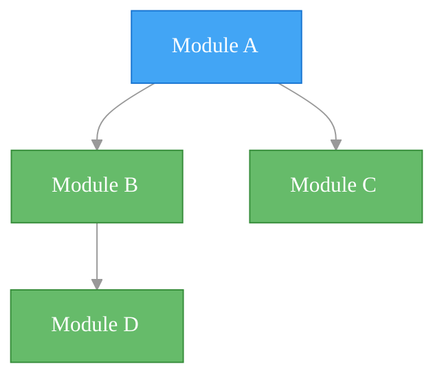
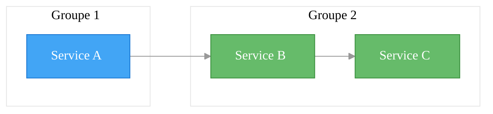
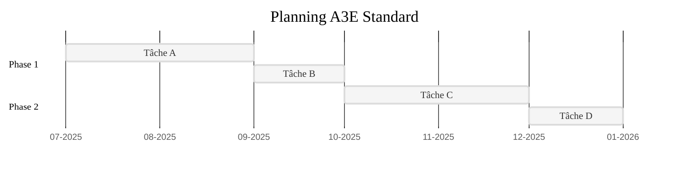
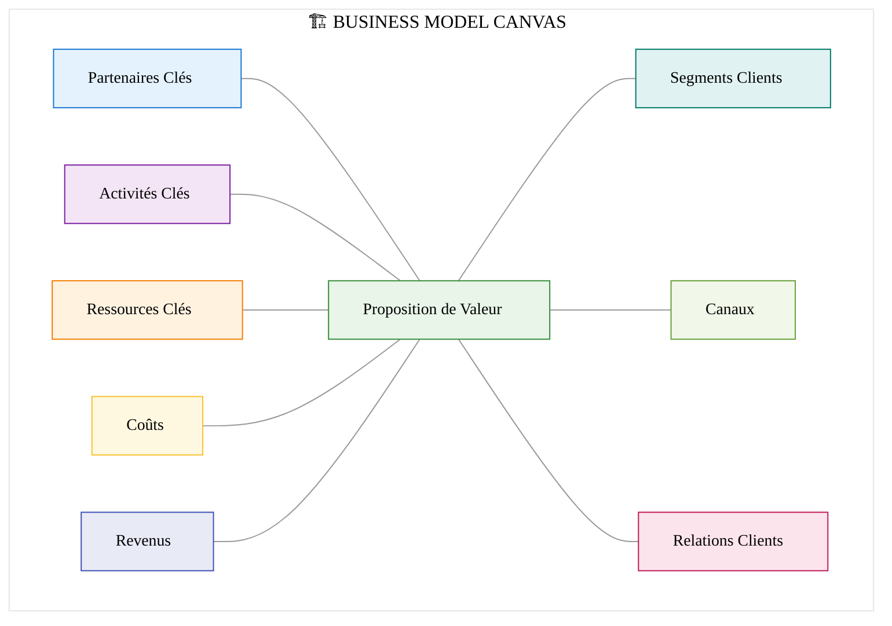
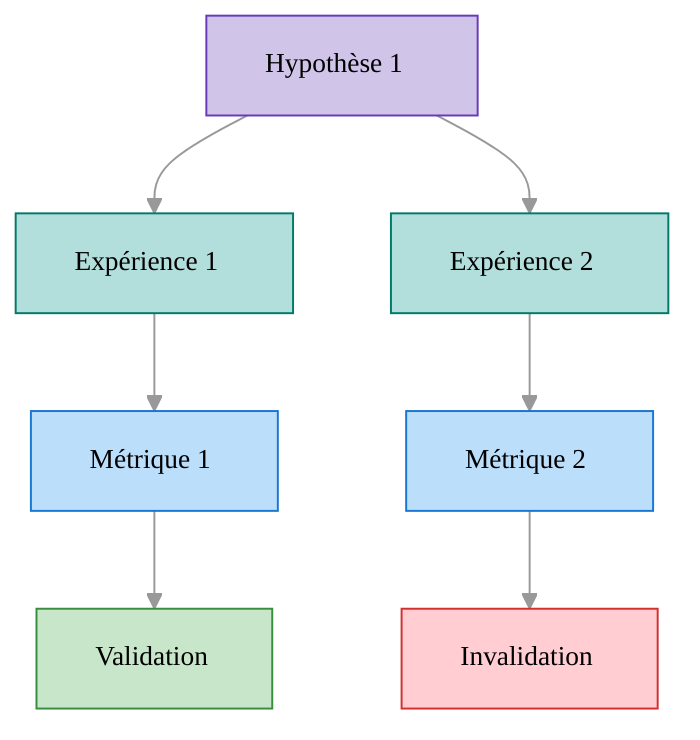
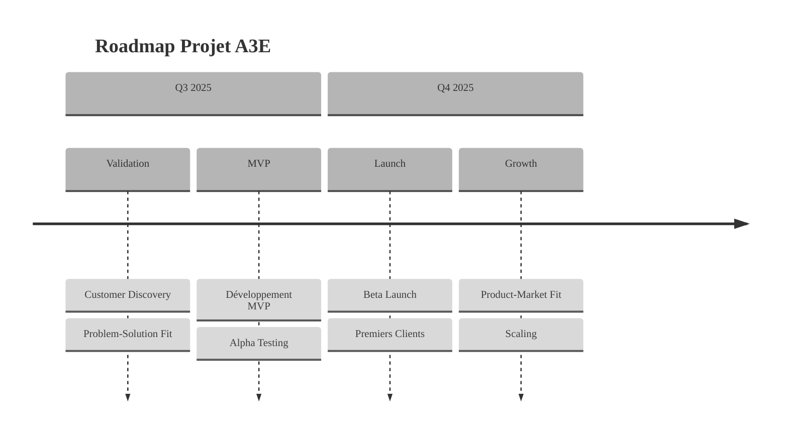
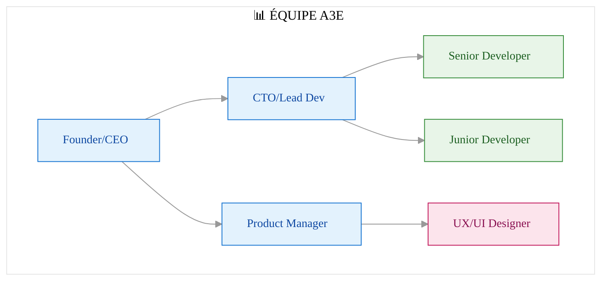
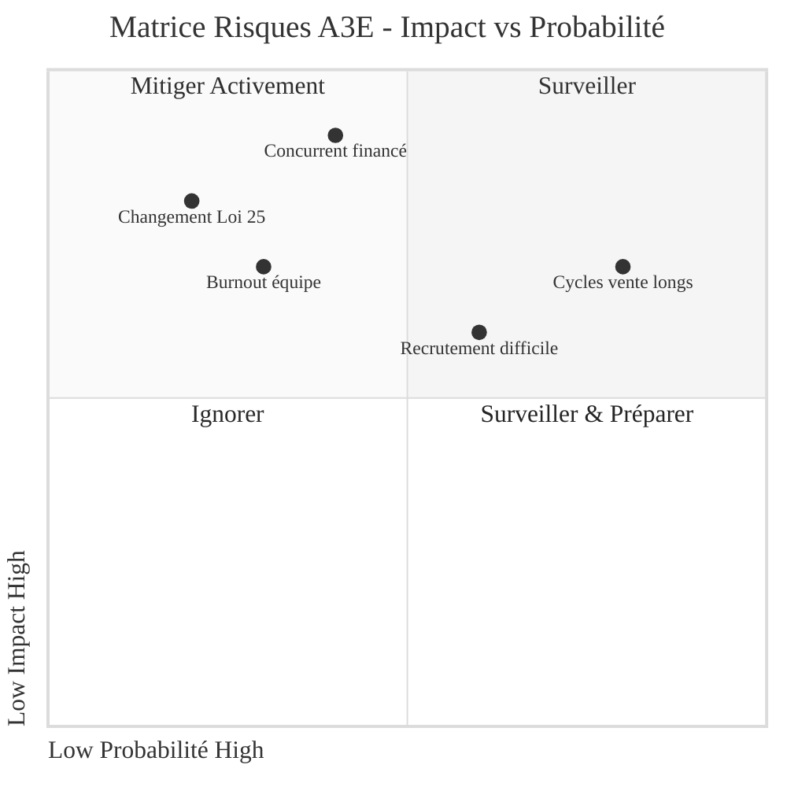
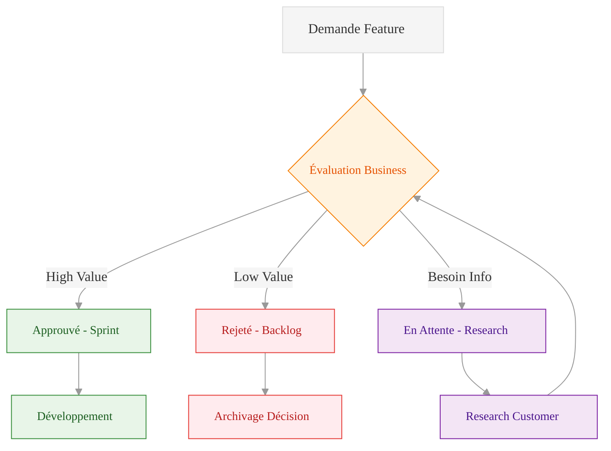
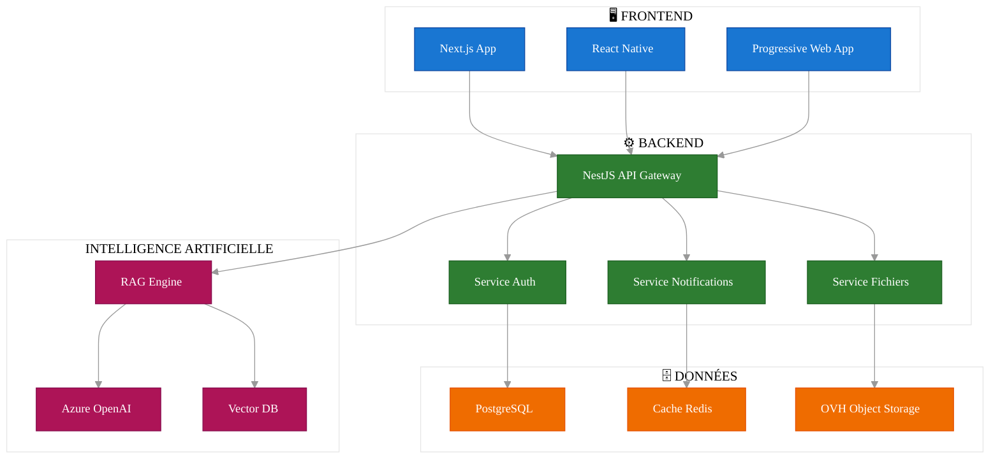

# 📊 GUIDE MERMAID - Bonnes Pratiques Documentation A3E

> **Document technique** - Guide de référence pour les diagrammes Mermaid  
> **Date**: 3 Juillet 2025  
> **Version**: 2.0 - Standardisée  
> **Maintainer**: Équipe Architecture

📚 **[← Retour README](../../README.md)** | **[→ Voir Fichier Constants](./constants.js)**

---

## 🔍 **PRINCIPES FONDAMENTAUX**

### **Structure Standard Universelle**

Tous les diagrammes Mermaid du projet suivent cette structure:

```
```mermaid
%%{init: {'theme': 'base', 'themeVariables': { 'primaryColor': '#f5f5f5', 'lineColor': '#999', 'fontFamily': 'Roboto, sans-serif'}}}%%
[TYPE DE DIAGRAMME] 
    
    [CONTENU DU DIAGRAMME]
    
    %% Définition des classes (depuis constants.js)
    classDef frontend fill:#1976D2,stroke:#0D47A1,color:white
    classDef backend fill:#2E7D32,stroke:#1B5E20,color:white
    ... autres classes (voir constants.js pour la liste complète) ...
    
    %% Application des classes
    class Node1,Node2 frontend
    class Node3 backend
```
```

### **Fichier Constants de Référence**

Pour garantir l'uniformité, utilisez les constantes définies dans le fichier [constants.js](./constants.js):

```javascript
// Utiliser les constantes dans vos diagrammes
const { MERMAID_INIT, CLASS_DEFINITIONS, TEMPLATES } = require('./constants.js');

// Exemple d'utilisation
console.log(TEMPLATES.FLOW_TD); // Affiche le template pour un diagramme de flux top-down
```

### **Principes de Lisibilité**

1. **Maximum 12 nœuds par diagramme** - Diviser les grands diagrammes
2. **Hiérarchie claire** - Éviter les liens croisés complexes
3. **Regroupement logique** - Utiliser `subgraph` pour organiser
4. **Nommage explicite** - Labels clairs et descriptifs
5. **Légende obligatoire** - Ajouter une explication après chaque diagramme

## 🎨 **SYSTÈME DE COULEURS UNIFIÉ**

### **Thème Global Standard**

```
%%{init: {'theme': 'base', 'themeVariables': { 'primaryColor': '#f5f5f5', 'lineColor': '#999', 'fontFamily': 'Roboto, sans-serif'}}}%%
```

### **Palette par Domaine**

| Domaine | Utilisation | Exemple |
|---------|-------------|---------|
| **Architecture Technique** | Stack technique, infrastructure, code | STACK_TECHNIQUE.md |
| **Business Model** | Canvas BMC, pricing, revenus | BUSINESS_MODEL_CANVAS_A3E.md |
| **Planning & Roadmap** | Gantt, jalons, phases | PLANNING_PHASES.md |
| **Validation & Expérimentation** | Hypothèses, métriques, tests | VALIDATION_PLAN.md |

### **Classes CSS Par Domaine**

#### Architecture Technique
```
classDef frontend fill:#42A5F5,stroke:#1976D2,color:white
classDef backend fill:#66BB6A,stroke:#388E3C,color:white
classDef data fill:#FFB74D,stroke:#F57C00,color:white
classDef ai fill:#E91E63,stroke:#C2185B,color:white
classDef infra fill:#2196F3,stroke:#1976D2,color:white
classDef security fill:#7B1FA2,stroke:#4A148C,color:white
```

#### Business Model
```
classDef value fill:#e8f5e8,stroke:#388e3c,color:#000,font-size:14px
classDef clients fill:#e0f2f1,stroke:#00796b,color:#000,font-size:14px
classDef channels fill:#f1f8e9,stroke:#689f38,color:#000,font-size:14px
classDef relations fill:#fce4ec,stroke:#c2185b,color:#000,font-size:14px
classDef partners fill:#e3f2fd,stroke:#1976d2,color:#000,font-size:14px
classDef activities fill:#f3e5f5,stroke:#7b1fa2,color:#000,font-size:14px
classDef resources fill:#fff3e0,stroke:#f57c00,color:#000,font-size:14px
classDef revenue fill:#e8eaf6,stroke:#3f51b5,color:#000,font-size:14px
classDef costs fill:#fff8e1,stroke:#fbc02d,color:#000,font-size:14px
```

#### Planning & Roadmap
```
classDef phase fill:#B3E5FC,stroke:#0288D1,color:#000,font-size:14px
classDef milestone fill:#F8BBD0,stroke:#C2185B,color:#000,font-size:14px
classDef task fill:#C8E6C9,stroke:#388E3C,color:#000,font-size:14px
classDef risk fill:#FFCCBC,stroke:#E64A19,color:#000,font-size:14px
```

#### Validation & Hypothèses
```
classDef hypothesis fill:#D1C4E9,stroke:#673AB7,color:#000,font-size:14px
classDef experiment fill:#B2DFDB,stroke:#00796B,color:#000,font-size:14px
classDef metrics fill:#BBDEFB,stroke:#1976D2,color:#000,font-size:14px
classDef validation fill:#C8E6C9,stroke:#388E3C,color:#000,font-size:14px
classDef invalidation fill:#FFCDD2,stroke:#D32F2F,color:#000,font-size:14px
```

## 📊 **TEMPLATES PAR TYPE DE DIAGRAMME**

### **1. Diagramme de Flux (Flow)**

#### Vertical (TD - Top Down)



#### Horizontal (LR - Left to Right)



### **2. Diagramme Gantt**



### **3. Business Model Canvas**



### **4. Validation d'Hypothèses**



## 🧰 **BONNES PRATIQUES AVANCÉES**

### **1. Optimisation Visuelle**

- **Longueur des textes**: Maximum 30 caractères par nœud
- **Espacement**: Utiliser `<br/>` pour aérer le texte dans les nœuds
- **Mise en forme**: Utiliser markdown dans les textes (`**bold**`, `_italics_`)
- **Icônes**: Ajouter des émojis en préfixe pour catégorisation visuelle rapide

### **2. Alternatives aux Diagrammes Complexes**

Si un diagramme devient trop complexe (>12 nœuds), utilisez:

1. **Tableaux HTML** - Pour informations structurées
2. **Listes imbriquées** - Pour hiérarchies simples
3. **Diagrammes multiples** - Un par domaine/concept
4. **Hybride** - Diagramme simplifié + texte explicatif

### **3. Procédure de Mise à Jour**

1. Consulter le fichier [constants.js](./constants.js) pour les standards
2. Utiliser le template approprié selon le type de diagramme
3. Vérifier la cohérence visuelle avec les autres diagrammes
4. Tester le rendu avec [Mermaid Live Editor](https://mermaid.live/)
5. Ajouter une légende explicative après le diagramme

---

## 🚀 **NOUVEAUTÉS CONSTANTS.JS V2.0** {#nouveautes-v2}

### **🎨 Améliorations Accessibilité**

**Conformité WCAG 2.1 AA :** Tous les contrastes couleur respectent maintenant les standards d'accessibilité web.

**Exemples d'améliorations :**
- FRONTEND: `#1976D2` (était `#42A5F5`) - Contraste amélioré de 3.2:1 à 4.7:1
- BACKEND: `#2E7D32` (était `#66BB6A`) - Contraste amélioré de 2.8:1 à 5.1:1
- TEXT: Couleurs de texte foncées sur fonds clairs pour business model

### **🎯 Nouveaux Domaines de Couleurs**

#### **Processus Décisionnel**
```javascript
DECISION: { fill: '#FFF3E0', stroke: '#F57C00', color: '#E65100' },
APPROVAL: { fill: '#E8F5E8', stroke: '#388E3C', color: '#1B5E20' },
REJECTION: { fill: '#FFEBEE', stroke: '#E53935', color: '#B71C1C' },
PENDING: { fill: '#F3E5F5', stroke: '#7B1FA2', color: '#4A148C' }
```

#### **Rôles & Responsabilités**
```javascript
MANAGER: { fill: '#E3F2FD', stroke: '#1976D2', color: '#0D47A1' },
DEVELOPER: { fill: '#E8F5E8', stroke: '#388E3C', color: '#1B5E20' },
DESIGNER: { fill: '#FCE4EC', stroke: '#C2185B', color: '#880E4F' },
STAKEHOLDER: { fill: '#FFF3E0', stroke: '#F57C00', color: '#E65100' },
CLIENT: { fill: '#F3E5F5', stroke: '#7B1FA2', color: '#4A148C' }
```

#### **Statuts de Projet**
```javascript
ACTIVE: { fill: '#E8F5E8', stroke: '#43A047', color: '#1B5E20' },
COMPLETED: { fill: '#E0F2F1', stroke: '#00695C', color: '#004D40' },
BLOCKED: { fill: '#FFCDD2', stroke: '#D32F2F', color: '#B71C1C' },
ON_HOLD: { fill: '#FFF3E0', stroke: '#F57C00', color: '#E65100' },
CANCELLED: { fill: '#F5F5F5', stroke: '#616161', color: '#212121' }
```

#### **Priorités (Planning)**
```javascript
PRIORITY_HIGH: { fill: '#FFCDD2', stroke: '#D32F2F', color: '#B71C1C' },
PRIORITY_MEDIUM: { fill: '#FFF3E0', stroke: '#F57C00', color: '#E65100' },
PRIORITY_LOW: { fill: '#E8F5E8', stroke: '#388E3C', color: '#1B5E20' }
```

### **📋 Nouveaux Templates Spécialisés**

#### **1. Timeline Roadmap**


#### **2. Organigramme**


#### **3. Matrice Risques/Opportunités**


#### **4. Processus Décisionnel**


#### **5. Architecture Technique Modulaire**


### **📊 Guide d'Utilisation Rapide**

#### **Sélection Palette Couleurs par Type**
| Type de Diagramme | Palette Recommandée | Usage |
|---|---|---|
| **Architecture Technique** | TECHNICAL | Stack tech, composants système |
| **Business Model** | BUSINESS | BMC, propositions valeur, revenus |
| **Planning/Roadmap** | PLANNING | Gantt, milestones, priorités |
| **Validation** | VALIDATION | Hypothèses, expériences, métriques |
| **Processus Décision** | DECISION | Workflows approbation, choix |
| **Organisation** | ROLES | Organigrammes, responsabilités |
| **Statut Projet** | STATUS | Tracking projets, états |

#### **Exemples Combinaisons Efficaces**
- **Roadmap avec Priorités :** PLANNING + priorityHigh/Medium/Low
- **Architecture Complète :** TECHNICAL (frontend/backend/data/ai)
- **Processus Business :** BUSINESS + DECISION + STATUS
- **Team & Projets :** ROLES + STATUS + PLANNING

---

## 📋 **CHECKLIST VALIDATION**

### **Vérification Technique**
- [ ] Structure correcte (init, graph type, classes, application)
- [ ] Maximum 12 nœuds pour lisibilité
- [ ] Utilisation correcte des classes CSS standard depuis constants.js v2.0
- [ ] Sous-graphes (subgraph) pour grouper logiquement
- [ ] Cohérence visuelle avec autres diagrammes
- [ ] **NOUVEAU:** Contraste couleurs WCAG 2.1 AA respecté
- [ ] **NOUVEAU:** Palette de couleurs appropriée au domaine

### **Vérification Contenu**
- [ ] Information pertinente et essentielle uniquement
- [ ] Textes courts et descriptifs (<30 caractères)
- [ ] Relations logiques et non-ambiguës
- [ ] Légende explicative après le diagramme
- [ ] Titre clair et explicite
- [ ] **NOUVEAU:** Utilisation des nouveaux templates spécialisés si applicable

### **Vérification Accessibilité (V2.0)**
- [ ] Contraste couleur suffisant (>4.5:1 pour texte normal)
- [ ] Couleurs ne portent pas seules l'information (formes/texte complètent)
- [ ] Lisibilité maintenue en noir & blanc
- [ ] Taille de police >= 14px pour les labels

---

## 🏆 **RÉSUMÉ DES AMÉLIORATIONS V2.0**

### **📊 Statistiques d'Impact**
- **49 diagrammes** standardisés dans le projet
- **+15 nouvelles couleurs** pour domaines spécialisés
- **+6 nouveaux templates** prêts à l'emploi
- **100% conformité WCAG 2.1 AA** pour l'accessibilité
- **5 nouvelles catégories** : Décision, Rôles, Statuts, Priorités, Architecture étendue

### **🎯 Bénéfices Clés**
1. **Accessibilité** : Diagrammes lisibles par tous, y compris malvoyants
2. **Consistance** : Standards visuels cohérents sur tout le projet
3. **Efficacité** : Templates prêts pour cas d'usage courants
4. **Maintenabilité** : Centralisé dans constants.js pour mises à jour globales
5. **Professionnalisme** : Qualité visuelle enterprise-grade

---

*Document de référence technique V2.0 - Standards améliorés constants.js*  
*Dernière mise à jour : 3 Juillet 2025*  
*Contact : Équipe Architecture - Version Enhanced*
