# 🛠️ STACK TECHNIQUE - PLATEFORME DE GESTION CONSTRUCTION QUÉBEC

> **Document d'architecture technique** - Aligné avec la vision produit et roadmap stratégique  
> **Date**: Juillet 2025  
> **Méthodologie**: Architecture cloud-native, microservices, IA avancée

📚 **[← Retour INDEX](../INDEX.md)** | **[→ PRD Features](../2_product_strategy/PRD.md)** | **[→ Analyse Concurrentielle](../3_competitive_analysis/ANALYSE_CONCURRENTIELLE_STRATEGIQUE.md)**

---

## 🔍 **ARCHITECTURE GLOBALE** {#architecture-globale}

⚙️ **Liens connexes**: [→ PRD Features Techniques](../2_product_strategy/PRD.md#features) | [→ BMC Key Resources](../1_business_foundation/BUSINESS_MODEL_CANVAS_A3E.md#key-resources)

L'architecture de la plateforme est conçue pour être modulaire, évolutive et hautement performante, tout en respectant les contraintes réglementaires québécoises (Loi 25) et en optimisant les coûts d'opération.

```mermaid
%%{init: {'theme': 'base', 'themeVariables': { 'primaryColor': '#f5f5f5', 'lineColor': '#999'}}}%%
graph TB
    classDef frontend fill:#42A5F5,stroke:#1976D2,color:white
    classDef backend fill:#66BB6A,stroke:#388E3C,color:white
    classDef microservices fill:#81C784,stroke:#4CAF50,color:white
    classDef data fill:#FFB74D,stroke:#F57C00,color:white
    classDef auth fill:#9575CD,stroke:#673AB7,color:white
    classDef event fill:#4DB6AC,stroke:#00897B,color:white
    classDef ia fill:#F06292,stroke:#E91E63,color:white

    subgraph "Frontend"
        UI[Interface Utilisateur<br/>NextJS + React]
        Mobile[Apps Mobiles<br/>React Native]
        PWA[Progressive Web App]
    end
    
    subgraph "Backend"
        API[API Gateway<br/>NestJS]
        Auth[Authentification<br/>KeyCloak]
        subgraph "Microservices"
            MS1[Planification]
            MS2[Conception]
            MS3[Construction]
            MS4[Maintenance]
            IA[Intelligence<br/>Artificielle]
        end
        Event[Event Bus<br/>Kafka]
    end
    
    subgraph "Données"
        DB[(PostgreSQL)]
        Doc[(MongoDB)]
        Vector[(Pinecone)]
        Cache[(Redis)]
        S3[(Stockage<br/>Object)]
    end
    
    UI --> API
    Mobile --> API
    PWA --> API
    
    API --> Auth
    API --> MS1
    API --> MS2
    API --> MS3
    API --> MS4
    API --> IA
    
    MS1 <--> Event
    MS2 <--> Event
    MS3 <--> Event
    MS4 <--> Event
    IA <--> Event
    
    MS1 --> DB
    MS2 --> DB
    MS3 --> DB
    MS4 --> DB
    
    MS1 --> Doc
    MS2 --> Doc
    MS3 --> Doc
    MS4 --> Doc
    
    IA --> Vector
    
    MS1 --> Cache
    MS2 --> Cache
    MS3 --> Cache
    MS4 --> Cache
    
    MS1 --> S3
    MS2 --> S3
    MS3 --> S3
    MS4 --> S3
    
    %% Apply classes
    class UI,Mobile,PWA frontend
    class API backend
    class Auth auth
    class MS1,MS2,MS3,MS4 microservices
    class IA ia
    class Event event
    class DB,Doc,Vector,Cache,S3 data
    
    %% Link styling
    linkStyle 0,1,2 stroke:#42A5F5,stroke-width:2px
    linkStyle 3,4,5,6,7,8 stroke:#66BB6A,stroke-width:2px
    linkStyle 9,10,11,12,13 stroke:#81C784,stroke-width:2px
    linkStyle 14,15,16,17,18,19,20,21 stroke:#81C784,stroke-width:2px
    linkStyle 22,23,24,25,26,27,28,29 stroke:#81C784,stroke-width:2px
    linkStyle 30 stroke:#F06292,stroke-width:2px
    linkStyle 31,32,33,34 stroke:#81C784,stroke-width:2px
```

## 💻 **STACK FRONTEND**

### **Technologies Principales**

| Technologie | Version | Justification |
|-------------|---------|---------------|
| **NextJS** | 14+ | Framework React full-stack avec rendu serveur pour performances optimales |
| **React** | 18+ | Bibliothèque UI réactive et composants réutilisables |
| **TypeScript** | 5.0+ | Typage statique pour code robuste et maintenance facilitée |
| **TailwindCSS** | 3.0+ | Styling utilitaire pour développement rapide et cohérent |
| **Shadcn UI** | Latest | Composants accessibles et personnalisables |
| **React Native** | Latest | Applications mobiles natives multiplateformes |
| **PWA** | Web Standards | Fonctionnalités hors-ligne et installation sur appareils |

### **Architecture Frontend**

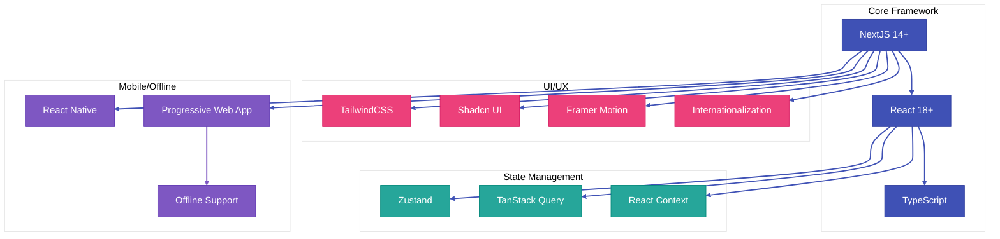

### **Composants UI Spécifiques aux Modules**

#### Module Planification
- Tableaux de bord exécutifs avec KPIs
- Visualisations avancées pour analyse de parc
- Interfaces de priorisation de projets
- Vues calendaires multi-projets

#### Module Conception
- Éditeur collaboratif temps réel
- Visionneuses de plans 2D/3D
- Interface d'annotation et de commentaires
- Gestionnaire de PFT et fiches locaux

#### Module Construction
- Rapports de visite mobiles avancés
- Tableaux de bord de progression
- Gestionnaire de demandes de changement
- Interface de workflow approbation

#### Module Maintenance
- Tableaux de bord prédictifs
- Interfaces de planification maintenance
- Scanners d'inspection mobile
- Visualisation de données IoT

## 🔧 **STACK BACKEND**

### **Technologies Principales**

| Technologie | Version | Justification |
|-------------|---------|---------------|
| **NestJS** | Latest | Framework Node.js structuré avec architecture hexagonale |
| **TypeScript** | 5.0+ | Typage fort pour backend robuste et maintenable |
| **PostgreSQL** | 15+ | Base de données relationnelle performante et fiable |
| **MongoDB** | 6.0+ | Stockage documents pour flexibilité des schémas |
| **Redis** | 7.0+ | Cache hautes performances et files d'attente |
| **Kafka** | 3.0+ | Bus d'événements pour architecture événementielle |
| **KeyCloak** | Latest | Gestion avancée d'authentification et autorisation |
| **Azure OpenAI** | Latest | Services IA avec hébergement canadien (souveraineté) |
| **Pinecone** | Latest | Base de données vectorielle pour RAG et recherche sémantique |

### **Architecture Microservices**

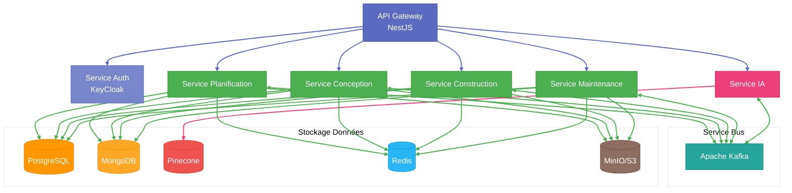

### **Microservices Détaillés**

#### Service Planification
- API de gestion de parc immobilier
- Moteur d'analyse et priorisation
- Workflows de budgétisation
- Générateur de plans directeurs

#### Service Conception
- API de gestion documentaire
- Moteur de collaboration temps réel
- Workflows PFT et fiches techniques
- Intégration BIM légère

#### Service Construction
- API de gestion de chantier
- Moteur de workflows d'approbation
- Générateur de rapports dynamiques
- Système de notifications intelligentes

#### Service Maintenance
- API de gestion d'actifs
- Moteur d'analyse prédictive
- Workflows d'inspection
- Intégration IoT/capteurs

#### Service IA
- RAG (Retrieval Augmented Generation)
- Traitement du langage naturel français québécois
- Vision par ordinateur pour inspection
- Prédiction et analyse de données

## 🧠 **ARCHITECTURE IA**

L'intelligence artificielle est au cœur de notre plateforme, offrant des capacités prédictives et d'assistance avancées.

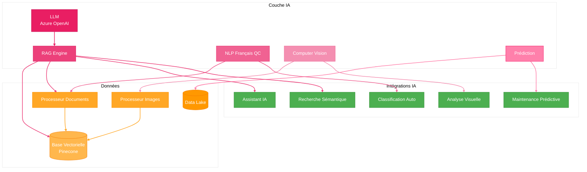

### **Fonctionnalités IA par Module**

#### Planification
- Prédiction des besoins futurs
- Optimisation des investissements
- Analyse de risques automatisée
- Recommandations basées sur données historiques

#### Conception
- Génération assistée de PFT
- Vérification automatique de conformité
- Suggestions d'optimisation de plans
- Détection de conflits dans les plans

#### Construction
- Analyse automatique des rapports de visite
- Prédiction des retards potentiels
- Détection visuelle de non-conformités
- Classification automatique des documents

#### Maintenance
- Maintenance prédictive avancée
- Optimisation énergétique en temps réel
- Détection précoce d'anomalies
- Priorisation intelligente des interventions

## 📱 **ARCHITECTURE MOBILE**

Notre solution mobile est conçue pour être utilisable en contexte de chantier avec connectivité limitée.

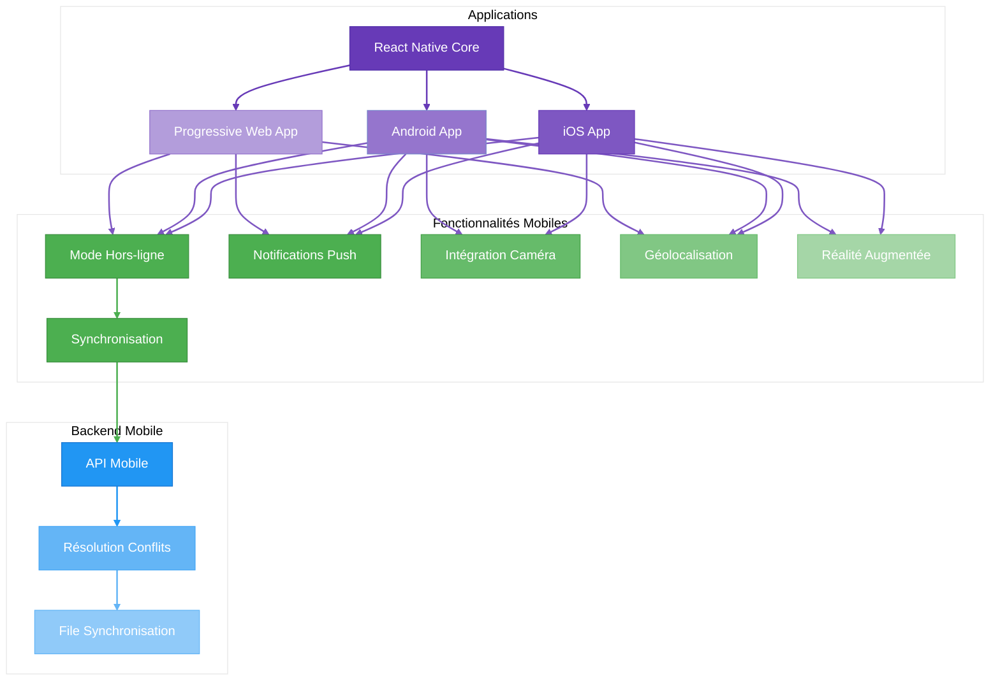

## 🔐 **SÉCURITÉ ET CONFORMITÉ**

La sécurité et la conformité sont primordiales pour une application gouvernementale au Québec.

```mermaid
%%{init: {'theme': 'base', 'themeVariables': { 'primaryColor': '#f5f5f5', 'lineColor': '#999'}}}%%
graph TD
    classDef auth fill:#7B1FA2,stroke:#6A1B9A,color:white
    classDef mfa fill:#9C27B0,stroke:#8E24AA,color:white
    classDef rbac fill:#AB47BC,stroke:#9C27B0,color:white
    classDef audit fill:#BA68C8,stroke:#AB47BC,color:white
    classDef encrypt fill:#CE93D8,stroke:#BA68C8,color:white
    classDef loi fill:#00897B,stroke:#00796B,color:white
    classDef dpia fill:#26A69A,stroke:#00897B,color:white
    classDef hosting fill:#4DB6AC,stroke:#26A69A,color:white
    classDef data fill:#80CBC4,stroke:#4DB6AC,color:white
    classDef monitor fill:#FFC107,stroke:#FFB300,color:white
    classDef log fill:#FFCA28,stroke:#FFC107,color:white
    classDef alert fill:#FFD54F,stroke:#FFCA28,color:white
    classDef siem fill:#FFE082,stroke:#FFD54F,color:white

    subgraph "Sécurité"
        Auth[Authentification<br/>KeyCloak]
        MFA[Multi-facteur]
        RBAC[Contrôle Accès<br/>Basé Rôles]
        Audit[Piste d'Audit]
        Encrypt[Chiffrement<br/>Données]
    end
    
    subgraph "Conformité"
        Loi25[Conformité Loi 25]
        DPIA[Analyse Impact<br/>Vie Privée]
        Hosting[Hébergement<br/>Québec/Canada]
        DataRes[Résidence<br/>Données]
    end
    
    subgraph "Surveillance"
        Monitor[Monitoring]
        Log[Logging]
        Alert[Alertes]
        SIEM[SIEM]
    end
    
    Auth --> MFA
    Auth --> RBAC
    RBAC --> Audit
    
    Loi25 --> DPIA
    Loi25 --> Hosting
    Hosting --> DataRes
    
    Monitor --> Log
    Log --> Alert
    Alert --> SIEM
    
    %% Apply classes
    class Auth auth
    class MFA mfa
    class RBAC rbac
    class Audit audit
    class Encrypt encrypt
    class Loi25 loi
    class DPIA dpia
    class Hosting hosting
    class DataRes data
    class Monitor monitor
    class Log log
    class Alert alert
    class SIEM siem
    
    %% Link styling
    linkStyle 0,1 stroke:#7B1FA2,stroke-width:2px
    linkStyle 2 stroke:#AB47BC,stroke-width:2px
    linkStyle 3,4 stroke:#00897B,stroke-width:2px
    linkStyle 5 stroke:#4DB6AC,stroke-width:2px
    linkStyle 6,7 stroke:#FFC107,stroke-width:2px
```

## 🚀 **INFRASTRUCTURE ET DÉPLOIEMENT**

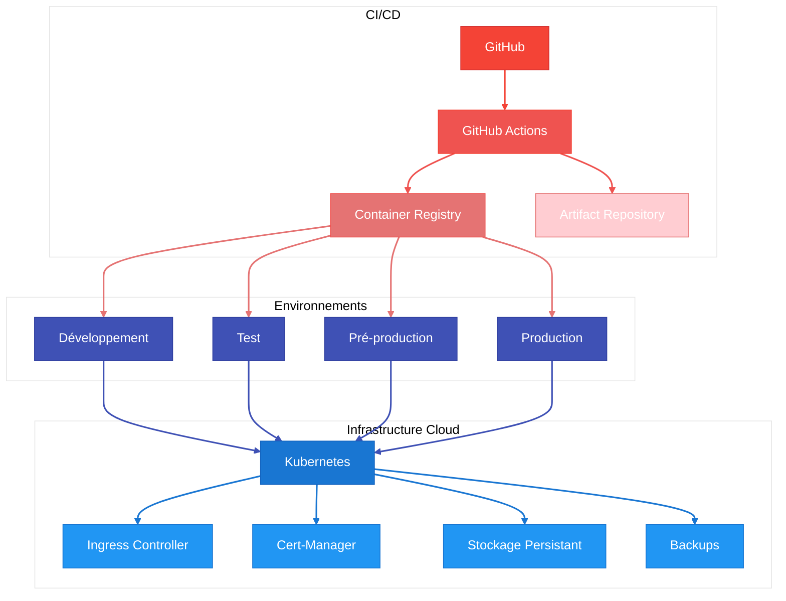

## 📊 **IMPLÉMENTATION PAR MODULE**

### **1. Module Planification**

Ce module permet la gestion stratégique des parcs immobiliers et la planification des projets de construction.

#### Stack Technique Spécifique
- **Frontend**: Dashboards interactifs avec graphiques avancés (recharts, d3.js)
- **Backend**: Moteur d'analyse prédictive et API de gestion de planification
- **Base de données**: Modèle relationnel pour hiérarchie des actifs et projets
- **IA**: Modèles de priorisation et d'optimisation de ressources

#### Fonctionnalités Techniques
- Tableaux de bord personnalisés par type d'utilisateur
- Moteur de règles pour priorisation projets
- Analyse multi-critères pour décisions
- Intégration avec systèmes financiers externes
- Simulations budgétaires multi-scénarios

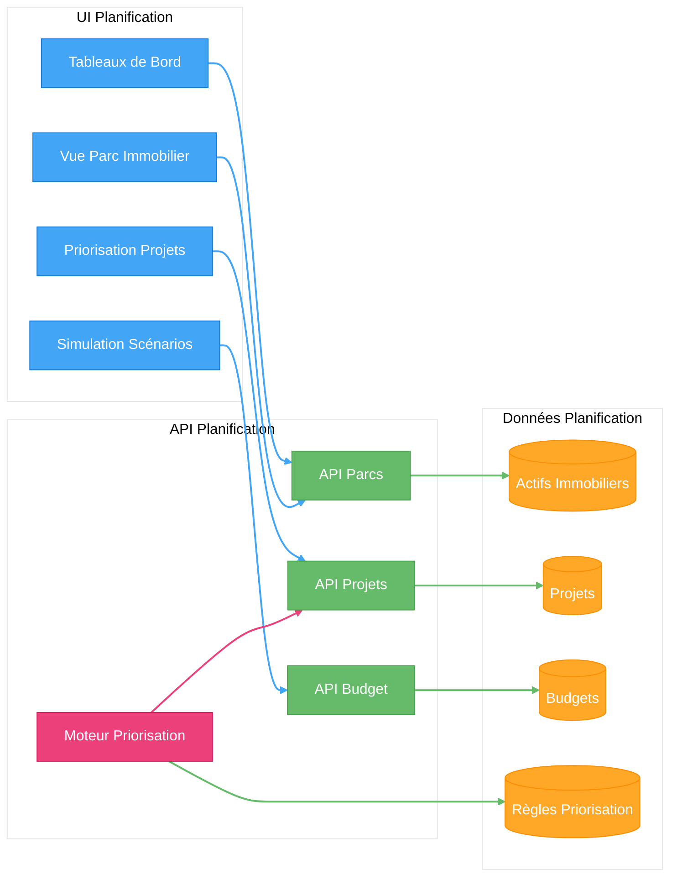

### **2. Module Conception**

Ce module gère la phase de conception des projets, incluant la collaboration avec architectes et ingénieurs.

#### Stack Technique Spécifique
- **Frontend**: Éditeurs collaboratifs temps réel, visualisation 2D/3D
- **Backend**: API de gestion documentaire et de workflows
- **Base de données**: MongoDB pour documents et versions, PostgreSQL pour relations
- **IA**: Assistance conception et vérification conformité

#### Fonctionnalités Techniques
- Édition collaborative temps réel (WebSockets/CRDTs)
- Visionneuse de plans avec annotations
- Gestion versions sophistiquée
- Workflows approbation paramétrables
- Intégration légère BIM/IFC

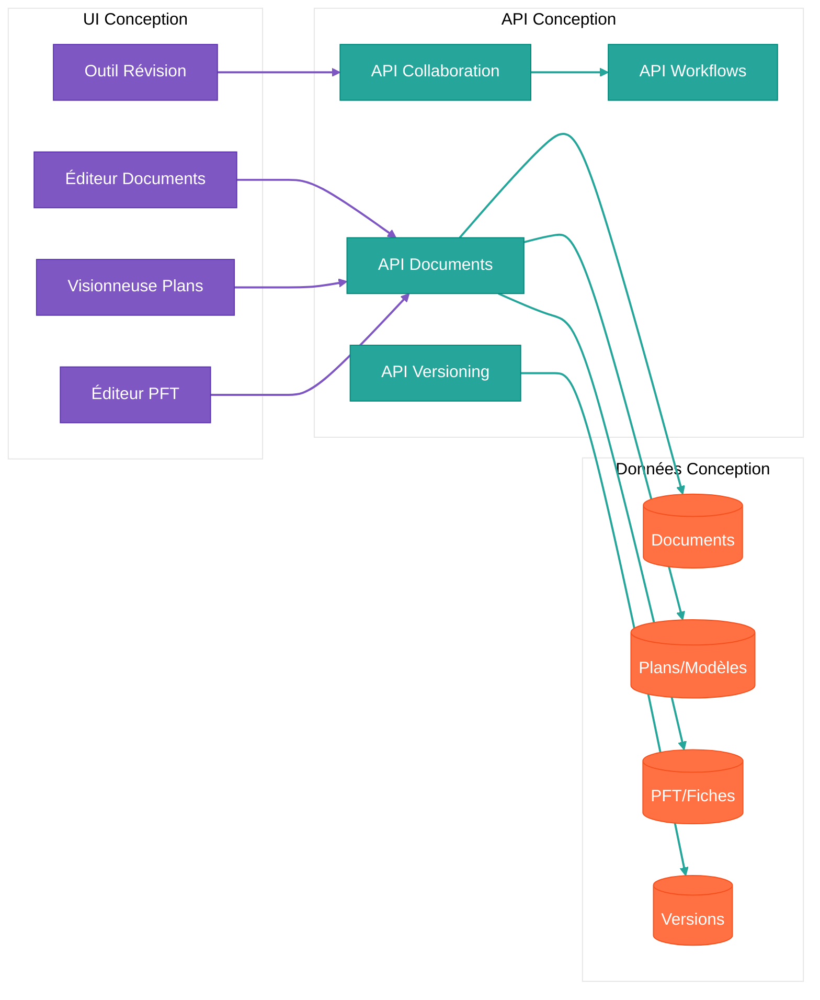

### **3. Module Construction**

Ce module gère l'exécution des projets de construction sur le terrain.

#### Stack Technique Spécifique
- **Frontend**: Interface mobile robuste, formulaires dynamiques
- **Backend**: API de gestion de chantier, moteur de workflows
- **Base de données**: Structure relationnelle pour suivi, MongoDB pour documents
- **IA**: Analyse rapports visite, détection problèmes

#### Fonctionnalités Techniques
- App mobile avec fonctionnement hors-ligne
- Capture photos avec annotations
- Formulaires dynamiques adaptatifs
- Workflows approbation avec signatures
- Notifications contextuelles intelligentes

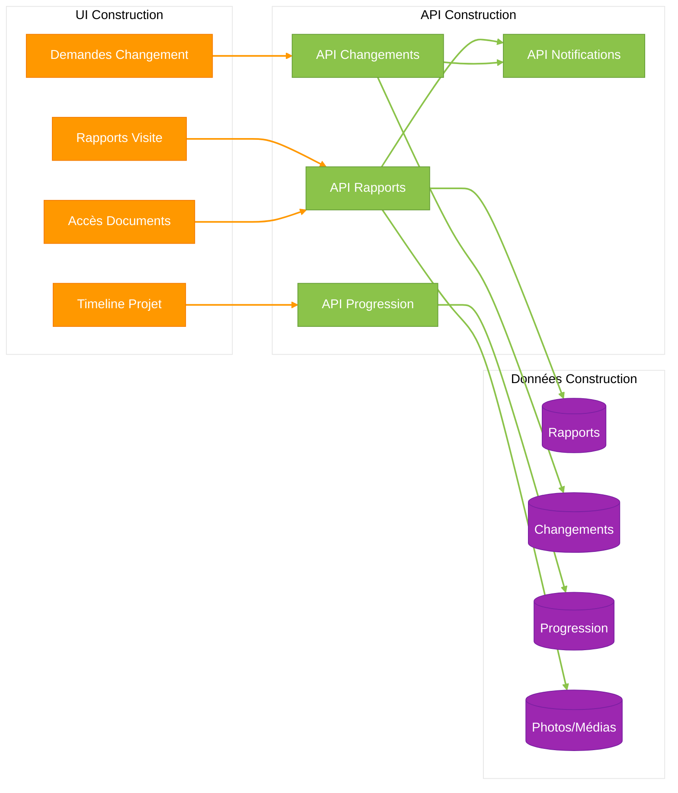

### **4. Module Maintenance**

Ce module gère le maintien des actifs après la construction.

#### Stack Technique Spécifique
- **Frontend**: Tableaux de bord prédictifs, interfaces inspection
- **Backend**: API de gestion d'actifs, moteur analytique
- **Base de données**: Modèle temporel pour données capteurs, graphe pour relations
- **IA**: Maintenance prédictive, détection anomalies

#### Fonctionnalités Techniques
- Dashboard prédictif maintenance
- Intégration IoT et capteurs
- Planification inspections intelligente
- Historique complet bâtiment
- Optimisation énergétique temps réel

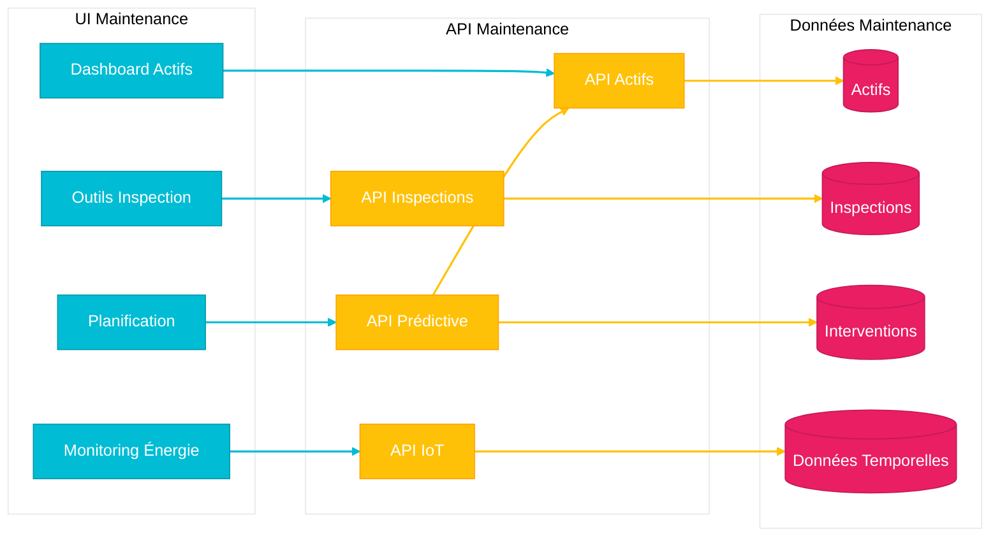

## 🔄 **INTÉGRATIONS EXTERNES**

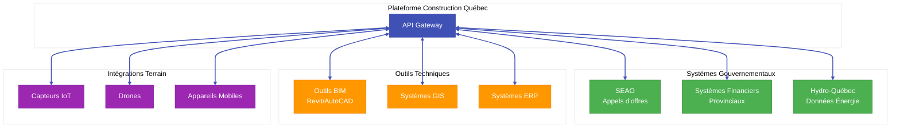

## 📈 **ÉVOLUTION DE LA STACK TECHNIQUE**

### **Phase 1: MVP (Mois 1-9)**
- Frontend: NextJS + React basique, PWA simple
- Backend: Monolithe NestJS
- Base de données: PostgreSQL + Supabase
- Déploiement: Vercel + services managés
- IA: Intégrations API basiques

### **Phase 2: Expansion (Mois 10-18)**
- Transition vers microservices
- Applications mobiles natives
- IA avancée avec RAG
- Architecture événementielle
- Intégrations systèmes externes

### **Phase 3: Plateforme Mature (Mois 19-30)**
- IA générative personnalisée
- Infrastructure multi-région
- Edge computing pour performance
- Jumeaux numériques complets
- Plateforme extensible via API publique

## 🛡️ **GESTION DE LA DETTE TECHNIQUE**

- Revues de code systématiques
- Tests automatisés (>80% couverture)
- Audits de performance trimestriels
- Refactoring planifié (20% du temps)
- Documentation technique continue

---

## 💎 **CONCLUSION**

Cette stack technique est conçue pour allier robustesse, performance et agilité de développement. Elle permet de livrer rapidement un produit minimum viable tout en posant les fondations pour une plateforme sophistiquée capable de révolutionner la gestion de construction au Québec.

Les choix technologiques ont été faits pour:
1. Minimiser le coût initial tout en permettant une évolution progressive
2. Garantir la conformité aux exigences réglementaires québécoises
3. Maximiser l'expérience utilisateur sur tous les appareils
4. Tirer parti des dernières avancées en IA et analyse prédictive
5. Assurer une plateforme évolutive pour les 10 prochaines années

---

*Document technique vivant - À réviser trimestriellement*  
*Dernière mise à jour : Juillet 2025*  
*Prochain audit d'architecture : Octobre 2025*
