# 🛠️ STACK TECHNIQUE - PLATEFORME DE GESTION CONSTRUCTION QUÉBEC

> **Document d'architecture technique** - Aligné avec la vision produit et roadmap stratégique  
> **Date**: Juillet 2025  
> **Méthodologie**: Architecture cloud-native, microservices, IA avancée  
> **Dernière mise à jour**: Août 2025

📚 **[← Retour au README](../../README.md)** | **[→ PRD Master](../6_product_specifications/PRD_MASTER.md)** | **[→ Analyse Concurrentielle](../2_competitive_analysis/ANALYSE_CONCURRENTIELLE_STRATEGIQUE.md)**

---

## 🔍 **ARCHITECTURE GLOBALE** {#architecture-globale}

⚙️ **Liens connexes**: [→ PRD Features Techniques](../6_product_specifications/PRD_MASTER.md#features) | [→ BMC Key Resources](../3_product_strategy/BUSINESS_MODEL_CANVAS_A3E.md#key-resources)

L'architecture de la plateforme est conçue pour être modulaire, évolutive et hautement performante, tout en respectant les contraintes réglementaires québécoises (Loi 25) et e23. **Documentation OpenTelemetry**: [opentelemetry.io/docs](https://opentelemetry.io/docs/)
24. **Documentation Azure DevOps**: [learn.microsoft.com/en-us/azure/devops/?view=azure-devops](https://learn.microsoft.com/en-us/azure/devops/?view=azure-devops)

---

## 📝 **NOTES SUR LA SIMPLIFICATION DE LA DOCUMENTATION**

### **Principes de Simplification Appliqués**
Cette documentation technique a été simplifiée selon les principes suivants:

1. **Diagrammes plus lisibles**:
   - Réduction du nombre d'éléments par diagramme
   - Focus sur les relations clés plutôt que sur tous les détails
   - Utilisation de niveaux d'abstraction plus élevés

2. **Formats alternatifs**:
   - Remplacement de certains diagrammes complexes par des tableaux
   - Utilisation de listes structurées pour l'information hiérarchique
   - Conservation des diagrammes uniquement quand ils apportent une valeur visuelle supérieure

3. **Focus sur l'essentiel**:
   - Mise en avant des choix architecturaux principaux
   - Clarification des relations entre les composants clés
   - Simplification des concepts techniques pour faciliter la compréhension

### **Diagrammes Simplifiés**
- **Architecture Globale**: Focus sur les 3 couches principales
- **Architecture Microservices**: Simplification pour montrer uniquement les relations principales
- **Architecture IA**: Simplification pour une meilleure compréhension des capacités
- **Architecture Mobile**: Focus sur les fonctionnalités clés pour le terrain
- **Sécurité et Conformité**: Conversion en tableau pour meilleure lisibilité

### **Bénéfices**
- **Documentation plus navigable** pour l'équipe
- **Onboarding facilité** pour nouveaux développeurs
- **Prise de décision plus rapide** grâce à une vue d'ensemble claire
- **Maintenance simplifiée** de la documentation

---

*Document technique vivant - À réviser trimestriellement*  
*Dernière mise à jour : Août 2025*  
*Prochain audit d'architecture : Octobre 2025*sant les coûts d'opération.

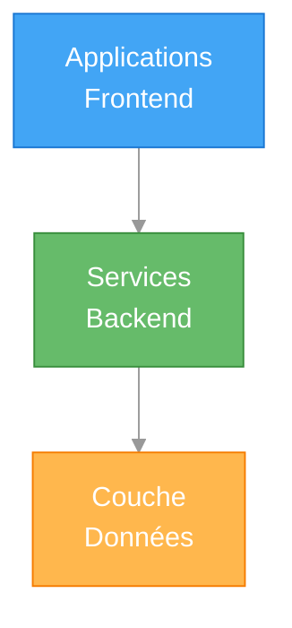

> **Vue simplifiée des trois couches principales de l'architecture**

### Composants par couche

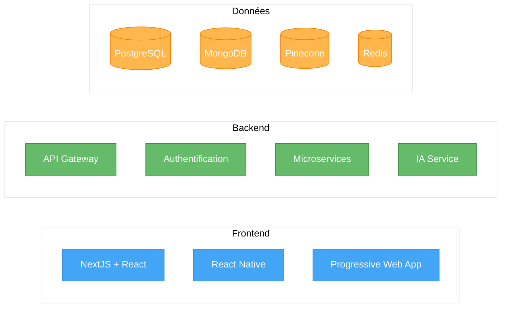

### Architecture des Microservices

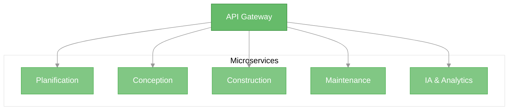

> **Organisation des microservices métier avec API Gateway centralisée**

## 💻 **STACK FRONTEND**

### **Technologies Principales**

| Technologie | Version | Justification |
|-------------|---------|---------------|
| **NextJS** | 14+ | Framework React full-stack avec rendu serveur pour performances optimales |
| **React** | 18+ | Bibliothèque UI réactive et composants réutilisables |
| **TypeScript** | 5.0+ | Typage statique pour code robuste et maintenance facilitée |
| **TailwindCSS** | 3.0+ | Styling utilitaire pour développement rapide et cohérent |
| **Shadcn UI** | Latest | Composants accessibles et personnalisables |
| **React Native** | Latest | Applications mobiles natives multiplateformes |
| **PWA** | Web Standards | Fonctionnalités hors-ligne et installation sur appareils |

### **Architecture Frontend**

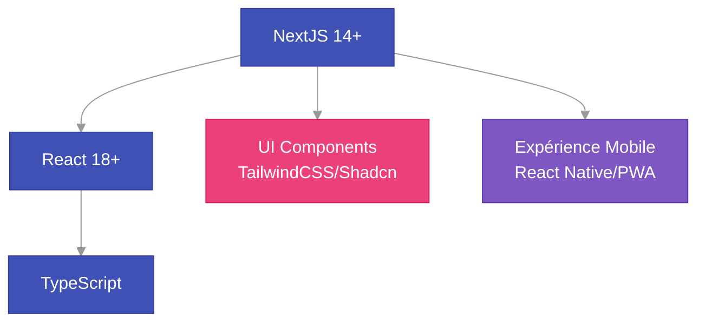

> **Stack frontend simplifiée montrant les relations entre technologies clés**

### **Composants UI Spécifiques aux Modules**

#### Module Planification
- Tableaux de bord exécutifs avec KPIs
- Visualisations avancées pour analyse de parc
- Interfaces de priorisation de projets
- Vues calendaires multi-projets

#### Module Conception
- Éditeur collaboratif temps réel
- Visionneuses de plans 2D/3D
- Interface d'annotation et de commentaires
- Gestionnaire de PFT et fiches locaux

#### Module Construction
- Rapports de visite mobiles avancés
- Tableaux de bord de progression
- Gestionnaire de demandes de changement
- Interface de workflow approbation

#### Module Maintenance
- Tableaux de bord prédictifs
- Interfaces de planification maintenance
- Scanners d'inspection mobile
- Visualisation de données IoT

## 🔧 **STACK BACKEND**

### **Technologies Principales**

| Technologie | Version | Justification |
|-------------|---------|---------------|
| **NestJS** | Latest | Framework Node.js structuré avec architecture hexagonale pour services complexes |
| **FastAPI** | Latest | Framework Python haute performance pour microservices IA et API critiques |
| **TypeScript** | 5.0+ | Typage fort pour backend robuste et maintenable |
| **Python** | 3.11+ | Langage privilégié pour services IA et traitement de données |
| **PostgreSQL** | 15+ | Base de données relationnelle performante et fiable |
| **MongoDB** | 6.0+ | Stockage documents pour flexibilité des schémas |
| **Redis** | 7.0+ | Cache hautes performances et files d'attente |
| **Kafka** | 3.0+ | Bus d'événements pour architecture événementielle |
| **KeyCloak** | Latest | Gestion avancée d'authentification et autorisation |
| **Azure OpenAI** | Latest | Services IA avec hébergement canadien (souveraineté) |
| **Pinecone** | Latest | Base de données vectorielle pour RAG et recherche sémantique |

### **Architecture Microservices**

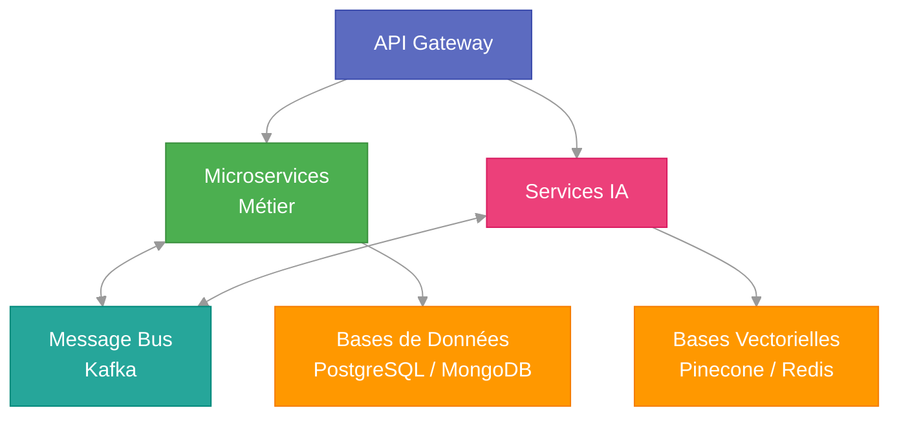

> **Architecture microservices simplifiée: séparation services métier et IA, communication via bus d'événements**

### **Microservices Détaillés**

#### Service Planification (NestJS)
- API de gestion de parc immobilier
- Moteur d'analyse et priorisation
- Workflows de budgétisation
- Générateur de plans directeurs

#### Service Conception (NestJS)
- API de gestion documentaire
- Moteur de collaboration temps réel
- Workflows PFT et fiches techniques
- Intégration BIM légère

#### Service Construction (NestJS)
- API de gestion de chantier
- Moteur de workflows d'approbation
- Générateur de rapports dynamiques
- Système de notifications intelligentes

#### Service Maintenance (NestJS)
- API de gestion d'actifs
- Moteur d'analyse prédictive
- Workflows d'inspection
- Intégration IoT/capteurs

#### Service IA (FastAPI)
- RAG (Retrieval Augmented Generation)
- Traitement du langage naturel français québécois
- Vision par ordinateur pour inspection
- Prédiction et analyse de données
- APIs haute performance pour inférences IA

#### Service Performance (FastAPI)
- API critiques nécessitant faible latence
- Streaming de données IoT/capteurs
- Agrégation métriques temps réel
- Traitement asyncrone haute performance

### **Stratégie d'utilisation NestJS vs FastAPI**

L'architecture hybride combinant NestJS et FastAPI offre le meilleur des deux mondes:

| **Framework** | **Forces** | **Cas d'usage** |
|---------------|------------|-----------------|
| **NestJS** | • Architecture hexagonale structurée<br>• Écosystème TypeScript riche<br>• Injection de dépendances native<br>• Adapté aux logiques métier complexes | • Services métier (4 modules principaux)<br>• API Gateway<br>• Services avec logique business complexe |
| **FastAPI** | • Performance ultra rapide<br>• Async natif (Uvicorn/Starlette)<br>• Écosystème Python Data Science/IA<br>• Documentation OpenAPI automatique | • Services IA et ML<br>• APIs haute performance<br>• Ingestion données IoT<br>• Services utilisant des librairies Python |

## 🧠 **ARCHITECTURE IA**

L'intelligence artificielle est au cœur de notre plateforme, offrant des capacités prédictives et d'assistance avancées.

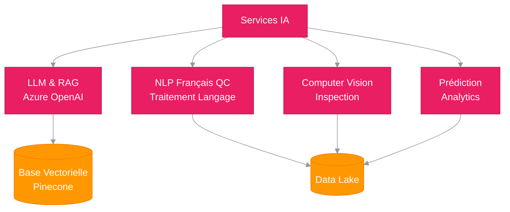

> **Architecture IA simplifiée: LLM, RAG, NLP, Computer Vision et Prédiction pour les 4 modules métier**

### **Fonctionnalités IA par Module**

#### Planification
- Prédiction des besoins futurs
- Optimisation des investissements
- Analyse de risques automatisée
- Recommandations basées sur données historiques

#### Conception
- Génération assistée de PFT
- Vérification automatique de conformité
- Suggestions d'optimisation de plans
- Détection de conflits dans les plans

#### Construction
- Analyse automatique des rapports de visite
- Prédiction des retards potentiels
- Détection visuelle de non-conformités
- Classification automatique des documents

#### Maintenance
- Maintenance prédictive avancée
- Optimisation énergétique en temps réel
- Détection précoce d'anomalies
- Priorisation intelligente des interventions

## 📱 **ARCHITECTURE MOBILE**

Notre solution mobile est conçue pour être utilisable en contexte de chantier avec connectivité limitée.

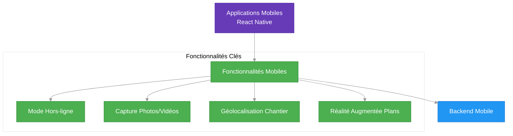

> **Architecture mobile simplifiée: React Native avec mode hors-ligne robuste pour utilisation sur chantiers**

## 🔐 **SÉCURITÉ ET CONFORMITÉ LOI 25**

**Avantage concurrentiel majeur : Conformité native Loi 25 vs impossibilité pour concurrents US**

### **📋 Exigences Conformité Loi 25 - Analyse Détaillée**

La Loi 25 sur la protection des renseignements personnels au Québec impose des contraintes strictes qui représentent notre **avantage concurrentiel défendable** contre Procore, Autodesk et autres solutions américaines.

#### **🌍 Résidence des Données (Article 17)**
```yaml
Exigence Légale:
  - Données personnelles stockées exclusivement au Canada
  - Processus de données sur territoire canadien uniquement  
  - Interdiction transfert vers pays sans protection équivalente
  - Exceptions limitées avec autorisation explicite

Notre Implémentation:
  Phase 1: Supabase région Canada + Vercel Edge Canada
  Phase 2: OVHcloud Canada exclusivement
  Phase 3: Multi-cloud Canada uniquement (OVH + AWS Canada)
  
Concurrents US:
  ❌ Procore: Données US, impossible conformité
  ❌ Autodesk: Infrastructure globale, non conforme
  ❌ Oracle/SAP: Solutions européennes non-conformes Loi 25
```

#### **🔐 Chiffrement et Protection (Articles 8-9)**
```yaml
Exigences:
  - Chiffrement données sensibles en transit et repos
  - Mesures de sécurité appropriées selon contexte
  - Pseudonymisation quand possible
  - Minimisation collecte données

Notre Implémentation:
  Chiffrement Transit: TLS 1.3 forcé, HSTS, certificate pinning
  Chiffrement Repos: AES-256 base données, chiffrement field-level données critiques
  Authentification: MFA obligatoire, RBAC granulaire, SSO enterprise
  Backup: Chiffrés et stockés Canada uniquement
  
Mesures Techniques:
  - Vault pour gestion secrets (HashiCorp Vault)
  - Zero-trust network architecture
  - End-to-end encryption documents sensibles
  - Database encryption at-rest + field-level sensitive data
```

#### **📝 Consentement et Droits Utilisateurs (Articles 12-16)**
```yaml
Droits Garantis:
  - Droit accès données personnelles
  - Droit rectification données inexactes
  - Droit suppression ("droit à l'oubli")
  - Droit portabilité données
  - Droit opposition traitement

Notre Implémentation Technique:
  Self-Service Portal:
    - Export données personnelles (JSON/CSV)
    - Modification profil utilisateur
    - Demande suppression compte
    - Historique consentements
    
  API Techniques:
    - GET /api/user/data-export
    - DELETE /api/user/delete-account
    - PUT /api/user/consent-preferences
    - Audit log complet toutes actions
```

#### **🚨 Notification Incidents (Article 20)**
```yaml
Obligations Légales:
  - Notification CAI sous 72h si risque préjudice
  - Notification utilisateurs si risque sérieux
  - Documentation complète incident
  - Mesures correctives mises en place

Notre Système de Réponse:
  Détection Automatique:
    - SIEM avec règles custom Loi 25
    - Monitoring accès données sensibles
    - Détection patterns suspects
    - Alertes temps réel équipe sécurité
    
  Procédure Incident:
    1. Détection automatique + alerte équipe (0-1h)
    2. Évaluation impact et classification (1-6h) 
    3. Notification CAI si requis (24-72h)
    4. Communication utilisateurs si applicable
    5. Rapport post-incident et améliorations
```

### **🛡️ Architecture Sécurité par Phase**

#### **Phase 1 (MVP) - Sécurité Essentielle**
```yaml
Authentification:
  - Supabase Auth (conforme SOC 2)
  - MFA via TOTP/SMS
  - Sessions sécurisées JWT
  - Password policies strictes

Hébergement:
  - Vercel Edge région Canada  
  - Supabase région Canada Central
  - CDN Cloudflare avec réplication Canada

Monitoring:
  - Logs Supabase centralisés
  - Alertes basic via email/Slack
  - Backup quotidien chiffré
```

#### **Phase 2 (Expansion) - Sécurité Renforcée**
```yaml
Infrastructure:
  - OVHcloud Canada exclusivement
  - WAF avancé + DDoS protection
  - VPN site-to-site pour intégrations gouvernementales
  - Certificate management automatisé

Authentification Enterprise:
  - SAML SSO integration
  - Directory services integration (LDAP)
  - Advanced MFA (hardware tokens)
  - Privileged access management (PAM)

Monitoring & Compliance:
  - SIEM custom (ELK Stack)
  - Vulnerability scanning automatisé
  - Penetration testing trimestriel
  - Audit logs immutables
```

#### **Phase 3 (Platform) - Sécurité Enterprise**
```yaml
Compliance Frameworks:
  - SOC 2 Type II certification
  - ISO 27001 préparation
  - Audit Loi 25 annuel externe
  - PIPEDA compliance (federal)

Advanced Security:
  - Zero-trust architecture complète
  - Micro-segmentation réseau
  - Runtime application security (RASP)
  - Behavioral analytics utilisateurs
  - Threat intelligence integration
```

### **💼 Avantage Concurrentiel Sécurité**

| **Critère Loi 25** | **A3E** | **Procore** | **Autodesk** | **Impact Business** |
|-------------------|---------|-------------|--------------|-------------------|
| Résidence données Canada | ✅ Native | ❌ Impossible | ❌ Impossible | **Deal breaker** |
| Support French QC | ✅ Native | ❌ Anglais seulement | ❌ Anglais/traduction | **Adoption critique** |
| Processus conformité | ✅ By-design | ❌ Adaptation coûteuse | ❌ Refonte architecture | **Time-to-market** |
| Coût mise en conformité | 0$ | >500K$ | >1M$ | **ROI supérieur** |
| Délai conformité | Immédiat | 18-24 mois | 24+ mois | **Avantage timing** |

### **📊 Plan de Conformité Continue**

```yaml
Audits & Validations:
  Mensuel: Automated compliance scanning
  Trimestriel: Security penetration testing  
  Semestriel: Loi 25 compliance review externe
  Annuel: Full security audit + certification

Documentation Maintenue:
  - Registre traitements données (RGPD-style)
  - Procédures réponse incidents
  - Matrice risques mise à jour
  - Formation équipe conformité
  
KPIs Conformité:
  - 0 incident sécurité majeur/an
  - <72h notification incidents si requis
  - 100% données stockées Canada
  - 99.9% disponibilité services critiques
```

## 🚀 **INFRASTRUCTURE ET DÉPLOIEMENT**

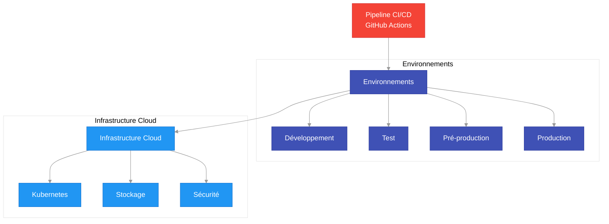

> **Infrastructure simplifiée: pipeline CI/CD, environnements de déploiement et infrastructure cloud basée sur Kubernetes**

## 📊 **IMPLÉMENTATION PAR MODULE**

### **1. Module Planification**

Ce module permet la gestion stratégique des parcs immobiliers et la planification des projets de construction.

#### Stack Technique Spécifique
- **Frontend**: Dashboards interactifs avec graphiques avancés (recharts, d3.js)
- **Backend**: Moteur d'analyse prédictive et API de gestion de planification
- **Base de données**: Modèle relationnel pour hiérarchie des actifs et projets
- **IA**: Modèles de priorisation et d'optimisation de ressources

#### Fonctionnalités Techniques
- Tableaux de bord personnalisés par type d'utilisateur
- Moteur de règles pour priorisation projets
- Analyse multi-critères pour décisions
- Intégration avec systèmes financiers externes
- Simulations budgétaires multi-scénarios

### **2. Module Conception**

Ce module gère la phase de conception des projets, incluant la collaboration avec architectes et ingénieurs.

#### Stack Technique Spécifique
- **Frontend**: Éditeurs collaboratifs temps réel, visualisation 2D/3D
- **Backend**: API de gestion documentaire et de workflows
- **Base de données**: MongoDB pour documents et versions, PostgreSQL pour relations
- **IA**: Assistance conception et vérification conformité

#### Fonctionnalités Techniques
- Édition collaborative temps réel (WebSockets/CRDTs)
- Visionneuse de plans avec annotations
- Gestion versions sophistiquée
- Workflows approbation paramétrables
- Intégration légère BIM/IFC

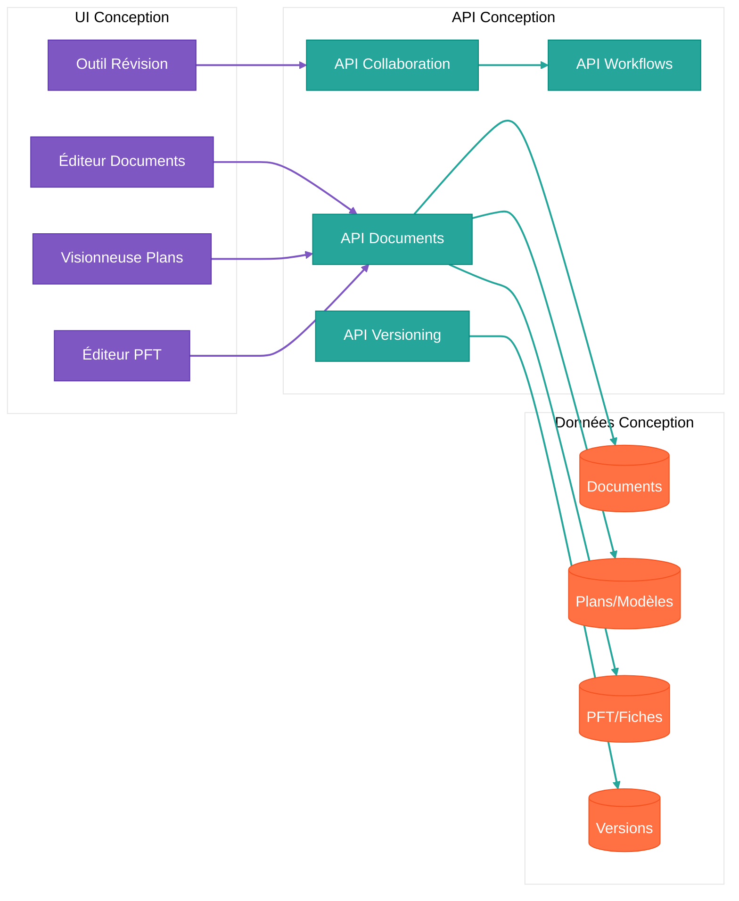

### **3. Module Construction**

Ce module gère l'exécution des projets de construction sur le terrain.

#### Stack Technique Spécifique
- **Frontend**: Interface mobile robuste, formulaires dynamiques
- **Backend**: API de gestion de chantier, moteur de workflows
- **Base de données**: Structure relationnelle pour suivi, MongoDB pour documents
- **IA**: Analyse rapports visite, détection problèmes

#### Fonctionnalités Techniques
- App mobile avec fonctionnement hors-ligne
- Capture photos avec annotations
- Formulaires dynamiques adaptatifs
- Workflows approbation avec signatures
- Notifications contextuelles intelligentes

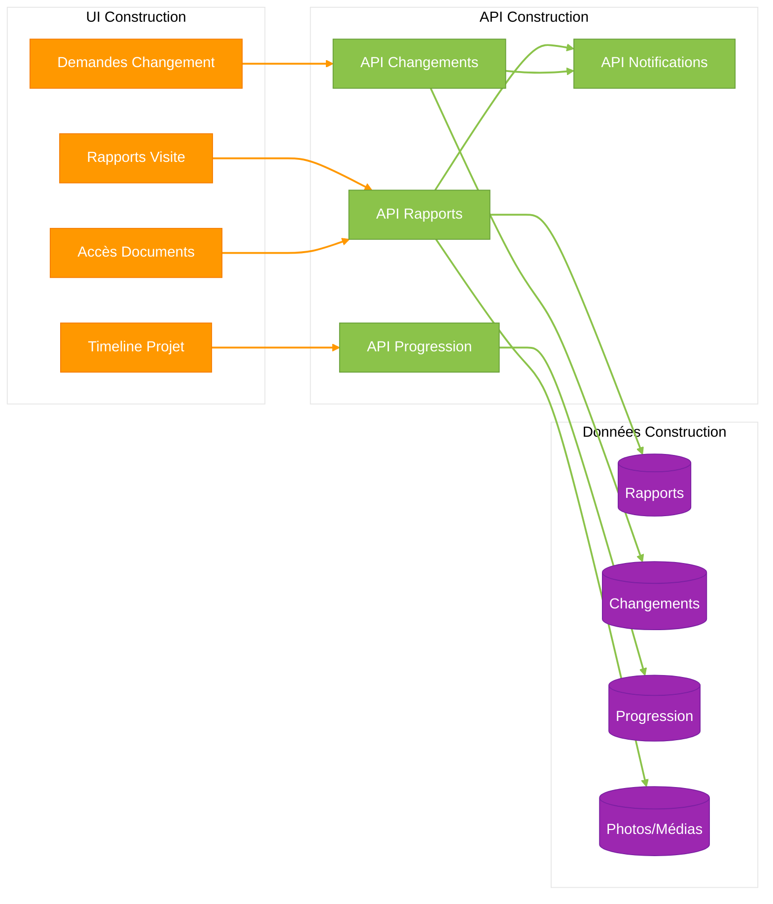

### **4. Module Maintenance**

Ce module gère le maintien des actifs après la construction.

#### Stack Technique Spécifique
- **Frontend**: Tableaux de bord prédictifs, interfaces inspection
- **Backend**: API de gestion d'actifs, moteur analytique
- **Base de données**: Modèle temporel pour données capteurs, graphe pour relations
- **IA**: Maintenance prédictive, détection anomalies

#### Fonctionnalités Techniques
- Dashboard prédictif maintenance
- Intégration IoT et capteurs
- Planification inspections intelligente
- Historique complet bâtiment
- Optimisation énergétique temps réel

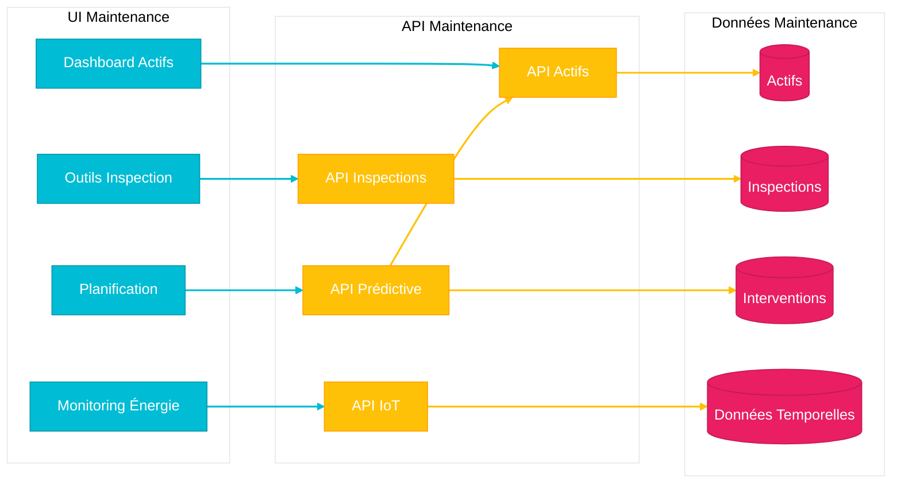

## 🔄 **INTÉGRATIONS EXTERNES**

| **Catégorie** | **Systèmes** | **Description** |
|---------------|--------------|-----------------|
| **Gouvernementaux** | • SEAO (Appels d'offres)<br>• Systèmes Financiers Provinciaux<br>• Hydro-Québec | Intégrations avec les systèmes gouvernementaux pour automatiser les appels d'offres, la gestion financière et le monitoring énergétique |
| **Techniques** | • Outils BIM (Revit/AutoCAD)<br>• Logiciels CAD<br>• Systèmes GIS | Intégrations avec les outils techniques pour faciliter l'échange de modèles et de plans entre les différents acteurs |
| **Terrain** | • Capteurs IoT<br>• Drones d'inspection<br>• Applications terrain | Collecte de données sur le terrain pour alimenter les modules de construction et de maintenance |

> **Intégrations clés avec les systèmes gouvernementaux, techniques et de terrain**

## 📈 **ÉVOLUTION DE LA STACK TECHNIQUE**

**Architecture évolutive alignée avec la croissance business :**
- **Phase 1** : 10 clients, 1K$ MRR → Stack simple et rapide à déployer
- **Phase 2** : 50 clients, 9K$ MRR → Architecture scalable pour croissance
- **Phase 3** : 200+ clients, 40K$ MRR → Plateforme enterprise avec IA avancée

### **Phase 1: MVP (Mois 1-9) - Bootstrap Technique**

```yaml
Objectif Business: 10 clients payants, 1,000$ MRR
Équipe: 3 fondateurs (gestionnaire, architecte, dev full-stack)
Budget Tech: <500$/mois

Frontend:
  - NextJS 14 + React 18 (Vercel)
  - TailwindCSS + Shadcn UI
  - PWA pour mobile (mode hors-ligne basique)
  - Zustand + React Query (state management)

Backend:
  - NextJS API Routes (monolithe simple)
  - Supabase (PostgreSQL + Auth + Storage)
  - Hosting: Vercel (région Canada)

IA/ML:
  - Azure OpenAI API (GPT-4)
  - Embeddings simples pour search
  - Pas de RAG custom encore

Infrastructure:
  - Vercel Pro (~50$/mois)
  - Supabase Pro (~25$/mois)
  - Total: <100$/mois
  
Capacité: 10 organisations, 100 utilisateurs max
Time-to-market: 3-6 mois
```

### **Phase 2: Expansion (Mois 10-18) - Scaling Architecture**

```yaml
Objectif Business: 50 clients payants, 9,000$ MRR
Équipe: 5 personnes (+ dev junior + customer success)
Budget Tech: 500-1,500$/mois

Frontend:
  - Même stack (NextJS) mais optimisée
  - React Native app (iOS/Android natives)
  - PWA avancée avec sync offline robuste
  - Micro-frontends pour modules complexes

Backend:
  - Migration vers NestJS microservices
  - PostgreSQL cluster (OVHcloud Canada)
  - Redis pour cache et sessions
  - API Gateway + service mesh

IA/ML:
  - RAG custom avec vector database
  - Azure OpenAI + modèles fine-tunés
  - Analytics prédictifs construction QC
  - Assistant IA spécialisé par module

Infrastructure:
  - OVHcloud Canada (conformité Loi 25)
  - Kubernetes cluster managé
  - CI/CD avec GitHub Actions
  - Monitoring avec Datadog
  - Total: 500-1,500$/mois
  
Capacité: 50 organisations, 500+ utilisateurs
Performance: <2s load time, 99.9% uptime
```

### **Phase 3: Plateforme Mature (Mois 19-30) - Enterprise Platform**

```yaml
Objectif Business: 200+ clients, 40,000$ MRR
Équipe: 10+ personnes (équipe dev complète)
Budget Tech: 2,000-5,000$/mois

Frontend:
  - Micro-frontends architecture
  - React Native + Flutter (multi-platform)
  - WebAssembly pour performance critique
  - Edge computing pour latence réduite

Backend:
  - Architecture distribuée full microservices
  - Event streaming (Apache Kafka)
  - CQRS + Event Sourcing pour audit
  - API publique pour partenaires

IA/ML:
  - Modèles propriétaires spécialisés construction QC
  - Computer vision pour analyse photos chantier
  - Prédiction maintenance préventive
  - Digital twins des infrastructures
  - LLM fine-tuné sur réglementations QC

Infrastructure:
  - Multi-cloud (OVH + AWS Canada)
  - Auto-scaling intelligent
  - Edge locations au Québec
  - SOC 2 Type II compliance
  - Total: 2,000-5,000$/mois
  
Capacité: 1,000+ organisations, 10,000+ utilisateurs
Performance: <1s load time, 99.99% uptime
```

### **Migration Strategy Entre Phases**

**Phase 1 → 2:**
- Migration progressive base de données Supabase → PostgreSQL cluster
- Extraction microservices du monolithe (un module à la fois)
- Maintien backward compatibility APIs
- Zero-downtime deployment

**Phase 2 → 3:**
- Adoption progressive event-driven architecture
- Migration vers infrastructure multi-cloud
- Implementation CQRS sur modules critiques
- API versioning pour clients existants

## 🛡️ **GESTION DE LA DETTE TECHNIQUE**

- Revues de code systématiques
- Tests automatisés (>80% couverture)
- Audits de performance trimestriels
- Refactoring planifié (20% du temps)
- Documentation technique continue

---

## 💎 **CONCLUSION**

Cette stack technique est conçue pour allier robustesse, performance et agilité de développement. Elle permet de livrer rapidement un produit minimum viable tout en posant les fondations pour une plateforme sophistiquée capable de révolutionner la gestion de construction au Québec.

Les choix technologiques ont été faits pour:
1. Minimiser le coût initial tout en permettant une évolution progressive
2. Garantir la conformité aux exigences réglementaires québécoises
3. Maximiser l'expérience utilisateur sur tous les appareils
4. Tirer parti des dernières avancées en IA et analyse prédictive
5. Assurer une plateforme évolutive pour les 10 prochaines années

Pour les détails d'implémentation spécifiques, référez-vous aux documents complémentaires suivants qui doivent être créés:

- **Guide du Développeur** - Configuration, conventions, workflow
- **API Reference** - Documentation complète des API
- **Infrastructure as Code** - Templates Terraform/Pulumi
- **Guide de Déploiement** - Procédures CI/CD détaillées
- **Plan de Tests** - Stratégie de tests et assurance qualité

---

## 💡 **ANNEXE: GLOSSAIRE DES TECHNOLOGIES**

- **NextJS**: Framework React pour le rendu côté serveur et la génération de sites statiques.
- **React**: Bibliothèque JavaScript pour construire des interfaces utilisateur.
- **TypeScript**: Superset de JavaScript ajoutant le typage statique.
- **TailwindCSS**: Framework CSS utilitaire pour un design rapide et réactif.
- **Shadcn UI**: Bibliothèque de composants UI accessibles et personnalisables.
- **React Native**: Framework pour construire des applications mobiles natives avec React.
- **PWA**: Applications web progressives offrant une expérience similaire à celle des applications natives.
- **NestJS**: Framework Node.js pour construire des applications serveur efficaces et évolutives.
- **FastAPI**: Framework Python pour construire des APIs rapides et performantes.
- **PostgreSQL**: Système de gestion de base de données relationnelle open-source.
- **MongoDB**: Base de données NoSQL orientée documents.
- **Redis**: Base de données en mémoire, clé-valeur, utilisée comme cache et broker de messages.
- **Kafka**: Système de gestion de flux de données en temps réel.
- **KeyCloak**: Solution open-source de gestion des identités et des accès.
- **Azure OpenAI**: Service d'OpenAI hébergé sur Azure, offrant des modèles de langage avancés.
- **Pinecone**: Base de données vectorielle pour la recherche sémantique et le RAG.
- **Vercel**: Plateforme de déploiement pour les applications front-end, optimisée pour Next.js.
- **Docker**: Outil de conteneurisation pour automatiser le déploiement d'applications.
- **Kubernetes**: Système d'orchestration de conteneurs pour automatiser le déploiement, la mise à l'échelle et la gestion des applications conteneurisées.
- **Terraform**: Outil d'infrastructure as code pour construire, changer et versionner l'infrastructure de manière sécurisée et efficace.
- **Prometheus**: Système de surveillance et d'alerte open-source, conçu pour la fiabilité et la flexibilité.
- **Grafana**: Outil d'analyse et de surveillance, permettant de visualiser les métriques à travers des tableaux de bord interactifs.
- **OpenTelemetry**: Ensemble d'API, SDK et outils pour instrumenter, générer, collecter et exporter des données de télémétrie.
- **Azure DevOps**: Ensemble de services pour le développement logiciel collaboratif, incluant des pipelines CI/CD, la gestion de repos Git, et le suivi des tâches.

---

## 📚 **RESSOURCES COMPLÉMENTAIRES**

1. **Documentation Officielle Next.js**: [nextjs.org/docs](https://nextjs.org/docs)
2. **Documentation Officielle React**: [reactjs.org/docs](https://reactjs.org/docs)
3. **Documentation TypeScript**: [typescriptlang.org/docs](https://www.typescriptlang.org/docs/)
4. **Documentation TailwindCSS**: [tailwindcss.com/docs](https://tailwindcss.com/docs)
5. **Documentation Shadcn UI**: [shadcn.dev/docs](https://shadcn.dev/docs)
6. **Documentation React Native**: [reactnative.dev/docs](https://reactnative.dev/docs)
7. **Documentation Vercel**: [vercel.com/docs](https://vercel.com/docs)
8. **Documentation NestJS**: [docs.nestjs.com](https://docs.nestjs.com/)
9. **Documentation FastAPI**: [fastapi.tiangolo.com](https://fastapi.tiangolo.com/)
10. **Documentation PostgreSQL**: [postgresql.org/docs](https://www.postgresql.org/docs/)
11. **Documentation MongoDB**: [mongodb.com/docs](https://www.mongodb.com/docs/)
12. **Documentation Redis**: [redis.io/docs](https://redis.io/docs/)
13. **Documentation Kafka**: [kafka.apache.org/documentation/](https://kafka.apache.org/documentation/)
14. **Documentation KeyCloak**: [www.keycloak.org/documentation](https://www.keycloak.org/documentation)
15. **Documentation Azure OpenAI**: [learn.microsoft.com/en-us/azure/cognitive-services/openai/](https://learn.microsoft.com/en-us/azure/cognitive-services/openai/)
16. **Documentation Pinecone**: [docs.pinecone.io](https://docs.pinecone.io/)
17. **Documentation Docker**: [docs.docker.com](https://docs.docker.com/)
18. **Documentation Kubernetes**: [kubernetes.io/docs](https://kubernetes.io/docs/)
19. **Documentation Terraform**: [registry.terraform.io/providers/hashicorp/azurerm/latest/docs](https://registry.terraform.io/providers/hashicorp/azurerm/latest/docs)
20. **Documentation Prometheus**: [prometheus.io/docs](https://prometheus.io/docs/)
21. **Documentation Grafana**: [grafana.com/docs](https://grafana.com/docs/)
22. **Documentation OpenTelemetry**: [opentelemetry.io/docs](https://opentelemetry.io/docs/)
23. **Documentation Azure DevOps**: [learn.microsoft.com/en-us/azure/devops/?view=azure-devops](https://learn.microsoft.com/en-us/azure/devops/?view=azure-devops)

---

*Document technique vivant - À réviser trimestriellement*  
*Dernière mise à jour : Août 2025*  
*Prochain audit d'architecture : Octobre 2025*
