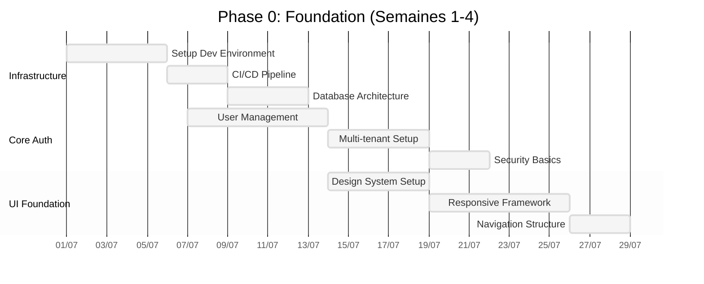
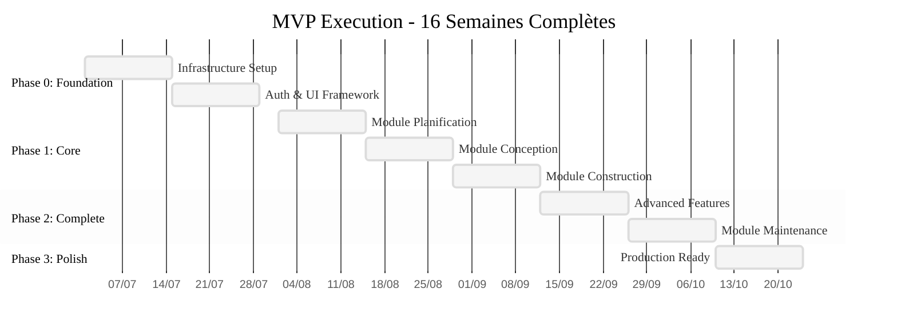
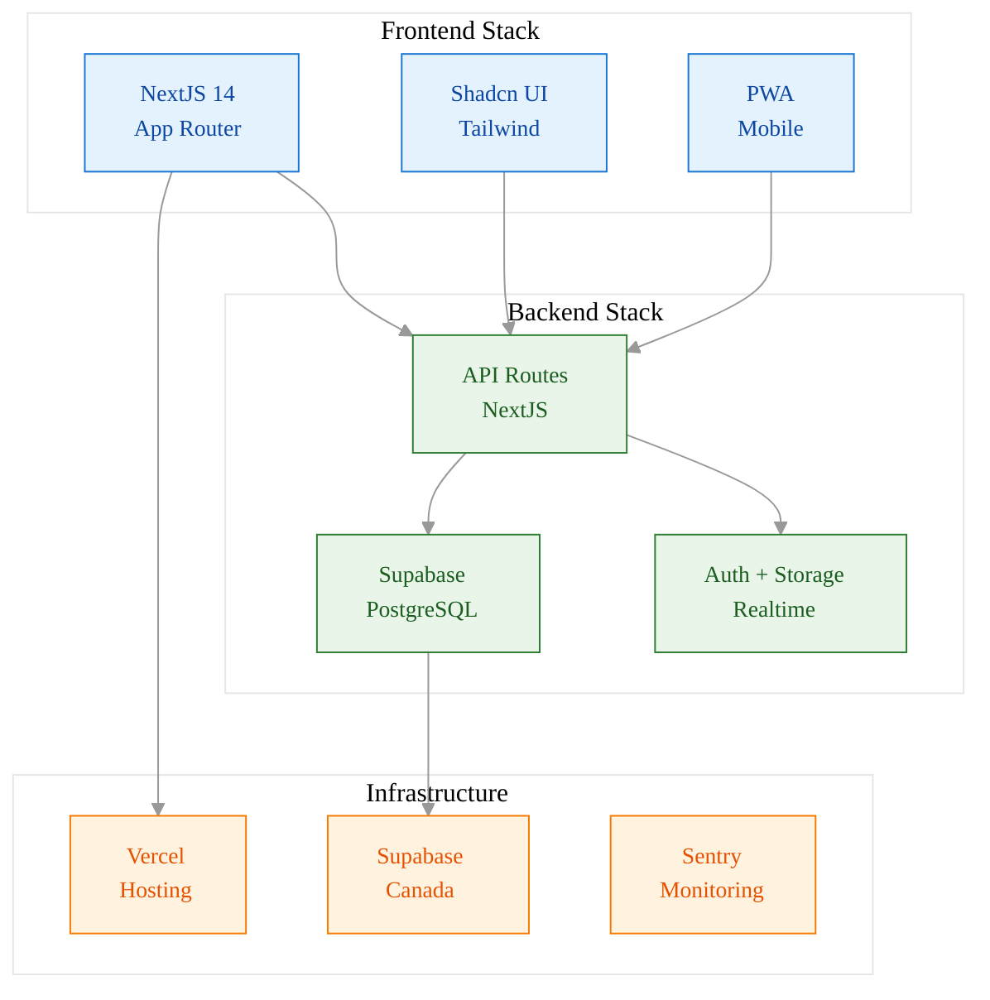
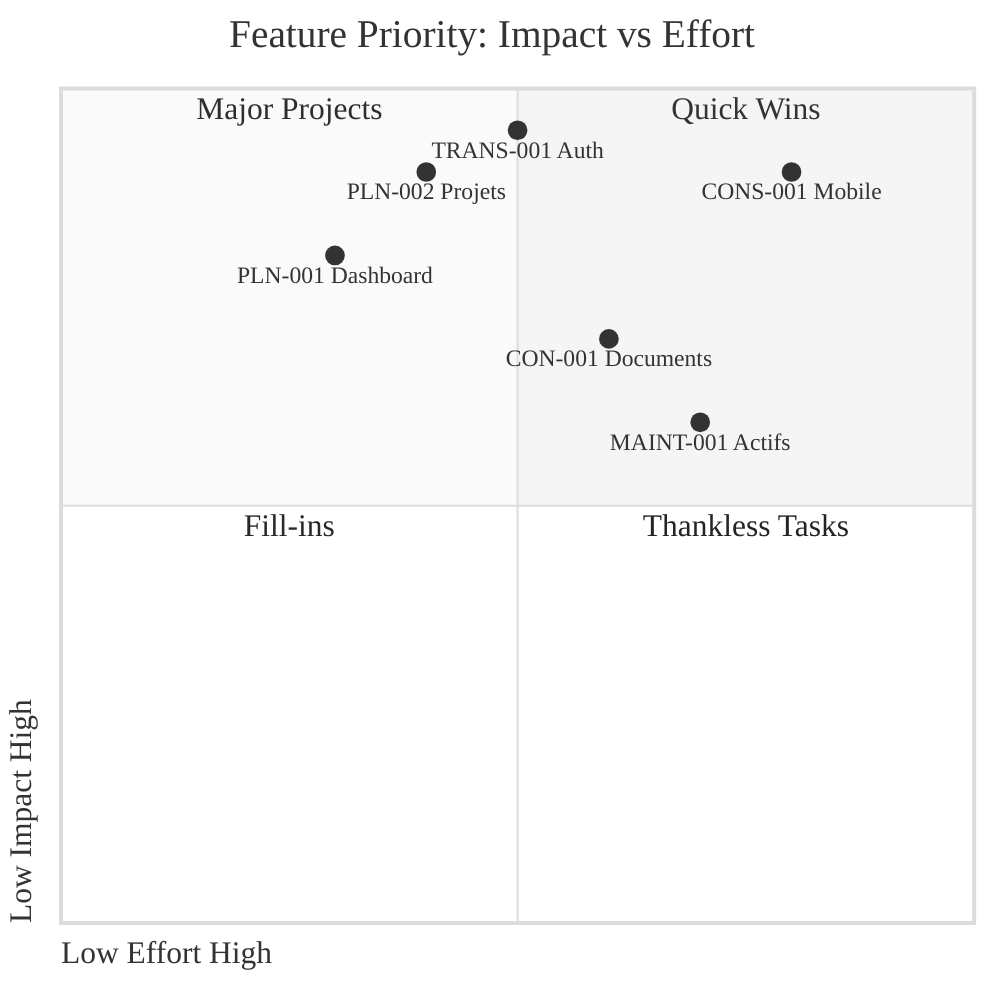
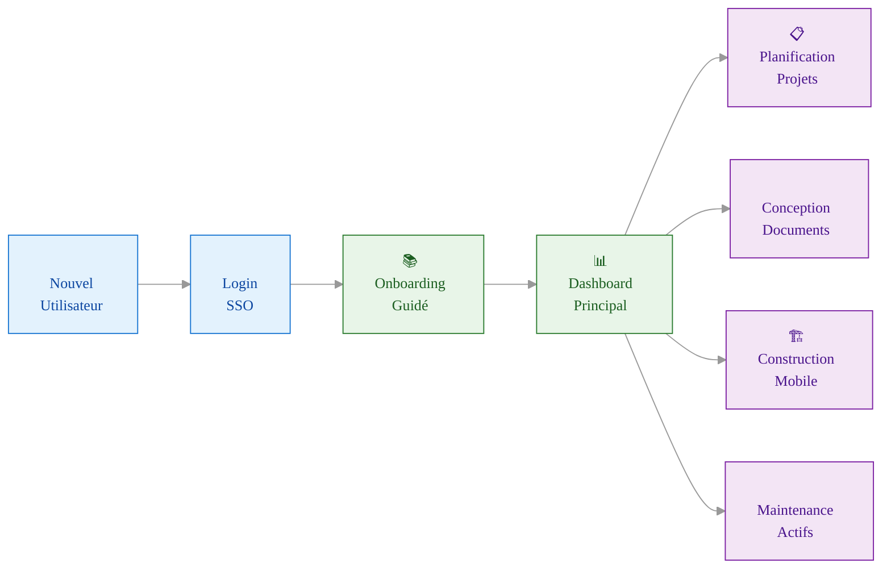

# 🚀 MVP EXECUTION PLAN - A3E Beta
## Plan d'Exécution Technique pour Livraison Rapide

> **Document d'exécution** - Roadmap technique concrète basée sur validation  
> **Date**: Juillet 2024  
> **Duration**: 16 semaines (4 mois de développement dans Phase 1: Mois 3-9)  
> **Budget estimé**: 30,000-50,000$

📚 **[← Retour PRD Master](./PRD_MASTER.md)** | **[→ Validation Plan](../1_business_foundation/VALIDATION_PLAN.md)** | **[→ Stack Technique](../4_technical_architecture/STACK_TECHNIQUE.md)**

---

## 🎯 **OBJECTIFS MVP**

### **Mission Statement**
Livrer un produit minimum viable en 16 semaines qui valide notre hypothèse value proposition auprès de 5-10 design partners avec un taux de satisfaction >80% et un taux de rétention >90%.

### **Definition of Done MVP**
```yaml
Critères Success MVP:
  ✅ 4 modules fonctionnels (planification, conception, construction, maintenance)
  ✅ Interface mobile-responsive complète
  ✅ 5-10 design partners utilisent activement
  ✅ Conformité Loi 25 certifiée
  ✅ Performance <3s load time
  ✅ Uptime >99% sur 30 jours
  ✅ Support français <4h response time
```

### **MVP Scope Boundaries**
**IN SCOPE**:
- Features core 4 modules identifiées dans [PRD_PHASE1_MVP.md](./PRD_PHASE1_MVP.md#features-requirements)
- Mobile-first responsive design
- Authentification multi-organisation
- Conformité Loi 25 basique

**OUT OF SCOPE (Phase 2)**:
- IA conversationnelle avancée
- Intégrations API gouvernementales
- Mobile app native
- Analytics prédictifs
- SSO entreprise

---

## 📋 **FEATURES MVP - PRIORISATION MoSCoW**

### **MUST HAVE - Core Value Proposition** {#must-have}

Basé sur [PRD_PHASE1_MVP Features](./PRD_PHASE1_MVP.md#features-requirements-moscow-prioritization):

#### **🏗️ Module 1: Planification (8 sprints)**
```yaml
PLN-001: Dashboard Parc Immobilier [5 points]
  Description: Vue d'ensemble actifs avec statuts, âges, état
  Sprint: 2-3
  Acceptance Criteria:
    - Liste/carte tous bâtiments organisation
    - Filtres: type, âge, état, arrondissement
    - Indicateurs santé basiques (vert/jaune/rouge)
    - Export Excel/PDF

PLN-002: Liste Projets avec Statuts [8 points]
  Description: Suivi projets planifiés/en cours avec priorités
  Sprint: 3-4
  Acceptance Criteria:
    - CRUD projets (créer, lire, modifier, supprimer)
    - Statuts: planifié, approuvé, en cours, complété
    - Priorité manuelle (1-5 étoiles)
    - Budget estimé vs réel
    - Timeline basique

PLN-003: Budgets et Allocations [13 points]
  Description: Gestion budgets annuels par catégorie/projet
  Sprint: 5-6
  Acceptance Criteria:
    - Budgets par catégorie (maintenance, construction, urgence)
    - Allocation budgets aux projets
    - Vue d'ensemble dépenses YTD
    - Alertes dépassement budget
```

#### **📐 Module 2: Conception (6 sprints)**
```yaml
CON-001: Gestion Documentaire Basique [13 points]
  Description: Upload, organisation, partage documents projets
  Sprint: 4-5
  Acceptance Criteria:
    - Upload multi-formats (PDF, DWG, DOC, images)
    - Structure dossiers par projet/phase
    - Permissions lecture/écriture par rôle
    - Versioning automatique
    - Recherche par nom/tags

CON-002: Commentaires et Annotations [21 points]
  Description: Système commentaires/révisions sur documents
  Sprint: 6-8
  Acceptance Criteria:
    - Commentaires texte sur documents
    - Annotations visuelles sur images/PDF
    - Mentions utilisateurs (@nom)
    - Résolution/fermeture commentaires
    - Notifications changements
```

#### **🏗️ Module 3: Construction (6 sprints)**
```yaml
CONS-001: Rapports Visite Mobiles [21 points]
  Description: Application mobile rapports inspection chantier
  Sprint: 7-9
  Acceptance Criteria:
    - Interface mobile responsive (PWA)
    - Formulaires inspection personnalisables
    - Upload photos avec annotations simples
    - Mode hors-ligne basique (sauvegarde locale)
    - Géolocalisation automatique
    - Export PDF automatique

CONS-002: Gestion Photos et Médias [13 points]
  Description: Capture, annotation, organisation photos chantier
  Sprint: 9-10
  Acceptance Criteria:
    - Capture photos directe depuis app
    - Annotations texte/flèches/formes
    - Organisation par date/location/type
    - Compression automatique upload
    - Galerie avec recherche/filtres
```

#### **🔧 Module 4: Maintenance (4 sprints)**
```yaml
MAINT-001: Inventaire Actifs Basique [21 points]
  Description: Base de données actifs avec informations essentielles
  Sprint: 10-11
  Acceptance Criteria:
    - CRUD actifs (équipements, systèmes, espaces)
    - Informations: localisation, âge, garantie, fournisseur
    - Photos et documents associés
    - Recherche/filtres multiples
    - Import/export données

MAINT-002: Planification Inspections Manuelles [34 points]
  Description: Calendrier inspections préventives basique
  Sprint: 12-13
  Acceptance Criteria:
    - Création tâches inspection avec fréquence
    - Assignation techniciens/équipes
    - Calendrier visuel (hebdo/mensuel)
    - Notifications échéances
    - Rapports inspection simples
```

### **SHOULD HAVE - Enhanced Experience** {#should-have}

#### **⚙️ Fonctionnalités Transversales**
```yaml
TRANS-001: Auth et Sécurité [34 points]
  Sprint: 1-2
  Priority: Fondation technique

TRANS-002: Interface Responsive [55 points]
  Sprint: 1-16 (continu)
  Priority: Expérience utilisateur

TRANS-003: Support Français [21 points]
  Sprint: 14-15
  Priority: Différenciation marché

TRANS-004: Conformité Loi 25 [89 points]
  Sprint: 15-16
  Priority: Avantage concurrentiel
```

### **COULD HAVE - Nice to Have** {#could-have}
- PLN-004: Rapports avancés
- CON-003: PFT éditables
- CONS-003: Statuts temps réel
- MAINT-003: Historique interventions

### **WON'T HAVE - Phase 2** {#wont-have}
- IA conversationnelle
- Intégrations API natives
- Analytics prédictifs
- Mobile app native

---

## 📅 **TIMELINE 16 SEMAINES - 4 PHASES**

### **Phase 0: Foundation (Semaines 1-4)** {#phase-0}



**Sprint 1 (Semaine 1-2): Infrastructure**
- Setup dev/staging/prod environments
- NextJS 14 + Supabase configuration
- Database schema design + migrations
- CI/CD pipeline (GitHub Actions → Vercel)

**Sprint 2 (Semaine 3-4): Core Auth & UI**
- Authentication system (Supabase Auth)
- Multi-tenant architecture basics
- Design system implementation (Shadcn UI)
- Mobile-responsive framework

**Livrables**:
- Infrastructure opérationnelle 3 environnements
- Authentification multi-organisationnelle
- Design system et navigation responsive

### **Phase 1: Core Modules (Semaines 5-10)** {#phase-1}

**Sprint 3 (Semaine 5-6): Planification Foundation**
- PLN-001: Dashboard parc immobilier
- PLN-002: Liste projets (CRUD basic)
- Database models + API endpoints

**Sprint 4 (Semaine 7-8): Conception Foundation**
- CON-001: Upload documents + storage
- File management + permissions
- Document viewer basic

**Sprint 5 (Semaine 9-10): Construction Mobile**
- CONS-001: Rapports visite PWA
- Mobile interface responsive
- Photo capture + annotations

**Livrables**:
- 3 modules fonctionnels basiques
- Interface mobile complète
- Upload/management documents

### **Phase 2: Features Complete (Semaines 11-14)** {#phase-2}

**Sprint 6 (Semaine 11-12): Advanced Features**
- PLN-003: Budgets et allocations
- CON-002: Commentaires et annotations
- CONS-002: Gestion photos avancée

**Sprint 7 (Semaine 13-14): Maintenance Module**
- MAINT-001: Inventaire actifs
- MAINT-002: Planification inspections
- Integration modules existants

**Livrables**:
- 4 modules complets et intégrés
- Système commentaires/annotations
- Gestion actifs et inspections

### **Phase 3: Polish & Launch (Semaines 15-16)** {#phase-3}

**Sprint 8 (Semaine 15-16): Production Ready**
- TRANS-003: Support français complet
- TRANS-004: Conformité Loi 25 finalisée
- Performance optimization
- User testing + bug fixes
- Documentation utilisateur
- Launch preparation

**Livrables**:
- Produit production-ready
- Conformité Loi 25 certifiée
- Documentation complète
- 5 design partners onboardés

---

## 🛠️ **ARCHITECTURE TECHNIQUE MVP**

### **Timeline Complète 16 Semaines**



### **Architecture Stack MVP**



### **Feature Priority Matrix (MoSCoW)**



### **User Journey MVP**



### **Stack Technique Simplifié**

Basé sur [STACK_TECHNIQUE.md](../4_technical_architecture/STACK_TECHNIQUE.md) mais optimisé pour livraison rapide:

```yaml
Frontend:
  Framework: NextJS 14 (App Router)
  UI Library: Shadcn UI + Tailwind CSS
  State Management: Zustand + React Query
  Mobile: PWA (Progressive Web App)
  
Backend:
  Runtime: NextJS API Routes (monolithe)
  Database: Supabase (PostgreSQL + Auth + Storage)
  File Storage: Supabase Storage
  Real-time: Supabase Realtime
  
Infrastructure:
  Hosting: Vercel (frontend + API)
  Database: Supabase (managed PostgreSQL)
  CDN: Vercel Edge Network
  Monitoring: Vercel Analytics + Sentry
  
Security:
  Authentication: Supabase Auth (JWT)
  Authorization: Row Level Security (RLS)
  Data Encryption: TLS 1.3 + AES-256
  Compliance: Supabase Canada region
```

### **Database Schema MVP**

```sql
-- Core entities basées sur PRD requirements
Tables principales:
  organizations (multi-tenant)
  users (avec rôles)
  buildings (actifs immobiliers)
  projects (projets construction)
  documents (gestion documentaire)
  inspections (rapports visite)
  assets (équipements maintenance)
  comments (annotations collaborative)
  
Relations:
  - Isolation tenant au niveau Row Level Security
  - Permissions granulaires par module
  - Audit trail pour conformité
```

### **API Design**

```yaml
REST API Structure:
  /api/auth/*          # Authentication
  /api/organizations/* # Multi-tenant management
  /api/planning/*      # Module planification
  /api/design/*        # Module conception
  /api/construction/*  # Module construction
  /api/maintenance/*   # Module maintenance
  /api/files/*         # File management
  /api/comments/*      # Collaborative features
```

---

## 👥 **ÉQUIPE & RESSOURCES**

### **Équipe MVP (3-4 personnes)**

```yaml
Tech Lead / Full-Stack Developer (1.0 FTE):
  - Architecture générale + backend API
  - Integration Supabase + database design
  - Performance + sécurité
  - Salaire: 80-100k$/an (6,700-8,300$/mois)

Frontend Developer (1.0 FTE):
  - React/NextJS + interface responsive
  - Shadcn UI implementation + mobile PWA
  - UX/UI polish + design system
  - Salaire: 70-85k$/an (5,800-7,100$/mois)

Product Manager / QA (0.5 FTE):
  - Coordination design partners
  - User testing + QA
  - Documentation + support
  - Contract: 4,000$/mois

Designer UX/UI (0.25 FTE):
  - Design system + mockups
  - User flows + prototyping
  - Brand identity
  - Contract: 2,000$/mois
```

### **Budget 16 Semaines**

```yaml
Personnel (80%): 40,000$
  Tech Lead: 4 mois × 7,500$ = 30,000$
  Frontend Dev: 4 mois × 6,500$ = 26,000$
  Product Manager: 4 mois × 4,000$ = 16,000$
  Designer: 4 mois × 2,000$ = 8,000$
  Subtotal Personnel: 80,000$ × 50% effort = 40,000$

Infrastructure (10%): 5,000$
  Supabase Pro: 4 mois × 25$ = 100$
  Vercel Pro: 4 mois × 20$ = 80$
  Design tools: 4 mois × 100$ = 400$
  Development tools: 4,500$

Opérations (10%): 5,000$
  Legal/compliance: 2,000$
  Testing/QA tools: 1,000$
  Documentation: 1,000$
  Contingency: 1,000$

TOTAL MVP: 50,000$ (Budget maximum)
```

---

## 📊 **MÉTRIQUES DE SUCCÈS**

### **Technical Metrics**

```yaml
Performance:
  - Page Load Time: <3 secondes
  - Mobile Performance Score: >90 (Lighthouse)
  - API Response Time: <500ms (95th percentile)
  - Uptime: >99.5%

Quality:
  - Test Coverage: >80%
  - Bug Density: <5 bugs/100 LOC
  - Security Scan: 0 critical vulnerabilities
  - Accessibility Score: >95 (WCAG 2.1 AA)
```

### **Business Metrics**

```yaml
Adoption:
  - Design Partners Onboarded: 5-10 (objectif final: 10 clients actifs payants)
  - Weekly Active Users: >80% of onboarded users
  - Feature Adoption: >70% utilisent 3+ modules
  - Support Tickets: <5/semaine

Satisfaction:
  - NPS Score: >40
  - User Satisfaction: >4/5
  - Churn Rate: <10%
  - Time to Value: <7 jours
```

### **Validation Metrics**

```yaml
Product-Market Fit:
  - Willingness to Pay: >70% acceptent pricing
  - Retention Rate: >90% après 30 jours
  - Referral Rate: >20% recommandent
  - Contract Renewals: >80% intent to renew
```

---

## 🚀 **PLAN DE LANCEMENT**

### **Pre-Launch (Semaine 13-14)**
- Internal testing complet
- 5 design partners alpha testing
- Bug fixes prioritaires
- Documentation utilisateur

### **Soft Launch (Semaine 15)**
- 5 design partners production
- Support monitoring 24/7
- Feedback collection systématique
- Performance monitoring

### **Official Launch (Semaine 16)**
- Annonce publique limitée
- Onboarding 5 nouveaux prospects
- Press release associations
- Feedback iteration continue

---

## 🔄 **POST-MVP ROADMAP**

### **Immediate Next Steps (Semaines 17-20)**
1. **Feedback Integration**: Améliorations basées retours design partners
2. **Performance Optimization**: Scaling pour 20+ organisations
3. **Advanced Features**: Features COULD HAVE en fonction priorités clients
4. **Sales Enablement**: Documentation commerciale + pricing finalisé

### **Phase 2 Planning (Mois 5-6)**
Transition vers [PRD_PHASE2_EXPANSION.md](./PRD_PHASE2_EXPANSION.md):
- IA conversationnelle basique
- Intégrations API gouvernementales
- Mobile app native
- Analytics et reporting avancés

---

## ⚠️ **RISQUES & MITIGATION**

### **Risques Techniques**
| Risque | Probabilité | Impact | Mitigation |
|--------|-------------|--------|------------|
| Complexité multi-tenant | Moyenne | Élevé | Architecture simple Supabase RLS, migration progressive vers microservices |
| Performance mobile | Faible | Moyen | PWA + optimisations précoces |
| Intégration documents | Moyenne | Moyen | Supabase Storage + fallback solutions |

### **Risques Business**
| Risque | Probabilité | Impact | Mitigation |
|--------|-------------|--------|------------|
| Design partners désengagés | Faible | Élevé | Contract engagement + valeur immédiate |
| Feedback contradictoire | Moyenne | Moyen | Priorisation claire + roadmap transparent |
| Timeline dépassée | Moyenne | Élevé | Buffer 20% + scope reduction agile |

### **Plan de Contingence**
- **Week 8 Checkpoint**: Si retard >2 semaines → scope reduction
- **Week 12 Checkpoint**: Si bugs critiques → extension 2 semaines
- **Week 14 Checkpoint**: Go/No-Go décision launch

---

**Ce plan d'exécution nous permettra de livrer un MVP fonctionnel en 16 semaines avec des design partners satisfaits et une base solide pour la croissance.**

**Prochaine étape**: Validation de ce plan + confirmation budget/équipe + start Sprint 1.

---

*Document d'exécution - Ajustements selon feedback design partners*  
*Dernière mise à jour : Juillet 2024*  
*Prochaine révision : Checkpoint Week 4*