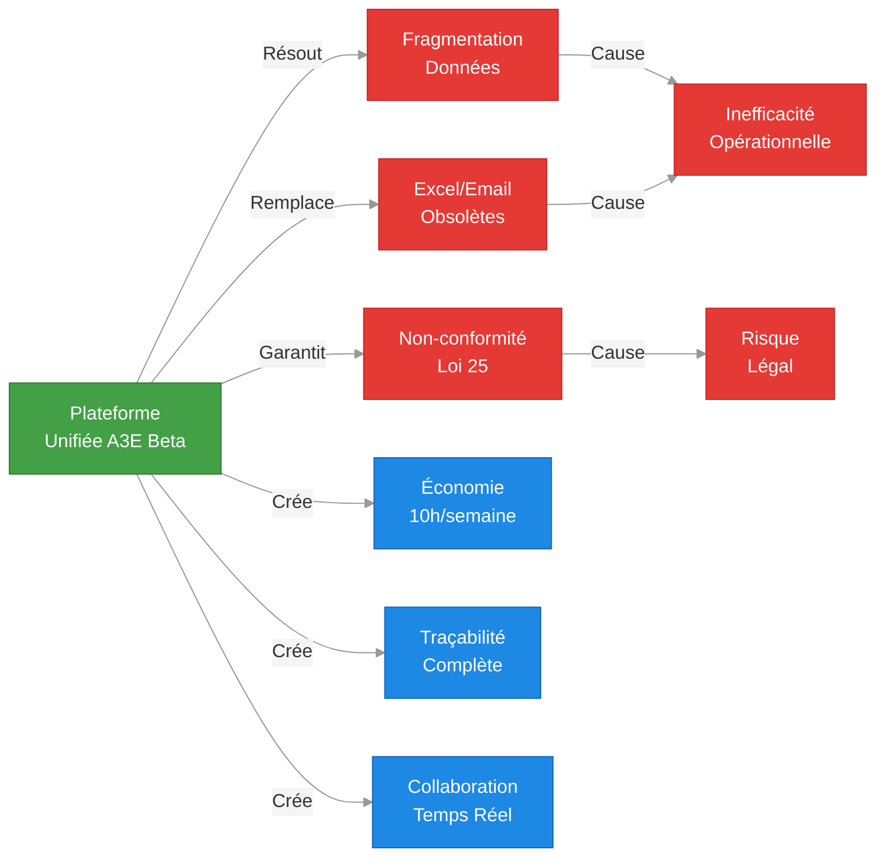
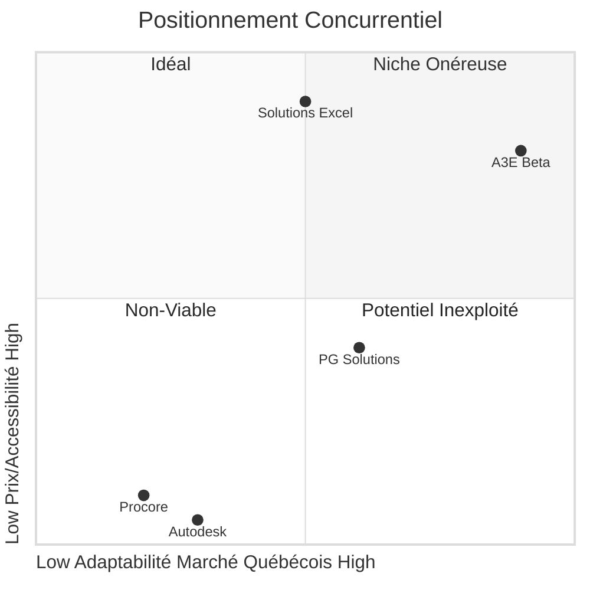
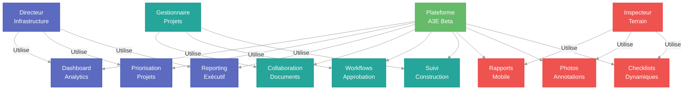
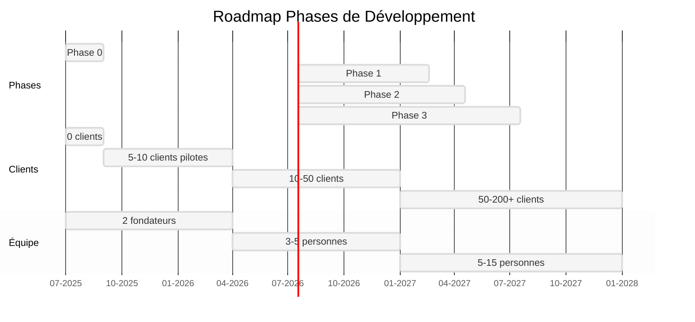
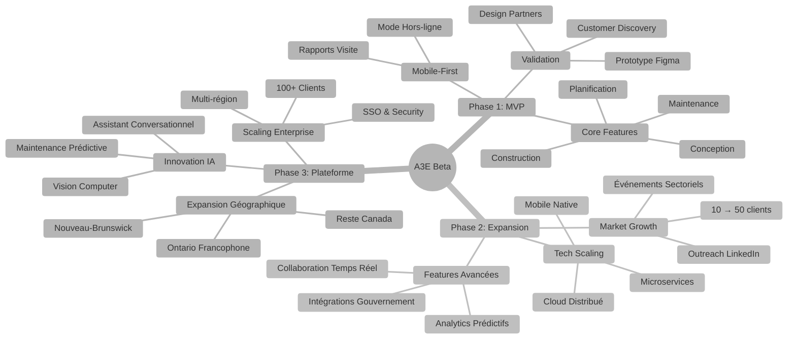
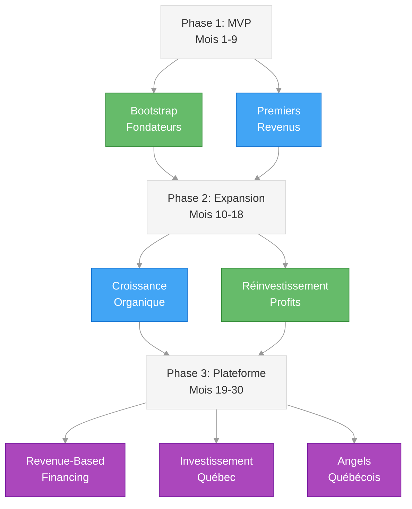

# 📋 PRD MASTER - A3E Beta
## Product Requirements Document - A3E Beta Platform

> **Document produit officiel** - Spécifications complètes pour développement  
> **Date**: Juillet 2025  
> **Version**: 1.0  
> **Équipe**: Fondateurs + Développement

---

## 🧭 **NAVIGATION**

Cette PRD est divisée en plusieurs documents pour une meilleure lisibilité et gestion:

1. [**PRD_MASTER**](./PRD_MASTER.md) - Vue d'ensemble, stratégie et analyse de marché (ce document)
2. [**PRD_PHASE1_MVP**](./PRD_PHASE1_MVP.md) - Validation et MVP (Mois 1-9)
3. [**PRD_PHASE2_EXPANSION**](./PRD_PHASE2_EXPANSION.md) - Expansion et croissance (Mois 10-18)
4. [**PRD_PHASE3_PLATFORM**](./PRD_PHASE3_PLATFORM.md) - Plateforme mature et scaling (Mois 19-30)

---

## 🎯 **EXECUTIVE SUMMARY**

### **Vision Produit**
A3E Beta révolutionne la gestion d'infrastructure publique au Québec en centralisant planification, conception, construction et maintenance sur une plateforme unique alimentée par l'IA. Notre mission : transformer chaque gestionnaire public en super-gestionnaire grâce à l'automatisation intelligente.

### **Problème Résolu**
- **95% des organismes publics** utilisent Excel/email pour gérer leurs projets d'infrastructure
- **Fragmentation totale** des données entre 4 phases du cycle de vie (planification → maintenance)
- **Perte massive de temps** : 10-15h/semaine en communications non-productives par gestionnaire
- **Conformité Loi 25** : Besoin urgent de solutions hébergées au Québec

### **Solution Unique**
Plateforme **tout-en-un** québécoise avec:
- 🧠 **IA conversationnelle** spécialisée construction publique
- 📱 **Mobile-first** avec mode hors-ligne avancé  
- 🔗 **Intégrations natives** SEAO, Hydro-Québec, systèmes gouvernementaux
- 🛡️ **Conformité Loi 25** garantie par design



---

## 📊 **MARKET ANALYSIS**

### **Marché Total Addressable (TAM)**
```yaml
Organismes cibles:
  Municipalités: 1,100+ (priorité <50k habitants = 900)
  Centres services scolaires: 72
  CIUSSS/CISSS: 34
  Sociétés d'État: 200+
  
Utilisateurs potentiels:
  Gestionnaires projets: 3,500+
  Directeurs infrastructure: 1,100+
  Inspecteurs/techniciens: 5,000+
  
Pricing:
  200$/utilisateur/mois × 15,000 users = 36M$/an (TAM conservateur, potentiel 50M$)
```

### **Analyse Concurrentielle**

| Concurrent | Forces | Faiblesses | Menace |
|------------|--------|------------|---------|
| **Procore** | Leader mondial, fonctionnalités | Prix prohibitif, non-conformité Loi 25 | Faible |
| **Autodesk Construction Cloud** | Intégration BIM excellente | Complexité, coût, hébergement US | Faible |
| **Solutions locales Excel** | Familier, gratuit | Inefficace, non-scalable | Élevée |
| **Nouveaux entrants** | Agilité potentielle | Manque expérience | Moyenne |



Pour une analyse concurrentielle plus détaillée, voir [ANALYSE_CONCURRENTIELLE_STRATEGIQUE.md](../2_competitive_analysis/ANALYSE_CONCURRENTIELLE_STRATEGIQUE.md).

### **Avantages Concurrentiels Défendables**
1. **Barrière réglementaire** : Conformité Loi 25 native
2. **Expertise locale** : Codes bâtiment QC, processus gouvernementaux
3. **Réseau effets** : Plus d'organismes = plus de valeur (benchmarks, best practices)
4. **Coût acquisition** : 10x moins cher que concurrents US

---

## 🎮 **PRODUCT STRATEGY**

### **Positionnement**
**"Le Shopify de la construction publique québécoise - A3E Beta"**
- Platform-as-a-Service pour infrastructure publique
- Simple à adopter, puissant à l'usage
- Croissance organique via word-of-mouth

### **Différenciation Clé**
1. **IA Québécoise** : Formée sur codes du bâtiment QC, terminologie française
2. **Mobile-First** : Conçu pour le terrain, pas le bureau
3. **Intégrations Gouvernementales** : SEAO, Hydro-Québec, systèmes financiers
4. **Conformité Native** : Loi 25, hébergement souverain par design

### **Stratégie Go-to-Market**
```yaml
Phase 1 (Design Partners):
  - 5 municipalités pilotes <20k habitants
  - 1 centre services scolaires
  - Prix: 100$/mois (50% rabais à vie)
  
Phase 2 (Early Adopters):
  - 20 organismes payants
  - Prix: 150$/mois
  - Références + études de cas
  
Phase 3 (Mainstream):
  - 100+ organismes
  - Prix: 200$/mois
  - Expansion géographique
```

Voir le [ROADMAP_STRATEGIQUE_BOOTSTRAP.md](../6_implementation_roadmap/ROADMAP_STRATEGIQUE_BOOTSTRAP.md) pour le plan détaillé de croissance sans financement externe.

---

## 👥 **USER PERSONAS**

**📚 Pour les personas détaillés, voir [PRODUCT_STRATEGY.md](../3_product_strategy/PRODUCT_STRATEGY.md#user-personas)**

**Résumé des 3 personas cibles :**

1. **🎯 Directeur Infrastructure Municipal** (Martin Dubois)
   - Organisation: Municipalité 15K habitants
   - Besoins: Dashboard analytics, priorisation projets, reporting exécutif
   - Pain points: Données éparpillées, manque visibilité

2. **🏗️ Gestionnaire Projets Construction** (Isabelle Tremblay)
   - Organisation: Centre services scolaires
   - Besoins: Collaboration documents, workflows approbation, suivi construction
   - Pain points: Communications multiples, versions documents

3. **🔧 Inspecteur/Technicien Terrain** (Jean-François Côté)
   - Organisation: Municipalité/firme externe
   - Besoins: Rapports mobile, photos annotations, checklists dynamiques
   - Pain points: Formulaires papier, retranscription manuelle



---

## 🚀 **VISION GLOBALE DES PHASES DE DÉVELOPPEMENT**

### Vue d'ensemble temporelle



### Vue d'ensemble du projet



---

## 🛠️ **MODULES & FEATURES OVERVIEW**

### **Architecture du Produit**

```mermaid
%%{init: {'theme': 'base', 'themeVariables': { 'primaryColor': '#f5f5f5', 'lineColor': '#999'}}}%%
graph TD
    classDef plan fill:#42A5F5,stroke:#1976D2,color:white
    classDef concept fill:#66BB6A,stroke:#388E3C,color:white
    classDef construct fill:#FF9800,stroke:#F57C00,color:white
    classDef maintain fill:#E91E63,stroke:#C2185B,color:white
    classDef transverse fill:#7E57C2,stroke:#5E35B1,color:white

    App[A3E Beta<br/>Plateforme] --> PLN[Module<br/>Planification]
    App --> CON[Module<br/>Conception]
    App --> CONS[Module<br/>Construction]
    App --> MAINT[Module<br/>Maintenance]
    App --> TRANS[Fonctionnalités<br/>Transversales]
    
    PLN --> PLN1[Dashboard<br/>Parc Immobilier]
    PLN --> PLN2[Liste Projets<br/>avec Statuts]
    PLN --> PLN3[Budgets et<br/>Allocations]
    
    CON --> CON1[Gestion<br/>Documentaire]
    CON --> CON2[Commentaires<br/>Annotations]
    CON --> CON3[PFT et<br/>Fiches Locaux]
    
    CONS --> CONS1[Rapports<br/>Visite Mobile]
    CONS --> CONS2[Gestion<br/>Photos/Médias]
    CONS --> CONS3[Suivi<br/>Progression]
    
    MAINT --> MAINT1[Inventaire<br/>Actifs]
    MAINT --> MAINT2[Planification<br/>Inspections]
    MAINT --> MAINT3[Historique<br/>Interventions]
    
    TRANS --> TRANS1[Auth et<br/>Sécurité]
    TRANS --> TRANS2[Interface<br/>Responsive]
    TRANS --> TRANS3[IA<br/>Conversationnelle]
    
    class PLN,PLN1,PLN2,PLN3 plan
    class CON,CON1,CON2,CON3 concept
    class CONS,CONS1,CONS2,CONS3 construct
    class MAINT,MAINT1,MAINT2,MAINT3 maintain
    class TRANS,TRANS1,TRANS2,TRANS3 transverse
```



Pour les spécifications détaillées de chaque module et feature, voir:
- [PRD_PHASE1_MVP.md](./PRD_PHASE1_MVP.md) - Spécifications MVP
- [PRD_PHASE2_EXPANSION.md](./PRD_PHASE2_EXPANSION.md) - Spécifications expansion
- [PRD_PHASE3_PLATFORM.md](./PRD_PHASE3_PLATFORM.md) - Spécifications plateforme mature

Pour les détails de l'architecture technique, voir [STACK_TECHNIQUE.md](../4_technical_architecture/STACK_TECHNIQUE.md).

---

## 💰 **FINANCIAL MODEL SUMMARY**

### **Revenue Projections**

| Étape | Timing | Clients | ARPU | MRR | ARR |
|-------|--------|---------|------|-----|-----|
| Fin Phase 1 (MVP) | Mois 9 | 10 | 100$/mois | 1,000$ | 12,000$ |
| Fin Phase 2 (Expansion) | Mois 18 | 50 | 180$/mois | 9,000$ | 108,000$ |
| Fin Phase 3 (Platform) | Mois 30 | 200 | 200$/mois | 40,000$ | 480,000$ |
| Post-Financement | Mois 36 | 500 | 220$/mois | 110,000$ | 1,320,000$ |

### **Unit Economics**

- **CAC (Customer Acquisition Cost)**: 200-600$ selon phase
- **LTV (Customer Lifetime Value)**: 48,000$ (200$ × 12 × 20 ans)
- **LTV/CAC Ratio**: 80-240x
- **Payback Period**: 1-3 mois

### **Funding Strategy**



Pour les détails financiers complets, voir la section Financial Model dans les documents de phase spécifiques.

---

## 🎯 **CONCLUSION**

Le projet A3E Beta propose une solution unique pour le marché québécois de la gestion d'infrastructure publique, en combinant innovation technologique, conformité réglementaire et expertise locale. Notre approche par phases permet de:

1. **Valider** rapidement les hypothèses avec un MVP ciblé
2. **Croître** organiquement grâce aux références clients
3. **Innover** constamment avec des fonctionnalités IA avancées
4. **Scaler** stratégiquement pour conquérir le marché canadien

Les documents détaillés par phase fournissent les spécifications précises pour l'exécution de chaque étape du projet.

---

*Document maître - Version 1.0*  
*Dernière révision : Juillet 2025*  
*Prochaine révision : Après 20 customer interviews*  
*Contact : equipe@a3e.ca*
