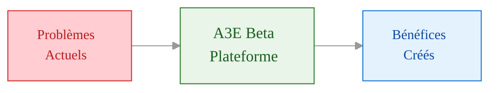
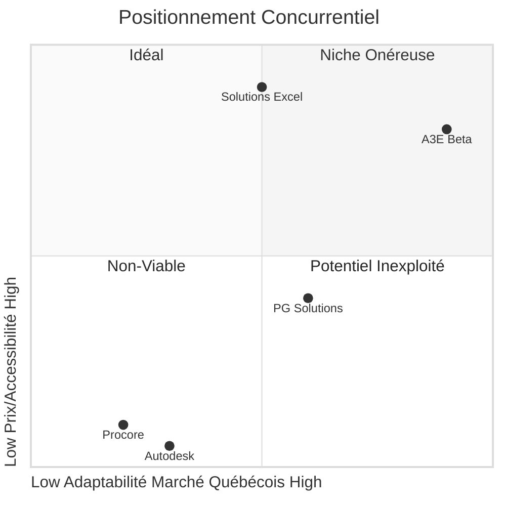
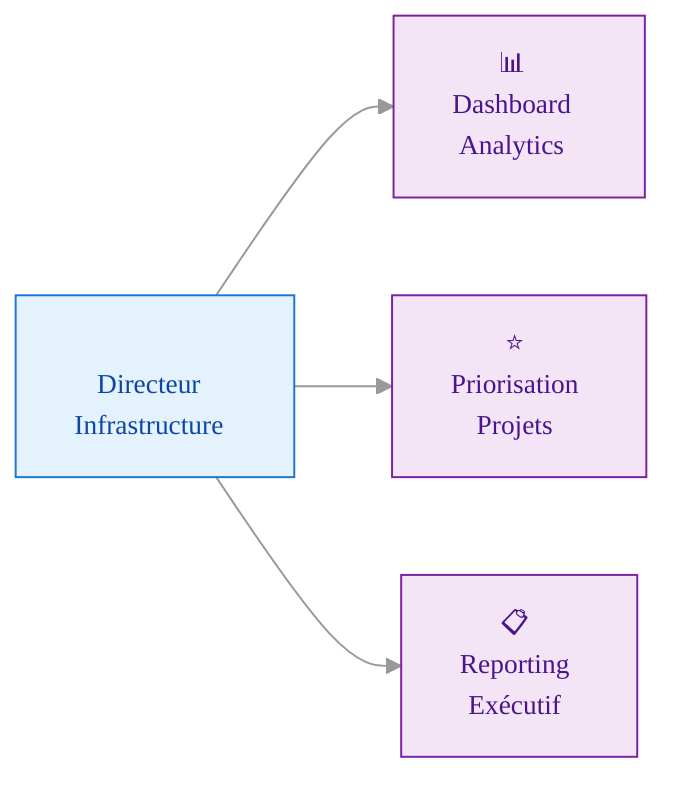
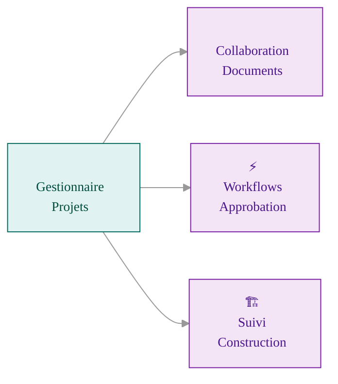
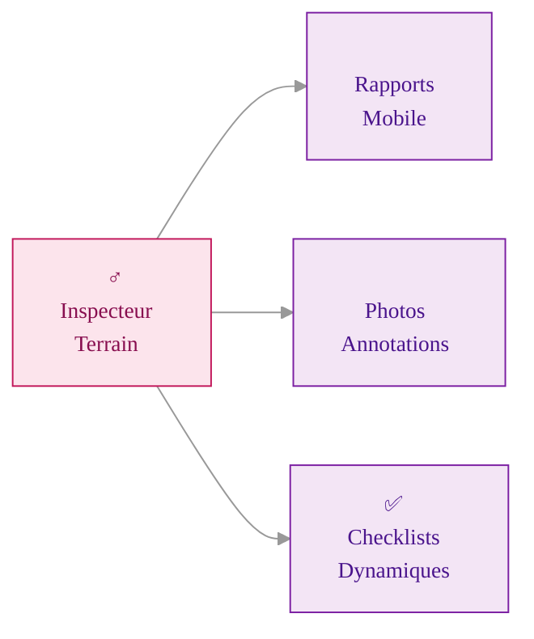
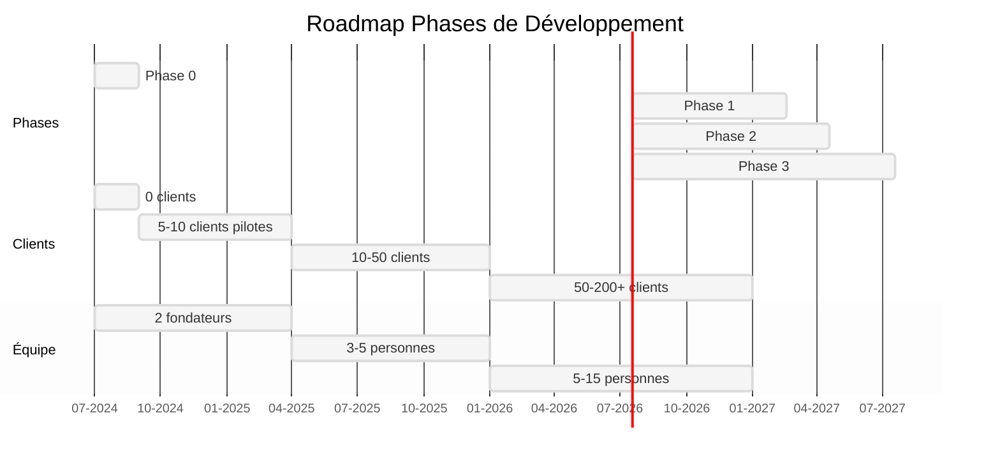
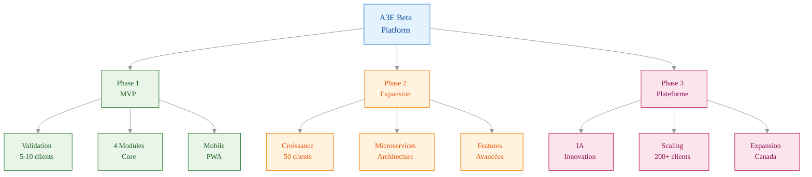
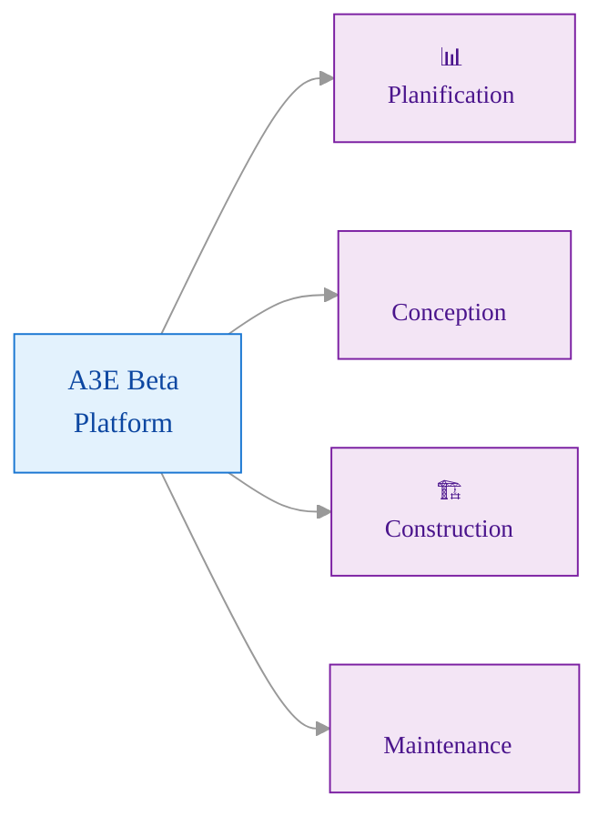
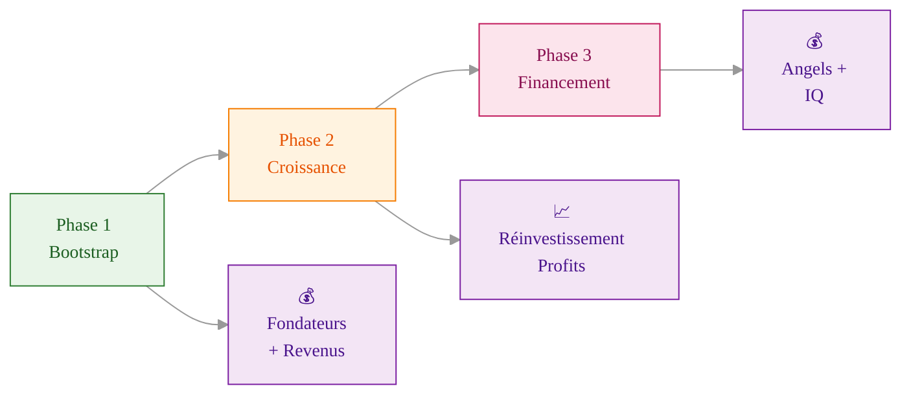

# 📋 PRD MASTER - A3E Beta
## Product Requirements Document - A3E Beta Platform

> **Document produit officiel** - Spécifications complètes pour développement  
> **Date**: Juillet 2024  
> **Version**: 1.0  
> **Équipe**: Fondateurs + Développement

---

## 🧭 **NAVIGATION**

Cette PRD est divisée en plusieurs documents pour une meilleure lisibilité et gestion:

1. [**PRD_MASTER**](./PRD_MASTER.md) - Vue d'ensemble, stratégie et analyse de marché (ce document)
2. [**PRD_PHASE1_MVP**](./PRD_PHASE1_MVP.md) - Validation et MVP (Mois 3-9)
3. [**PRD_PHASE2_EXPANSION**](./PRD_PHASE2_EXPANSION.md) - Expansion et croissance (Mois 10-18)
4. [**PRD_PHASE3_PLATFORM**](./PRD_PHASE3_PLATFORM.md) - Plateforme mature et scaling (Mois 19-30)

---

## 🎯 **EXECUTIVE SUMMARY**

### **Vision Produit**
A3E Beta révolutionne la gestion d'infrastructure publique au Québec en centralisant planification, conception, construction et maintenance sur une plateforme unique alimentée par l'IA. Notre mission : transformer chaque gestionnaire public en super-gestionnaire grâce à l'automatisation intelligente.

### **Problème Résolu**
- **95% des organismes publics** utilisent Excel/email pour gérer leurs projets d'infrastructure
- **Fragmentation totale** des données entre 4 phases du cycle de vie (planification → maintenance)
- **Perte massive de temps** : 10-15h/semaine en communications non-productives par gestionnaire
- **Conformité Loi 25** : Besoin urgent de solutions hébergées au Québec

### **Solution Unique**
Plateforme **tout-en-un** québécoise avec:
- 🧠 **IA conversationnelle** spécialisée construction publique
- 📱 **Mobile-first** avec mode hors-ligne avancé  
- 🔗 **Intégrations natives** SEAO, Hydro-Québec, systèmes gouvernementaux
- 🛡️ **Conformité Loi 25** garantie par design


```mermaid
%%{init: {'theme': 'base', 'themeVariables': { 'primaryColor': '#f5f5f5', 'lineColor': '#999', 'fontFamily': 'Roboto, sans-serif'}}}%%
graph LR
    Problems[Problèmes<br/>Actuels] --> Solution[A3E Beta<br/>Plateforme]
    Solution --> Benefits[Bénéfices<br/>Créés]
    
    classDef problem fill:#FFCDD2,stroke:#D32F2F,color:#B71C1C,font-size:14px
    classDef solution fill:#E8F5E8,stroke:#2E7D32,color:#1B5E20,font-size:16px
    classDef benefit fill:#E3F2FD,stroke:#1976D2,color:#0D47A1,font-size:14px
    
    class Problems problem
    class Solution solution
    class Benefits benefit
```

**Problèmes résolus :** Fragmentation données, Excel/Email obsolètes, Non-conformité Loi 25  
**Bénéfices créés :** Économie 10h/semaine, Traçabilité complète, Collaboration temps réel

---

## 📊 **MARKET ANALYSIS**

### **Marché Total Addressable (TAM)**
```yaml
Organismes cibles:
  Municipalités: 1,100+ (priorité <50k habitants = 900)
  Centres services scolaires: 72
  CIUSSS/CISSS: 34
  Sociétés d'État: 200+
  
Utilisateurs potentiels:
  Gestionnaires projets: 3,500+
  Directeurs infrastructure: 1,100+
  Inspecteurs/techniciens: 5,000+
  
Pricing:
  200$/utilisateur/mois × 15,000 users = 36M$/an (TAM conservateur, potentiel 50M$)
```

### **Analyse Concurrentielle**

| Concurrent | Forces | Faiblesses | Menace |
|------------|--------|------------|---------|
| **Procore** | Leader mondial, fonctionnalités | Prix prohibitif, non-conformité Loi 25 | Faible |
| **Autodesk Construction Cloud** | Intégration BIM excellente | Complexité, coût, hébergement US | Faible |
| **Solutions locales Excel** | Familier, gratuit | Inefficace, non-scalable | Élevée |
| **Nouveaux entrants** | Agilité potentielle | Manque expérience | Moyenne |


```mermaid
%%{init: {'theme': 'base', 'themeVariables': { 'primaryColor': '#f5f5f5', 'lineColor': '#999'}}}%%
quadrantChart
    title Positionnement Concurrentiel
    x-axis Low Adaptabilité Marché Québécois High
    y-axis Low Prix/Accessibilité High
    quadrant-1 Niche Onéreuse
    quadrant-2 Idéal
    quadrant-3 Non-Viable
    quadrant-4 Potentiel Inexploité
    Procore: [0.2, 0.1]
    Autodesk: [0.3, 0.05]
    PG Solutions: [0.6, 0.4]
    Solutions Excel: [0.5, 0.9]
    A3E Beta: [0.9, 0.8]
```

Pour une analyse concurrentielle plus détaillée, voir [ANALYSE_CONCURRENTIELLE_STRATEGIQUE.md](../2_competitive_analysis/ANALYSE_CONCURRENTIELLE_STRATEGIQUE.md).

### **Avantages Concurrentiels Défendables**
1. **Barrière réglementaire** : Conformité Loi 25 native
2. **Expertise locale** : Codes bâtiment QC, processus gouvernementaux
3. **Réseau effets** : Plus d'organismes = plus de valeur (benchmarks, best practices)
4. **Coût acquisition** : 10x moins cher que concurrents US

---

## 🎮 **PRODUCT STRATEGY**

### **Positionnement**
**"Le Shopify de la construction publique québécoise - A3E Beta"**
- Platform-as-a-Service pour infrastructure publique
- Simple à adopter, puissant à l'usage
- Croissance organique via word-of-mouth

### **Différenciation Clé**
1. **IA Québécoise** : Formée sur codes du bâtiment QC, terminologie française
2. **Mobile-First** : Conçu pour le terrain, pas le bureau
3. **Intégrations Gouvernementales** : SEAO, Hydro-Québec, systèmes financiers
4. **Conformité Native** : Loi 25, hébergement souverain par design

### **Stratégie Go-to-Market**
```yaml
Phase 1 (Design Partners):
  - 5 municipalités pilotes <20k habitants
  - 1 centre services scolaires
  - Prix: 100$/mois (50% rabais à vie)
  
Phase 2 (Early Adopters):
  - 20 organismes payants
  - Prix: 150$/mois
  - Références + études de cas
  
Phase 3 (Mainstream):
  - 100+ organismes
  - Prix: 200$/mois
  - Expansion géographique
```

Voir le [ROADMAP_STRATEGIQUE_BOOTSTRAP.md](../8_implementation_roadmap/ROADMAP_STRATEGIQUE_BOOTSTRAP.md) pour le plan détaillé de croissance sans financement externe.

---

## 👥 **USER PERSONAS**

**📚 Pour les personas détaillés, voir [PRODUCT_STRATEGY.md](../3_product_strategy/PRODUCT_STRATEGY.md#user-personas)**

**Résumé des 3 personas cibles :**

1. **🎯 Directeur Infrastructure Municipal** (Martin Dubois)
   - Organisation: Municipalité 15K habitants
   - Besoins: Dashboard analytics, priorisation projets, reporting exécutif
   - Pain points: Données éparpillées, manque visibilité

2. **🏗️ Gestionnaire Projets Construction** (Isabelle Tremblay)
   - Organisation: Centre services scolaires
   - Besoins: Collaboration documents, workflows approbation, suivi construction
   - Pain points: Communications multiples, versions documents

3. **🔧 Inspecteur/Technicien Terrain** (Jean-François Côté)
   - Organisation: Municipalité/firme externe
   - Besoins: Rapports mobile, photos annotations, checklists dynamiques
   - Pain points: Formulaires papier, retranscription manuelle

### **Persona 1: Directeur Infrastructure**


```mermaid
%%{init: {'theme': 'base', 'themeVariables': { 'primaryColor': '#f5f5f5', 'lineColor': '#999', 'fontFamily': 'Roboto, sans-serif'}}}%%
graph LR
    D[👨‍💼<br/>Directeur<br/>Infrastructure] --> D1[📊<br/>Dashboard<br/>Analytics]
    D --> D2[⭐<br/>Priorisation<br/>Projets]
    D --> D3[📋<br/>Reporting<br/>Exécutif]
    
    classDef director fill:#E3F2FD,stroke:#1976D2,color:#0D47A1,font-size:14px
    classDef feature fill:#F3E5F5,stroke:#7B1FA2,color:#4A148C,font-size:14px
    
    class D director
    class D1,D2,D3 feature
```

### **Persona 2: Gestionnaire Projets**


```mermaid
%%{init: {'theme': 'base', 'themeVariables': { 'primaryColor': '#f5f5f5', 'lineColor': '#999', 'fontFamily': 'Roboto, sans-serif'}}}%%
graph LR
    M[👩‍🏗️<br/>Gestionnaire<br/>Projets] --> M1[📁<br/>Collaboration<br/>Documents]
    M --> M2[⚡<br/>Workflows<br/>Approbation]
    M --> M3[🏗️<br/>Suivi<br/>Construction]
    
    classDef manager fill:#E0F2F1,stroke:#00695C,color:#004D40,font-size:14px
    classDef feature fill:#F3E5F5,stroke:#7B1FA2,color:#4A148C,font-size:14px
    
    class M manager
    class M1,M2,M3 feature
```

### **Persona 3: Inspecteur Terrain**


```mermaid
%%{init: {'theme': 'base', 'themeVariables': { 'primaryColor': '#f5f5f5', 'lineColor': '#999', 'fontFamily': 'Roboto, sans-serif'}}}%%
graph LR
    I[👷‍♂️<br/>Inspecteur<br/>Terrain] --> I1[📱<br/>Rapports<br/>Mobile]
    I --> I2[📸<br/>Photos<br/>Annotations]
    I --> I3[✅<br/>Checklists<br/>Dynamiques]
    
    classDef inspector fill:#FCE4EC,stroke:#C2185B,color:#880E4F,font-size:14px
    classDef feature fill:#F3E5F5,stroke:#7B1FA2,color:#4A148C,font-size:14px
    
    class I inspector
    class I1,I2,I3 feature
```

---

## 🚀 **VISION GLOBALE DES PHASES DE DÉVELOPPEMENT**

### Vue d'ensemble temporelle


```mermaid
%%{init: {'theme': 'base', 'themeVariables': { 'primaryColor': '#f5f5f5', 'lineColor': '#999'}}}%%
gantt
    title Roadmap Phases de Développement
    dateFormat  MM-YYYY
    axisFormat  %m-%Y
    
    section Phases
    Phase 0: Validation       :p0, 07-2024, 2M
    Phase 1: MVP              :p1, after p0, 7M
    Phase 2: Expansion        :p2, after p1, 9M
    Phase 3: Plateforme       :p3, after p2, 12M
    
    section Clients
    0 clients                 :c0, 07-2024, 2M
    5-10 clients pilotes      :c1, after c0, 7M
    10-50 clients             :c2, after c1, 9M
    50-200+ clients           :c3, after c2, 12M
    
    section Équipe
    2 fondateurs              :e1, 07-2024, 9M
    3-5 personnes             :e2, after e1, 9M
    5-15 personnes            :e3, after e2, 12M
```

### Vue d'ensemble du projet


```mermaid
%%{init: {'theme': 'base', 'themeVariables': { 'primaryColor': '#f5f5f5', 'lineColor': '#999', 'fontFamily': 'Roboto, sans-serif'}}}%%
graph TD
    A3E[A3E Beta<br/>Platform] --> P1[Phase 1<br/>MVP]
    A3E --> P2[Phase 2<br/>Expansion]  
    A3E --> P3[Phase 3<br/>Plateforme]
    
    P1 --> P1A[Validation<br/>5-10 clients]
    P1 --> P1B[4 Modules<br/>Core]
    P1 --> P1C[Mobile<br/>PWA]
    
    P2 --> P2A[Croissance<br/>50 clients]
    P2 --> P2B[Microservices<br/>Architecture]
    P2 --> P2C[Features<br/>Avancées]
    
    P3 --> P3A[IA<br/>Innovation]
    P3 --> P3B[Scaling<br/>200+ clients]
    P3 --> P3C[Expansion<br/>Canada]
    
    classDef platform fill:#E3F2FD,stroke:#1976D2,color:#0D47A1,font-size:16px
    classDef phase1 fill:#E8F5E8,stroke:#2E7D32,color:#1B5E20,font-size:14px
    classDef phase2 fill:#FFF3E0,stroke:#F57C00,color:#E65100,font-size:14px
    classDef phase3 fill:#FCE4EC,stroke:#C2185B,color:#880E4F,font-size:14px
    
    class A3E platform
    class P1,P1A,P1B,P1C phase1
    class P2,P2A,P2B,P2C phase2
    class P3,P3A,P3B,P3C phase3
```

---

## 🛠️ **MODULES & FEATURES OVERVIEW**

### **Architecture du Produit**

📋 **Architecture complète détaillée** : [→ PRODUCT_STRATEGY.md](../3_product_strategy/PRODUCT_STRATEGY.md#architecture-globale-de-la-plateforme)

**Vue synthétique des 4 modules principaux :**


```mermaid
%%{init: {'theme': 'base', 'themeVariables': { 'primaryColor': '#f5f5f5', 'lineColor': '#999', 'fontFamily': 'Roboto, sans-serif'}}}%%
graph LR
    A3E[A3E Beta<br/>Platform] --> PLN[📊<br/>Planification]
    A3E --> CON[📐<br/>Conception]
    A3E --> CONS[🏗️<br/>Construction]
    A3E --> MAINT[🔧<br/>Maintenance]
    
    classDef platform fill:#E3F2FD,stroke:#1976D2,color:#0D47A1,font-size:16px
    classDef module fill:#F3E5F5,stroke:#7B1FA2,color:#4A148C,font-size:14px
    
    class A3E platform
    class PLN,CON,CONS,MAINT module
```

Pour les spécifications détaillées de chaque module et feature, voir:
- [PRD_PHASE1_MVP.md](./PRD_PHASE1_MVP.md) - Spécifications MVP
- [PRD_PHASE2_EXPANSION.md](./PRD_PHASE2_EXPANSION.md) - Spécifications expansion
- [PRD_PHASE3_PLATFORM.md](./PRD_PHASE3_PLATFORM.md) - Spécifications plateforme mature

Pour les détails de l'architecture technique, voir [STACK_TECHNIQUE.md](../4_technical_architecture/STACK_TECHNIQUE.md).

---

## 💰 **FINANCIAL MODEL SUMMARY**

### **Revenue Projections**

| Étape | Timing | Clients | ARPU | MRR | ARR |
|-------|--------|---------|------|-----|-----|
| Fin Phase 1 (MVP) | Mois 9 | 10 | 100$/mois | 1,000$ | 12,000$ |
| Fin Phase 2 (Expansion) | Mois 18 | 50 | 180$/mois ARPU | 9,000$ | 108,000$ |
| Fin Phase 3 (Platform) | Mois 30 | 200 | 200$/mois | 40,000$ | 480,000$ |
| Post-Financement | Mois 36 | 500 | 220$/mois | 110,000$ | 1,320,000$ |

### **Unit Economics**

- **CAC (Customer Acquisition Cost)**: 200-600$ selon phase
- **LTV (Customer Lifetime Value)**: 48,000$ (200$ × 12 × 20 ans)
- **LTV/CAC Ratio**: 80-240x
- **Payback Period**: 1-3 mois

### **Funding Strategy**


```mermaid
%%{init: {'theme': 'base', 'themeVariables': { 'primaryColor': '#f5f5f5', 'lineColor': '#999', 'fontFamily': 'Roboto, sans-serif'}}}%%
graph LR
    P1[Phase 1<br/>Bootstrap] --> P2[Phase 2<br/>Croissance]
    P2 --> P3[Phase 3<br/>Financement]
    
    P1 --> P1F[💰<br/>Fondateurs<br/>+ Revenus]
    P2 --> P2F[📈<br/>Réinvestissement<br/>Profits]
    P3 --> P3F[💰<br/>Angels +<br/>IQ]
    
    classDef phase1 fill:#E8F5E8,stroke:#2E7D32,color:#1B5E20,font-size:14px
    classDef phase2 fill:#FFF3E0,stroke:#F57C00,color:#E65100,font-size:14px
    classDef phase3 fill:#FCE4EC,stroke:#C2185B,color:#880E4F,font-size:14px
    classDef funding fill:#F3E5F5,stroke:#7B1FA2,color:#4A148C,font-size:14px
    
    class P1 phase1
    class P2 phase2
    class P3 phase3
    class P1F,P2F,P3F funding
```

**Stratégie de financement par phases :**
- **Phase 1** : Bootstrap fondateurs + premiers revenus (1K$ MRR)
- **Phase 2** : Réinvestissement profits organiques (9K$ MRR)
- **Phase 3** : Financement stratégique Angels + Investissement Québec (40K$ MRR)

Pour les détails financiers complets, voir la section Financial Model dans les documents de phase spécifiques.

---

## 🎯 **CONCLUSION**

Le projet A3E Beta propose une solution unique pour le marché québécois de la gestion d'infrastructure publique, en combinant innovation technologique, conformité réglementaire et expertise locale. Notre approche par phases permet de:

1. **Valider** rapidement les hypothèses avec un MVP ciblé
2. **Croître** organiquement grâce aux références clients
3. **Innover** constamment avec des fonctionnalités IA avancées
4. **Scaler** stratégiquement pour conquérir le marché canadien

Les documents détaillés par phase fournissent les spécifications précises pour l'exécution de chaque étape du projet.

---

*Document maître - Version 1.0*  
*Dernière révision : Juillet 2024*  
*Prochaine révision : Après 20 customer interviews*  
*Contact : equipe@a3e.ca*
