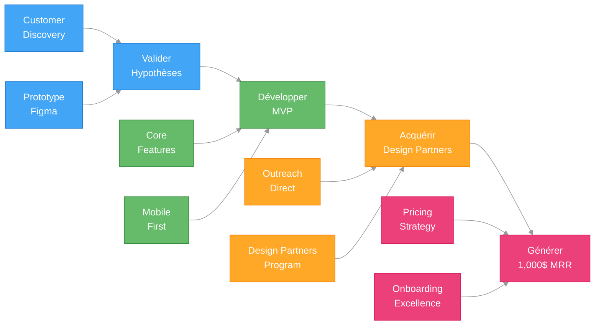
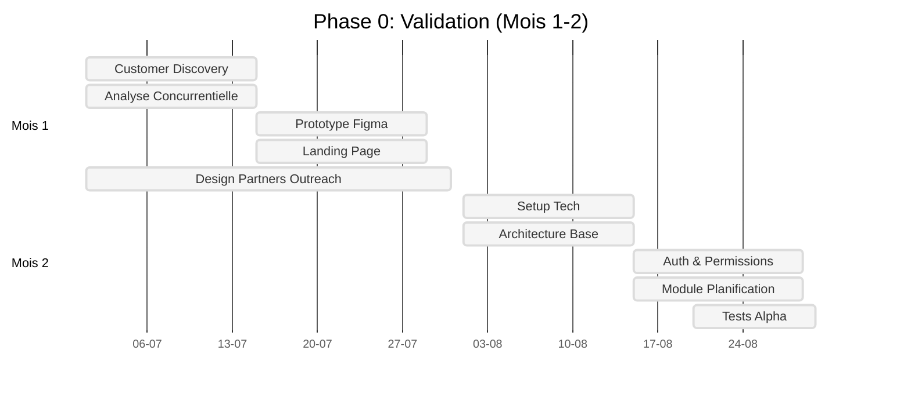
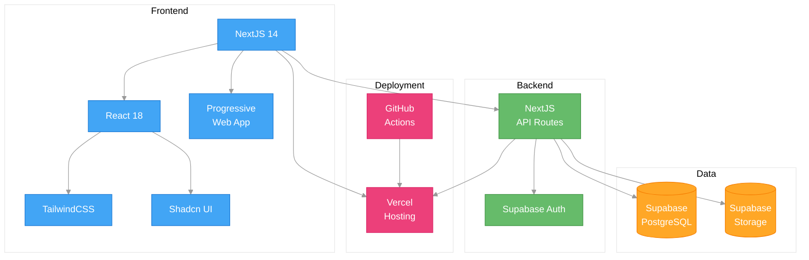

# 📋 PRD PHASE 1: MVP - A3E Beta
## Product Requirements Document - Validation et MVP (Mois 1-9)

> **Document produit officiel** - Spécifications Phase 1: Validation et MVP  
> **Date**: Juillet 2025  
> **Version**: 1.0  
> **Équipe**: Fondateurs + Développement

---

## 🧭 **NAVIGATION**

Cette PRD est divisée en plusieurs documents pour une meilleure lisibilité et gestion:

1. [**PRD_MASTER**](./PRD_MASTER.md) - Vue d'ensemble, stratégie et analyse de marché
2. [**PRD_PHASE1_MVP**](./PRD_PHASE1_MVP.md) - Validation et MVP (Mois 1-9) (ce document)
3. [**PRD_PHASE2_EXPANSION**](./PRD_PHASE2_EXPANSION.md) - Expansion et croissance (Mois 10-18)
4. [**PRD_PHASE3_PLATFORM**](./PRD_PHASE3_PLATFORM.md) - Plateforme mature et scaling (Mois 19-30)

---

## 🎯 **OBJECTIFS DE LA PHASE 1**

La Phase 1 (Mois 1-9) a pour objectifs principaux:

1. **Valider** les hypothèses de marché via customer discovery
2. **Développer** un MVP ultra-minimal mais complet sur les 4 modules
3. **Acquérir** 5-10 clients pilotes (design partners)
4. **Atteindre** 1,000$ MRR
5. **Établir** product-market fit initial



---

## 📅 **PLANNING DÉTAILLÉ**

### **Phase 0: Validation (Mois 1-2)**
```yaml
Mois 1:
  Semaine 1-2:
    - Customer Discovery: 20 entrevues téléphoniques
    - Analyse concurrentielle terrain
    - Définition MVP features basé sur feedback
  
  Semaine 3-4:
    - Prototype Figma interactif complet
    - Landing page Framer avec pricing
    - 5 design partners confirmés
    
Livrables:
  - Rapport customer discovery (20 pages)
  - Prototype validé par 5 prospects
  - Business model finalisé
  - Stack technique MVP définie

Mois 2:
  Semaine 1-2:
    - Setup développement (repo, CI/CD, hosting)
    - Architecture base NextJS + Supabase
    - Design system basique (Shadcn UI)
  
  Semaine 3-4:
    - Authentification et permissions
    - Module planification basique (PLN-001, PLN-002)
    - Tests utilisateurs prototype alpha
    
Livrables:
  - Infrastructure dev/staging opérationnelle
  - Alpha version avec auth + planification
  - Feedback 3 premiers design partners
  
Métriques Go/No-Go:
  - 15/20 confirment problème critique
  - 5/5 design partners engagés
  - Prototype validé techniquement
```



### **Phase 1: MVP (Mois 3-9)**

#### **Mois 3-4: Core Foundation**
```yaml
Sprint 1-2 (Mois 3):
  Planification:
    ✅ PLN-001: Dashboard parc immobilier basique
    ✅ PLN-002: Liste projets avec statuts
    ✅ PLN-003: Budgets et allocations
  
  Conception:
    ✅ CON-001: Gestion documentaire basique
    ✅ CON-002: Commentaires et annotations
  
  Transversal:
    ✅ TRANS-001: Auth et sécurité robuste
    ✅ TRANS-002: Interface responsive
    
Sprint 3-4 (Mois 4):
  Construction:
    ✅ CONS-001: Rapports visite mobiles
    ✅ CONS-002: Gestion photos et médias
    ✅ CONS-003: Statuts et suivi progression
  
  Support:
    ✅ TRANS-003: Support français québécois
    ✅ Documentation utilisateur basique
    ✅ Onboarding flows
    
Livrables Mois 3-4:
  - Version Beta fonctionnelle 3 modules
  - 3 premiers design partners en production
  - Feedback loops implémentés
  - Métriques usage trackées
```

#### **Mois 5-6: Completion MVP**
```yaml
Sprint 5-6 (Mois 5):
  Maintenance:
    ✅ MAINT-001: Inventaire actifs basique
    ✅ MAINT-002: Planification inspections
    ✅ MAINT-003: Historique interventions
  
  Conception (suite):
    ✅ CON-003: PFT et fiches locaux
    ✅ CON-004: Suivi approbations simple
    
Sprint 7-8 (Mois 6):
  Finitions MVP:
    ✅ PLN-004: Rapports basiques
    ✅ CONS-004: Communication centralisée
    ✅ MAINT-004: Rapports maintenance
    ✅ TRANS-004: Conformité Loi 25 complète
    
Livrables Mois 5-6:
  - MVP complet 4 modules fonctionnels
  - 5 design partners actifs
  - Documentation technique complète
  - Tests automatisés >80% couverture
```

#### **Mois 7-9: Polish & Scale**
```yaml
Sprint 9-10 (Mois 7):
  Performance & UX:
    ✅ Optimisations performance (<3s load)
    ✅ Mode hors-ligne basique mobile
    ✅ Error handling et logging
    ✅ Analytics usage (Plausible)
    
Sprint 11-12 (Mois 8):
  Business Features:
    ✅ Billing et subscriptions (Stripe)
    ✅ Multi-tenant architecture
    ✅ Exports avancés (Excel, PDF)
    ✅ Email notifications
    
Sprint 13-14 (Mois 9):
  Launch Preparation:
    ✅ Landing page marketing
    ✅ Documentation publique
    ✅ Support client intégré
    ✅ Launch beta publique limitée
    
Livrables Mois 7-9:
  - Produit production-ready
  - 10 clients payants (1,000$ MRR)
  - Processus support rodé
  - Pipeline commercial établi
```

---

## 🔧 **FEATURES & REQUIREMENTS - MOSCOW PRIORITIZATION**

### **MODULE 1: PLANIFICATION**

#### **MUST HAVE (Phase 0-1) - MVP Critical**
```yaml
PLN-001: Dashboard Parc Immobilier Basique
  Description: Vue d'ensemble actifs avec statuts, âges, état
  User Story: "En tant que directeur, je veux voir tous mes bâtiments d'un coup d'œil"
  Acceptance Criteria:
    - Liste/carte tous bâtiments organisation
    - Filtres: type, âge, état, arrondissement
    - Indicateurs santé basiques (vert/jaune/rouge)
    - Export Excel/PDF
  Effort: 5 points
  Dependencies: Auth, base données actifs

PLN-002: Liste Projets avec Statuts
  Description: Suivi projets planifiés/en cours avec priorités
  User Story: "En tant que gestionnaire, je veux prioriser mes projets efficacement"
  Acceptance Criteria:
    - CRUD projets (créer, lire, modifier, supprimer)
    - Statuts: planifié, approuvé, en cours, complété
    - Priorité manuelle (1-5 étoiles)
    - Budget estimé vs réel
    - Timeline basique
  Effort: 8 points
  Dependencies: PLN-001

PLN-003: Budgets et Allocations
  Description: Gestion budgets annuels par catégorie/projet
  User Story: "En tant que directeur, je veux suivre mes dépenses vs budget"
  Acceptance Criteria:
    - Budgets par catégorie (maintenance, construction, urgence)
    - Allocation budgets aux projets
    - Vue d'ensemble dépenses YTD
    - Alertes dépassement budget
  Effort: 13 points
  Dependencies: PLN-002

PLN-004: Rapports Básiques
  Description: Génération rapports standard pour direction/conseil
  User Story: "En tant que directeur, je veux des rapports pour le conseil municipal"
  Acceptance Criteria:
    - Templates rapport prédéfinis
    - Export PDF/Word automatique
    - Graphiques simples (barres, secteurs)
    - Branding organisation
  Effort: 8 points
  Dependencies: PLN-001, PLN-002, PLN-003
```

### **MODULE 2: CONCEPTION**

#### **MUST HAVE (Phase 0-1) - MVP Critical**
```yaml
CON-001: Gestion Documentaire Basique
  Description: Upload, organisation, partage documents projets
  User Story: "En tant qu'architecte, je veux partager mes plans facilement"
  Acceptance Criteria:
    - Upload multi-formats (PDF, DWG, DOC, images)
    - Structure dossiers par projet/phase
    - Permissions lecture/écriture par rôle
    - Versioning automatique
    - Recherche par nom/tags
  Effort: 13 points
  Dependencies: Auth, storage object

CON-002: Commentaires et Annotations
  Description: Système commentaires/révisions sur documents
  User Story: "En tant que gestionnaire, je veux commenter les plans"
  Acceptance Criteria:
    - Commentaires texte sur documents
    - Annotations visuelles sur images/PDF
    - Mentions utilisateurs (@nom)
    - Résolution/fermeture commentaires
    - Notifications changements
  Effort: 21 points
  Dependencies: CON-001

CON-003: PFT et Fiches Locaux Éditables
  Description: Outils création/édition Programme Fonctionnel Technique
  User Story: "En tant qu'architecte, je veux créer des PFT standardisés"
  Acceptance Criteria:
    - Templates PFT par type projet
    - Éditeur fiches locaux (WYSIWYG)
    - Calculs automatiques superficies
    - Export Word/PDF
    - Bibliothèque locaux standards
  Effort: 34 points
  Dependencies: CON-001

CON-004: Suivi Approbations Simple
  Description: Workflow basique approbation documents
  User Story: "En tant que directeur, je veux approuver les plans efficacement"
  Acceptance Criteria:
    - Statuts documents: brouillon, révision, approuvé
    - Assignation réviseurs
    - Historique approbations/rejets
    - Notifications échéances
  Effort: 13 points
  Dependencies: CON-001, CON-002
```

### **MODULE 3: CONSTRUCTION**

#### **MUST HAVE (Phase 0-1) - MVP Critical**
```yaml
CONS-001: Rapports Visite Mobiles
  Description: Application mobile rapports inspection chantier
  User Story: "En tant qu'inspecteur, je veux faire mes rapports directement sur site"
  Acceptance Criteria:
    - Interface mobile responsive (PWA)
    - Formulaires inspection personnalisables
    - Upload photos avec annotations simples
    - Mode hors-ligne basique (sauvegarde locale)
    - Géolocalisation automatique
    - Export PDF automatique
  Effort: 21 points
  Dependencies: Auth mobile, storage

CONS-002: Gestion Photos et Médias
  Description: Capture, annotation, organisation photos chantier
  User Story: "En tant que technicien, je veux documenter visuellement les problèmes"
  Acceptance Criteria:
    - Capture photos directe depuis app
    - Annotations texte/flèches/formes
    - Organisation par date/location/type
    - Compression automatique upload
    - Galerie avec recherche/filtres
  Effort: 13 points
  Dependencies: CONS-001

CONS-003: Statuts et Suivi Progression
  Description: Tracking avancement travaux par phase/secteur
  User Story: "En tant que gestionnaire, je veux voir la progression en temps réel"
  Acceptance Criteria:
    - Décomposition projet en tâches/phases
    - Statuts: non-commencé, en cours, complété, bloqué
    - Pourcentage completion estimé
    - Timeline visuelle simple
    - Alertes retards/problèmes
  Effort: 34 points
  Dependencies: CONS-001

CONS-004: Communication Centralisée
  Description: Hub communication projet remplaçant emails
  User Story: "En tant que gestionnaire, je veux centraliser toutes les communications"
  Acceptance Criteria:
    - Messages par projet/thread
    - Mentions utilisateurs (@nom)
    - Pièces jointes documents/photos
    - Notifications push/email
    - Historique complet conversations
  Effort: 21 points
  Dependencies: CONS-001, Auth
```

### **MODULE 4: MAINTENANCE**

#### **MUST HAVE (Phase 0-1) - MVP Critical**
```yaml
MAINT-001: Inventaire Actifs Basique
  Description: Base de données actifs avec informations essentielles
  User Story: "En tant que responsable maintenance, je veux lister tous mes équipements"
  Acceptance Criteria:
    - CRUD actifs (équipements, systèmes, espaces)
    - Informations: localisation, âge, garantie, fournisseur
    - Photos et documents associés
    - Recherche/filtres multiples
    - Import/export données
  Effort: 21 points
  Dependencies: Auth, base données

MAINT-002: Planification Inspections Manuelles
  Description: Calendrier inspections préventives basique
  User Story: "En tant que technicien, je veux planifier mes inspections"
  Acceptance Criteria:
    - Création tâches inspection avec fréquence
    - Assignation techniciens/équipes
    - Calendrier visuel (hebdo/mensuel)
    - Notifications échéances
    - Rapports inspection simples
  Effort: 34 points
  Dependencies: MAINT-001

MAINT-003: Historique Interventions
  Description: Journal complet interventions par actif
  User Story: "En tant que gestionnaire, je veux l'historique complet de mes équipements"
  Acceptance Criteria:
    - Enregistrement interventions (préventive/corrective)
    - Détails: date, technicien, actions, pièces, coûts
    - Liens photos/documents/factures
    - Timeline visuelle par actif
    - Recherche historique avancée
  Effort: 21 points
  Dependencies: MAINT-001, MAINT-002

MAINT-004: Rapports Maintenance Simples
  Description: Génération rapports standard maintenance
  User Story: "En tant que directeur, je veux des rapports sur mes coûts maintenance"
  Acceptance Criteria:
    - Templates rapport (coûts, activités, tendances)
    - Graphiques simples (barres, lignes, secteurs)
    - Filtres période/catégorie/actif
    - Export PDF/Excel
    - Envoi automatique par email
  Effort: 13 points
  Dependencies: MAINT-001, MAINT-002, MAINT-003
```

### **FONCTIONNALITÉS TRANSVERSALES**

#### **MUST HAVE (Phase 0-1) - MVP Critical**
```yaml
TRANS-001: Authentification et Sécurité
  Description: Système auth robuste avec permissions granulaires
  User Story: "En tant qu'administrateur, je veux contrôler l'accès selon les rôles"
  Acceptance Criteria:
    - Inscription/connexion email/mot de passe
    - Rôles prédéfinis: admin, gestionnaire, inspecteur, lecteur
    - Permissions par module/fonctionnalité
    - Sessions sécurisées (JWT)
    - Audit log connexions
  Effort: 34 points
  Dependencies: Base

TRANS-002: Interface Responsive Multi-Device
  Description: UI adaptative desktop/tablette/mobile
  User Story: "En tant qu'utilisateur, je veux utiliser l'app sur tous mes appareils"
  Acceptance Criteria:
    - Design responsive (Tailwind breakpoints)
    - Navigation optimisée mobile
    - Touch gestures tablette
    - Performance mobile (< 3s load)
    - Mode hors-ligne basique (cache)
  Effort: 55 points
  Dependencies: TRANS-001

TRANS-003: Support Français Québécois
  Description: Interface et contenu 100% français québécois
  User Story: "En tant qu'utilisateur québécois, je veux une interface dans ma langue"
  Acceptance Criteria:
    - Interface complètement française
    - Terminologie construction québécoise
    - Formats dates/monnaie canadiens
    - Support caractères accents
    - Messages erreur français
  Effort: 21 points
  Dependencies: TRANS-002

TRANS-004: Conformité Loi 25
  Description: Respect complet réglementation protection données Québec
  User Story: "En tant qu'organisme public, je dois respecter la Loi 25"
  Acceptance Criteria:
    - Hébergement données Canada uniquement
    - Chiffrement données repos/transit
    - Consentement explicite collecte données
    - Droit rectification/suppression
    - Audit logs accès données
  Effort: 89 points
  Dependencies: TRANS-001, infra
```

---

## 🏗️ **TECHNICAL ARCHITECTURE - PHASE 1**

### **Stack Technique MVP**

```yaml
Frontend:
  Framework: NextJS 14 + React 18
  Styling: TailwindCSS + Shadcn UI
  State: Zustand + React Query
  Mobile: PWA (Progressive Web App)
  
Backend:
  Framework: NextJS API Routes (monolithe)
  Base données: Supabase (PostgreSQL + Auth)
  Storage: Supabase Storage
  Hosting: Vercel
  
Coût mensuel: 0-50$ (Vercel Pro + Supabase Pro)
Capacité: Jusqu'à 10 organisations, 100 utilisateurs
```



Pour plus de détails sur l'architecture technique complète, voir [STACK_TECHNIQUE.md](../4_technical_architecture/STACK_TECHNIQUE.md).

### **Sécurité et Conformité MVP**

```yaml
Hébergement:
  Localisation: Canada (Vercel région US-East + Supabase région Canada)
  Résidence données: Garantie contractuelle Supabase
  
Chiffrement:
  Transit: TLS 1.3
  Repos: AES-256 (Supabase par défaut)
  
Authentification:
  Auth: Email/password + magic link
  Sessions: JWT sécurisés
  Permissions: RBAC simple 4 niveaux
```

---

## 🚀 **GO-TO-MARKET - PHASE 1**

### **Design Partners Program**

```yaml
Offre spéciale premiers clients:
  - 50% rabais à vie (100$/mois vs 200$)
  - Accès direct fondateurs
  - Features sur mesure prioritaires
  - Logo sur site (early adopters)
  
Engagement clients:
  - Feedback hebdomadaire (30 min call)
  - Beta testing features
  - Témoignages/études de cas après 3 mois
  - 2 références minimum après 6 mois
```

### **Outreach Strategy**

```yaml
Phase 1 - Target:
  - 5 municipalités <20k habitants
  - 1-2 centres services scolaires petits/moyens
  - Focus: région Québec & Montérégie (proximité équipe)
  
Canaux:
  1. LinkedIn outreach direct (20/jour)
  2. Recommandations réseau personnel
  3. Présence 2 événements sectoriels (COMAQ, AEMQ)
  
Message:
  - Problème spécifique validé + solution
  - Programme design partners exclusif
  - ROI immédiat (10h économisées/semaine)
```

### **Pricing & Revenue Model**

| Client Type | Prix mensuel | Engagement | Inclusions |
|-------------|--------------|-----------|------------|
| Design Partner | 100$ | 12 mois | Tous modules, support prioritaire |
| Early Adopter (fin MVP) | 150$ | 12 mois | Tous modules, onboarding inclus |

### **Onboarding Process**

```yaml
Étape 1: Welcome Call (30 min)
  - Introduction équipe
  - Configuration compte admin
  - Planning implémentation
  
Étape 2: Setup Data (45-60 min)
  - Import données bâtiments
  - Création projets initiaux
  - Configuration utilisateurs
  
Étape 3: Formation (60 min)
  - Session interactive équipe client
  - Walkthrough fonctionnalités clés
  - Q&A personnalisée
  
Étape 4: Suivi (15 min)
  - Check-in J+7
  - Résolution problèmes
  - Feedback initial
```

---

## 📊 **SUCCESS METRICS - PHASE 1**

### **KPIs Phase 1**

| Catégorie | Métrique | Cible Mois 9 |
|-----------|----------|--------------|
| **Produit** | Feature Adoption | >70% utilisateurs actifs utilisent 3+ modules |
| **Produit** | NPS Score | >40 |
| **Produit** | Product-Market Fit Score | >60% réponse "très déçus si disparaît" |
| **Business** | Clients actifs | 10 |
| **Business** | MRR | 1,000$ |
| **Business** | Churn mensuel | <10% |
| **Business** | CAC | <300$ |
| **Technique** | Uptime | >99.5% |
| **Technique** | Page Load Time | <3 secondes |
| **Technique** | Bug critique rate | <5/mois |

### **User Engagement Metrics**

```yaml
Activité utilisateur:
  - Daily Active Users: >50% utilisateurs totaux
  - Weekly Active Users: >80% utilisateurs totaux
  - Session duration: >15 minutes
  - Sessions/utilisateur/semaine: >3
  
Feature adoption:
  - Dashboard visité: >90% utilisateurs
  - Rapports mobiles créés: >5/semaine/organisation
  - Documents partagés: >10/semaine/organisation
  - Commentaires/annotations: >20/semaine/organisation
```

---

## 🚨 **RISK ANALYSIS - PHASE 1**

### **Risques Critiques Phase 1**

| Risque | Impact | Probabilité | Mitigation |
|--------|--------|-------------|------------|
| Onboarding trop complexe | Critique | Moyenne | UX simplifié, focus 1 module à la fois |
| Bugs MVP critiques | Critique | Élevée | Test cycle rigoureux, rollback facile |
| Design partners désengagés | Majeur | Moyenne | Engagement contractuel, valeur immédiate |
| Performance insuffisante | Majeur | Faible | Monitoring précoce, optimisations proactives |

### **Plan de Contingence Phase 1**

```yaml
Scenario: Adoption lente MVP
  Triggers:
    - <50% utilisation après 30 jours
    - Feedback négatif récurrent même feature
  
  Actions:
    1. User interviews urgentes (5+ utilisateurs)
    2. Simplification UX radicale
    3. Focus feature la plus utilisée uniquement
    4. Onboarding 1:1 supplémentaire
```

---

## 💰 **FINANCIAL MODEL - PHASE 1**

### **Coûts Phase 1**

```yaml
Infrastructures:
  - Vercel Pro: 20$/mois
  - Supabase Pro: 25$/mois
  - Autres services: ~30$/mois
  Total: ~75$/mois
  
Opérations:
  - Domaine: 20$/an
  - Outils développement: 50$/mois
  - Marketing: 100$/mois (LinkedIn Sales Navigator)
  - Juridique/Administratif: 500$ (one-time)
  Total: ~150$/mois
  
Équipe:
  - 2 fondateurs: 0$ (sweat equity)
  - Contractuels: ~500$/mois (design, contenu)
  
Coût mensuel total: ~725$/mois
Runway: 9 mois = ~6,500$ investissement total
```

### **Revenus Phase 1**

| Mois | Nouveaux clients | Clients totaux | MRR | Commentaire |
|------|-----------------|---------------|-----|-------------|
| 1-3 | 0 | 0 | 0$ | Validation & développement |
| 4 | 2 | 2 | 200$ | Premiers design partners |
| 5 | 1 | 3 | 300$ | |
| 6 | 2 | 5 | 500$ | MVP complet |
| 7 | 1 | 6 | 600$ | |
| 8 | 2 | 8 | 800$ | |
| 9 | 2 | 10 | 1,000$ | Cible finale Phase 1 |

### **Break-Even Analysis**

```yaml
Break-even point:
  - Coût mensuel: ~725$
  - Prix client: 100$/mois
  - Clients nécessaires: 8
  - Atteint: Mois 8
  
ROI Phase 1:
  - Investissement total: ~6,500$
  - MRR fin phase: 1,000$
  - Payback period: 6.5 mois post-phase
```

---

## 🎯 **NEXT STEPS & TRANSITION PHASE 2**

### **Critères de Succès pour Passer à Phase 2**

```yaml
Product Criteria:
  - MVP complet et stable
  - NPS >40
  - Utilisation active >70% utilisateurs
  - <5 bugs critiques/mois
  
Business Criteria:
  - 10+ clients actifs
  - 1,000$+ MRR
  - <10% churn mensuel
  - Pipeline >20 prospects
  
Technical Criteria:
  - Architecture prête pour scaling
  - Documentation technique complète
  - Test coverage >80%
  - Uptime >99.5%
```

### **Préparation Phase 2**

```yaml
1. Scaling Architecture:
   - Plan migration architecture microservices
   - Documentation API interne complète
   - Préparation infrastructure cloud distribuée
   
2. Recrutement:
   - Profil développeur junior défini
   - Job posting prêt
   - Processus entrevue établi
   
3. Expansion Marketing:
   - Site web marketing complet
   - Matériel études de cas prêt
   - Stratégie contenu définie
```

Pour plus de détails sur la Phase 2, voir [PRD_PHASE2_EXPANSION.md](./PRD_PHASE2_EXPANSION.md).

---

*Document Phase 1: MVP - Version 1.0*  
*Dernière révision : Juillet 2025*  
*Prochaine révision : Après 20 customer interviews*  
*Contact : equipe@a3e.ca*
