# 📋 PRD PHASE 2: EXPANSION - A3E Beta
## Product Requirements Document - Expansion et Croissance (Mois 10-18)

> **Document produit officiel** - Spécifications Phase 2: Expansion et Croissance  
> **Date**: Juillet 2024  
> **Version**: 1.0  
> **Équipe**: Fondateurs + Développement

---

## 🧭 **NAVIGATION**

Cette PRD est divisée en plusieurs documents pour une meilleure lisibilité et gestion:

1. [**PRD_MASTER**](./PRD_MASTER.md) - Vue d'ensemble, stratégie et analyse de marché
2. [**PRD_PHASE1_MVP**](./PRD_PHASE1_MVP.md) - Validation et MVP (Mois 3-9)
3. [**PRD_PHASE2_EXPANSION**](./PRD_PHASE2_EXPANSION.md) - Expansion et croissance (Mois 10-18) (ce document)
4. [**PRD_PHASE3_PLATFORM**](./PRD_PHASE3_PLATFORM.md) - Plateforme mature et scaling (Mois 19-30)

---

## 🎯 **OBJECTIFS DE LA PHASE 2**

La Phase 2 (Mois 10-18) a pour objectifs principaux:

1. **Accélérer** la croissance client (10 → 50 clients)
2. **Faire évoluer** l'architecture technique pour le scaling
3. **Développer** des fonctionnalités avancées "Should Have"
4. **Établir** une équipe minimale viable (5 personnes)
5. **Atteindre** 9,000$ MRR

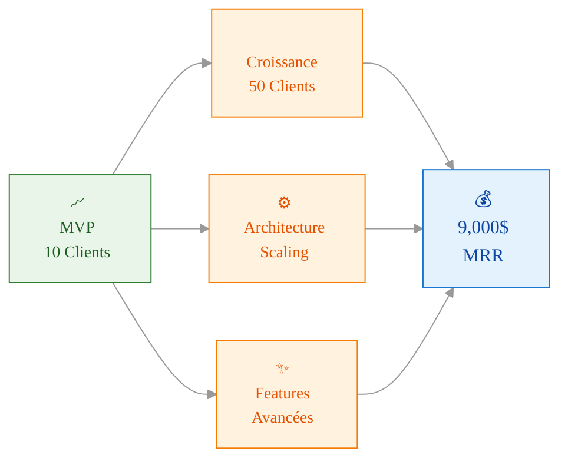

### **Architecture Scaling Evolution**

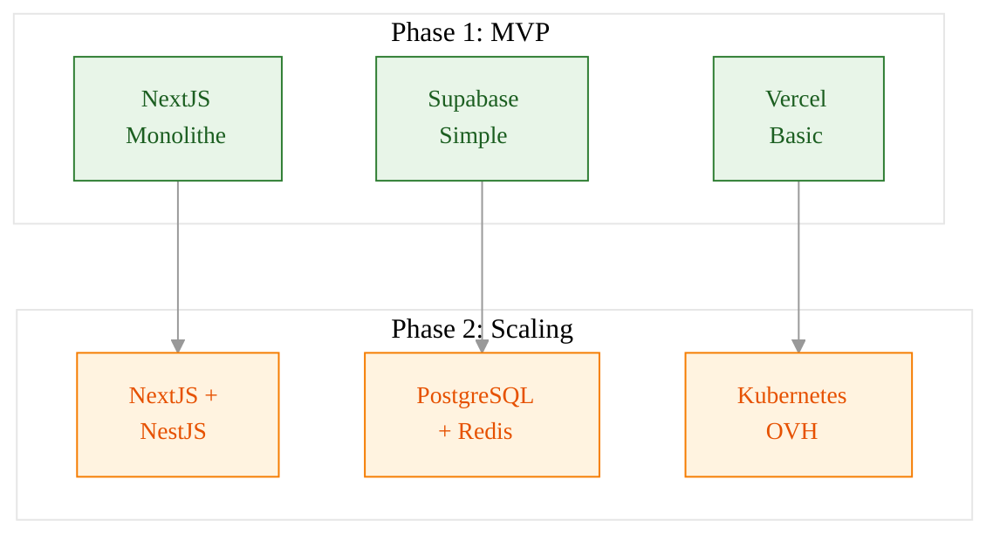

### **Feature Evolution Map**

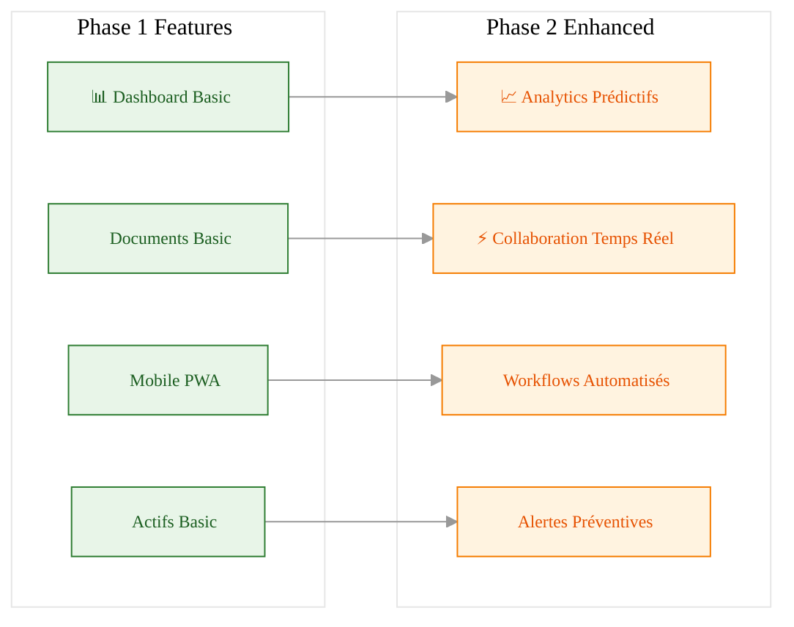

---

## 📅 **PLANNING DÉTAILLÉ**

### **Mois 10-12: Architecture Scale**
```yaml
Infrastructure:
  ✅ Migration NestJS microservices
  ✅ PostgreSQL + Redis cluster
  ✅ Kubernetes deployment (OVH)
  ✅ CI/CD pipeline advanced
  
Features Should-Have:
  ✅ PLN-005: Analytics prédictifs simples
  ✅ CON-005: Collaboration temps réel
  ✅ CONS-005: Workflows demandes changement
  ✅ MAINT-005: Alertes préventives auto
  
Team Scaling:
  ✅ Développeur Full-Stack Junior
  ✅ Customer Success Manager
  ✅ Processus QA formalisé
  
Livrables:
  - Architecture scalable opérationnelle
  - 20 clients (3,000$ MRR)
  - Équipe de 3 personnes
  - NPS >60
```

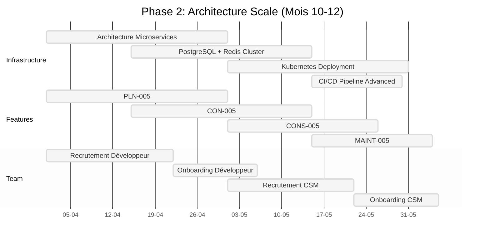

### **Mois 13-15: Feature Expansion**
```yaml
Advanced Features:
  ✅ CON-006: Visionneuse plans 2D avancée
  ✅ CONS-006: Signatures électroniques
  ✅ MAINT-006: Gestion stocks basique
  ✅ TRANS-005: SSO organisationnel
  
Mobile Native:
  ✅ React Native app (iOS/Android)
  ✅ Mode hors-ligne avancé
  ✅ Push notifications natives
  ✅ Sync conflit resolution
  
Intégrations:
  ✅ MAINT-007: Données Hydro-Québec
  ✅ TRANS-006: API REST basique
  ✅ Email/calendar integrations
  
Livrables:
  - Apps mobiles natives lancées
  - 35 clients (7,000$ MRR)
  - Première intégration gouvernementale
  - Sales Development Rep embauché
```

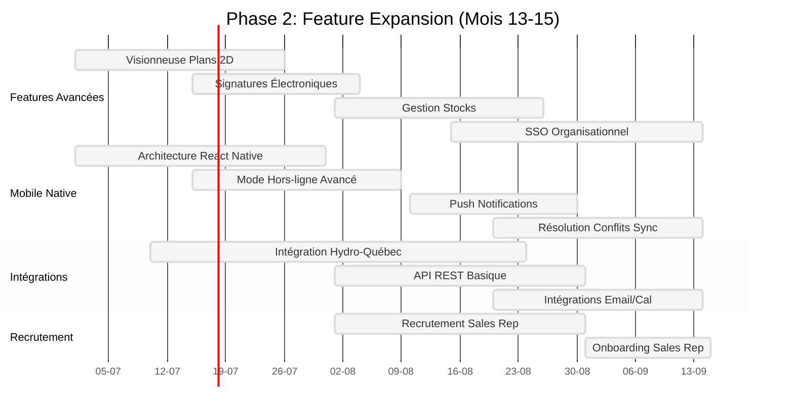

### **Mois 16-18: Market Expansion**
```yaml
Business Growth:
  ✅ 50+ clients (12,000$ MRR)
  ✅ Expansion Ontario francophone
  ✅ Partenariats consultants établis
  ✅ Content marketing mature
  
Product Maturity:
  ✅ PLN-006: Workflows approbation budgets
  ✅ CON-007: Workflows paramétrables
  ✅ CONS-007: Notifications intelligentes
  ✅ MAINT-008: Coûts détaillés
  
Technical Excellence:
  ✅ 99.9% uptime SLA
  ✅ <200ms API response time
  ✅ Security audit completed
  ✅ Performance monitoring advanced
  
Livrables:
  - Leadership marché petit/moyen
  - Équipe de 5 personnes
  - Plateforme mature stabilisée
  - Préparation financement
```

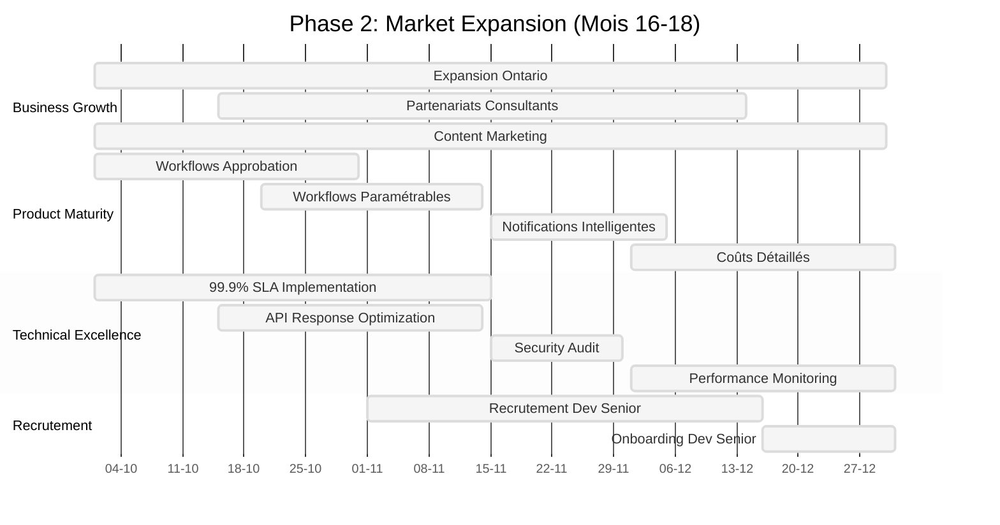

---

## 🔧 **FEATURES & REQUIREMENTS - PHASE 2**

### **MODULE 1: PLANIFICATION - FEATURES SHOULD HAVE**

```yaml
PLN-005: Analytics Prédictifs Simples
  Description: Tendances et prédictions basées sur données historiques
  User Story: "En tant que directeur, je veux anticiper les besoins futurs d'infrastructure"
  Acceptance Criteria:
    - Analyse tendances historiques par catégorie
    - Prédictions basiques 12-24 mois
    - Visualisations comparatives (plan vs réel)
    - Export rapports prédictifs
    - Alertes préventives basées sur seuils
  Effort: 13 points
  Dependencies: PLN-001, PLN-002, PLN-003, PLN-004

PLN-006: Workflows Approbation Budgets
  Description: Processus approbation automatisé avec signatures
  User Story: "En tant que gestionnaire, je veux un processus formel d'approbation budgétaire"
  Acceptance Criteria:
    - Flux approbation multi-niveaux configurable
    - Signatures électroniques
    - Historique approbations/rejets
    - Notifications automatiques
    - Rappels échéances
  Effort: 21 points
  Dependencies: PLN-003, Auth avancée
```

### **MODULE 2: CONCEPTION - FEATURES SHOULD HAVE**

```yaml
CON-005: Collaboration Temps Réel
  Description: Édition simultanée documents style Google Docs
  User Story: "En tant qu'équipe de conception, nous voulons collaborer simultanément sur les documents"
  Acceptance Criteria:
    - Édition collaborative temps réel
    - Présence utilisateurs visible
    - Historique modifications par utilisateur
    - Commentaires contextuels en ligne
    - Résolution conflits automatique
  Effort: 34 points
  Dependencies: CON-001, CON-002, CON-003

CON-006: Visionneuse Plans 2D Avancée
  Description: Visualisation plans avec zoom, mesures, couches
  User Story: "En tant qu'architecte, je veux manipuler des plans complexes dans l'interface"
  Acceptance Criteria:
    - Zoom fluide haute performance
    - Mesures et annotations directes
    - Gestion couches/calques
    - Comparaison versions côte à côte
    - Compatibilité formats CAD standards
  Effort: 21 points
  Dependencies: CON-001, CON-002

CON-007: Workflows Approbation Paramétrables
  Description: Configuration workflows selon types projets
  User Story: "En tant qu'administrateur, je veux définir des workflows d'approbation personnalisés"
  Acceptance Criteria:
    - Éditeur de workflow visuel
    - Conditions/branches logiques
    - Règles d'escalade automatique
    - Templates workflow réutilisables
    - Rapports performance workflow
  Effort: 55 points
  Dependencies: CON-004, RBAC avancé
```

### **MODULE 3: CONSTRUCTION - FEATURES SHOULD HAVE**

```yaml
CONS-005: Workflows Demandes Changement
  Description: Processus formalisé gestion changements/variations
  User Story: "En tant que gestionnaire, je veux un processus structuré pour les demandes de changement"
  Acceptance Criteria:
    - Formulaires demande changement
    - Estimation impact (budget, délai)
    - Processus approbation multi-niveaux
    - Traçabilité complète modifications
    - Intégration coûts au budget global
  Effort: 34 points
  Dependencies: CONS-003, CONS-004

CONS-006: Signatures Électroniques Simples
  Description: Approbation/signature documents directement app
  User Story: "En tant que directeur, je veux signer électroniquement les documents"
  Acceptance Criteria:
    - Signature tactile (doigt/stylet)
    - Signature par code (OTP)
    - Traçabilité complète (IP, date, device)
    - Certification signatures
    - Vérification identité basique
  Effort: 21 points
  Dependencies: CON-004, Auth avancée

CONS-007: Notifications Push Intelligentes
  Description: Alertes contextuelles selon rôle/urgence/localisation
  User Story: "En tant qu'utilisateur terrain, je veux des notifications pertinentes et contextuelles"
  Acceptance Criteria:
    - Notifications push (web/mobile)
    - Filtrage intelligent par priorité
    - Géo-fencing (alertes basées localisation)
    - Préférences personnalisables
    - Agrégation intelligente
  Effort: 13 points
  Dependencies: CONS-004, Mobile infrastructure
```

### **MODULE 4: MAINTENANCE - FEATURES SHOULD HAVE**

```yaml
MAINT-005: Alertes Préventives Automatiques
  Description: Notifications basées sur âge/usage/dernière intervention
  User Story: "En tant que responsable maintenance, je veux être alerté automatiquement des besoins d'entretien"
  Acceptance Criteria:
    - Règles d'alerte configurables
    - Calcul automatique dates d'intervention
    - Priorisation intelligente
    - Distribution équipes automatique
    - Calendrier maintenance généré
  Effort: 21 points
  Dependencies: MAINT-001, MAINT-002, MAINT-003

MAINT-006: Gestion Stocks Pièces Basique
  Description: Inventaire pièces détachées avec seuils réapprovisionnement
  User Story: "En tant que responsable maintenance, je veux gérer mon stock de pièces"
  Acceptance Criteria:
    - Catalogue pièces avec caractéristiques
    - Mouvements stock (entrée/sortie)
    - Alertes seuil minimal
    - Association pièces/équipements
    - Historique utilisation
  Effort: 34 points
  Dependencies: MAINT-001

MAINT-007: Intégration Données Énergétiques
  Description: Import consommation Hydro-Québec avec analyses simples
  User Story: "En tant que gestionnaire, je veux analyser la consommation énergétique de mes bâtiments"
  Acceptance Criteria:
    - Connexion API Hydro-Québec
    - Import données consommation
    - Tableaux bord consommation
    - Comparaison bâtiments similaires
    - Alertes anomalies
  Effort: 55 points
  Dependencies: MAINT-001, API intégration framework

MAINT-008: Coûts Maintenance Détaillés
  Description: Tracking précis coûts main-d'œuvre/pièces/externes
  User Story: "En tant que directeur, je veux analyser précisément les coûts de maintenance"
  Acceptance Criteria:
    - Ventilation coûts par catégorie
    - Suivi main-d'œuvre interne/externe
    - Analyses tendances coûts
    - Comparaison prévisionnel vs réel
    - Export données comptables
  Effort: 21 points
  Dependencies: MAINT-003, MAINT-006
```

### **FONCTIONNALITÉS TRANSVERSALES - SHOULD HAVE**

```yaml
TRANS-005: SSO Organisationnel
  Description: Intégration Active Directory/LDAP organisations
  User Story: "En tant qu'administrateur IT, je veux intégrer notre système d'authentification existant"
  Acceptance Criteria:
    - Support Active Directory/LDAP
    - Mapping rôles automatique
    - Provisioning utilisateurs automatique
    - Audit connexions
    - Déconnexion centralisée
  Effort: 55 points
  Dependencies: TRANS-001, Auth avancée

TRANS-006: API REST Basique
  Description: API publique pour intégrations tierces basiques
  User Story: "En tant que développeur, je veux intégrer d'autres systèmes avec la plateforme"
  Acceptance Criteria:
    - Documentation OpenAPI
    - Endpoints CRUD principaux
    - Authentication OAuth 2.0
    - Rate limiting
    - Monitoring usage
  Effort: 34 points
  Dependencies: Architecture microservices

TRANS-007: Support Client Intégré
  Description: Chat support, base connaissances, tickets
  User Story: "En tant qu'utilisateur, je veux obtenir de l'aide directement dans l'application"
  Acceptance Criteria:
    - Chat support en direct
    - Base de connaissances intégrée
    - Système tickets avec suivi
    - Notifications résolution
    - Feedback satisfaction
  Effort: 21 points
  Dependencies: TRANS-002, TRANS-003

TRANS-008: Multi-Tenant Architecture
  Description: Isolation données entre organisations
  User Story: "En tant qu'administrateur, je veux garantir l'isolation complète des données entre organisations"
  Acceptance Criteria:
    - Séparation logique complète données
    - Performance optimisée multi-tenant
    - Audits sécurité entre tenants
    - Monitoring usage par tenant
    - Backup/restore par tenant
  Effort: 144 points
  Dependencies: TRANS-001, TRANS-004, Architecture scalable
```

---

## 🏗️ **TECHNICAL ARCHITECTURE - PHASE 2**

### **Stack Technique - Evolution**

```yaml
Frontend:
  - React Native: Apps mobiles natives iOS/Android
  - React Query: Data fetching avancé et caching
  - Framer Motion: Animations avancées
  - Optimistic UI: Mise à jour instantanée interface
  
Backend:
  - NestJS: Migration microservices
  - Kafka: Bus événementiel
  - Redis: Cache et files d'attente
  - Citus: PostgreSQL distribué
  
Infrastructure:
  - Kubernetes (OVH/DigitalOcean)
  - Ingress Controller: Routing intelligent
  - HorizontalPodAutoscaler: Scaling automatique
  - Cert-Manager: Gestion certificats TLS
  
Monitoring:
  - Sentry: Tracking erreurs
  - Prometheus: Métriques
  - Grafana: Dashboards monitoring
  - Elastic Stack: Logs centralisés
  
Coût mensuel: 200-500$
Capacité: 50 organisations, 500 utilisateurs
```

```mermaid
%%{init: {'theme': 'base', 'themeVariables': { 'primaryColor': '#f5f5f5', 'lineColor': '#999'}}}%%
graph TD
    classDef frontend fill:#42A5F5,stroke:#1976D2,color:white
    classDef mobile fill:#5C6BC0,stroke:#3949AB,color:white
    classDef backend fill:#66BB6A,stroke:#388E3C,color:white
    classDef messaging fill:#81C784,stroke:#4CAF50,color:white
    classDef data fill:#FFA726,stroke:#F57C00,color:white
    classDef infra fill:#EF5350,stroke:#E53935,color:white
    classDef monitor fill:#EC407A,stroke:#D81B60,color:white

    subgraph "Frontend Evolution"
        Next[NextJS 14]
        RN[React Native]
        Query[React Query]
        Optimistic[Optimistic UI]
    end
    
    subgraph "Backend Evolution"
        Monolith[Monolith API]
        Micro[Microservices]
        Kafka[Kafka Events]
        Redis[Redis Cache]
    end
    
    subgraph "Data Evolution"
        Supabase[Supabase]
        Postgres[PostgreSQL]
        Citus[Citus Distributed]
        MongoDB[MongoDB]
    end
    
    subgraph "Infrastructure Evolution"
        Vercel[Vercel]
        K8s[Kubernetes]
        Scaling[Auto-scaling]
        CICD[CI/CD Advanced]
    end
    
    subgraph "Monitoring Evolution"
        Basic[Basic Logs]
        Sentry[Sentry]
        Prometheus[Prometheus]
        Grafana[Grafana]
    end
    
    Monolith --> Micro
    Micro --> Kafka
    
    Supabase --> Postgres
    Postgres --> Citus
    
    Vercel --> K8s
    K8s --> Scaling
    
    Basic --> Sentry
    Sentry --> Prometheus
    Prometheus --> Grafana
    
    Next --> RN
    Next --> Query
    Query --> Optimistic
    
    %% Apply classes
    class Next,Query,Optimistic frontend
    class RN mobile
    class Monolith,Micro backend
    class Kafka messaging
    class Redis,Supabase,Postgres,Citus,MongoDB data
    class Vercel,K8s,Scaling,CICD infra
    class Basic,Sentry,Prometheus,Grafana monitor
    
    %% Link styling
    linkStyle 0 stroke:#66BB6A,stroke-width:2px
    linkStyle 1 stroke:#66BB6A,stroke-width:2px
    linkStyle 2 stroke:#FFA726,stroke-width:2px
    linkStyle 3 stroke:#FFA726,stroke-width:2px
    linkStyle 4 stroke:#EF5350,stroke-width:2px
    linkStyle 5 stroke:#EF5350,stroke-width:2px
    linkStyle 6 stroke:#EC407A,stroke-width:2px
    linkStyle 7 stroke:#EC407A,stroke-width:2px
    linkStyle 8 stroke:#EC407A,stroke-width:2px
    linkStyle 9 stroke:#42A5F5,stroke-width:2px
    linkStyle 10 stroke:#42A5F5,stroke-width:2px
    linkStyle 11 stroke:#42A5F5,stroke-width:2px
```

### **Architecture Microservices**

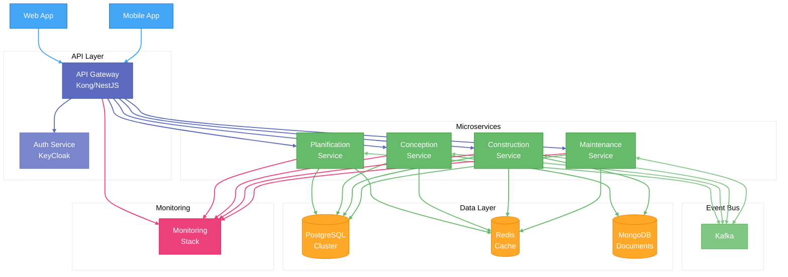

### **Mobile Architecture Native**

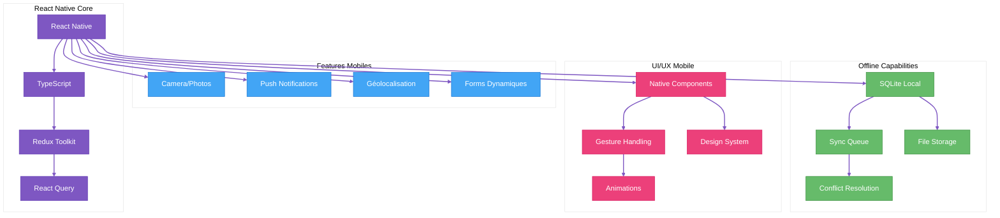

### **Intégration Cloud Infrastructure**

```mermaid
%%{init: {'theme': 'base', 'themeVariables': { 'primaryColor': '#f5f5f5', 'lineColor': '#999'}}}%%
graph TD
    classDef deploy fill:#42A5F5,stroke:#1976D2,color:white
    classDef cluster fill:#5C6BC0,stroke:#3949AB,color:white
    classDef storage fill:#66BB6A,stroke:#388E3C,color:white
    classDef network fill:#FFA726,stroke:#F57C00,color:white
    classDef security fill:#EC407A,stroke:#D81B60,color:white
    classDef monitor fill:#7E57C2,stroke:#5E35B1,color:white

    subgraph "CI/CD Pipeline"
        GH[GitHub Actions]
        Registry[Container Registry]
        Artifacts[Artifacts Storage]
    end
    
    subgraph "Kubernetes Cluster"
        K8s[K8s Control Plane]
        Nodes[Worker Nodes]
        Scaling[Auto-scaling]
        Affinity[Node Affinity]
    end
    
    subgraph "Storage Solutions"
        Block[Block Storage]
        Object[Object Storage]
        DB[Database Instances]
        Backup[Backup Systems]
    end
    
    subgraph "Networking"
        Ingress[Ingress Controller]
        LB[Load Balancer]
        Policy[Network Policies]
        DNS[DNS Management]
    end
    
    subgraph "Security"
        TLS[TLS Management]
        Secrets[Secrets Management]
        RBAC[K8s RBAC]
        Audit[Audit Logging]
    end
    
    subgraph "Monitoring"
        Prometheus[Prometheus]
        Grafana[Grafana]
        Alerts[Alerting]
        Logs[Log Management]
    end
    
    GH --> Registry
    Registry --> K8s
    GH --> Artifacts
    
    K8s --> Nodes
    K8s --> Scaling
    K8s --> Affinity
    
    K8s --> Block
    K8s --> Object
    K8s --> DB
    DB --> Backup
    
    K8s --> Ingress
    Ingress --> LB
    K8s --> Policy
    Ingress --> DNS
    
    K8s --> TLS
    K8s --> Secrets
    K8s --> RBAC
    K8s --> Audit
    
    K8s --> Prometheus
    Prometheus --> Grafana
    Prometheus --> Alerts
    K8s --> Logs
    
    %% Apply classes
    class GH,Registry,Artifacts deploy
    class K8s,Nodes,Scaling,Affinity cluster
    class Block,Object,DB,Backup storage
    class Ingress,LB,Policy,DNS network
    class TLS,Secrets,RBAC,Audit security
    class Prometheus,Grafana,Alerts,Logs monitor
    
    %% Link styling
    linkStyle 0,1,2 stroke:#42A5F5,stroke-width:2px
    linkStyle 3,4,5 stroke:#5C6BC0,stroke-width:2px
    linkStyle 6,7,8,9 stroke:#66BB6A,stroke-width:2px
    linkStyle 10,11,12,13 stroke:#FFA726,stroke-width:2px
    linkStyle 14,15,16,17 stroke:#EC407A,stroke-width:2px
    linkStyle 18,19,20,21 stroke:#7E57C2,stroke-width:2px
```

---

## 🚀 **GO-TO-MARKET - PHASE 2**

### **Stratégie Acquisition Clients**

```yaml
Target Market Phase 2:
  - 10 → 50 organismes publics québécois
  - Segmentation primaire: Municipalités 10k-50k habitants
  - Segmentation secondaire: Centres services scolaires moyens
  - Expansion géographique: Ontario francophone (pilotes)
  
Canaux Principaux:
  1. LinkedIn Sales Navigator (outbound personnalisé)
  2. Recommandations clients existants (programme référence)
  3. Webinaires sectoriels bimensuels
  4. Présence événements (COMAQ, AEMQ, ADGMQ)
  
Message Core:
  "La seule plateforme de gestion de construction publique
   conçue spécifiquement pour le Québec, qui économise en moyenne
   10h/semaine/gestionnaire, tout en garantissant la conformité
   Loi 25 et une adoption en moins de 2 semaines."
```

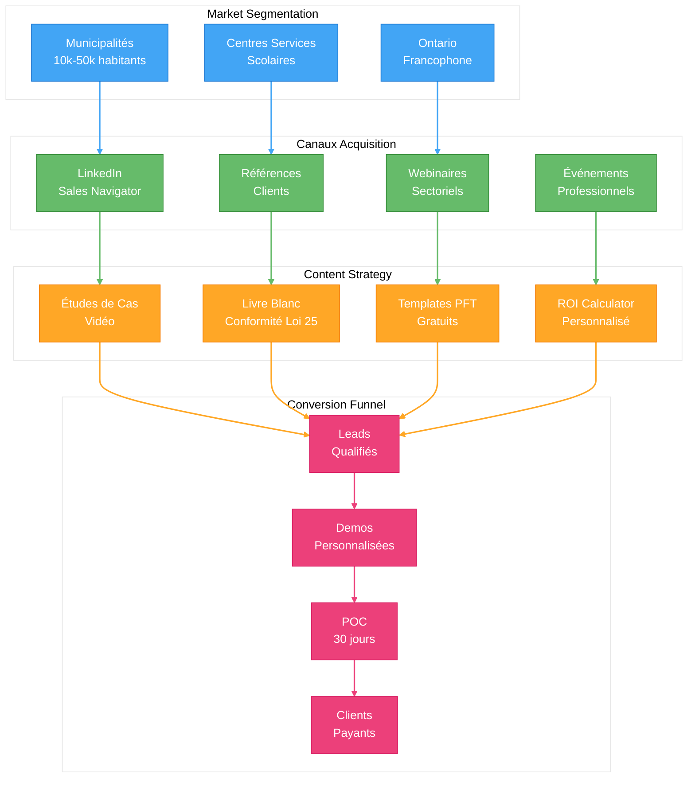

### **Content Marketing Strategy**

```yaml
Blog Articles:
  - "Guide complet conformité Loi 25 pour organismes publics" (SEO)
  - "7 façons d'optimiser le budget maintenance infrastructure" (Lead Gen)
  - "Étude: Les municipalités utilisant outils digitaux économisent 23%" (Social)
  - "Comparatif: Procore vs A3E Beta pour le marché québécois" (Conversion)
  
Webinaires:
  - "Comment digitaliser vos processus construction en 30 jours" (Mensuel)
  - "Panel experts: L'avenir des infrastructures municipales au Québec" (Trimestriel)
  - "Workshop: Créer des PFT efficaces avec A3E Beta" (Bi-mensuel)
  - "Témoignages clients: Transformation digitale réussie" (Mensuel)
  
Ressources Téléchargeables:
  - Templates PFT municipalités/écoles
  - Checklist conformité Loi 25
  - Calculateur ROI personnalisable
  - Guide migration Excel vers A3E Beta
  
Stratégie SEO:
  - Mots-clés locaux québécois
  - Contenu français optimisé
  - Backlinks associations sectorielles
  - Fiches Google My Business locales
```

### **Pricing & Revenue Model**

| Offre | Prix | Cible | Inclusions |
|-------|------|-------|------------|
| **Standard** | 200$/utilisateur/mois | Municipalités <20k habitants | Core modules, Support standard |
| **Professional** | 350$/utilisateur/mois | Municipalités 20k-50k habitants | Tous modules, Intégrations, Support prioritaire |
| **Enterprise** | Custom | CSS, grandes municipalités | Modules avancés, Intégrations sur mesure, Account manager dédié |

### **Sales Process**

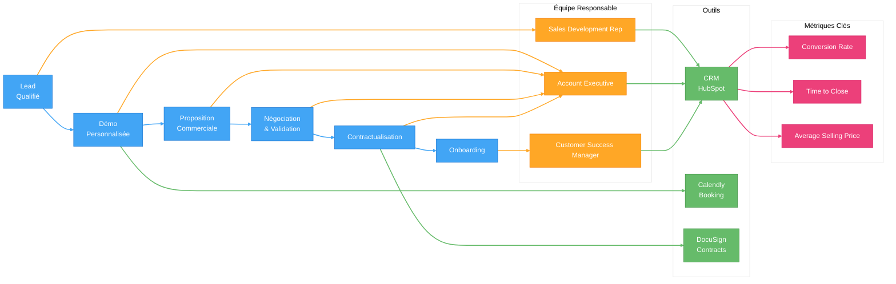

### **Customer Success Enhanced**

```yaml
Onboarding Excellence:
  - Kick-off call structuré (60 min)
  - Plan d'implémentation personnalisé
  - Import données/migration assistée
  - Formation utilisateurs (2 sessions)
  - Certification admin plateforme
  - Check-in J+7, J+14, J+30, J+90
  
Support Premium:
  - Temps réponse <2h garanti
  - Chat support dans application
  - Base connaissance complète française
  - Webinaires Q&A mensuels
  - Accès communauté utilisateurs privée
  
Success Plans:
  - Goals & OKRs définis par client
  - Quarterly Business Reviews
  - Usage analytics & recommandations
  - Roadmap input prioritaire
  - Early access nouvelles features
  
Rétention Stratégique:
  - Health Scores automatisés
  - Détection proactive risques churn
  - Interventions Success Manager
  - Programme loyalty/rewards
  - Renouvellements anticipés 90 jours
```

---

## 📊 **SUCCESS METRICS - PHASE 2**

### **KPIs Phase 2**

| Catégorie | Métrique | Cible Mois 12 | Cible Mois 18 |
|-----------|----------|--------------|---------------|
| **Croissance** | Clients actifs | 20 | 50 |
| **Croissance** | MRR | 3,000$ | 9,000$ |
| **Croissance** | User Growth Rate | >10%/mois | >15%/mois |
| **Produit** | Feature Adoption | >80% | >85% |
| **Produit** | NPS Score | >50 | >60 |
| **Produit** | Mobile App Usage | >40% users | >60% users |
| **Business** | CAC | <500$ | <500$ |
| **Business** | LTV:CAC | >5:1 | >8:1 |
| **Business** | Churn mensuel | <3% | <2% |
| **Technique** | Uptime | >99.5% | >99.9% |
| **Technique** | Perfo API (p95) | <300ms | <200ms |

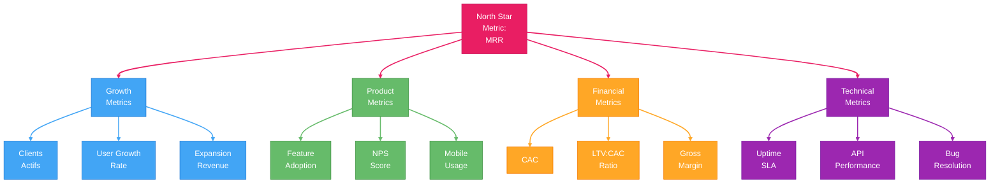

### **User Analytics Framework**

```yaml
Plateforme Analytics:
  - Segment: Data collection centralisée
  - Amplitude: Product analytics
  - PostHog: Session recording (RGPD compliant)
  - Looker/Metabase: Dashboards internes
  
Metrics Clés par Module:
  Planification:
    - # Projets créés
    - # Dashboards personnalisés
    - # Exports analytics
    - Temps passé analyses
    
  Conception:
    - # Documents créés/édités
    - % Documents avec commentaires
    - # Workflows d'approbation
    - Temps moyen approbation
    
  Construction:
    - # Rapports visite mobile
    - # Photos capturées
    - # Demandes changement
    - % Réponses <24h
    
  Maintenance:
    - # Inspections programmées
    - # Alertes préventives
    - % Reduction incidents
    - $ Économies maintenance
  
Metrics d'Engagement:
  - Daily Active Users (DAU)
  - Weekly Active Users (WAU)
  - DAU/MAU Ratio (Stickiness)
  - Avg Session Duration
  - Actions per Session
  - Retention D1/D7/D30
```

---

## 🚨 **RISK ANALYSIS - PHASE 2**

### **Risques Critiques Phase 2**

| Risque | Impact | Probabilité | Mitigation |
|--------|--------|-------------|------------|
| Scaling technique insuffisant | Critique | Moyenne | Architecture microservices, load testing, monitoring avancé |
| Concurrence locale émergente | Majeur | Élevée | Accélération roadmap, lock-in clients, partenariats stratégiques |
| Churn clients pilotes | Critique | Faible | Customer success avancé, early warning system, success plans |
| Difficultés recrutement | Majeur | Élevée | Remote-first, partenariat écoles, augmentation compensations |
| Performance apps mobiles | Modéré | Moyenne | Tests exhaustifs, réduction fonctionnalités, optimisations natives |

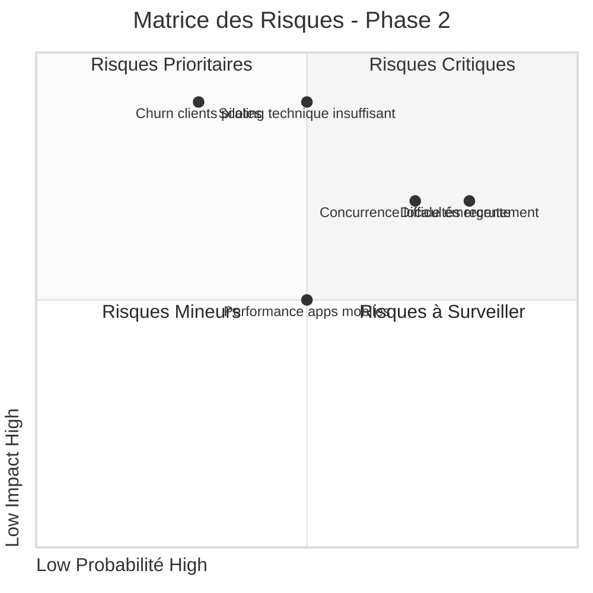

### **Contingency Plans**

```yaml
Scenario: Performance dégradée sous charge
  Triggers:
    - Temps réponse API >500ms
    - CPU/Memory >80% sustained
    - Plaintes utilisateurs performance
  
  Actions:
    1. Activation plan scale-out d'urgence
    2. Déploiement optimisations cache
    3. Réduction temporaire fonctionnalités heavy
    4. Communication proactive clients
    5. War room équipe technique 24/7

Scenario: Émergence concurrent direct
  Triggers:
    - Lancement solution comparable locale
    - Perte d'un client à la concurrence
    - Baisse win rate >15%
  
  Actions:
    1. Analyse comparative features concurrentes
    2. Accélération roadmap différenciatrice
    3. Programme fidélité clients existants
    4. Renégociation contrats (lock-in 2-3 ans)
    5. Task force partenariats stratégiques

Scenario: Difficultés recrutement prolongées
  Triggers:
    - Postes clés non pourvus >90 jours
    - Turnover >15% annualisé
    - Impact roadmap (retards >30%)
  
  Actions:
    1. Révision packages compensation (+20%)
    2. Élargissement zone géographique (full remote)
    3. Partenariats universitaires renforcés
    4. Contractors stratégiques temporaires
    5. Révision priorisation avec ressources limitées
```

---

## 💰 **FINANCIAL MODEL - PHASE 2**

### **Revenue Projections**

```yaml
Forecast MRR:
  Mois 10:  10 clients × 180$ × 2 users  = 3,600$
  Mois 12:  20 clients × 190$ × 2 users  = 7,600$
  Mois 15:  35 clients × 200$ × 2 users  = 14,000$
  Mois 18:  50 clients × 210$ × 2 users  = 21,000$
  
Composition Revenus:
  Standard:  60% (180$/user)
  Pro:       35% (240$/user)
  Enterprise: 5% (400$/user)
  
Expansion Revenue:
  - Upsell utilisateurs: +10%/client/an
  - Upsell features: +15%/client/an
  - Net Revenue Retention: 110% annuel
```

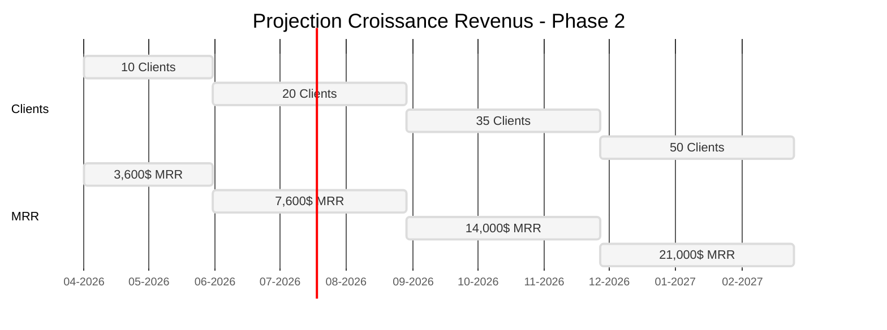

### **Coûts Opérationnels**

| Catégorie | Mois 10-12 | Mois 13-15 | Mois 16-18 | Total Phase 2 |
|-----------|------------|------------|------------|---------------|
| Salaires | 8,000$/mois | 12,000$/mois | 20,000$/mois | 120,000$ |
| Infrastructure | 300$/mois | 400$/mois | 600$/mois | 3,900$ |
| Marketing | 500$/mois | 800$/mois | 1,200$/mois | 7,500$ |
| Outils SaaS | 200$/mois | 300$/mois | 500$/mois | 3,000$ |
| Autres | 300$/mois | 500$/mois | 700$/mois | 4,500$ |
| **Total** | **9,300$/mois** | **14,000$/mois** | **23,000$/mois** | **138,900$** |

### **Unit Economics**

```yaml
CAC (Customer Acquisition Cost):
  Mois 10-12: 600$ par client
  Mois 13-15: 800$ par client
  Mois 16-18: 1,000$ par client

LTV (Customer Lifetime Value):
  ARPU: 400$/mois
  Marge brute: 85%
  Churn mensuel: 2%
  Durée vie moyenne: 50 mois
  LTV = (400$ × 85% × 50) = 17,000$

LTV:CAC Ratio:
  Mois 10-12: 28:1
  Mois 13-15: 21:1
  Mois 16-18: 17:1

Payback Period:
  Mois 10-12: 1.8 mois
  Mois 13-15: 2.4 mois
  Mois 16-18: 3.0 mois
```

### **Profitability & Runway**

```yaml
Break-Even:
  MRR nécessaire: 23,000$ (derniers mois)
  Atteint: Mois 18 (21,000$ MRR, proche break-even)
  
Runway (sans financement externe):
  Mois 10: Cash reserve + MRR = 15+ mois
  Mois 15: Cash reserve + MRR = ∞ (cash-flow positif)
  
Capital Efficiency:
  Cash invested to date: ~100,000$
  MRR at Month 18: 21,000$
  Capital Efficiency Ratio: 0.21 (excellent)
```

---

## 🎯 **NEXT STEPS & TRANSITION PHASE 3**

### **Critères de Succès pour Passer à Phase 3**

```yaml
Business Criteria:
  - 50+ clients actifs
  - 20,000$+ MRR
  - <2% churn mensuel
  - >60 NPS
  - 80%+ feature adoption
  
Technical Criteria:
  - Architecture microservices stable
  - API <200ms response time
  - Mobile apps 4.5+ store rating
  - 99.9% uptime
  - <5 bugs critiques/mois
  
Team Criteria:
  - 5+ employés productifs
  - Processus recrutement établi
  - Rôles/responsabilités clairs
  - Culture d'entreprise positive
  - Capacité exécution avérée
```

### **Préparation Phase 3**

```yaml
1. Architecture Enterprise:
   - Planification multi-région
   - Stratégie scaling horizontal
   - Sécurité avancée SOC2
   - Plan data lake/AI
   
2. Team Expansion:
   - Plan embauche +10 personnes
   - Structure départements
   - Processus management
   - Formation leadership
   
3. Préparation Financement:
   - Data room préparée
   - Liste investisseurs cibles
   - Pitch deck et matériel
   - Financial models détaillés
   - Due diligence anticipée
```

Pour plus de détails sur la Phase 3, voir [PRD_PHASE3_PLATFORM.md](./PRD_PHASE3_PLATFORM.md).

---

*Document Phase 2: Expansion - Version 1.0*  
*Dernière révision : Juillet 2024*  
*Prochaine révision : Après atteinte 20 clients*  
*Contact : equipe@a3e.ca*
