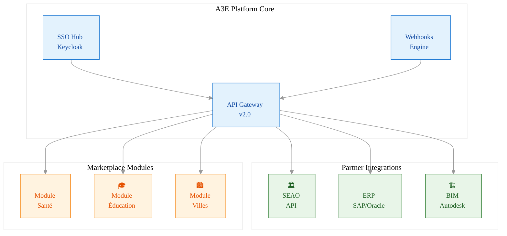
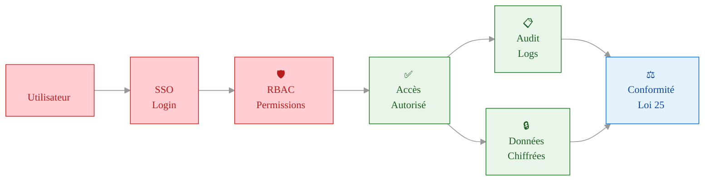
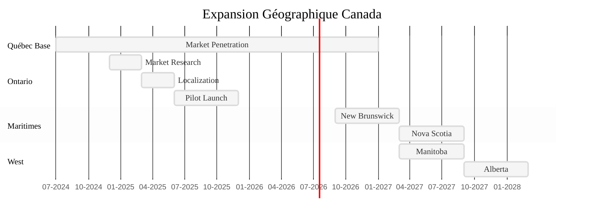

# 📋 PRD PHASE 3: PLATFORM & SCALING - A3E Beta
## Product Requirements Document - Plateforme Mature & Scaling (Mois 19-30)

> **Document produit officiel** - Spécifications Phase 3: Plateforme complète, scalabilité, intégrations avancées  
> **Date**: Juillet 2024  
> **Version**: 1.0  
> **Équipe**: Fondateurs + Dév + Customer Success + Sales

📚 **[← Retour au README](../../README.md)** | **[← PRD PHASE 2](./PRD_PHASE2_EXPANSION.md)** | **[→ Stack Technique](../4_technical_architecture/STACK_TECHNIQUE.md)**

---

## 🧭 NAVIGATION

1. [PRD_MASTER](./PRD_MASTER.md) - Vue d'ensemble, stratégie et analyse de marché
2. [PRD_PHASE1_MVP](./PRD_PHASE1_MVP.md) - Validation et MVP (Mois 3-9)
3. [PRD_PHASE2_EXPANSION](./PRD_PHASE2_EXPANSION.md) - Expansion et croissance (Mois 10-18)
4. **PRD_PHASE3_PLATFORM** (ce document) - Plateforme mature et scaling (Mois 19-30)

---

## 🎯 OBJECTIFS DE LA PHASE 3

1. **Scalabilité** : Passer de 100 à 500+ clients (expansion Québec, Ontario, Canada)
2. **Plateforme API-first** : Ouvrir l'écosystème (API publique, webhooks, intégrations tierces)
3. **Sécurité & conformité avancées** : SSO, audit, certifications
4. **Personnalisation & modules avancés** : Marketplace, modules verticaux (santé, éducation)
5. **Automatisation & IA** : Workflows automatisés, IA prédictive, analytics avancés

---

## 🏗️ **PLATFORM ARCHITECTURE VISION**

### **API Ecosystem Overview**



### **Security & Compliance Flow**



### **Expansion Roadmap Canada**



## 📅 PLANNING DÉTAILLÉ

### Mois 19-21: Foundation Scaling
```yaml
Sprint 1-2:
  - Migration infra scalable (Kubernetes, multi-cloud)
  - Mise en place monitoring avancé (Sentry, Better Stack)
  - Refactoring codebase pour microservices

Sprint 3-4:
  - API publique v1 (REST/GraphQL)
  - Authentification SSO (Keycloak, Azure AD)
  - Webhooks pour intégrations externes

Livrables:
  - Plateforme scalable, API publique, SSO opérationnel
```

### Mois 22-25: Intégrations & Modules
```yaml
Sprint 5-6:
  - Marketplace modules (santé, éducation, villes)
  - Intégration ERP/finances (API SEAO, SAP, Oracle)
  - Automatisation workflows (no-code builder)

Sprint 7-8:
  - Analytics avancés (prédictif, IA, dashboards custom)
  - Module conformité avancée (audit, logs, certifications)

Livrables:
  - Marketplace live, intégrations majeures, analytics avancés
```

### Mois 26-30: Expansion & Optimisation
```yaml
Sprint 9-10:
  - Localisation Ontario/Canada (bilingue, normes locales)
  - Optimisation performance (sharding, caching, CDN)
  - Sécurité renforcée (pentest, bug bounty, ISO27001)

Sprint 11-12:
  - Plateforme ouverte (API partners, documentation dev)
  - Support multi-tenant avancé (SSO, RBAC, SLA)
  - Préparation scale-up international

Livrables:
  - Plateforme mature, prête pour scale Canada/international
```

---

## 🔧 FEATURES & REQUIREMENTS - MOSCOW PRIORITIZATION

### MUST HAVE (Plateforme & Scaling)
```yaml
PLAT-001: API Publique & Webhooks
  Description: Exposer toutes les fonctionnalités clés via API REST/GraphQL + webhooks
  User Story: "En tant que partenaire, je veux intégrer mes outils à la plateforme"
  Acceptance Criteria:
    - Documentation Swagger/OpenAPI
    - Auth sécurisée (OAuth2, API keys)
    - Webhooks configurables par client
  Effort: 34 points
  Dependencies: Refactoring microservices

PLAT-002: SSO & Sécurité Avancée
  Description: Authentification SSO (Keycloak, Azure AD, Google), RBAC, audit
  User Story: "En tant qu'admin, je veux gérer les accès et logs de sécurité"
  Acceptance Criteria:
    - SSO multi-fournisseurs
    - RBAC granulaire
    - Audit trail complet
    - Alertes sécurité
  Effort: 21 points
  Dependencies: PLAT-001

PLAT-003: Marketplace Modules
  Description: Modules additionnels (santé, éducation, villes) installables
  User Story: "En tant que client, je veux ajouter des modules selon mon secteur"
  Acceptance Criteria:
    - Marketplace UI intégrée
    - Installation/désinstallation modules
    - Billing modulaire
  Effort: 34 points
  Dependencies: PLAT-001, PLAT-002

PLAT-004: Analytics & IA Avancés
  Description: Dashboards custom, prédiction, IA, alertes automatiques
  User Story: "En tant que gestionnaire, je veux des insights prédictifs et personnalisés"
  Acceptance Criteria:
    - Dashboards custom par client
    - Prédiction retards, risques, maintenance
    - Alertes automatiques IA
  Effort: 34 points
  Dependencies: Data warehouse, API
```

### SHOULD HAVE (Optimisation & Expansion)
```yaml
PLAT-005: Localisation Canada/International
  Description: Support bilingue, normes locales, adaptation réglementaire
  User Story: "En tant que client hors Québec, je veux une plateforme adaptée à mon contexte"
  Acceptance Criteria:
    - UI bilingue (fr/en)
    - Adaptation normes Ontario, fédéral
    - Documentation localisée
  Effort: 21 points
  Dependencies: PLAT-001

PLAT-006: Performance & Sécurité
  Description: Sharding, caching, pentest, bug bounty
  User Story: "En tant que CTO, je veux garantir la performance et la sécurité à grande échelle"
  Acceptance Criteria:
    - Sharding PostgreSQL
    - CDN global
    - Pentest annuel
    - Programme bug bounty
  Effort: 21 points
  Dependencies: PLAT-001, PLAT-002
```

### COULD HAVE (Ouverture & Personnalisation)
```yaml
PLAT-007: Plateforme Ouverte & Dev
  Description: Documentation développeur, API partners, sandbox
  User Story: "En tant que partenaire, je veux tester et intégrer facilement"
  Acceptance Criteria:
    - Portail dev avec docs, sandbox
    - Support API partners
    - Exemples d'intégration
  Effort: 13 points
  Dependencies: PLAT-001
```

---

## 🏗️ ARCHITECTURE & SCALING
- Migration Kubernetes, multi-cloud (OVH, AWS, Azure)
- PostgreSQL sharding (Citus), Redis, S3-compatible storage
- Monitoring: Sentry, Better Stack, Prometheus
- Sécurité: SSO, RBAC, audit, pentest
- API-first: REST/GraphQL, webhooks, documentation Swagger
- Marketplace: modules verticaux, billing modulaire

---

## 🔗 INTÉGRATIONS AVANCÉES
- SEAO, Hydro-Québec, ERP (SAP, Oracle), systèmes financiers
- Plateformes partenaires (API, webhooks)
- Marketplace modules sectoriels

---

## 📈 LIVRABLES & MÉTRIQUES
- 500+ clients actifs (Canada)
- 99.9% uptime, SLA contractuel
- NPS > 60, churn < 5%
- 10+ intégrations partenaires
- Plateforme certifiée (ISO27001, Loi 25, etc.)

---

*Document vivant - À réviser trimestriellement*
*Dernière mise à jour : Juillet 2024*
