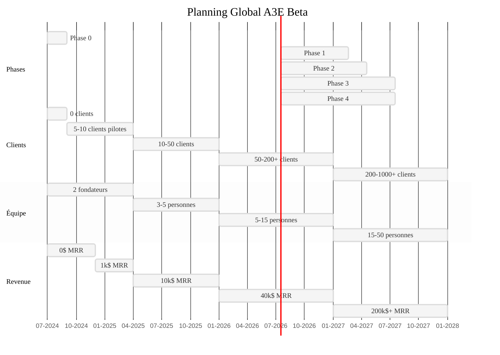

# 📅 PLANNING PHASES - A3E Beta
## Vue d'ensemble et Timeline des Phases de Développement

> **Document de planification** - Synthèse des phases et jalons critiques  
> **Date**: Juillet 2024  
> **Version**: 1.0  
> **Équipe**: Fondateurs + Développement

📚 **[← Retour README](../../README.md)** | **[→ Roadmap Bootstrap](ROADMAP_STRATEGIQUE_BOOTSTRAP.md)** | **[→ Spécifications](../6_product_specifications/PRD_MASTER.md)**

---

## 🧭 **NAVIGATION DES PHASES**

Ce document synthétise la timeline et les jalons de développement :

1. **Phase 0** : Validation Lean (Mois 1-2)
2. **Phase 1** : MVP Ultra-Minimal (Mois 3-9)
3. **Phase 2** : Expansion & Scaling (Mois 10-18)
4. **Phase 3** : Plateforme Mature (Mois 19-30)
5. **Phase 4** : Financement & Croissance (Mois 31+)

---

## 📊 **VUE D'ENSEMBLE TEMPORELLE**

> **Légende**: Ce diagramme Gantt présente notre planning global sur 42 mois, avec quatre sections parallèles: les phases de développement produit, l'évolution du nombre de clients, la croissance de l'équipe, et la progression des revenus mensuels récurrents (MRR).

---

## 🏗️ **PHASE 0 : VALIDATION LEAN**
**Timeline**: Mois 1-2 | **Budget**: 0$ | **Équipe**: 1-2 personnes

### **Objectifs Critiques**
- ✅ Valider hypothèses marché via 20 customer interviews
- ✅ Identifier le problème le plus douloureux
- ✅ Confirmer 5 design partners prêts à payer
- ✅ Prototype validé techniquement

### **Livrables**

**Mois 1**
- 📊 Rapport customer discovery (20 pages)
- 🎨 Prototype Figma interactif complet
- 🌐 Landing page avec pricing
- 🤝 5 design partners confirmés

**Mois 2**
- 🛠️ Stack technique MVP définie
- 🏗️ Infrastructure dev/staging opérationnelle
- 💰 Business model finalisé
- 🚀 Alpha version avec auth basique

### **Go/No-Go Criteria**
- **75%** confirment problème critique
- **50%** prêts à payer le prix proposé
- **25%** intéressés comme pilotes
- **100%** faisabilité technique validée

---

## 💻 **PHASE 1 : MVP ULTRA-MINIMAL**
**Timeline**: Mois 3-9 (7 mois dont 16 semaines dev) | **Budget**: 30-50k$ | **Équipe**: 3-4 personnes

### **Objectifs Critiques**
- 🎯 Développer MVP complet 4 modules
- 🎯 Acquérir 10 clients payants
- 🎯 Atteindre 2,000$ MRR
- 🎯 Établir product-market fit initial

### **Développement par Sprints**

**Mois 3-4 (Core Foundation)**
- ✅ Module Planification basique
- ✅ Module Conception documents
- ✅ Auth et sécurité robuste
- ✅ Interface responsive

**Mois 5-6 (Completion MVP)**
- ✅ Module Construction mobile
- ✅ Module Maintenance basique
- ✅ Conformité Loi 25 complète
- ✅ Tests automatisés >80%

**Mois 7-9 (Polish & Scale)**
- ✅ Performance optimisée (<3s load)
- ✅ Mode hors-ligne mobile
- ✅ Billing et subscriptions
- ✅ Launch beta publique

### **Métriques de Succès**
- **10+** clients actifs payants
- **2,000$** MRR atteint
- **>40** NPS Score
- **<5** bugs critiques/mois
- **>99.5%** uptime

---

## 🚀 **PHASE 2 : EXPANSION & SCALING**
**Timeline**: Mois 10-18 | **Budget**: <50k$ | **Équipe**: 3-5 personnes

### **Objectifs Critiques**
- 📈 Croître de 10 à 50 clients
- 📈 Atteindre 17,500$ MRR
- 📈 Implémenter fonctionnalités avancées
- 📈 Établir canaux d'acquisition scalables

### **Développement Produit**

**Q4 2024 (Mois 10-12)**
- 📄 Gestion documentaire avancée
- 🔄 Intégration SEAO basique
- 👥 Collaboration temps réel
- 🏗️ Infrastructure scalable

**Q1 2026 (Mois 13-15)**
- 🤖 IA conversationnelle (RAG)
- 📱 Application mobile native
- 📊 Analytics prédictifs
- 🔌 API publique v1

**Q2 2026 (Mois 16-18)**
- 🧩 Microservices architecture
- 🏛️ Intégrations gouvernementales
- 🔐 SSO entreprise
- 🏢 Multi-tenant avancé

### **Go-to-Market**
- **LinkedIn outreach** : 20 prospects/jour
- **Événements sectoriels** : 4 événements/an
- **Références clients** : Programme structuré
- **Content marketing** : Blog technique

### **Métriques de Succès**
- **50+** clients actifs
- **17,500$** MRR
- **>15%** croissance mensuelle MRR
- **<10%** churn annuel
- **>60** NPS Score

---

## 🏢 **PHASE 3 : PLATEFORME MATURE**
**Timeline**: Mois 19-30 | **Budget**: 500k$-1M$ | **Équipe**: 5-15 personnes

### **Objectifs Critiques**
- 🎯 Atteindre 200+ clients
- 🎯 40,000$ MRR (500k$ ARR)
- 🎯 Devenir plateforme extensible
- 🎯 Préparer expansion géographique

### **Innovation Produit**

**IA Avancée**
- 🤖 Assistant conversationnel complet
- 🔮 Maintenance prédictive
- 👁️ Vision par ordinateur
- 📝 Génération automatique documents

**Plateforme**
- 🏪 Marketplace intégrations
- 🔌 API ecosystem
- 🏷️ White-label solutions
- 🔄 Jumeaux numériques

**Enterprise**
- 🌍 Multi-région deployment
- 🔒 Advanced security (SOC2)
- ⚙️ Custom workflows
- 👨‍💼 Dedicated support

### **Expansion Marché**
- **Géographique** : Ontario francophone, Nouveau-Brunswick
- **Vertical** : Grandes municipalités, universités
- **Partenaires** : Intégrateurs systèmes, consultants

### **Métriques de Succès**
- **200+** clients actifs
- **40,000$** MRR
- **>20%** croissance mensuelle
- **<5%** churn annuel
- **>60** NPS Score

---

## 💰 **PHASE 4 : FINANCEMENT & SCALING**
**Timeline**: Mois 31+ | **Budget**: 2-5M$ | **Équipe**: 15-50 personnes

### **Objectifs Critiques**
- 🚀 Lever financement série A (2-5M$)
- 🚀 Conquérir marché canadien
- 🚀 Développer nouvelles verticales
- 🚀 Préparer expansion internationale

### **Stratégie Financement**

**Options (ordre préférence)**
1. 💰 Revenue-Based Financing (500k-1M$)
2. 🏛️ Investissement Québec (jusqu'à 5M$)
3. 👥 Angels québécois (1-2M$)
4. 🏢 VC spécialisé GovTech (2-5M$)

**Critères déclencheurs**
- 📈 200+ clients actifs
- 💲 250k$+ ARR
- 📊 >15% croissance mensuelle
- ✅ Product-market fit prouvé

### **Expansion Stratégique**
- **Canada** : Toutes provinces (focus francophone)
- **Verticales** : Santé, éducation, transport
- **International** : France (DOM-TOM), Afrique francophone

### **Métriques de Succès**
- **500+** clients actifs
- **200,000$** MRR (2.4M$ ARR)
- **Expansion** 3+ provinces
- **Équipe** 50+ employés
- **Profitabilité** break-even atteint

---

## ⚡ **JALONS CRITIQUES & DÉCISIONS GO/NO-GO**

### **Jalons Phase 0 → Phase 1**

**Critères obligatoires**
- ✅ 15/20 confirment problème critique
- ✅ 5/5 design partners engagés
- ✅ Prototype validé techniquement
- ✅ Stack technique MVP définie

**Décision**: Procéder à Phase 1

### **Jalons Phase 1 → Phase 2**

**Critères obligatoires**
- 👥 10+ clients actifs payants
- 💰 1,000$ MRR stable
- 📉 <10% churn mensuel
- 📊 NPS >40
- 🔄 Uptime >99.5%

**Décision**: Si échec: Pivot ou arrêt | Si succès: Procéder Phase 2

### **Jalons Phase 2 → Phase 3**

**Critères obligatoires**
- 👥 50+ clients actifs
- 💰 17,500$ MRR
- 📈 Croissance >15% mensuelle
- 🎯 Pipeline >100 prospects
- 👨‍💻 Équipe rodée 5+ personnes

**Décision**: Si échec: Consolidation | Si succès: Procéder Phase 3

### **Jalons Phase 3 → Phase 4**

**Critères obligatoires**
- 👥 200+ clients actifs
- 💰 40,000$ MRR
- ✅ Product-market fit prouvé
- 🏆 Market leadership Québec
- 👨‍💼 Équipe scaling prête

**Décision**: Financement externe

---

## 📊 **ÉVOLUTION DES MÉTRIQUES**

### **Croissance Revenue**
| Phase | Durée | Clients Fin | MRR Fin | ARR Fin | Croissance |
|-------|-------|-------------|---------|---------|------------|
| Phase 0 | 2 mois | 0 | 0$ | 0$ | - |
| Phase 1 | 7 mois | 10 | 1,000$ | 12,000$ | +∞% |
| Phase 2 | 9 mois | 50 | 17,500$ | 210,000$ | +1650% |
| Phase 3 | 12 mois | 200 | 40,000$ | 480,000$ | +300% |
| Phase 4 | 12 mois | 500+ | 100,000$+ | 1,200,000$+ | +150% |

### **Évolution Équipe**
| Phase | Équipe | Rôles Clés | Coût Mensuel |
|-------|--------|------------|--------------|
| Phase 0 | 1-2 | Fondateurs | 0$ |
| Phase 1 | 2 | Fondateurs | 0$ |
| Phase 2 | 3-5 | +Dev Junior, +CS Manager | 8,000$ |
| Phase 3 | 5-15 | +Sales, +Dev Senior, +Marketing | 25,000$ |
| Phase 4 | 15-50+ | Équipes complètes | 100,000$+ |

---

## 🚨 **RISQUES & MITIGATION PAR PHASE**

### **Risques Phase 1 (Critiques)**
- **Adoption lente MVP** → User interviews urgentes + UX simplifié
- **Bugs critiques** → Test cycle rigoureux + rollback facile
- **Design partners désengagés** → Valeur immédiate + suivi hebdo

### **Risques Phase 2 (Majeurs)**
- **Problème scaling technique** → Architecture microservices préparée
- **Concurrent financé** → Vitesse execution + lock-in contracts
- **Recrutement difficile** → Remote work + stages universitaires

### **Risques Phase 3 (Stratégiques)**
- **Saturation marché Québec** → Expansion géographique planifiée
- **Changement réglementation** → Diversification value-add
- **Guerre des prix** → Différenciation technologique forte

---

## 💎 **CONCLUSION & PROCHAINES ÉTAPES**

Ce planning phases fournit la roadmap claire pour transformer A3E Beta d'un concept validé en leader de marché. Chaque phase a des objectifs spécifiques, des critères de succès mesurables, et des jalons go/no-go pour décisions éclairées.

### **Prochaines Actions Immédiates**
1. **Lancer Phase 0** - Customer discovery intensif
2. **Préparer Phase 1** - Setup technique et équipe
3. **Monitorer jalons** - Métriques et décisions go/no-go
4. **Réviser planning** - Ajustements basés sur apprentissages

**Clé du succès** : Execution disciplinée, focus obsessionnel, et adaptation rapide aux signaux marché.

---

*Document de planification - Version 1.0*  
*Dernière révision : Juillet 2024*  
*Révision mensuelle obligatoire*  
*Contact : equipe@a3e.ca*