# 🚀 ROADMAP STRATÉGIQUE BOOTSTRAP
## Plateforme de Gestion Construction Québec - Sans Financement Initial

> **Document stratégique** - Approche Lean Startup adaptée au marché B2G québécois  
> **Date**: Juillet 2024  
> **Méthodologie**: Build-Measure-Learn avec contraintes zéro capital

📚 **[← Retour README](../../README.md)** | **[→ Business Model Canvas](../3_product_strategy/BUSINESS_MODEL_CANVAS_A3E.md)** | **[→ PRD MVP](../6_product_specifications/PRD_PHASE1_MVP.md)**

---

## 🎯 **SYNTHÈSE EXÉCUTIVE**

Ce roadmap présente une stratégie de développement **sans financement externe** pour conquérir le marché de la gestion de construction publique au Québec. Basé sur une approche Lean Startup moderne et des données 2024 montrant que les startups bootstrappées croissent à 44% (vs 42.8% pour les VC-backed), ce plan maximise les chances de succès avec des ressources minimales.

**Principe fondamental** : Commencer TRÈS petit, valider rapidement, croître organiquement.

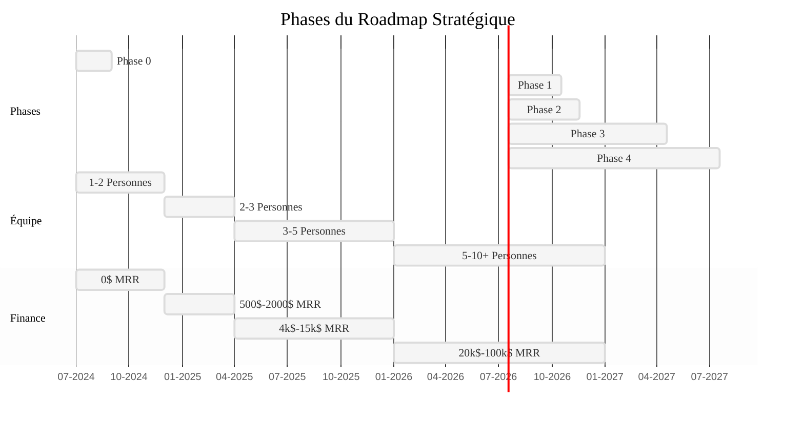

> **Légende**: Ce diagramme Gantt montre notre roadmap sur 30 mois, de la validation initiale jusqu'à la croissance significative, avec trois axes parallèles: les phases de développement produit, l'évolution de l'équipe, et la progression financière (MRR = Monthly Recurring Revenue).
```

---

## 📊 **ANALYSE DE DÉPART**

### **Atouts identifiés**
- ✅ Marché captif (Loi 25) = barrière naturelle contre géants US
- ✅ 95% du marché utilise Excel/email = opportunité massive
- ✅ Prix Procore/Autodesk prohibitifs = avantage concurrentiel
- ✅ Stack technique moderne planifiée = scalabilité future

### **Contraintes critiques**
- ❌ Budget initial : 0$
- ❌ Équipe : 1-3 personnes max
- ❌ Cycles vente B2G : 6-24 mois
- ❌ Compétiteurs établis avec millions en funding

### **Stratégie adaptée**
Transformer ces contraintes en avantages compétitifs par l'agilité extrême et le focus obsessionnel.

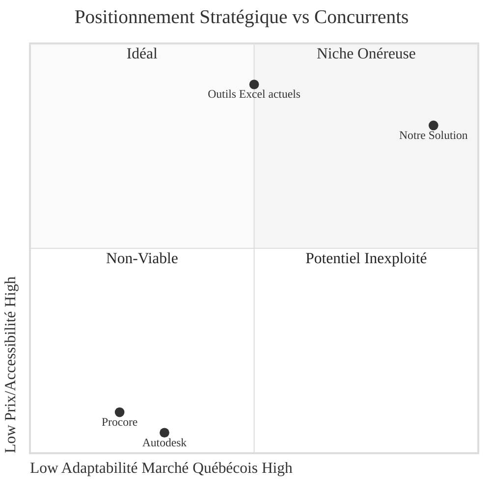

> **Légende**: Ce diagramme quadrant illustre notre positionnement stratégique par rapport aux concurrents existants, montrant notre avantage compétitif sur l'adaptabilité au marché québécois (conformité Loi 25, langue française, processus locaux) et l'accessibilité financière pour les petites municipalités.
```

---

## 🏗️ **PHASE 0 : VALIDATION LEAN (Mois 1-2)**
**Budget : 0$ | Équipe : 1-2 personnes | Objectif : Valider sans construire**

### **1. Customer Discovery Intensif**

#### Méthodologie
```yaml
Semaine 1-2:
  - 20 entrevues téléphoniques (30 min)
  - Cibles: Directeurs infrastructure municipalités <50k habitants
  - Script: Problèmes actuels, outils utilisés, budget disponible
  
Semaine 3-4:
  - 10 observations terrain (shadowing)
  - Analyser workflow réel Excel/email
  - Identifier le problème le plus douloureux
```

#### Questions critiques
1. "Montrez-moi comment vous gérez un projet aujourd'hui"
2. "Quel est votre plus gros irritant quotidien?"
3. "Combien de temps/argent perdez-vous sur ce problème?"
4. "Si une solution existait, combien paieriez-vous?"
5. "Qui prend la décision d'achat?"

### **2. Analyse Concurrentielle Terrain**

```yaml
Actions:
  - Créer compte démo Procore/Autodesk
  - Participer à 3 webinaires concurrents
  - Analyser 10 RFP gouvernementaux récents
  - Interviewer 5 utilisateurs actuels Procore
  
Livrables:
  - Matrice features vs frustrations
  - Prix réels payés (pas liste)
  - Délais implémentation typiques
```

### **3. Prototype Zéro-Code**

#### Outils recommandés
- **Figma** : Mockups interactifs
- **Tally/Typeform** : Simuler workflows
- **Notion** : Backend simulé
- **Loom** : Démos vidéo

#### Validation cible
- 15/20 confirment problème critique
- 10/20 intéressés comme pilotes
- 5/20 prêts à pré-payer (LOI)
- Prix validé : 200$/utilisateur/mois

### **📊 Métriques Go/No-Go**
| Métrique | Seuil minimum | Action si < seuil |
|----------|---------------|-------------------|
| Problem validation | 75% | Pivot problème |
| Willingness to pay | 50% | Revoir pricing |
| Pilot interest | 25% | Revoir segment |

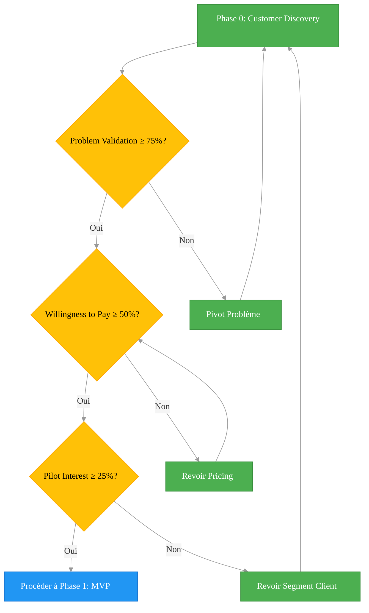

> **Légende**: Ce diagramme décisionnel illustre notre processus de validation Phase 0, avec trois métriques clés et des boucles de rétroaction permettant de pivoter rapidement si l'une des métriques n'atteint pas le seuil critique défini.
```

---

## 💻 **PHASE 1 : MVP ULTRA-MINIMAL (Mois 3-5)**
**Budget : <5000$ | Équipe : 2 personnes | Objectif : Premier produit payant**

### **1. Stack Technique Bootstrap**

```yaml
Frontend:
  NextJS 14: 
    - Full-stack framework
    - Server components = performance
    - App Router = modern
  Vercel:
    - Hosting gratuit (jusqu'à 100GB)
    - Deploy automatique
    - Analytics inclus
  Shadcn UI + Tailwind:
    - Components pro gratuits
    - Responsive par défaut
    
Backend:
  Supabase:
    - PostgreSQL managé
    - Auth inclus (email, magic link)
    - Realtime subscriptions
    - Storage (documents)
    - Free tier: 500MB
  
Infrastructure:
  - Coût total: 0-25$/mois
  - Scaling: jusqu'à 50 users gratuit
```

### **2. Feature Unique à Développer**

#### Option A : **Rapports de Visite Mobile-First**
```typescript
// Fonctionnalités core
- PWA installable (iOS/Android)
- Photos + annotations tactiles
- Formulaires dynamiques
- Génération PDF automatique
- Partage par email/SMS
- Mode hors-ligne

// Pourquoi ça marche
- Problème #1 identifié terrain
- ROI immédiat (2h → 15min)
- Viral (partage naturel)
- Difficile pour Procore (trop simple)
```

#### Option B : **Hub Communication Projets**
```typescript
// Fonctionnalités core
- Dashboard unifié tous projets
- Messagerie centralisée (remplace emails)
- Notifications push web
- Statuts temps réel
- Historique complet

// Pourquoi ça marche
- Remplace 10 chaînes email/jour
- Adoption naturelle
- Network effect (plus users = plus value)
```

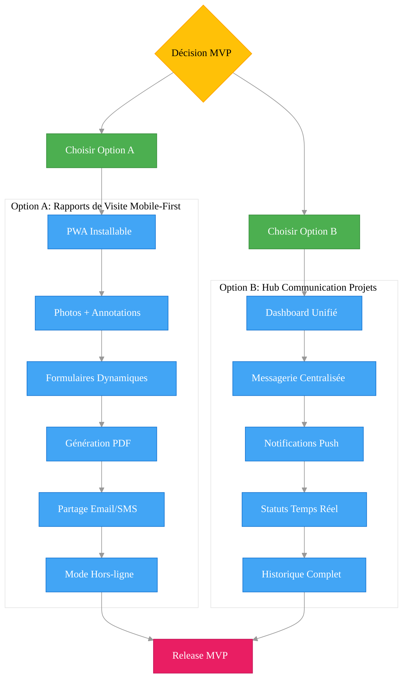

> **Légende**: Ce diagramme présente les deux options stratégiques pour notre MVP, avec leurs fonctionnalités progressives. Le choix entre l'Option A (Rapports de Visite) et l'Option B (Hub Communication) sera basé sur les résultats de la phase de validation client, pour maximiser l'adoption rapide.
```

### **3. Développement Agile Extrême**

```yaml
Sprint 0 (1 semaine):
  - Setup technique complet
  - CI/CD pipeline (GitHub Actions)
  - Architecture base de données
  
Sprint 1-2 (2 semaines):
  - Core feature fonctionnelle
  - Auth + permissions basiques
  - UI mobile responsive
  
Sprint 3-4 (2 semaines):
  - Feedback loops intégrés
  - Analytics (Plausible)
  - Onboarding simplifié
  
Sprint 5 (1 semaine):
  - Polish UI/UX
  - Documentation utilisateur
  - Launch preparation
```

### **4. Design Partners Program**

```yaml
Offre spéciale premiers clients:
  - 50% rabais à vie (100$/mois)
  - Accès direct fondateurs
  - Features sur mesure
  - Logo sur site
  
Engagement clients:
  - Feedback hebdomadaire
  - Beta testing features
  - Témoignages/études de cas
  - Références
```

---

## 💰 **PHASE 2 : PREMIERS REVENUS (Mois 6-9)**
**Objectif : 500$ MRR → 2000$ MRR | Break-even opérationnel**

### **1. Go-to-Market Asymétrique**

#### Canal principal : **Outreach Direct LinkedIn**
```yaml
Stratégie:
  - 20 messages/jour personnalisés
  - Cible: Directeurs infrastructure <50k hab
  - Message: Problème spécifique + solution
  - CTA: Demo 15 minutes
  
Script gagnant:
  "Bonjour [Nom], 
  J'ai vu que [Municipalité] gère X projets construction.
  Nos clients économisent 10h/semaine en remplaçant 
  Excel par notre plateforme. 
  15 min pour vous montrer?"
  
Métriques:
  - Taux réponse: >20%
  - Taux demo: >10%
  - Conversion: >20%
```

#### Canal secondaire : **Conférences/Associations**
```yaml
Événements cibles:
  - UMRCQ (Union municipalités)
  - FCSQ (Fédération centres services)
  - COMAQ (Corporation officiers municipaux)
  
Tactiques:
  - Stand minimal (rollup + iPad)
  - Démo live 5 minutes
  - Collecte emails pour suivi
  - Partenariat avec 1 consultant
```

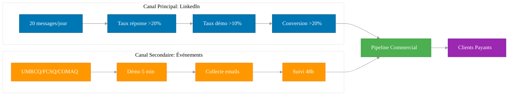

> **Légende**: Ce diagramme de flux illustre notre stratégie d'acquisition clients via deux canaux complémentaires - LinkedIn pour la prospection digitale directe avec un suivi métriques précis, et les événements sectoriels pour le networking et les démonstrations en personne. Les deux convergent vers un pipeline commercial unifié.
```

### **2. Modèle de Prix Évolutif**

| Nb Clients | Prix/mois | MRR | Costs | Profit | Actions |
|------------|-----------|-----|-------|--------|---------|
| 5 | 100$ | 500$ | 350$ | 150$ | Validation |
| 10 | 150$ | 1500$ | 500$ | 1000$ | Stabilisation |
| 20 | 200$ | 4000$ | 1000$ | 3000$ | Premier hire |

### **3. Customer Success Obsessionnel**

```yaml
Onboarding parfait:
  - Call bienvenue (30 min)
  - Migration données Excel
  - Formation équipe (1h)
  - Check-in J+7, J+30
  
Support réactif:
  - Chat live 8h-17h
  - Réponse <2h garantie
  - FAQ vidéo Loom
  - Base connaissance Notion
  
Retention tactics:
  - Feature request Fridays
  - Changelog mensuel
  - Webinaires trimestriels
  - Groupe WhatsApp VIP
```

### **4. Métriques North Star**

```yaml
Weekly:
  - Active users (DAU/WAU)
  - Feature adoption rate
  - Support tickets résolution
  - NPS score (>50)
  
Monthly:
  - MRR growth (>20%)
  - Churn (<5%)
  - CAC (<500$)
  - LTV/CAC (>3)
```

---

## 🚀 **PHASE 3 : CROISSANCE ORGANIQUE (Mois 10-18)**
**Objectif : 4000$ → 15000$ MRR | Équipe de 5 personnes**

### **1. Expansion Produit Méthodique**

#### Roadmap Features
```yaml
Q4 2024 (Mois 10-12):
  Feature #2: Gestion documentaire
    - Upload/versioning
    - Permissions granulaires
    - Recherche full-text
    - Commentaires/annotations
  
  Intégration SEAO:
    - Import appels d'offres
    - Soumission électronique
    - Notifications automatiques
    
Q1 2026 (Mois 13-15):
  Feature #3: IA Conversationnelle
    - RAG sur documents projets
    - Q&A en français québécois
    - Résumés automatiques
    - Insights prédictifs
    
  Mobile natif:
    - React Native app
    - Push notifications
    - Offline sync complet

Q2 2026 (Mois 16-18):
  Plateforme complète:
    - API publique
    - Webhooks
    - SSO entreprise
    - Conformité totale Loi 25
```

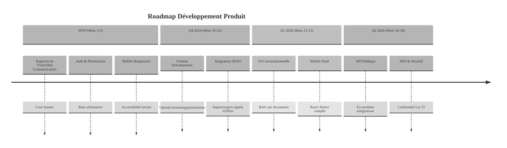

> **Légende**: Ce timeline montre notre progression de développement produit sur 18 mois, de la fonctionnalité MVP essentielle jusqu'à une plateforme complète avec IA, intégrations, et conformité totale, le tout par phases trimestrielles bien définies.
```

### **2. Scaling Architecture**

```yaml
Migration infrastructure (Mois 12):
  De: Supabase free tier
  Vers: 
    - PostgreSQL managed (OVH)
    - Redis cache
    - S3-compatible storage
    - Coût: ~200$/mois
    
Performance optimizations:
  - CDN Cloudflare
  - Image optimization
  - Database indexing
  - Query caching
  
Monitoring stack:
  - Sentry (errors)
  - Plausible (analytics)
  - Better Stack (uptime)
  - Coût: ~100$/mois
```

### **3. Équipe Minimum Viable**

```yaml
Mois 10: Développeur Full-Stack Junior
  - Profil: Finissant Polytechnique/ÉTS
  - Focus: Features & bugs
  - Salaire: 50k/an
  
Mois 12: Customer Success Manager
  - Profil: Ex-municipal, bilingue
  - Focus: Onboarding & retention
  - Salaire: 45k + commission
  
Mois 15: Sales Development Rep
  - Profil: Hunter B2G expérience
  - Focus: Outbound & demos
  - Salaire: 40k + commission
  
Mois 18: Développeur Senior
  - Profil: Architecture & scaling
  - Focus: Performance & intégrations
  - Salaire: 80k/an
```

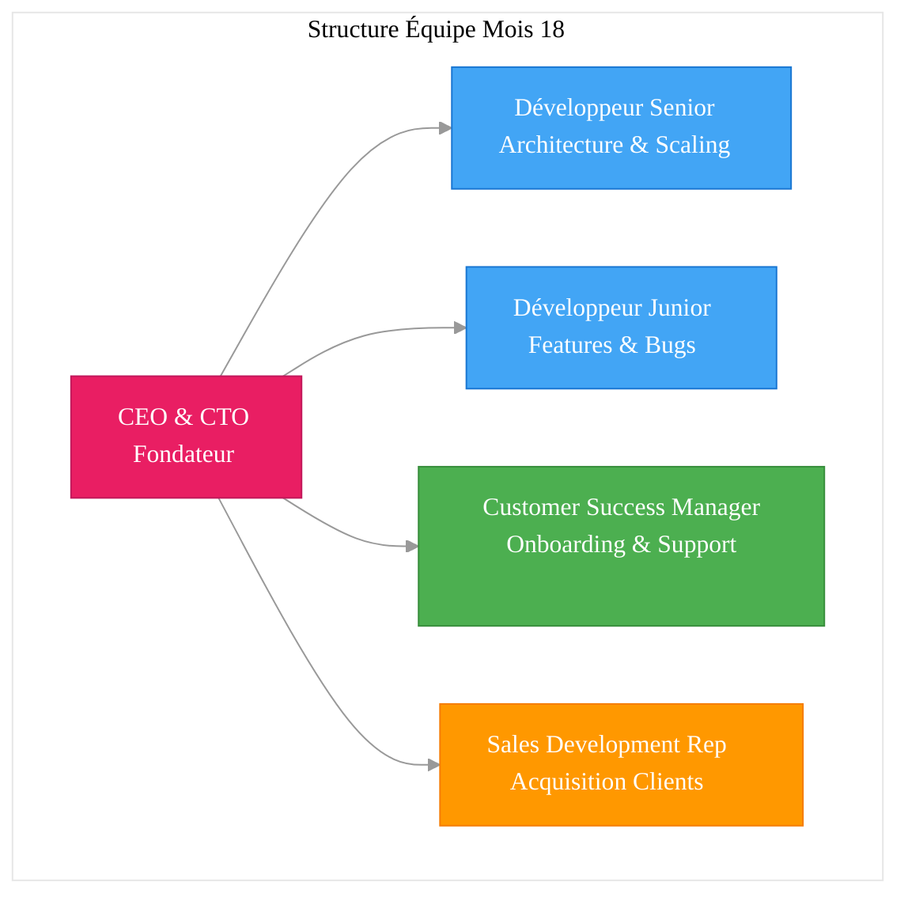

> **Légende**: Ce diagramme présente notre structure d'équipe optimale au Mois 18, avec 5 personnes couvrant les fonctions essentielles: leadership technique et business, développement, support client et ventes. Cette structure équilibrée permet un ratio efficacité/coût optimal avant la levée de fonds.
```

### **4. Métriques de Traction**

| Mois | Clients | MRR | Équipe | Burn | Runway |
|------|---------|-----|--------|------|--------|
| 10 | 20 | 4k$ | 2 | 2k$ | ∞ |
| 12 | 35 | 7k$ | 3 | 6k$ | ∞ |
| 15 | 60 | 12k$ | 4 | 10k$ | ∞ |
| 18 | 100 | 20k$ | 5 | 15k$ | ∞ |

---

## 📈 **PHASE 4 : FINANCEMENT STRATÉGIQUE (Mois 19-30)**
**Objectif : 100 → 500 clients | Financement 2-3M$ | Expansion Canada**

### **1. Préparation au Financement**

#### Prérequis atteints
- ✅ 100+ clients payants
- ✅ 20k$+ MRR (~250k$ ARR)
- ✅ Croissance >15% mensuelle
- ✅ CAC < 3 mois payback
- ✅ NPS > 60
- ✅ Churn < 5% annuel

#### Options de financement
```yaml
Ordre de préférence:
  
1. Revenue-Based Financing:
   - Montant: 500k-1M$
   - Dilution: 0%
   - Remboursement: 5-10% revenus
   - Idéal pour: Croissance prévisible
   
2. Investissement Québec:
   - Programme: ESSOR
   - Montant: Jusqu'à 5M$
   - Conditions: Emplois QC
   - Avantage: Patient capital
   
3. Angels québécois:
   - Cible: 1-2M$
   - Profil: Ex-entrepreneurs B2G
   - Value-add: Réseau gouvernement
   
4. VC spécialisé GovTech:
   - Dernier recours
   - Si croissance >300%/an
   - Pour expansion internationale
```

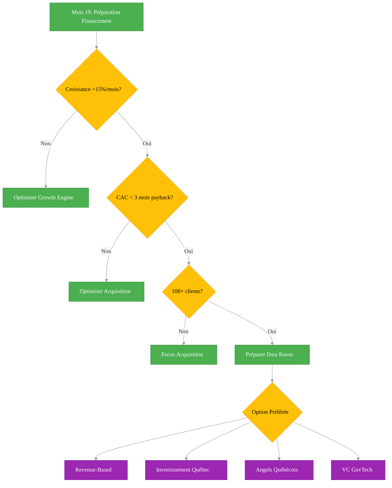

> **Légende**: Ce diagramme de décision présente notre méthodologie d'approche au financement, en vérifiant d'abord que nous atteignons les métriques clés requises (croissance, CAC, nombre de clients), puis en explorant les différentes options de financement par ordre de préférence, du Revenue-Based Financing (sans dilution) au VC traditionnel (en dernier recours).
```

### **2. Stack Technique Finale**

```yaml
Architecture cible:
  
Frontend:
  - React 18 + TypeScript
  - Design system custom
  - Micro-frontends ready
  
Backend:
  - NestJS microservices
  - GraphQL Federation
  - Event-driven (Kafka)
  
Data:
  - PostgreSQL (Citus sharding)
  - MongoDB (documents)
  - Redis (cache + queues)
  - Pinecone (vector search)
  
AI/ML:
  - Azure OpenAI (souveraineté)
  - LangChain (orchestration)
  - Custom models (Hugging Face)
  
Infrastructure:
  - Kubernetes (EKS/OVH)
  - Multi-cloud ready
  - 99.9% SLA
```

### **3. Expansion Marché**

```yaml
Géographique:
  T1: Québec saturation (500+ clients)
  T2: Ontario francophone
  T3: Nouveau-Brunswick
  T4: Reste du Canada
  
Vertical:
  - Santé (CIUSSS)
  - Éducation supérieure
  - Sociétés d'État
  - Grandes villes (>100k)
  
Pricing enterprise:
  Starter: 200$/user/mois
  Pro: 400$/user/mois  
  Enterprise: Custom
```

```mermaid
%%{init: {'theme': 'base', 'themeVariables': { 'primaryColor': '#f5f5f5', 'lineColor': '#999', 'fontFamily': 'Roboto, sans-serif'}}}%%
graph TB
    subgraph "Expansion Géographique"
        QC[Québec<br/>500+ clients]
        ON[Ontario<br/>Francophone]
        NB[Nouveau-<br/>Brunswick]
        CAN[Reste du<br/>Canada]
        
        QC --> ON
        ON --> NB
        NB --> CAN
    end
    
    subgraph "Expansion Verticale"
        M["Municipalités<br/><50k hab"]
        CSS["Centres Services<br/>Scolaires"]
        CIUSSS["Santé<br/>CIUSSS"]
        EDU["Éducation<br/>Supérieure"]
        SOC["Sociétés<br/>d'État"]
        GV["Grandes Villes<br/>>100k"]
        
        M --> CSS
        CSS --> CIUSSS
        CIUSSS --> EDU
        EDU --> SOC
        SOC --> GV
    end
    
    %% Définition des classes
    classDef geo fill:#42A5F5,stroke:#1976D2,color:white
    classDef vertical fill:#FF9800,stroke:#F57C00,color:white
    
    %% Application des classes
    class QC,ON,NB,CAN geo
    class M,CSS,CIUSSS,EDU,SOC,GV vertical
```

> **Légende**: Ce diagramme illustre notre stratégie d'expansion double - géographique (du Québec vers le reste du Canada) et verticale (des petites municipalités vers des segments plus complexes comme la santé, l'éducation supérieure et les grandes villes). Cette approche séquentielle permet de maximiser la pénétration tout en minimisant les coûts d'acquisition.
```

---

## ⚡ **FACTEURS CRITIQUES DE SUCCÈS**

### **1. Execution Speed**
- Ship daily si possible
- Feature → Production < 2 semaines
- Bug → Fix < 24h
- Feedback → Action < 72h

### **2. Customer Obsession**
- Parler à 5 clients/semaine minimum
- Chaque employé fait du support
- NPS comme religion
- Success stories publiques

### **3. Capital Efficiency**
```yaml
Règles d'or:
  - Profitable avant hiring
  - Burn < 50% revenus
  - 6 mois runway minimum
  - ROI prouvé chaque dépense
```

### **4. Focus Extrême**
- Une feature à la fois
- Un segment client
- Un canal d'acquisition
- Dire non à 90% des opportunités

---

## 📊 **MÉTRIQUES DE PILOTAGE**

### **Daily Metrics (Tableau de bord)**
- Nouveaux sign-ups
- Daily Active Users
- Support tickets ouverts
- Revenus du jour

### **Weekly Reviews**
- Pipeline commercial
- Product velocity
- Churn signals
- Cash position

### **Monthly Board Metrics**
- MRR et croissance %
- CAC et payback
- LTV/CAC ratio
- Runway restant
- NPS et trends

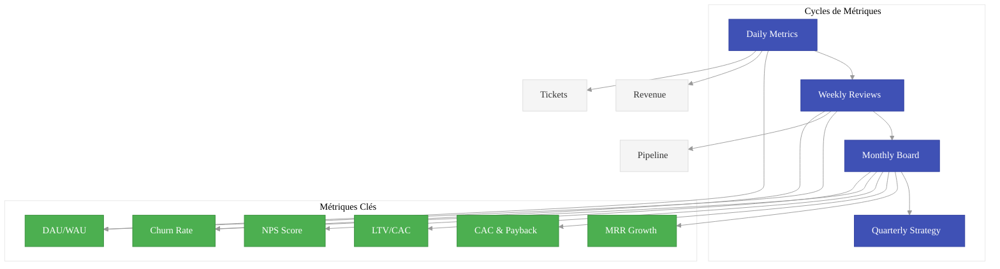

> **Légende**: Ce diagramme illustre notre système de pilotage par métriques, organisé en cycles (journalier, hebdomadaire, mensuel, trimestriel) avec des indicateurs clés adaptés à chaque niveau de décision, permettant de maintenir l'alignement entre l'exécution quotidienne et la stratégie à long terme.
```

---

## 🚨 **RISQUES ET MITIGATION**

| Risque | Impact | Probabilité | Mitigation |
|--------|--------|-------------|------------|
| Cycles vente trop longs | Critique | Élevée | Focus petites municipalités + prix bas |
| Concurrent local funded | Majeur | Moyenne | Vitesse + lock-in contracts 3 ans |
| Problème recrutement tech | Majeur | Élevée | Remote + équité + stage universitaires |
| Changement réglementation | Critique | Faible | Diversification features + lobbying |
| Burnout fondateurs | Critique | Moyenne | Discipline work-life + advisors |

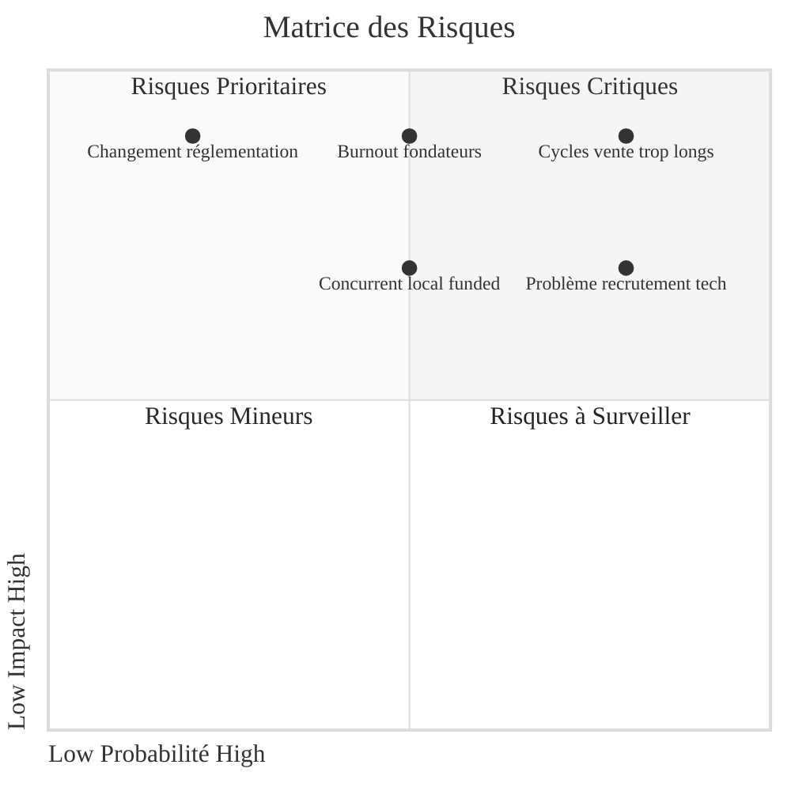

> **Légende**: Cette matrice des risques positionne les principales menaces au projet selon deux axes: leur probabilité d'occurrence et leur impact potentiel. Les risques dans le quadrant supérieur droit (critiques) nécessitent des plans de mitigation immédiats, tandis que ceux dans les autres quadrants sont à surveiller ou traiter selon leur évolution.
```

---

## 🎯 **PLAN 30-60-90 JOURS**

### **30 premiers jours**
- [ ] 20 customer interviews complétées
- [ ] Landing page live (Framer)
- [ ] 5 design partners confirmés
- [ ] Prototype Figma validé
- [ ] Stack technique choisie

### **60 premiers jours**
- [ ] MVP fonctionnel déployé
- [ ] 3 premiers clients pilotes
- [ ] Processus onboarding rodé
- [ ] Prix marché validé
- [ ] Pipeline 20 prospects

### **90 premiers jours**
- [ ] 10 clients payants
- [ ] 1000$ MRR atteint
- [ ] Product-market fit signals
- [ ] Plan scale validé
- [ ] Premier hire identifié

```mermaid
%%{init: {'theme': 'base', 'themeVariables': { 'primaryColor': '#f5f5f5', 'lineColor': '#999', 'fontFamily': 'Roboto, sans-serif'}}}%%
gantt
    title Plan 30-60-90 Jours
    dateFormat  DD
    axisFormat %j
    
    section 30 Jours
    Customer Interviews        :a1, 01, 30d
    Landing Page               :a2, 15, 15d
    Design Partners            :a3, 01, 30d
    Prototype Figma            :a4, 10, 20d
    Stack Technique            :a5, 20, 10d
    
    section 60 Jours
    MVP Déployé                :b1, 31, 30d
    Clients Pilotes            :b2, 45, 16d
    Processus Onboarding       :b3, 50, 11d
    Validation Prix            :b4, 55, 6d
    Pipeline Prospects         :b5, 31, 30d
    
    section 90 Jours
    Clients Payants            :c1, 61, 30d
    MRR 1000$                  :c2, 75, 16d
    Product-Market Fit         :c3, 61, 30d
    Plan Scale                 :c4, 80, 11d
    Premier Hire               :c5, 85, 6d
```

> **Légende**: Ce diagramme Gantt détaille notre plan d'action pour les 90 premiers jours du projet, divisé en trois phases de 30 jours. Il présente les activités critiques, leur durée et leur séquencement, avec des objectifs clairs pour chaque période: validation (30j), MVP fonctionnel (60j), et premiers clients payants (90j).
```

---

## 💎 **CONCLUSION : LA VOIE DU BOOTSTRAP**

Ce roadmap prouve qu'il est possible de bâtir une entreprise SaaS B2G rentable sans financement externe. Les clés du succès :

1. **Commencer ridiculement petit** mais parfaitement exécuté
2. **Valider avant de construire** (toujours)
3. **Obsession client** plutôt que technologie
4. **Croissance organique** basée sur valeur réelle
5. **Patience stratégique** avec cycles B2G

**Rappel** : Les données 2024 montrent que les startups bootstrappées croissent à 44% vs 42.8% pour les VC-backed. Avec votre marché captif (Loi 25) et l'approche lean, vous avez tous les éléments pour devenir le "Shopify de la construction québécoise".

**Le moment d'agir est MAINTENANT. Dans 18 mois, il sera trop tard.**

---

*Document vivant - À réviser mensuellement*  
*Dernière mise à jour : Juillet 2024*  
*Prochaine révision : Après 20 customer interviews*